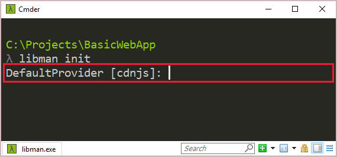
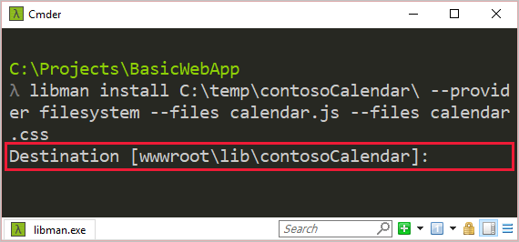

# Use the LibMan CLI with ASP.NET Core

By [Scott Addie](https://twitter.com/Scott_Addie)

The [LibMan](xref:client-side/libman/index) CLI is a cross-platform tool that's supported everywhere .NET Core is supported.

## Prerequisites

* [!INCLUDE [2.1-SDK](../../includes/2.1-SDK.md)]

## Installation

To install the LibMan CLI:

```dotnetcli
dotnet tool install -g Microsoft.Web.LibraryManager.Cli
```

A [.NET Core Global Tool](/dotnet/core/tools/global-tools#install-a-global-tool) is installed from the [Microsoft.Web.LibraryManager.Cli](https://www.nuget.org/packages/Microsoft.Web.LibraryManager.Cli/) NuGet package.

To install the LibMan CLI from a specific NuGet package source:

```dotnetcli
dotnet tool install -g Microsoft.Web.LibraryManager.Cli --version 1.0.94-g606058a278 --add-source C:\Temp\
```

In the preceding example, a .NET Core Global Tool is installed from the local Windows machine's *C:\Temp\Microsoft.Web.LibraryManager.Cli.1.0.94-g606058a278.nupkg* file.

## Usage

After successful installation of the CLI, the following command can be used:

```console
libman
```

To view the installed CLI version:

```console
libman --version
```

To view the available CLI commands:

```console
libman --help
```

The preceding command displays output similar to the following:

```console
 1.0.163+g45474d37ed

Usage: libman [options] [command]

Options:
  --help|-h  Show help information
  --version  Show version information

Commands:
  cache      List or clean libman cache contents
  clean      Deletes all library files defined in libman.json from the project
  init       Create a new libman.json
  install    Add a library definition to the libman.json file, and download the 
             library to the specified location
  restore    Downloads all files from provider and saves them to specified 
             destination
  uninstall  Deletes all files for the specified library from their specified 
             destination, then removes the specified library definition from 
             libman.json
  update     Updates the specified library

Use "libman [command] --help" for more information about a command.
```

The following sections outline the available CLI commands.

## Initialize LibMan in the project

The `libman init` command creates a *libman.json* file if one doesn't exist. The file is created with the default item template content.

### Synopsis

```console
libman init [-d|--default-destination] [-p|--default-provider] [--verbosity]
libman init [-h|--help]
```

### Options

The following options are available for the `libman init` command:

* `-d|--default-destination <PATH>`

  A path relative to the current folder. Library files are installed in this location if no `destination` property is defined for a library in *libman.json*. The `<PATH>` value is written to the `defaultDestination` property of *libman.json*.

* `-p|--default-provider <PROVIDER>`

  The provider to use if no provider is defined for a given library. The `<PROVIDER>` value is written to the `defaultProvider` property of *libman.json*. Replace `<PROVIDER>` with one of the following values:

  [!INCLUDE [LibMan provider names](../../includes/libman-cli/provider-names.md)]

[!INCLUDE [standard-cli-options](../../includes/libman-cli/standard-cli-options.md)]

### Examples

To create a *libman.json* file in an ASP.NET Core project:

* Navigate to the project root.
* Run the following command:

  ```console
  libman init
  ```

* Type the name of the default provider, or press `Enter` to use the default CDNJS provider. Valid values include:

  [!INCLUDE [LibMan provider names](../../includes/libman-cli/provider-names.md)]

  

A *libman.json* file is added to the project root with the following content:

```json
{
  "version": "1.0",
  "defaultProvider": "cdnjs",
  "libraries": []
}
```

## Add library files

The `libman install` command downloads and installs library files into the project. A *libman.json* file is added if one doesn't exist. The *libman.json* file is modified to store configuration details for the library files.

### Synopsis

```console
libman install <LIBRARY> [-d|--destination] [--files] [-p|--provider] [--verbosity]
libman install [-h|--help]
```

### Arguments

`LIBRARY`

The name of the library to install. This name may include version number notation (for example, `@1.2.0`).

### Options

The following options are available for the `libman install` command:

* `-d|--destination <PATH>`

  The location to install the library. If not specified, the default location is used. If no `defaultDestination` property is specified in *libman.json*, this option is required.

* `--files <FILE>`

  Specify the name of the file to install from the library. If not specified, all files from the library are installed. Provide one `--files` option per file to be installed. Relative paths are supported too. For example: `--files dist/browser/signalr.js`.

* `-p|--provider <PROVIDER>`

  The name of the provider to use for the library acquisition. Replace `<PROVIDER>` with one of the following values:
  
  [!INCLUDE [LibMan provider names](../../includes/libman-cli/provider-names.md)]

  If not specified, the `defaultProvider` property in *libman.json* is used. If no `defaultProvider` property is specified in *libman.json*, this option is required.

[!INCLUDE [standard-cli-options](../../includes/libman-cli/standard-cli-options.md)]

### Examples

Consider the following *libman.json* file:

```json
{
  "version": "1.0",
  "defaultProvider": "cdnjs",
  "libraries": []
}
```

To install the jQuery version 3.2.1 *jquery.min.js* file to the *wwwroot/scripts/jquery* folder using the CDNJS provider:

```console
libman install jquery@3.2.1 --provider cdnjs --destination wwwroot/scripts/jquery --files jquery.min.js
```

The *libman.json* file resembles the following:

```json
{
  "version": "1.0",
  "defaultProvider": "cdnjs",
  "libraries": [
    {
      "library": "jquery@3.2.1",
      "destination": "wwwroot/scripts/jquery",
      "files": [
        "jquery.min.js"
      ]
    }
  ]
}
```

To install the *calendar.js* and *calendar.css* files from *C:\\temp\\contosoCalendar\\* using the file system provider:

  ```console
  libman install C:\temp\contosoCalendar\ --provider filesystem --files calendar.js --files calendar.css
  ```

The following prompt appears for two reasons:

* The *libman.json* file doesn't contain a `defaultDestination` property.
* The `libman install` command doesn't contain the `-d|--destination` option.



After accepting the default destination, the *libman.json* file resembles the following:

```json
{
  "version": "1.0",
  "defaultProvider": "cdnjs",
  "libraries": [
    {
      "library": "jquery@3.2.1",
      "destination": "wwwroot/scripts/jquery",
      "files": [
        "jquery.min.js"
      ]
    },
    {
      "library": "C:\\temp\\contosoCalendar\\",
      "provider": "filesystem",
      "destination": "wwwroot/lib/contosoCalendar",
      "files": [
        "calendar.js",
        "calendar.css"
      ]
    }
  ]
}
```

## Restore library files

The `libman restore` command installs library files defined in *libman.json*. The following rules apply:

* If no *libman.json* file exists in the project root, an error is returned.
* If a library specifies a provider, the `defaultProvider` property in *libman.json* is ignored.
* If a library specifies a destination, the `defaultDestination` property in *libman.json* is ignored.

### Synopsis

```console
libman restore [--verbosity]
libman restore [-h|--help]
```

### Options

The following options are available for the `libman restore` command:

[!INCLUDE [standard-cli-options](../../includes/libman-cli/standard-cli-options.md)]

### Examples

To restore the library files defined in *libman.json*:

```console
libman restore
```

## Delete library files

The `libman clean` command deletes library files previously restored via LibMan. Folders that become empty after this operation are deleted. The library files' associated configurations in the `libraries` property of *libman.json* aren't removed.

### Synopsis

```console
libman clean [--verbosity]
libman clean [-h|--help]
```

### Options

The following options are available for the `libman clean` command:

[!INCLUDE [standard-cli-options](../../includes/libman-cli/standard-cli-options.md)]

### Examples

To delete library files installed via LibMan:

```console
libman clean
```

## Uninstall library files

The `libman uninstall` command:

* Deletes all files associated with the specified library from the destination in *libman.json*.
* Removes the associated library configuration from *libman.json*.

An error occurs when:

* No *libman.json* file exists in the project root.
* The specified library doesn't exist.

If more than one library with the same name is installed, you're prompted to choose one.

### Synopsis

```console
libman uninstall <LIBRARY> [--verbosity]
libman uninstall [-h|--help]
```

### Arguments

`LIBRARY`

The name of the library to uninstall. This name may include version number notation (for example, `@1.2.0`).

### Options

The following options are available for the `libman uninstall` command:

[!INCLUDE [standard-cli-options](../../includes/libman-cli/standard-cli-options.md)]

### Examples

Consider the following *libman.json* file:

[!code-json[](samples/LibManSample/libman.json)]

* To uninstall jQuery, either of the following commands succeed:

  ```console
  libman uninstall jquery
  ```

  ```console
  libman uninstall jquery@3.3.1
  ```

* To uninstall the Lodash files installed via the `filesystem` provider:

  ```console
  libman uninstall C:\temp\lodash\
  ```

## Update library version

The `libman update` command updates a library installed via LibMan to the specified version.

An error occurs when:

* No *libman.json* file exists in the project root.
* The specified library doesn't exist.

If more than one library with the same name is installed, you're prompted to choose one.

### Synopsis

```console
libman update <LIBRARY> [-pre] [--to] [--verbosity]
libman update [-h|--help]
```

### Arguments

`LIBRARY`

The name of the library to update.

### Options

The following options are available for the `libman update` command:

* `-pre`

  Obtain the latest prerelease version of the library.

* `--to <VERSION>`

  Obtain a specific version of the library.

[!INCLUDE [standard-cli-options](../../includes/libman-cli/standard-cli-options.md)]

### Examples

* To update jQuery to the latest version:

  ```console
  libman update jquery
  ```

* To update jQuery to version 3.3.1:

  ```console
  libman update jquery --to 3.3.1
  ```

* To update jQuery to the latest prerelease version:

  ```console
  libman update jquery -pre
  ```

## Manage library cache

The `libman cache` command manages the LibMan library cache. The `filesystem` provider doesn't use the library cache.

### Synopsis

```console
libman cache clean [<PROVIDER>] [--verbosity]
libman cache list [--files] [--libraries] [--verbosity]
libman cache [-h|--help]
```

### Arguments

`PROVIDER`

Only used with the `clean` command. Specifies the provider cache to clean. Valid values include:

[!INCLUDE [LibMan provider names](../../includes/libman-cli/provider-names.md)]

### Options

The following options are available for the `libman cache` command:

* `--files`

  List the names of files that are cached.

* `--libraries`

  List the names of libraries that are cached.

[!INCLUDE [standard-cli-options](../../includes/libman-cli/standard-cli-options.md)]

### Examples

* To view the names of cached libraries per provider, use one of the following commands:

  ```console
  libman cache list
  ```

  ```console
  libman cache list --libraries
  ```

  Output similar to the following is displayed:

  ```console
  Cache contents:
  ---------------
  unpkg:
      knockout
      react
      vue
  cdnjs:
      font-awesome
      jquery
      knockout
      lodash.js
      react
  ```

* To view the names of cached library files per provider:

  ```console
  libman cache list --files
  ```

  Output similar to the following is displayed:

  ```console
  Cache contents:
  ---------------
  unpkg:
      knockout:
          <list omitted for brevity>
      react:
          <list omitted for brevity>
      vue:
          <list omitted for brevity>
  cdnjs:
      font-awesome
          metadata.json
      jquery
          metadata.json
          3.2.1\core.js
          3.2.1\jquery.js
          3.2.1\jquery.min.js
          3.2.1\jquery.min.map
          3.2.1\jquery.slim.js
          3.2.1\jquery.slim.min.js
          3.2.1\jquery.slim.min.map
          3.3.1\core.js
          3.3.1\jquery.js
          3.3.1\jquery.min.js
          3.3.1\jquery.min.map
          3.3.1\jquery.slim.js
          3.3.1\jquery.slim.min.js
          3.3.1\jquery.slim.min.map
      knockout
          metadata.json
          3.4.2\knockout-debug.js
          3.4.2\knockout-min.js
      lodash.js
          metadata.json
          4.17.10\lodash.js
          4.17.10\lodash.min.js
      react
          metadata.json
  ```

  Notice the preceding output shows that jQuery versions 3.2.1 and 3.3.1 are cached under the CDNJS provider.

* To empty the library cache for the CDNJS provider:

  ```console
  libman cache clean cdnjs
  ```

  After emptying the CDNJS provider cache, the `libman cache list` command displays the following:

  ```console
  Cache contents:
  ---------------
  unpkg:
      knockout
      react
      vue
  cdnjs:
      (empty)
  ```

* To empty the cache for all supported providers:

  ```console
  libman cache clean
  ```

  After emptying all provider caches, the `libman cache list` command displays the following:

  ```console
  Cache contents:
  ---------------
  unpkg:
      (empty)
  cdnjs:
      (empty)
  ```

## Additional resources

* [Install a Global Tool](/dotnet/core/tools/global-tools#install-a-global-tool)
* <xref:client-side/libman/libman-vs>
* [LibMan GitHub repository](https://github.com/aspnet/LibraryManager)
