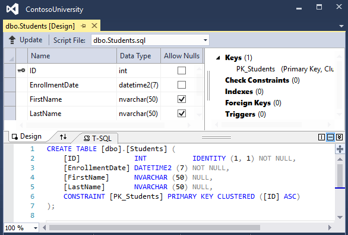
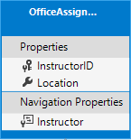
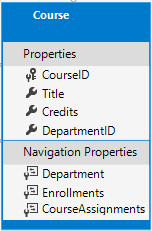
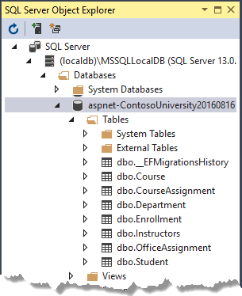

# Tutorial: Create a complex data model - ASP.NET MVC with EF Core

In the previous tutorials, you worked with a simple data model that was composed of three entities. In this tutorial, you'll add more entities and relationships and you'll customize the data model by specifying formatting, validation, and database mapping rules.

When you're finished, the entity classes will make up the completed data model that's shown in the following illustration:


In this tutorial, you:

> [!div class="checklist"]
> * Customize the Data model
> * Make changes to Student entity
> * Create Instructor entity
> * Create OfficeAssignment entity
> * Modify Course entity
> * Create Department entity
> * Modify Enrollment entity
> * Update the database context
> * Seed database with test data
> * Add a migration
> * Change the connection string
> * Update the database

## Prerequisites

* [Using EF Core migrations](migrations.md)

## Customize the Data model

In this section you'll see how to customize the data model by using attributes that specify formatting, validation, and database mapping rules. Then in several of the following sections you'll create the complete School data model by adding attributes to the classes you already created and creating new classes for the remaining entity types in the model.

### The DataType attribute

For student enrollment dates, all of the web pages currently display the time along with the date, although all you care about for this field is the date. By using data annotation attributes, you can make one code change that will fix the display format in every view that shows the data. To see an example of how to do that, you'll add an attribute to the `EnrollmentDate` property in the `Student` class.

In *Models/Student.cs*, add a `using` statement for the `System.ComponentModel.DataAnnotations` namespace and add `DataType` and `DisplayFormat` attributes to the `EnrollmentDate` property, as shown in the following example:

[!code-csharp[](intro/samples/cu/Models/Student.cs?name=snippet_DataType&highlight=3,12-13)]

The `DataType` attribute is used to specify a data type that's more specific than the database intrinsic type. In this case we only want to keep track of the date, not the date and time. The  `DataType` Enumeration provides for many data types, such as Date, Time, PhoneNumber, Currency, EmailAddress, and more. The `DataType` attribute can also enable the application to automatically provide type-specific features. For example, a `mailto:` link can be created for `DataType.EmailAddress`, and a date selector can be provided for `DataType.Date` in browsers that support HTML5. The `DataType` attribute emits HTML 5 `data-` (pronounced data dash) attributes that HTML 5 browsers can understand. The `DataType` attributes don't provide any validation.

`DataType.Date` doesn't specify the format of the date that's displayed. By default, the data field is displayed according to the default formats based on the server's CultureInfo.

The `DisplayFormat` attribute is used to explicitly specify the date format:

```csharp
[DisplayFormat(DataFormatString = "{0:yyyy-MM-dd}", ApplyFormatInEditMode = true)]
```

The `ApplyFormatInEditMode` setting specifies that the formatting should also be applied when the value is displayed in a text box for editing. (You might not want that for some fields -- for example, for currency values, you might not want the currency symbol in the text box for editing.)

You can use the `DisplayFormat` attribute by itself, but it's generally a good idea to use the `DataType` attribute also. The `DataType` attribute conveys the semantics of the data as opposed to how to render it on a screen, and provides the following benefits that you don't get with `DisplayFormat`:

* The browser can enable HTML5 features (for example to show a calendar control, the locale-appropriate currency symbol, email links, some client-side input validation, etc.).

* By default, the browser will render data using the correct format based on your locale.

For more information, see the [\<input> tag helper documentation](../../mvc/views/working-with-forms.md#the-input-tag-helper).

Run the app, go to the Students Index page and notice that times are no longer displayed for the enrollment dates. The same will be true for any view that uses the Student model.


### The StringLength attribute

You can also specify data validation rules and validation error messages using attributes. The `StringLength` attribute sets the maximum length  in the database and provides client side and server side validation for ASP.NET Core MVC. You can also specify the minimum string length in this attribute, but the minimum value has no impact on the database schema.

Suppose you want to ensure that users don't enter more than 50 characters for a name. To add this limitation, add `StringLength` attributes to the `LastName` and `FirstMidName` properties, as shown in the following example:

[!code-csharp[](intro/samples/cu/Models/Student.cs?name=snippet_StringLength&highlight=10,12)]

The `StringLength` attribute won't prevent a user from entering white space for a name. You can use the `RegularExpression` attribute to apply restrictions to the input. For example, the following code requires the first character to be upper case and the remaining characters to be alphabetical:

```csharp
[RegularExpression(@"^[A-Z]+[a-zA-Z""'\s-]*$")]
```

The `MaxLength` attribute provides functionality similar to the `StringLength` attribute but doesn't provide client side validation.

The database model has now changed in a way that requires a change in the database schema. You'll use migrations to update the schema without losing any data that you may have added to the database by using the application UI.

Save your changes and build the project. Then open the command window in the project folder and enter the following commands:

```console
dotnet ef migrations add MaxLengthOnNames
```

```console
dotnet ef database update
```

The `migrations add` command warns that data loss may occur, because the change makes the maximum length shorter for two columns.  Migrations creates a file named *\<timeStamp>_MaxLengthOnNames.cs*. This file contains code in the `Up` method that will update the database to match the current data model. The `database update` command ran that code.

The timestamp prefixed to the migrations file name is used by Entity Framework to order the migrations. You can create multiple migrations before running the update-database command, and then all of the migrations are applied in the order in which they were created.

Run the app, select the **Students** tab, click **Create New**, and try to enter either name longer than 50 characters. The application should prevent you from doing this. 

### The Column attribute

You can also use attributes to control how your classes and properties are mapped to the database. Suppose you had used the name `FirstMidName` for the first-name field because the field might also contain a middle name. But you want the database column to be named `FirstName`, because users who will be writing ad-hoc queries against the database are accustomed to that name. To make this mapping, you can use the `Column` attribute.

The `Column` attribute specifies that when the database is created, the column of the `Student` table that maps to the `FirstMidName` property will be named `FirstName`. In other words, when your code refers to `Student.FirstMidName`, the data will come from or be updated in the `FirstName` column of the `Student` table. If you don't specify column names, they're given the same name as the property name.

In the *Student.cs* file, add a `using` statement for `System.ComponentModel.DataAnnotations.Schema` and add the column name attribute to the `FirstMidName` property, as shown in the following highlighted code:

[!code-csharp[](intro/samples/cu/Models/Student.cs?name=snippet_Column&highlight=4,14)]

The addition of the `Column` attribute changes the model backing the `SchoolContext`, so it won't match the database.

Save your changes and build the project. Then open the command window in the project folder and enter the following commands to create another migration:

```console
dotnet ef migrations add ColumnFirstName
```

```console
dotnet ef database update
```

In **SQL Server Object Explorer**, open the Student table designer by double-clicking the **Student** table.



Before you applied the first two migrations, the name columns were of type nvarchar(MAX). They're now nvarchar(50) and the column name has changed from FirstMidName to FirstName.

> [!Note]
> If you try to compile before you finish creating all of the entity classes in the following sections, you might get compiler errors.

## Changes to Student entity


In *Models/Student.cs*, replace the code you added earlier with the following code. The changes are highlighted.

[!code-csharp[](intro/samples/cu/Models/Student.cs?name=snippet_BeforeInheritance&highlight=11,13,15,18,22,24-31)]

### The Required attribute

The `Required` attribute makes the name properties required fields. The `Required` attribute isn't needed for non-nullable types such as value types (DateTime, int, double, float, etc.). Types that can't be null are automatically treated as required fields.

You could remove the `Required` attribute and replace it with a minimum length parameter for the `StringLength` attribute:

```csharp
[Display(Name = "Last Name")]
[StringLength(50, MinimumLength=1)]
public string LastName { get; set; }
```

### The Display attribute

The `Display` attribute specifies that the caption for the text boxes should be "First Name", "Last Name", "Full Name", and "Enrollment Date" instead of the property name in each instance (which has no space dividing the words).

### The FullName calculated property

`FullName` is a calculated property that returns a value that's created by concatenating two other properties. Therefore it has only a get accessor, and no `FullName` column will be generated in the database.

## Create Instructor entity


Create *Models/Instructor.cs*, replacing the template code with the following code:

[!code-csharp[](intro/samples/cu/Models/Instructor.cs?name=snippet_BeforeInheritance)]

Notice that several properties are the same in the Student and Instructor entities. In the [Implementing Inheritance](inheritance.md) tutorial later in this series, you'll refactor this code to eliminate the redundancy.

You can put multiple attributes on one line, so you could also write the `HireDate` attributes as follows:

```csharp
[DataType(DataType.Date),Display(Name = "Hire Date"),DisplayFormat(DataFormatString = "{0:yyyy-MM-dd}", ApplyFormatInEditMode = true)]
```

### The CourseAssignments and OfficeAssignment navigation properties

The `CourseAssignments` and `OfficeAssignment` properties are navigation properties.

An instructor can teach any number of courses, so `CourseAssignments` is defined as a collection.

```csharp
public ICollection<CourseAssignment> CourseAssignments { get; set; }
```

If a navigation property can hold multiple entities, its type must be a list in which entries can be added, deleted, and updated.  You can specify `ICollection<T>` or a type such as `List<T>` or `HashSet<T>`. If you specify `ICollection<T>`, EF creates a `HashSet<T>` collection by default.

The reason why these are `CourseAssignment` entities is explained below in the section about many-to-many relationships.

Contoso University business rules state that an instructor can only have at most one office, so the `OfficeAssignment` property holds a single OfficeAssignment entity (which may be null if no office is assigned).

```csharp
public OfficeAssignment OfficeAssignment { get; set; }
```

## Create OfficeAssignment entity



Create *Models/OfficeAssignment.cs* with the following code:

[!code-csharp[](intro/samples/cu/Models/OfficeAssignment.cs)]

### The Key attribute

There's a one-to-zero-or-one relationship  between the Instructor and the OfficeAssignment entities. An office assignment only exists in relation to the instructor it's assigned to, and therefore its primary key is also its foreign key to the Instructor entity. But the Entity Framework can't automatically recognize InstructorID as the primary key of this entity because its name doesn't follow the ID or classnameID naming convention. Therefore, the `Key` attribute is used to identify it as the key:

```csharp
[Key]
public int InstructorID { get; set; }
```

You can also use the `Key` attribute if the entity does have its own primary key but you want to name the property something other than classnameID or ID.

By default, EF treats the key as non-database-generated because the column is for an identifying relationship.

### The Instructor navigation property

The Instructor entity has a nullable `OfficeAssignment` navigation property (because an instructor might not have an office assignment), and the OfficeAssignment entity has a non-nullable `Instructor` navigation property (because an office assignment can't exist without an instructor -- `InstructorID` is non-nullable). When an Instructor entity has a related OfficeAssignment entity, each entity will have a reference to the other one in its navigation property.

You could put a `[Required]` attribute on the Instructor navigation property to specify that there must be a related instructor, but you don't have to do that because the `InstructorID` foreign key (which is also the key to this table) is non-nullable.

## Modify Course entity



In *Models/Course.cs*, replace the code you added earlier with the following code. The changes are highlighted.

[!code-csharp[](intro/samples/cu/Models/Course.cs?name=snippet_Final&highlight=2,10,13,16,19,21,23)]

The course entity has a foreign key property `DepartmentID` which points to the related Department entity and it has a `Department` navigation property.

The Entity Framework doesn't require you to add a foreign key property to your data model when you have a navigation property for a related entity.  EF automatically creates foreign keys in the database wherever they're needed and creates [shadow properties](/ef/core/modeling/shadow-properties) for them. But having the foreign key in the data model can make updates simpler and more efficient. For example, when you fetch a course entity to edit, the  Department entity is null if you don't load it, so when you update the course entity, you would have to first fetch the Department entity. When the foreign key property `DepartmentID` is included in the data model, you don't need to fetch the Department entity before you update.

### The DatabaseGenerated attribute

The `DatabaseGenerated` attribute with the `None` parameter on the `CourseID` property specifies that primary key values are provided by the user rather than generated by the database.

```csharp
[DatabaseGenerated(DatabaseGeneratedOption.None)]
[Display(Name = "Number")]
public int CourseID { get; set; }
```

By default, Entity Framework assumes that primary key values are generated by the database. That's what you want in most scenarios. However, for Course entities, you'll use a user-specified course number such as a 1000 series for one department, a 2000 series for another department, and so on.

The `DatabaseGenerated` attribute can also be used to generate default values, as in the case of database columns used to record the date a row was created or updated.  For more information, see [Generated Properties](/ef/core/modeling/generated-properties).

### Foreign key and navigation properties

The foreign key properties and navigation properties in the Course entity reflect the following relationships:

A course is assigned to one department, so there's a `DepartmentID` foreign key and a `Department` navigation property for the reasons mentioned above.

```csharp
public int DepartmentID { get; set; }
public Department Department { get; set; }
```

A course can have any number of students enrolled in it, so the `Enrollments` navigation property is a collection:

```csharp
public ICollection<Enrollment> Enrollments { get; set; }
```

A course may be taught by multiple instructors, so the `CourseAssignments` navigation property is a collection (the type `CourseAssignment` is explained [later](#many-to-many-relationships)):

```csharp
public ICollection<CourseAssignment> CourseAssignments { get; set; }
```

## Create Department entity


Create *Models/Department.cs* with the following code:

[!code-csharp[](intro/samples/cu/Models/Department.cs?name=snippet_Begin)]

### The Column attribute

Earlier you used the `Column` attribute to change column name mapping. In the code for the Department entity, the `Column` attribute is being used to change SQL data type mapping so that the column will be defined using the SQL Server money type in the database:

```csharp
[Column(TypeName="money")]
public decimal Budget { get; set; }
```

Column mapping is generally not required, because the Entity Framework chooses the appropriate SQL Server data type based on the CLR type that you define for the property. The CLR `decimal` type maps to a SQL Server `decimal` type. But in this case you know that the column will be holding currency amounts, and the money data type is more appropriate for that.

### Foreign key and navigation properties

The foreign key and navigation properties reflect the following relationships:

A department may or may not have an administrator, and an administrator is always an instructor. Therefore the `InstructorID` property is included as the foreign key to the Instructor entity, and a question mark is added after the `int` type designation to mark the property as nullable. The navigation property is named `Administrator` but holds an Instructor entity:

```csharp
public int? InstructorID { get; set; }
public Instructor Administrator { get; set; }
```

A department may have many courses, so there's a Courses navigation property:

```csharp
public ICollection<Course> Courses { get; set; }
```

> [!NOTE]
> By convention, the Entity Framework enables cascade delete for non-nullable foreign keys and for many-to-many relationships. This can result in circular cascade delete rules, which will cause an exception when you try to add a migration. For example, if you didn't define the Department.InstructorID property as nullable, EF would configure a cascade delete rule to delete the department when you delete the instructor, which isn't what you want to have happen. If your business rules required the `InstructorID` property to be non-nullable, you would have to use the following fluent API statement to disable cascade delete on the relationship:
>
> ```csharp
> modelBuilder.Entity<Department>()
>    .HasOne(d => d.Administrator)
>    .WithMany()
>    .OnDelete(DeleteBehavior.Restrict)
> ```

## Modify Enrollment entity


In *Models/Enrollment.cs*, replace the code you added earlier with the following code:

[!code-csharp[](intro/samples/cu/Models/Enrollment.cs?name=snippet_Final&highlight=1-2,16)]

### Foreign key and navigation properties

The foreign key properties and navigation properties reflect the following relationships:

An enrollment record is for a single course, so there's a `CourseID` foreign key property and a `Course` navigation property:

```csharp
public int CourseID { get; set; }
public Course Course { get; set; }
```

An enrollment record is for a single student, so there's a `StudentID` foreign key property and a `Student` navigation property:

```csharp
public int StudentID { get; set; }
public Student Student { get; set; }
```

## Many-to-Many relationships

There's a many-to-many relationship between the Student and Course entities, and the Enrollment entity functions as a many-to-many join table *with payload* in the database. "With payload" means that the Enrollment table contains additional data besides foreign keys for the joined tables (in this case, a primary key and a Grade property).

The following illustration shows what these relationships look like in an entity diagram. (This diagram was generated using the Entity Framework Power Tools for EF 6.x; creating the diagram isn't part of the tutorial, it's just being used here as an illustration.)


Each relationship line has a 1 at one end and an asterisk (*) at the other, indicating a one-to-many relationship.

If the Enrollment table didn't include grade information, it would only need to contain the two foreign keys CourseID and StudentID. In that case, it would be a many-to-many join table without payload (or a pure join table) in the database. The Instructor and Course entities have that kind of many-to-many relationship, and your next step is to create an entity class to function as a join table without payload.

(EF 6.x supports implicit join tables for many-to-many relationships, but EF Core doesn't. For more information, see the [discussion in the EF Core GitHub repository](https://github.com/aspnet/EntityFramework/issues/1368).)

## The CourseAssignment entity


Create *Models/CourseAssignment.cs* with the following code:

[!code-csharp[](intro/samples/cu/Models/CourseAssignment.cs)]

### Join entity names

A join table is required in the database for the Instructor-to-Courses many-to-many relationship, and it has to be represented by an entity set. It's common to name a join entity `EntityName1EntityName2`, which in this case would be `CourseInstructor`. However, we recommend that you choose a name that describes the relationship. Data models start out simple and grow, with no-payload joins frequently getting payloads later. If you start with a descriptive entity name, you won't have to change the name later. Ideally, the join entity would have its own natural (possibly single word) name in the business domain. For example, Books and Customers could be linked through Ratings. For this relationship, `CourseAssignment` is a better choice than `CourseInstructor`.

### Composite key

Since the foreign keys are not nullable and together uniquely identify each row of the table, there's no need for a separate primary key. The *InstructorID* and *CourseID* properties should function as a composite primary key. The only way to identify composite primary keys to EF is by using the *fluent API* (it can't be done by using attributes). You'll see how to configure the composite primary key in the next section.

The composite key ensures that while you can have multiple rows for one course, and multiple rows for one instructor, you can't have multiple rows for the same instructor and course. The `Enrollment` join entity defines its own primary key, so duplicates of this sort are possible. To prevent such duplicates, you could add a unique index on the foreign key fields, or configure `Enrollment` with a primary composite key similar to `CourseAssignment`. For more information, see [Indexes](/ef/core/modeling/indexes).

## Update the database context

Add the following highlighted code to the *Data/SchoolContext.cs* file:

[!code-csharp[](intro/samples/cu/Data/SchoolContext.cs?name=snippet_BeforeInheritance&highlight=15-18,25-31)]

This code adds the new entities and configures the CourseAssignment entity's composite primary key.

## About a fluent API alternative

The code in the `OnModelCreating` method of the `DbContext` class uses the *fluent API* to configure EF behavior. The API is called "fluent" because it's often used by stringing a series of method calls together into a single statement, as in this example from the [EF Core documentation](/ef/core/modeling/#use-fluent-api-to-configure-a-model):

```csharp
protected override void OnModelCreating(ModelBuilder modelBuilder)
{
    modelBuilder.Entity<Blog>()
        .Property(b => b.Url)
        .IsRequired();
}
```

In this tutorial, you're using the fluent API only for database mapping that you can't do with attributes. However, you can also use the fluent API to specify most of the formatting, validation, and mapping rules that you can do by using attributes. Some attributes such as `MinimumLength` can't be applied with the fluent API. As mentioned previously, `MinimumLength` doesn't change the schema, it only applies a client and server side validation rule.

Some developers prefer to use the fluent API exclusively so that they can keep their entity classes "clean." You can mix attributes and fluent API if you want, and there are a few customizations that can only be done by using fluent API, but in general the recommended practice is to choose one of these two approaches and use that consistently as much as possible. If you do use both, note that wherever there's a conflict, Fluent API overrides attributes.

For more information about attributes vs. fluent API, see [Methods of configuration](/ef/core/modeling/).

## Entity Diagram Showing Relationships

The following illustration shows the diagram that the Entity Framework Power Tools create for the completed School model.


Besides the one-to-many relationship lines (1 to \*), you can see here the one-to-zero-or-one relationship line (1 to 0..1) between the Instructor and OfficeAssignment entities and the zero-or-one-to-many relationship line (0..1 to *) between the Instructor and Department entities.

## Seed database with test data

Replace the code in the *Data/DbInitializer.cs* file with the following code in order to provide seed data for the new entities you've created.

[!code-csharp[](intro/samples/cu/Data/DbInitializer.cs?name=snippet_Final)]

As you saw in the first tutorial, most of this code simply creates new entity objects and loads sample data into properties as required for testing. Notice how the many-to-many relationships are handled: the code creates relationships by creating entities in the `Enrollments` and `CourseAssignment` join entity sets.

## Add a migration

Save your changes and build the project. Then open the command window in the project folder and enter the `migrations add` command (don't do the update-database command yet):

```console
dotnet ef migrations add ComplexDataModel
```

You get a warning about possible data loss.

```text
An operation was scaffolded that may result in the loss of data. Please review the migration for accuracy.
Done. To undo this action, use 'ef migrations remove'
```

If you tried to run the `database update` command at this point (don't do it yet), you would get the following error:

> The ALTER TABLE statement conflicted with the FOREIGN KEY constraint "FK_dbo.Course_dbo.Department_DepartmentID". The conflict occurred in database "ContosoUniversity", table "dbo.Department", column 'DepartmentID'.

Sometimes when you execute migrations with existing data, you need to insert stub data into the database to satisfy foreign key constraints. The generated code in the `Up` method adds a non-nullable DepartmentID foreign key to the Course table. If there are already rows in the Course table when the code runs, the `AddColumn` operation fails because SQL Server doesn't know what value to put in the column that can't be null. For this tutorial you'll run the migration on a new database, but in a production application you'd have to make the migration handle existing data, so the following directions show an example of how to do that.

To make this migration work with existing data you have to change the code to give the new column a default value, and create a stub department named "Temp" to act as the default department. As a result, existing Course rows will all be related to the "Temp" department after the `Up` method runs.

* Open the *{timestamp}_ComplexDataModel.cs* file.

* Comment out the line of code that adds the DepartmentID column to the Course table.

  [!code-csharp[](intro/samples/cu/Migrations/20170215234014_ComplexDataModel.cs?name=snippet_CommentOut&highlight=9-13)]

* Add the following highlighted code after the code that creates the Department table:

  [!code-csharp[](intro/samples/cu/Migrations/20170215234014_ComplexDataModel.cs?name=snippet_CreateDefaultValue&highlight=22-32)]

In a production application, you would write code or scripts to add Department rows and relate Course rows to the new Department rows. You would then no longer need the "Temp" department or the default value on the Course.DepartmentID column.

Save your changes and build the project.

## Change the connection string

You now have new code in the `DbInitializer` class that adds seed data for the new entities to an empty database. To make EF create a new empty database, change the name of the database in the connection string in *appsettings.json* to ContosoUniversity3 or some other name that you haven't used on the computer you're using.

```json
{
  "ConnectionStrings": {
    "DefaultConnection": "Server=(localdb)\\mssqllocaldb;Database=ContosoUniversity3;Trusted_Connection=True;MultipleActiveResultSets=true"
  },
```

Save your change to *appsettings.json*.

> [!NOTE]
> As an alternative to changing the database name, you can delete the database. Use **SQL Server Object Explorer** (SSOX) or the `database drop` CLI command:
>
> ```console
> dotnet ef database drop
> ```

## Update the database

After you have changed the database name or deleted the database, run the `database update` command in the command window to execute the migrations.

```console
dotnet ef database update
```

Run the app to cause the `DbInitializer.Initialize` method to run and populate the new database.

Open the database in SSOX as you did earlier, and expand the **Tables** node to see that all of the tables have been created. (If you still have SSOX open from the earlier time, click the **Refresh** button.)



Run the app to trigger the initializer code that seeds the database.

Right-click the **CourseAssignment** table and select **View Data** to verify that it has data in it.


## Get the code

[Download or view the completed application.](https://github.com/aspnet/AspNetCore.Docs/tree/master/aspnetcore/data/ef-mvc/intro/samples/cu-final)

## Next steps

In this tutorial, you:

> [!div class="checklist"]
> * Customized the Data model
> * Made changes to Student entity
> * Created Instructor entity
> * Created OfficeAssignment entity
> * Modified Course entity
> * Created Department entity
> * Modified Enrollment entity
> * Updated the database context
> * Seeded database with test data
> * Added a migration
> * Changed the connection string
> * Updated the database

Advance to the next tutorial to learn more about how to access related data.

> [!div class="nextstepaction"]
> [Next: Access related data](read-related-data.md)
