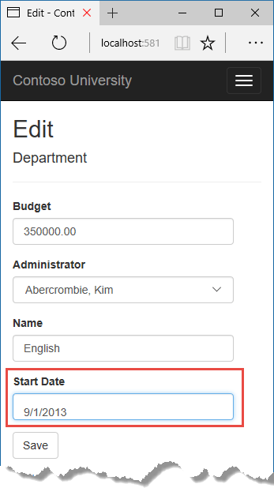
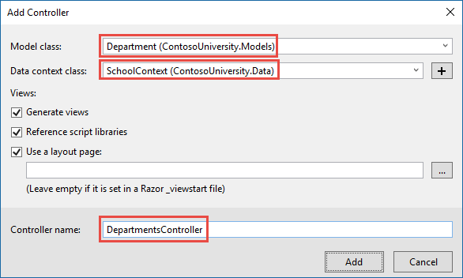
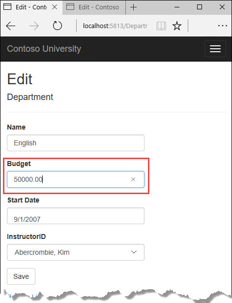
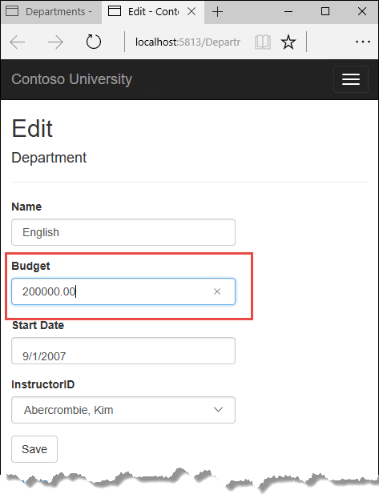

# Handling concurrency conflicts - EF Core with ASP.NET Core MVC tutorial (8 of 10)

By [Tom Dykstra](https://github.com/tdykstra) and [Rick Anderson](https://twitter.com/RickAndMSFT)

The Contoso University sample web application demonstrates how to create ASP.NET Core 1.1 MVC web applications using Entity Framework Core 1.1 and Visual Studio 2017. For information about the tutorial series, see [the first tutorial in the series](intro.md).

In earlier tutorials you learned how to update data. This tutorial shows how to handle conflicts when multiple users update the same entity at the same time.

You'll create web pages that work with the Department entity and handle concurrency errors. The following illustrations show the Edit and Delete pages, including some messages that are displayed if a concurrency conflict occurs.


## Concurrency conflicts

A concurrency conflict occurs when one user displays an entity's data in order to edit it, and then another user updates the same entity's data before the first user's change is written to the database. If you don't enable the detection of such conflicts, whoever updates the database last overwrites the other user's changes. In many applications, this risk is acceptable: if there are few users, or few updates, or if isn't really critical if some changes are overwritten, the cost of programming for concurrency might outweigh the benefit. In that case, you don't have to configure the application to handle concurrency conflicts.

### Pessimistic concurrency (locking)

If your application does need to prevent accidental data loss in concurrency scenarios, one way to do that is to use database locks. This is called pessimistic concurrency. For example, before you read a row from a database, you request a lock for read-only or for update access. If you lock a row for update access, no other users are allowed to lock the row either for read-only or update access, because they would get a copy of data that's in the process of being changed. If you lock a row for read-only access, others can also lock it for read-only access but not for update.

Managing locks has disadvantages. It can be complex to program. It requires significant database management resources, and it can cause performance problems as the number of users of an application increases. For these reasons, not all database management systems support pessimistic concurrency. Entity Framework Core provides no built-in support for it, and this tutorial doesn't show you how to implement it.

### Optimistic Concurrency

The alternative to pessimistic concurrency is optimistic concurrency. Optimistic concurrency means allowing concurrency conflicts to happen, and then reacting appropriately if they do. For example, Jane visits the Department Edit page and changes the Budget amount for the English department from $350,000.00 to $0.00.


Before Jane clicks **Save**, John visits the same page and changes the Start Date field from 9/1/2007 to 9/1/2013.



Jane clicks **Save** first and sees her change when the browser returns to the Index page.


Then John clicks **Save** on an Edit page that still shows a budget of $350,000.00. What happens next is determined by how you handle concurrency conflicts.

Some of the options include the following:

* You can keep track of which property a user has modified and update only the corresponding columns in the database.

     In the example scenario, no data would be lost, because different properties were updated by the two users. The next time someone browses the English department, they'll see both Jane's and John's changes -- a start date of 9/1/2013 and a budget of zero dollars. This method of updating can reduce the number of conflicts that could result in data loss, but it can't avoid data loss if competing changes are made to the same property of an entity. Whether the Entity Framework works this way depends on how you implement your update code. It's often not practical in a web application, because it can require that you maintain large amounts of state in order to keep track of all original property values for an entity as well as new values. Maintaining large amounts of state can affect application performance because it either requires server resources or must be included in the web page itself (for example, in hidden fields) or in a cookie.

* You can let John's change overwrite Jane's change.

     The next time someone browses the English department, they'll see 9/1/2013 and the restored $350,000.00 value. This is called a *Client Wins* or *Last in Wins* scenario. (All values from the client take precedence over what's in the data store.) As noted in the introduction to this section, if you don't do any coding for concurrency handling, this will happen automatically.

* You can prevent John's change from being updated in the database.

     Typically, you would display an error message, show him the current state of the data, and allow him to reapply his changes if he still wants to make them. This is called a *Store Wins* scenario. (The data-store values take precedence over the values submitted by the client.) You'll implement the Store Wins scenario in this tutorial. This method ensures that no changes are overwritten without a user being alerted to what's happening.

### Detecting concurrency conflicts

You can resolve conflicts by handling `DbConcurrencyException` exceptions that the Entity Framework throws. In order to know when to throw these exceptions, the Entity Framework must be able to detect conflicts. Therefore, you must configure the database and the data model appropriately. Some options for enabling conflict detection include the following:

* In the database table, include a tracking column that can be used to determine when a row has been changed. You can then configure the Entity Framework to include that column in the Where clause of SQL Update or Delete commands.

     The data type of the tracking column is typically `rowversion`. The `rowversion` value is a sequential number that's incremented each time the row is updated. In an Update or Delete command, the Where clause includes the original value of the tracking column (the original row version) . If the row being updated has been changed by another user, the value in the `rowversion` column is different than the original value, so the Update or Delete statement can't find the row to update because of the Where clause. When the Entity Framework finds that no rows have been updated by the Update or Delete command (that is, when the number of affected rows is zero), it interprets that as a concurrency conflict.

* Configure the Entity Framework to include the original values of every column in the table in the Where clause of Update and Delete commands.

     As in the first option, if anything in the row has changed since the row was first read, the Where clause won't return a row to update, which the Entity Framework interprets as a concurrency conflict. For database tables that have many columns, this approach can result in very large Where clauses, and can require that you maintain large amounts of state. As noted earlier, maintaining large amounts of state can affect application performance. Therefore this approach is generally not recommended, and it isn't the method used in this tutorial.

     If you do want to implement this approach to concurrency, you have to mark all non-primary-key properties in the entity you want to track concurrency for by adding the `ConcurrencyCheck` attribute to them. That change enables the Entity Framework to include all columns in the SQL Where clause of Update and Delete statements.

In the remainder of this tutorial you'll add a `rowversion` tracking property to the Department entity, create a controller and views, and test to verify that everything works correctly.

## Add a tracking property to the Department entity

In *Models/Department.cs*, add a tracking property named RowVersion:

[!code-csharp[Main](intro/samples/cu/Models/Department.cs?name=snippet_Final&highlight=26,27)]

The `Timestamp` attribute specifies that this column will be included in the Where clause of Update and Delete commands sent to the database. The attribute is called `Timestamp` because previous versions of SQL Server used a SQL `timestamp` data type before the SQL `rowversion` replaced it. The .NET type for `rowversion` is a byte array.

If you prefer to use the fluent API, you can use the `IsConcurrencyToken` method (in *Data/SchoolContext.cs*) to specify the tracking property, as shown in the following example:

```csharp
modelBuilder.Entity<Department>()
    .Property(p => p.RowVersion).IsConcurrencyToken();
```

By adding a property you changed the database model, so you need to do another migration.

Save your changes and build the project, and then enter the following commands in the command window:

```console
dotnet ef migrations add RowVersion
dotnet ef database update
```

## Create a Departments controller and views

Scaffold a Departments controller and views as you did earlier for Students, Courses, and Instructors.



In the *DepartmentsController.cs* file, change all four occurrences of "FirstMidName" to "FullName" so that the department administrator drop-down lists will contain the full name of the instructor rather than just the last name.

[!code-csharp[Main](intro/samples/cu/Controllers/DepartmentsController.cs?name=snippet_Dropdown)]

## Update the Departments Index view

The scaffolding engine created a RowVersion column in the Index view, but that field shouldn't be displayed.

Replace the code in *Views/Departments/Index.cshtml* with the following code.

[!code-html[Main](intro/samples/cu/Views/Departments/Index.cshtml?highlight=4,7,44)]

This changes the heading to "Departments" deletes the RowVersion column, and shows full name instead of first name for the administrator.

## Update the Edit methods in the Departments controller

In both the HttpGet `Edit` method and the `Details` method, add `AsNoTracking`. In the HttpGet `Edit` method, add eager loading for the Administrator.

[!code-csharp[Main](intro/samples/cu/Controllers/DepartmentsController.cs?name=snippet_EagerLoading&highlight=2,3)]

Replace the existing code for the HttpPost `Edit` method with the following code:

[!code-csharp[Main](intro/samples/cu/Controllers/DepartmentsController.cs?name=snippet_EditPost)]

The code begins by trying to read the department to be updated. If the `SingleOrDefaultAsync` method returns null, the department was deleted by another user. In that case the code uses the posted form values to create a department entity so that the Edit page can be redisplayed with an error message. As an alternative, you wouldn't have to re-create the department entity if you display only an error message without redisplaying the department fields.

The view stores the original `RowVersion` value in a hidden field, and this method receives that value in the `rowVersion` parameter. Before you call `SaveChanges`, you have to put that original `RowVersion` property value in the `OriginalValues` collection for the entity.

```csharp
_context.Entry(departmentToUpdate).Property("RowVersion").OriginalValue = rowVersion;
```

Then when the Entity Framework creates a SQL UPDATE command, that command will include a WHERE clause that looks for a row that has the original `RowVersion` value. If no rows are affected by the UPDATE command (no rows have the original `RowVersion` value),  the Entity Framework throws a `DbUpdateConcurrencyException` exception.

The code in the catch block for that exception gets the affected Department entity that has the updated values from the `Entries` property on the exception object.

[!code-csharp[Main](intro/samples/cu/Controllers/DepartmentsController.cs?range=164)]

The `Entries` collection will have just one `EntityEntry` object.  You can use that object to get the new values entered by the user and the current database values.

[!code-csharp[Main](intro/samples/cu/Controllers/DepartmentsController.cs?range=165-166)]

The code adds a custom error message for each column that has database values different from what the user entered on the Edit page (only one field is shown here for brevity).

[!code-csharp[Main](intro/samples/cu/Controllers/DepartmentsController.cs?range=174-178)]

Finally, the code sets the `RowVersion` value of the `departmentToUpdate` to the new value retrieved from the database. This new `RowVersion` value will be stored in the hidden field when the Edit page is redisplayed, and the next time the user clicks **Save**, only concurrency errors that happen since the redisplay of the Edit page will be caught.

[!code-csharp[Main](intro/samples/cu/Controllers/DepartmentsController.cs?range=199-200)]

The `ModelState.Remove` statement is required because `ModelState` has the old `RowVersion` value. In the view, the `ModelState` value for a field takes precedence over the model property values when both are present.

## Update the Department Edit view

In *Views/Departments/Edit.cshtml*, make the following changes:

* Remove the `<div>` element that was scaffolded for the `RowVersion` field.

* Add a hidden field to save the `RowVersion` property value, immediately following the hidden field for the `DepartmentID` property.

* Add a "Select Administrator" option to the drop-down list.

[!code-html[Main](intro/samples/cu/Views/Departments/Edit.cshtml?highlight=15,41-43)]

## Test concurrency conflicts in the Edit page

Run the site and click Departments to go to the Departments Index page.

Right click the **Edit** hyperlink for the English department and select **Open in new tab**, then click the **Edit** hyperlink for the English department. The two browser tabs now display the same information.

Change a field in the first browser tab and click **Save**.



The browser shows the Index page with the changed value.

Change a field in the second browser tab.



Click **Save**. You see an error message:


Click **Save** again. The value you entered in the second browser tab is saved. You see the saved values when the Index page appears.

## Update the Delete page

For the Delete page, the Entity Framework detects concurrency conflicts caused by someone else editing the department in a similar manner. When the HttpGet `Delete` method displays the confirmation view, the view includes the original `RowVersion` value in a hidden field. That value is then available to the HttpPost `Delete` method that's called when the user confirms the deletion. When the Entity Framework creates the SQL DELETE command, it includes a WHERE clause with the original `RowVersion` value. If the command results in zero rows affected (meaning the row was changed after the Delete confirmation page was displayed), a concurrency exception is thrown, and the HttpGet `Delete` method is called with an error flag set to true in order to redisplay the confirmation page with an error message. It's also possible that zero rows were affected because the row was deleted by another user, so in that case no error message is displayed.

### Update the Delete methods in the Departments controller

In *DepartmentController.cs*, replace the HttpGet `Delete` method with the following code:

[!code-csharp[Main](intro/samples/cu/Controllers/DepartmentsController.cs?name=snippet_DeleteGet&highlight=1,14-17,21-29)]

The method accepts an optional parameter that indicates whether the page is being redisplayed after a concurrency error. If this flag is true and the department specified no longer exists, it was deleted by another user. In that case, the code redirects to the Index page.  If this flag is true and the Department does exist, it was changed by another user. In that case, the code sends sends an error message to the view using `ViewData`.  

Replace the code in the HttpPost `Delete` method (named `DeleteConfirmed`) with the following code:

[!code-csharp[Main](intro/samples/cu/Controllers/DepartmentsController.cs?name=snippet_DeletePost&highlight=3,7,14,15,16,17,18)]

In the scaffolded code that you just replaced, this method accepted only a record ID:


```csharp
public async Task<IActionResult> DeleteConfirmed(int id)
```

You've changed this parameter to a Department entity instance created by the model binder. This gives EF access to the RowVersion property value in addition to the record key.

```csharp
public async Task<IActionResult> Delete(Department department)
```

You have also changed the action method name from `DeleteConfirmed` to `Delete`. The scaffolded code used the name `DeleteConfirmed` to give the HttpPost method a unique signature. (The CLR requires overloaded methods to have different method parameters.) Now that the signatures are unique, you can stick with the MVC convention and use the same name for the HttpPost and HttpGet delete methods.

If the department is already deleted, the `AnyAsync` method returns false and the application just goes back to the Index method.

If a concurrency error is caught, the code redisplays the Delete confirmation page and provides a flag that indicates it should display a concurrency error message.

### Update the Delete view

In *Views/Department/Delete.cshtml*, replace the scaffolded code with the following code that adds an error message field and hidden fields for the DepartmentID and RowVersion properties. The changes are highlighted.

[!code-html[Main](intro/samples/cu/Views/Departments/Delete.cshtml?highlight=9,38,43-44)]

This makes the following changes:

* Adds an error message between the `h2` and `h3` headings.

* Replaces LastName with FullName in the **Administrator** field.

* Removes the RowVersion field.

* Adds hidden fields for the `DepartmentID` and `RowVersion` properties.

Run the Departments Index page. Right click the **Delete** hyperlink for the English department and select **Open in new tab**, then in the first tab click the **Edit** hyperlink for the English department.

In the first window, change one of the values, and click **Save**:


In the second tab, click **Delete**. You see the concurrency error message, and the Department values are refreshed with what's currently in the database.


If you click **Delete** again, you're redirected to the Index page, which shows that the department has been deleted.

## Update Details and Create views

You can optionally clean up scaffolded code in the Details and Create views.

Replace the code in *Views/Departments/Details.cshtml* to delete the RowVersion column and show the full name of the Administrator.

[!code-html[Main](intro/samples/cu/Views/Departments/Details.cshtml?highlight=35)]

Replace the code in *Views/Departments/Create.cshtml* to add a Select option to the drop-down list.

[!code-html[Main](intro/samples/cu/Views/Departments/Create.cshtml?highlight=38-40)]

## Summary

This completes the introduction to handling concurrency conflicts. For more information about how to handle concurrency in EF Core, see [Concurrency conflicts](https://docs.microsoft.com/en-us/ef/core/saving/concurrency). The next tutorial shows how to implement table-per-hierarchy inheritance for the Instructor and Student entities.

>[!div class="step-by-step"]
[Previous](update-related-data.md)
[Next](inheritance.md)  
