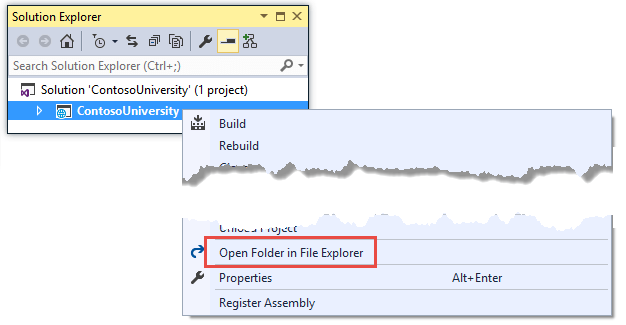
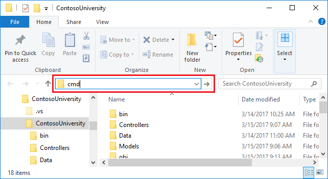

# Tutorial: Part 5, apply migrations to the Contoso University sample

In this tutorial, you start using the EF Core migrations feature for managing data model changes. In later tutorials, you'll add more migrations as you change the data model.

In this tutorial, you:

> [!div class="checklist"]
> * Learn about migrations
> * Create an initial migration
> * Examine Up and Down methods
> * Learn about the data model snapshot
> * Apply the migration

## Prerequisites

* [Sorting, filtering, and paging](sort-filter-page.md)

## About migrations

When you develop a new application, your data model changes frequently, and each time the model changes, it gets out of sync with the database. You started these tutorials by configuring the Entity Framework to create the database if it doesn't exist. Then each time you change the data model -- add, remove, or change entity classes or change your DbContext class -- you can delete the database and EF creates a new one that matches the model, and seeds it with test data.

This method of keeping the database in sync with the data model works well until you deploy the application to production. When the application is running in production it's usually storing data that you want to keep, and you don't want to lose everything each time you make a change such as adding a new column. The EF Core Migrations feature solves this problem by enabling EF to update the database schema instead of creating  a new database.

To work with migrations, you can use the **Package Manager Console** (PMC) or the CLI.  These tutorials show how to use CLI commands. Information about the PMC is at [the end of this tutorial](#pmc).

## Drop the database

Install EF Core tools as a [global tool](/ef/core/miscellaneous/cli/dotnet) and delete the database:

 ```dotnetcli
 dotnet tool install --global dotnet-ef
 dotnet ef database drop
 ```

The following section explains how to run CLI commands.

## Create an initial migration

Save your changes and build the project. Then open a command window and navigate to the project folder. Here's a quick way to do that:

* In **Solution Explorer**, right-click the project and choose **Open Folder in File Explorer** from the context menu.

  

* Enter "cmd" in the address bar and press Enter.

  

Enter the following command in the command window:

```dotnetcli
dotnet ef migrations add InitialCreate
```

In the preceding commands, output similar to the following is displayed:

```console
info: Microsoft.EntityFrameworkCore.Infrastructure[10403]
      Entity Framework Core initialized 'SchoolContext' using provider 'Microsoft.EntityFrameworkCore.SqlServer' with options: None
Done. To undo this action, use 'ef migrations remove'
```

If you see an error message "*cannot access the file ... ContosoUniversity.dll because it is being used by another process.*", find the IIS Express icon in the Windows System Tray, and right-click it, then click **ContosoUniversity > Stop Site**.

## Examine Up and Down methods

When you executed the `migrations add` command, EF generated the code that will create the database from scratch. This code is in the *Migrations* folder, in the file named *\<timestamp>_InitialCreate.cs*. The `Up` method of the `InitialCreate` class creates the database tables that correspond to the data model entity sets, and the `Down` method deletes them, as shown in the following example.

[!code-csharp[](intro/samples/cu/Migrations/20170215220724_InitialCreate.cs?range=92-118)]

Migrations calls the `Up` method to implement the data model changes for a migration. When you enter a command to roll back the update, Migrations calls the `Down` method.

This code is for the initial migration that was created when you entered the `migrations add InitialCreate` command. The migration name parameter ("InitialCreate" in the example) is used for the file name and can be whatever you want. It's best to choose a word or phrase that summarizes what is being done in the migration. For example, you might name a later migration "AddDepartmentTable".

If you created the initial migration when the database already exists, the database creation code is generated but it doesn't have to run because the database already matches the data model. When you deploy the app to another environment where the database doesn't exist yet, this code will run to create your database, so it's a good idea to test it first. That's why you dropped the database earlier -- so that migrations can create a new one from scratch.

## The data model snapshot

Migrations creates a *snapshot* of the current database schema in *Migrations/SchoolContextModelSnapshot.cs*. When you add a migration, EF determines what changed by comparing the data model to the snapshot file.

Use the [dotnet ef migrations remove](/ef/core/miscellaneous/cli/dotnet#dotnet-ef-migrations-remove) command to remove a migration. `dotnet ef migrations remove` deletes the migration and ensures the snapshot is correctly reset. If `dotnet ef migrations remove` fails, use `dotnet ef migrations remove -v` to get more information on the failure.

See [EF Core Migrations in Team Environments](/ef/core/managing-schemas/migrations/teams) for more information about how the snapshot file is used.

## Apply the migration

In the command window, enter the following command to create the database and tables in it.

```dotnetcli
dotnet ef database update
```

The output from the command is similar to the `migrations add` command, except that you see logs for the SQL commands that set up the database. Most of the logs are omitted in the following sample output. If you prefer not to see this level of detail in log messages, you can change the log level in the *appsettings.Development.json* file. For more information, see <xref:fundamentals/logging/index>.

```text
info: Microsoft.EntityFrameworkCore.Infrastructure[10403]
      Entity Framework Core initialized 'SchoolContext' using provider 'Microsoft.EntityFrameworkCore.SqlServer' with options: None
info: Microsoft.EntityFrameworkCore.Database.Command[20101]
      Executed DbCommand (274ms) [Parameters=[], CommandType='Text', CommandTimeout='60']
      CREATE DATABASE [ContosoUniversity2];
info: Microsoft.EntityFrameworkCore.Database.Command[20101]
      Executed DbCommand (60ms) [Parameters=[], CommandType='Text', CommandTimeout='60']
      IF SERVERPROPERTY('EngineEdition') <> 5
      BEGIN
          ALTER DATABASE [ContosoUniversity2] SET READ_COMMITTED_SNAPSHOT ON;
      END;
info: Microsoft.EntityFrameworkCore.Database.Command[20101]
      Executed DbCommand (15ms) [Parameters=[], CommandType='Text', CommandTimeout='30']
      CREATE TABLE [__EFMigrationsHistory] (
          [MigrationId] nvarchar(150) NOT NULL,
          [ProductVersion] nvarchar(32) NOT NULL,
          CONSTRAINT [PK___EFMigrationsHistory] PRIMARY KEY ([MigrationId])
      );

<logs omitted for brevity>

info: Microsoft.EntityFrameworkCore.Database.Command[20101]
      Executed DbCommand (3ms) [Parameters=[], CommandType='Text', CommandTimeout='30']
      INSERT INTO [__EFMigrationsHistory] ([MigrationId], [ProductVersion])
      VALUES (N'20190327172701_InitialCreate', N'5.0-rtm');
Done.
```

Use **SQL Server Object Explorer** to inspect the database as you did in the first tutorial.  You'll notice the addition of an \_\_EFMigrationsHistory table that keeps track of which migrations have been applied to the database. View the data in that table and you'll see one row for the first migration. (The last log in the preceding CLI output example shows the INSERT statement that creates this row.)

Run the application to verify that everything still works the same as before.


<a id="pmc"></a>

## Compare CLI and PMC

The EF tooling for managing migrations is available from .NET Core CLI commands or from PowerShell cmdlets in the Visual Studio **Package Manager Console** (PMC) window. This tutorial shows how to use the CLI, but you can use the PMC if you prefer.

The EF commands for the PMC commands are in the [Microsoft.EntityFrameworkCore.Tools](https://www.nuget.org/packages/Microsoft.EntityFrameworkCore.Tools) package. This package is included in the [Microsoft.AspNetCore.App metapackage](xref:fundamentals/metapackage-app), so you don't need to add a package reference if your app has a package reference for `Microsoft.AspNetCore.App`.

**Important:** This isn't the same package as the one you install for the CLI by editing the *.csproj* file. The name of this one ends in `Tools`, unlike the CLI package name which ends in `Tools.DotNet`.

For more information about the CLI commands, see [.NET Core CLI](/ef/core/miscellaneous/cli/dotnet).

For more information about the PMC commands, see [Package Manager Console (Visual Studio)](/ef/core/miscellaneous/cli/powershell).

## Get the code

[Download or view the completed application.](https://github.com/dotnet/AspNetCore.Docs/tree/main/aspnetcore/data/ef-mvc/intro/samples)

## Next step

Advance to the next tutorial to begin looking at more advanced topics about expanding the data model. Along the way you'll create and apply additional migrations.

> [!div class="nextstepaction"]
> [Create and apply additional migrations](complex-data-model.md)
