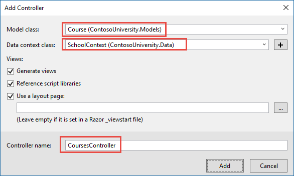
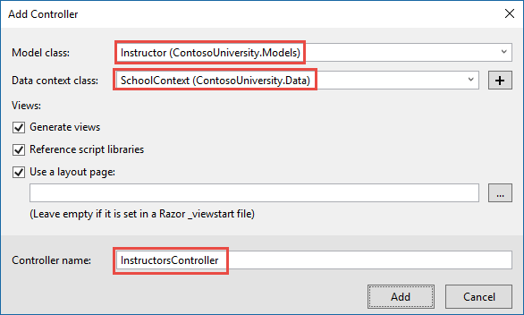
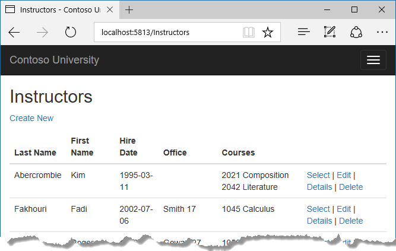
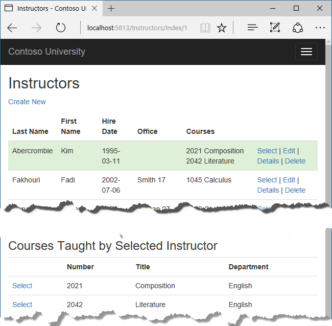

# ASP.NET Core MVC with EF Core - Read Related Data - 6 of 10

By [Tom Dykstra](https://github.com/tdykstra) and [Rick Anderson](https://twitter.com/RickAndMSFT)

The Contoso University sample web application demonstrates how to create ASP.NET Core MVC web applications using Entity Framework Core and Visual Studio. For information about the tutorial series, see [the first tutorial in the series](intro.md).

In the previous tutorial, you completed the School data model. In this tutorial, you'll read and display related data -- that is, data that the Entity Framework loads into navigation properties.

The following illustrations show the pages that you'll work with.


## Eager, explicit, and lazy Loading of related data

There are several ways that Object-Relational Mapping (ORM) software such as Entity Framework can load related data into the navigation properties of an entity:

* Eager loading. When the entity is read, related data is retrieved along with it. This typically results in a single join query that retrieves all of the data that's needed. You specify eager loading in Entity Framework Core by using the `Include` and `ThenInclude` methods.

  

  You can retrieve some of the data in separate queries, and EF "fixes up" the navigation properties.  That is, EF automatically adds the separately retrieved entities where they belong in navigation properties of previously retrieved entities. For the query that retrieves related data, you can use the `Load` method instead of a method that returns a list or object, such as `ToList` or `Single`.

  

* Explicit loading. When the entity is first read, related data isn't retrieved. You write code that retrieves the related data if it's needed. As in the case of eager loading with separate queries, explicit loading results in multiple queries sent to the database. The difference is that with explicit loading, the code specifies the navigation properties to be loaded. In Entity Framework Core 1.1 you can use the `Load` method to do explicit loading. For example:

  

* Lazy loading. When the entity is first read, related data isn't retrieved. However, the first time you attempt to access a navigation property, the data required for that navigation property is automatically retrieved. A query is sent to the database each time you try to get data from a navigation property for the first time. Entity Framework Core 1.0 doesn't support lazy loading.

### Performance considerations

If you know you need related data for every entity retrieved, eager loading often offers the best performance, because a single query sent to the database is typically more efficient than separate queries for each entity retrieved. For example, suppose that each department has ten related courses. Eager loading of all related data would result in just a single (join) query and a single round trip to the database. A separate query for courses for each department would result in eleven round trips to the database. The extra round trips to the database are especially detrimental to performance when latency is high.

On the other hand, in some scenarios separate queries is more efficient. Eager loading of all related data in one query might cause a very complex join to be generated, which SQL Server can't process efficiently. Or if you need to access an entity's navigation properties only for a subset of a set of the entities you're processing, separate queries might perform better because eager loading of everything up front would retrieve more data than you need. If performance is critical, it's best to test performance both ways in order to make the best choice.

## Create a Courses page that displays Department name

The Course entity includes a navigation property that contains the Department entity of the department that the course is assigned to. To display the name of the assigned department in a list of courses, you need to get the Name property from the Department entity that's in the `Course.Department` navigation property.

Create a controller named CoursesController for the Course entity type, using the same options for the **MVC Controller with views, using Entity Framework** scaffolder that you did earlier for the Students controller, as shown in the following illustration:



Open *CoursesController.cs* and examine the `Index` method. The automatic scaffolding has specified eager loading for the `Department` navigation property by using the `Include` method.

Replace the `Index` method with the following code that uses a more appropriate name for the `IQueryable` that returns Course entities (`courses` instead of `schoolContext`):

[!code-csharp[](intro/samples/cu/Controllers/CoursesController.cs?name=snippet_RevisedIndexMethod)]

Open *Views/Courses/Index.cshtml* and replace the template code with the following code. The changes are highlighted:

[!code-html[](intro/samples/cu/Views/Courses/Index.cshtml?highlight=4,7,15-17,34-36,44)]

You've made the following changes to the scaffolded code:

* Changed the heading from Index to Courses.

* Added a **Number** column that shows the `CourseID` property value. By default, primary keys aren't scaffolded because normally they're meaningless to end users. However, in this case the primary key is meaningful and you want to show it.

* Changed the **Department** column to display the department name. The code displays the `Name` property of the Department entity that's loaded into the `Department` navigation property:

  ```html
  @Html.DisplayFor(modelItem => item.Department.Name)
  ```

Run the app and select the **Courses** tab to see the list with department names.


## Create an Instructors page that shows Courses and Enrollments

In this section, you'll create a controller and view for the Instructor entity in order to display the Instructors page:


This page reads and displays related data in the following ways:

* The list of instructors displays related data from the OfficeAssignment entity. The Instructor and OfficeAssignment entities are in a one-to-zero-or-one relationship. You'll use eager loading for the OfficeAssignment entities. As explained earlier, eager loading is typically more efficient when you need the related data for all retrieved rows of the primary table. In this case, you want to display office assignments for all displayed instructors.

* When the user selects an instructor, related Course entities are displayed. The Instructor and Course entities are in a many-to-many relationship. You'll use eager loading for the Course entities and their related Department entities. In this case, separate queries might be more efficient because you need courses only for the selected instructor. However, this example shows how to use eager loading for navigation properties within entities that are themselves in navigation properties.

* When the user selects a course, related data from the Enrollments entity set is displayed. The Course and Enrollment entities are in a one-to-many relationship. You'll use separate queries for Enrollment entities and their related Student entities.

### Create a view model for the Instructor Index view

The Instructors page shows data from three different tables. Therefore, you'll create a view model that includes three properties, each holding the data for one of the tables.

In the *SchoolViewModels* folder, create *InstructorIndexData.cs* and replace the existing code with the following code:

[!code-csharp[](intro/samples/cu/Models/SchoolViewModels/InstructorIndexData.cs)]

### Create the Instructor controller and views

Create an Instructors controller with EF read/write actions as shown in the following illustration:



Open *InstructorsController.cs* and add a using statement for the ViewModels namespace:

[!code-csharp[](intro/samples/cu/Controllers/InstructorsController.cs?name=snippet_Using)]

Replace the Index method with the following code to do eager loading of related data and put it in the view model.

[!code-csharp[](intro/samples/cu/Controllers/InstructorsController.cs?name=snippet_EagerLoading)]

The method accepts optional route data (`id`) and a query string parameter (`courseID`) that provide the ID values of the selected instructor and selected course. The parameters are provided by the **Select** hyperlinks on the page.

The code begins by creating an instance of the view model and putting in it the list of instructors. The code specifies eager loading for the `Instructor.OfficeAssignment` and the `Instructor.CourseAssignments` navigation properties. Within the `CourseAssignments` property, the `Course` property is loaded, and within that, the `Enrollments` and `Department` properties are loaded, and within each `Enrollment` entity the `Student` property is loaded.

[!code-csharp[](intro/samples/cu/Controllers/InstructorsController.cs?name=snippet_ThenInclude)]

Since the view always requires the OfficeAssignment entity, it's more efficient to fetch that in the same query. Course entities are required when an instructor is selected in the web page, so a single query is better than multiple queries only if the page is displayed more often with a course selected than without.

The code repeats `CourseAssignments` and `Course` because you need two properties from `Course`. The first string of `ThenInclude` calls gets `CourseAssignment.Course`, `Course.Enrollments`, and `Enrollment.Student`.

[!code-csharp[](intro/samples/cu/Controllers/InstructorsController.cs?name=snippet_ThenInclude&highlight=3-6)]

At that point in the code, another `ThenInclude` would be for navigation properties of `Student`, which you don't need. But calling `Include` starts over with `Instructor` properties, so you have to go through the chain again, this time specifying `Course.Department` instead of `Course.Enrollments`.

[!code-csharp[](intro/samples/cu/Controllers/InstructorsController.cs?name=snippet_ThenInclude&highlight=7-9)]

The following code executes when an instructor was selected. The selected instructor is retrieved from the list of instructors in the view model. The view model's `Courses` property is then loaded with the Course entities from that instructor's `CourseAssignments` navigation property.

[!code-csharp[](intro/samples/cu/Controllers/InstructorsController.cs?range=56-62)]

The `Where` method returns a collection, but in this case the criteria passed to that method result in only a single Instructor entity being returned. The `Single` method converts the collection into a single Instructor entity, which gives you access to that entity's `CourseAssignments` property. The `CourseAssignments` property contains `CourseAssignment` entities, from which you want only the related `Course` entities.

You use the `Single` method on a collection when you know the collection will have only one item. The Single method throws an exception if the collection passed to it's empty or if there's more than one item. An alternative is `SingleOrDefault`, which returns a default value (null in this case) if the collection is empty. However, in this case that would still result in an exception (from trying to find a `Courses` property on a null reference), and the exception message would less clearly indicate the cause of the problem. When you call the `Single` method, you can also pass in the Where condition instead of calling the `Where` method separately:

```csharp
.Single(i => i.ID == id.Value)
```

Instead of:

```csharp
.Where(I => i.ID == id.Value).Single()
```

Next, if a course was selected, the selected course is retrieved from the list of courses in the view model. Then the view model's `Enrollments` property is loaded with the Enrollment entities from that course's `Enrollments` navigation property.

[!code-csharp[](intro/samples/cu/Controllers/InstructorsController.cs?range=64-69)]

### Modify the Instructor Index view

In *Views/Instructors/Index.cshtml*, replace the template code with the following code. The changes are highlighted.

[!code-html[](intro/samples/cu/Views/Instructors/Index1.cshtml?range=1-64&highlight=1,3-7,15-19,24,26-31,41-54,56)]

You've made the following changes to the existing code:

* Changed the model class to `InstructorIndexData`.

* Changed the page title from **Index** to **Instructors**.

* Added an **Office** column that displays `item.OfficeAssignment.Location` only if `item.OfficeAssignment` isn't null. (Because this is a one-to-zero-or-one relationship, there might not be a related OfficeAssignment entity.)

  ```html
  @if (item.OfficeAssignment != null)
  {
      @item.OfficeAssignment.Location
  }
  ```

* Added a **Courses** column that displays courses taught by each instructor. See [Explicit Line Transition with `@:`](xref:mvc/views/razor#explicit-line-transition-with-) for more about this razor syntax.

* Added code that dynamically adds `class="success"` to the `tr` element of the selected instructor. This sets a background color for the selected row using a Bootstrap class.

  ```html
  string selectedRow = "";
  if (item.ID == (int?)ViewData["InstructorID"])
  {
      selectedRow = "success";
  }
  <tr class="@selectedRow">
  ```

* Added a new hyperlink labeled **Select** immediately before the other links in each row, which causes the selected instructor's ID to be sent to the `Index` method.

  ```html
  <a asp-action="Index" asp-route-id="@item.ID">Select</a> |
  ```

Run the app and select the **Instructors** tab. The page displays the Location property of related OfficeAssignment entities and an empty table cell when there's no related OfficeAssignment entity.



In the *Views/Instructors/Index.cshtml* file, after the closing table element (at the end of the file), add the following code. This code displays a list of courses related to an instructor when an instructor is selected.

[!code-html[](intro/samples/cu/Views/Instructors/Index1.cshtml?range=66-101)]

This code reads the `Courses` property of the view model to display a list of courses. It also provides a **Select** hyperlink that sends the ID of the selected course to the `Index` action method.

Refresh the page and select an instructor. Now you see a grid that displays courses assigned to the selected instructor, and for each course you see the name of the assigned department.



After the code block you just added, add the following code. This displays a list of the students who are enrolled in a course when that course is selected.

[!code-html[](intro/samples/cu/Views/Instructors/Index1.cshtml?range=103-125)]

This code reads the Enrollments property of the view model in order to display a list of students enrolled in the course.

Refresh the page again and select an instructor. Then select a course to see the list of enrolled students and their grades.


## Explicit loading

When you retrieved the list of instructors in *InstructorsController.cs*, you specified eager loading for the `CourseAssignments` navigation property.

Suppose you expected users to only rarely want to see enrollments in a selected instructor and course. In that case, you might want to load the enrollment data only if it's requested. To see an example of how to do explicit loading, replace the `Index` method with the following code, which removes eager loading for Enrollments and loads that property explicitly. The code changes are highlighted.

[!code-csharp[](intro/samples/cu/Controllers/InstructorsController.cs?name=snippet_ExplicitLoading&highlight=23-29)]

The new code drops the *ThenInclude* method calls for enrollment data from the code that retrieves instructor entities. If an instructor and course are selected, the highlighted code retrieves Enrollment entities for the selected course, and Student entities for each Enrollment.

Run the app, go to the Instructors Index page now and you'll see no difference in what's displayed on the page, although you've changed how the data is retrieved.

## Summary

You've now used eager loading with one query and with multiple queries to read related data into navigation properties. In the next tutorial you'll learn how to update related data.

>[!div class="step-by-step"]
>[Previous](complex-data-model.md)
>[Next](update-related-data.md)  
