# Part 8, Razor Pages with EF Core in ASP.NET Core - Concurrency

By [Rick Anderson](https://twitter.com/RickAndMSFT), [Tom Dykstra](https://github.com/tdykstra), and [Jon P Smith](https://twitter.com/thereformedprog)

[!INCLUDE [about the series](../../includes/RP-EF/intro.md)]

::: moniker range=">= aspnetcore-3.0"

This tutorial shows how to handle conflicts when multiple users update an entity concurrently (at the same time).

## Concurrency conflicts

A concurrency conflict occurs when:

* A user navigates to the edit page for an entity.
* Another user updates the same entity before the first user's change is written to the database.

If concurrency detection isn't enabled, whoever updates the database last overwrites the other user's changes. If this risk is acceptable, the cost of programming for concurrency might outweigh the benefit.

### Pessimistic concurrency (locking)

One way to prevent concurrency conflicts is to use database locks. This is called pessimistic concurrency. Before the app reads a database row that it intends to update, it requests a lock. Once a row is locked for update access, no other users are allowed to lock the row until the first lock is released.

Managing locks has disadvantages. It can be complex to program and can cause performance problems as the number of users increases. Entity Framework Core provides no built-in support for it, and this tutorial doesn't show how to implement it.

### Optimistic concurrency

Optimistic concurrency allows concurrency conflicts to happen, and then reacts appropriately when they do. For example, Jane visits the Department edit page and changes the budget for the English department from $350,000.00 to $0.00.

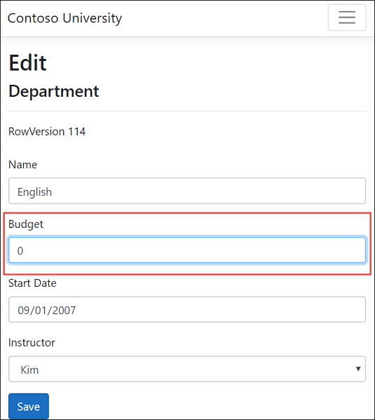

Before Jane clicks **Save**, John visits the same page and changes the Start Date field from 9/1/2007 to 9/1/2013.

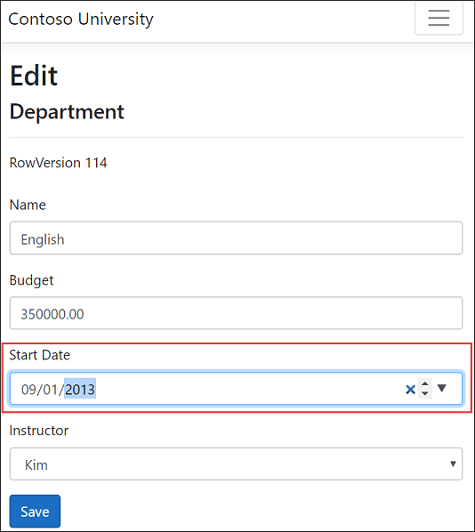

Jane clicks **Save** first and sees her change take effect, since the browser displays the Index page with zero as the Budget amount.

John clicks **Save** on an Edit page that still shows a budget of $350,000.00. What happens next is determined by how you handle concurrency conflicts:

* You can keep track of which property a user has modified and update only the corresponding columns in the database.

  In the scenario, no data would be lost. Different properties were updated by the two users. The next time someone browses the English department, they will see both Jane's and John's changes. This method of updating can reduce the number of conflicts that could result in data loss. This approach has some disadvantages:
 
  * Can't avoid data loss if competing changes are made to the same property.
  * Is generally not practical in a web app. It requires maintaining significant state in order to keep track of all fetched values and new values. Maintaining large amounts of state can affect app performance.
  * Can increase app complexity compared to concurrency detection on an entity.

* You can let John's change overwrite Jane's change.

  The next time someone browses the English department, they will see 9/1/2013 and the fetched $350,000.00 value. This approach is called a *Client Wins* or *Last in Wins* scenario. (All values from the client take precedence over what's in the data store.) If you don't do any coding for concurrency handling, Client Wins happens automatically.

* You can prevent John's change from being updated in the database. Typically, the app would:

  * Display an error message.
  * Show the current state of the data.
  * Allow the user to reapply the changes.

  This is called a *Store Wins* scenario. (The data-store values take precedence over the values submitted by the client.) You implement the Store Wins scenario in this tutorial. This method ensures that no changes are overwritten without a user being alerted.

## Conflict detection in EF Core

EF Core throws `DbConcurrencyException` exceptions when it detects conflicts. The data model has to be configured to enable conflict detection. Options for enabling conflict detection include the following:

* Configure EF Core to include the original values of columns configured as [concurrency tokens](/ef/core/modeling/concurrency) in the Where clause of Update and Delete commands.

  When `SaveChanges` is called, the Where clause looks for the original values of any properties annotated with the <xref:System.ComponentModel.DataAnnotations.ConcurrencyCheckAttribute> attribute. The update statement won't find a row to update if any of the concurrency token properties changed since the row was first read. EF Core interprets that as a concurrency conflict. For database tables that have many columns, this approach can result in very large Where clauses, and can require large amounts of state. Therefore this approach is generally not recommended, and it isn't the method used in this tutorial.

* In the database table, include a tracking column that can be used to determine when a row has been changed.

  In a SQL Server database, the data type of the tracking column is `rowversion`. The `rowversion` value is a sequential number that's incremented each time the row is updated. In an Update or Delete command, the Where clause includes the original value of the tracking column (the original row version number). If the row being updated has been changed by another user, the value in the `rowversion` column is different than the original value. In that case, the Update or Delete statement can't find the row to update because of the Where clause. EF Core throws a concurrency exception when no rows are affected by an Update or Delete command.

## Add a tracking property

In *Models/Department.cs*, add a tracking property named RowVersion:

[!code-csharp[](intro/samples/cu30/Models/Department.cs?highlight=26,27)]

The <xref:System.ComponentModel.DataAnnotations.TimestampAttribute> attribute is what identifies the column as a concurrency tracking column. The fluent API is an alternative way to specify the tracking property:

```csharp
modelBuilder.Entity<Department>()
  .Property<byte[]>("RowVersion")
  .IsRowVersion();
```

# [Visual Studio](#tab/visual-studio)

For a SQL Server database, the `[Timestamp]` attribute on an entity property defined as byte array:

* Causes the column to be included in DELETE and UPDATE WHERE clauses.
* Sets the column type in the database to [rowversion](/sql/t-sql/data-types/rowversion-transact-sql).

The database generates a sequential row version number that's incremented each time the row is updated. In an `Update` or `Delete` command, the `Where` clause includes the fetched row version value. If the row being updated has changed since it was fetched:

* The current row version value doesn't match the fetched value.
* The `Update` or `Delete` commands don't find a row because the `Where` clause looks for the fetched row version value.
* A `DbUpdateConcurrencyException` is thrown.

The following code shows a portion of the T-SQL generated by EF Core when the Department name is updated:

[!code-sql[](intro/samples/cu30snapshots/8-concurrency/sql.txt?highlight=2-3)]

The preceding highlighted code shows the `WHERE` clause containing `RowVersion`. If the database `RowVersion` doesn't equal the `RowVersion` parameter (`@p2`), no rows are updated.

The following highlighted code shows the T-SQL that verifies exactly one row was updated:

[!code-sql[](intro/samples/cu30snapshots/8-concurrency/sql.txt?highlight=4-6)]

[@@ROWCOUNT](/sql/t-sql/functions/rowcount-transact-sql) returns the number of rows affected by the last statement. If no rows are updated, EF Core throws a `DbUpdateConcurrencyException`.

# [Visual Studio Code](#tab/visual-studio-code)

For a SQLite database, the `[Timestamp]` attribute on an entity property defined as byte array:

* Causes the column to be included in DELETE and UPDATE WHERE clauses.
* Maps to a BLOB column type.

Database triggers update the RowVersion column with a new random byte array whenever a row is updated. In an `Update` or `Delete` command, the `Where` clause includes the fetched value of the RowVersion column. If the row being updated has changed since it was fetched:

* The current row version value doesn't match the fetched value.
* The `Update` or `Delete` command doesn't find a row because the `Where` clause looks for the original row version value.
* A `DbUpdateConcurrencyException` is thrown.

---

### Update the database

Adding the `RowVersion` property changes the data model, which requires a migration.

Build the project. 

# [Visual Studio](#tab/visual-studio)

* Run the following command in the PMC:

  ```powershell
  Add-Migration RowVersion
  ```

# [Visual Studio Code](#tab/visual-studio-code)

* Run the following command in a terminal:

  ```dotnetcli
  dotnet ef migrations add RowVersion
  ```

---

This command:

* Creates the *Migrations/{time stamp}_RowVersion.cs* migration file.
* Updates the *Migrations/SchoolContextModelSnapshot.cs* file. The update adds the following highlighted code to the `BuildModel` method:

  [!code-csharp[](intro/samples/cu30/Migrations/SchoolContextModelSnapshot.cs?name=snippet_Department&highlight=15-17)]

# [Visual Studio](#tab/visual-studio)

* Run the following command in the PMC:

  ```powershell
  Update-Database
  ```

# [Visual Studio Code](#tab/visual-studio-code)

* Open the `Migrations/<timestamp>_RowVersion.cs` file and add the highlighted code:

  [!code-csharp[](intro/samples/cu30/MigrationsSQLite/20190722151951_RowVersion.cs?highlight=16-42)]

  The preceding code:

  * Updates existing rows with random blob values.
  * Adds database triggers that set the RowVersion column to a random blob value whenever a row is updated.

* Run the following command in a terminal:

  ```dotnetcli
  dotnet ef database update
  ```

---

<a name="scaffold"></a>

## Scaffold Department pages

# [Visual Studio](#tab/visual-studio)

* Follow the instructions in [Scaffold Student pages](xref:data/ef-rp/intro#scaffold-student-pages) with the following exceptions:

* Create a *Pages/Departments* folder.  
* Use `Department` for the model class.
  * Use the existing context class instead of creating a new one.

# [Visual Studio Code](#tab/visual-studio-code)

* Create a *Pages/Departments* folder.

* Run the following command to scaffold the Department pages.

  **On Windows:**

  ```dotnetcli
  dotnet aspnet-codegenerator razorpage -m Department -dc SchoolContext -udl -outDir Pages\Departments --referenceScriptLibraries
  ```

  **On Linux or macOS:**

  ```dotnetcli
  dotnet aspnet-codegenerator razorpage -m Department -dc SchoolContext -udl -outDir Pages/Departments --referenceScriptLibraries
  ```

---

Build the project.

## Update the Index page

The scaffolding tool created a `RowVersion` column for the Index page, but that field wouldn't be displayed in a production app. In this tutorial, the last byte of the `RowVersion` is displayed to help show how concurrency handling works. The last byte isn't guaranteed to be unique by itself.

Update *Pages\Departments\Index.cshtml* page:

* Replace Index with Departments.
* Change the code containing `RowVersion` to show just the last byte of the byte array.
* Replace FirstMidName with FullName.

The following code shows the updated page:

[!code-cshtml[](intro/samples/cu30/Pages/Departments/Index.cshtml?highlight=5,8,29,48,51)]

## Update the Edit page model

Update *Pages\Departments\Edit.cshtml.cs* with the following code:

[!code-csharp[](intro/samples/cu30/Pages/Departments/Edit.cshtml.cs?name=snippet_All)]

The <xref:Microsoft.EntityFrameworkCore.ChangeTracking.PropertyEntry.OriginalValue> is updated with the `rowVersion` value from the entity when it was fetched in the `OnGet` method. EF Core generates a SQL UPDATE command with a WHERE clause containing the original `RowVersion` value. If no rows are affected by the UPDATE command (no rows have the original `RowVersion` value), a `DbUpdateConcurrencyException` exception is thrown.

[!code-csharp[](intro/samples/cu30/Pages/Departments/Edit.cshtml.cs?name=snippet_RowVersion&highlight=17-18)]

In the preceding highlighted code:

* The value in `Department.RowVersion` is what was in the entity when it was originally fetched in the Get request for the Edit page. The value is provided to the `OnPost` method by a hidden field in the Razor page that displays the entity to be edited. The hidden field value is copied to `Department.RowVersion` by the model binder.
* `OriginalValue` is what EF Core will use in the Where clause. Before the highlighted line of code executes, `OriginalValue` has the value that was in the database when `FirstOrDefaultAsync` was called in this method, which might be different from what was displayed on the Edit page.
* The highlighted code makes sure that EF Core uses the original `RowVersion` value from the displayed `Department` entity in the SQL UPDATE statement's Where clause.

When a concurrency error happens, the following highlighted code gets the client values (the values posted to this method) and the database values.

[!code-csharp[](intro/samples/cu30/Pages/Departments/Edit.cshtml.cs?name=snippet_TryUpdateModel&highlight=14,23)]

The following code adds a custom error message for each column that has database values different from what was posted to `OnPostAsync`:

[!code-csharp[](intro/samples/cu30/Pages/Departments/Edit.cshtml.cs?name=snippet_Error)]

The following highlighted code sets the `RowVersion` value to the new value retrieved from the database. The next time the user clicks **Save**, only concurrency errors that happen since the last display of the Edit page will be caught.

[!code-csharp[](intro/samples/cu30/Pages/Departments/Edit.cshtml.cs?name=snippet_TryUpdateModel&highlight=28)]

The `ModelState.Remove` statement is required because `ModelState` has the old `RowVersion` value. In the Razor Page, the `ModelState` value for a field takes precedence over the model property values when both are present.

### Update the Edit page

Update *Pages/Departments/Edit.cshtml* with the following code:

[!code-cshtml[](intro/samples/cu30/Pages/Departments/Edit.cshtml?highlight=1,14,16-17,37-39)]

The preceding code:

* Updates the `page` directive from `@page` to `@page "{id:int}"`.
* Adds a hidden row version. `RowVersion` must be added so postback binds the value.
* Displays the last byte of `RowVersion` for debugging purposes.
* Replaces `ViewData` with the strongly-typed `InstructorNameSL`.

### Test concurrency conflicts with the Edit page

Open two browsers instances of Edit on the English department:

* Run the app and select Departments.
* Right-click the **Edit** hyperlink for the English department and select **Open in new tab**.
* In the first tab, click the **Edit** hyperlink for the English department.

The two browser tabs display the same information.

Change the name in the first browser tab and click **Save**.

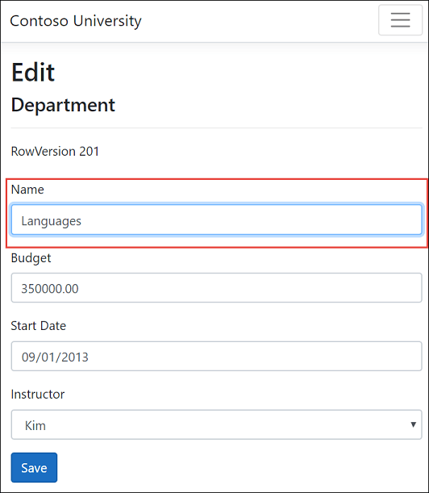

The browser shows the Index page with the changed value and updated rowVersion indicator. Note the updated rowVersion indicator, it's displayed on the second postback in the other tab.

Change a different field in the second browser tab.

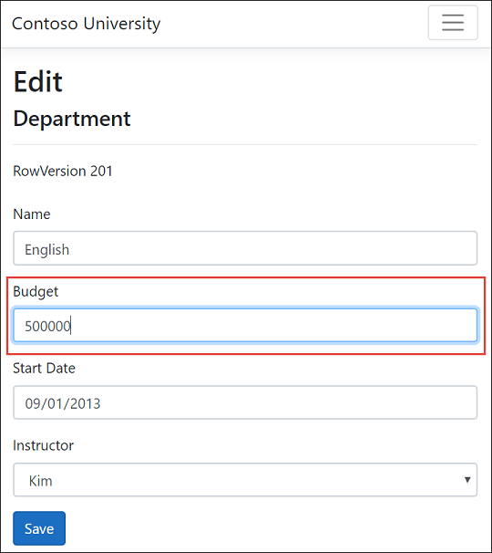

Click **Save**. You see error messages for all fields that don't match the database values:

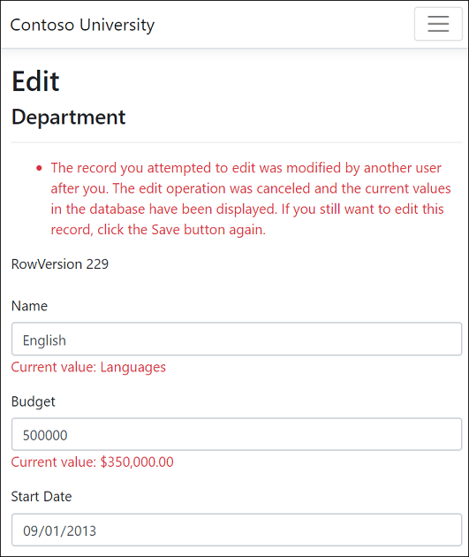

This browser window didn't intend to change the Name field. Copy and paste the current value (Languages) into the Name field. Tab out. Client-side validation removes the error message.

Click **Save** again. The value you entered in the second browser tab is saved. You see the saved values in the Index page.

## Update the Delete page model

Update *Pages/Departments/Delete.cshtml.cs* with the following code:

[!code-csharp[](intro/samples/cu30/Pages/Departments/Delete.cshtml.cs)]

The Delete page detects concurrency conflicts when the entity has changed after it was fetched. `Department.RowVersion` is the row version when the entity was fetched. When EF Core creates the SQL DELETE command, it includes a WHERE clause with `RowVersion`. If the SQL DELETE command results in zero rows affected:

* The `RowVersion` in the SQL DELETE command doesn't match `RowVersion` in the database.
* A DbUpdateConcurrencyException exception is thrown.
* `OnGetAsync` is called with the `concurrencyError`.

### Update the Delete page

Update *Pages/Departments/Delete.cshtml* with the following code:

[!code-cshtml[](intro/samples/cu30/Pages/Departments/Delete.cshtml?highlight=1,10,39,42,51)]

The preceding code makes the following changes:

* Updates the `page` directive from `@page` to `@page "{id:int}"`.
* Adds an error message.
* Replaces FirstMidName with FullName in the **Administrator** field.
* Changes `RowVersion` to display the last byte.
* Adds a hidden row version. `RowVersion` must be added so postback binds the value.

### Test concurrency conflicts

Create a test department.

Open two browsers instances of Delete on the test department:

* Run the app and select Departments.
* Right-click the **Delete** hyperlink for the test department and select **Open in new tab**.
* Click the **Edit** hyperlink for the test department.

The two browser tabs display the same information.

Change the budget in the first browser tab and click **Save**.

The browser shows the Index page with the changed value and updated rowVersion indicator. Note the updated rowVersion indicator, it's displayed on the second postback in the other tab.

Delete the test department from the second tab. A concurrency error is display with the current values from the database. Clicking **Delete** deletes the entity, unless `RowVersion` has been updated.

## Additional resources

* [Concurrency Tokens in EF Core](/ef/core/modeling/concurrency)
* [Handle concurrency in EF Core](/ef/core/saving/concurrency)
* [Debugging ASP.NET Core 2.x source](https://github.com/dotnet/AspNetCore.Docs/issues/4155)

## Next steps

This is the last tutorial in the series. Additional topics are covered in the [MVC version of this tutorial series](xref:data/ef-mvc/index).

> [!div class="step-by-step"]
> [Previous tutorial](xref:data/ef-rp/update-related-data)

::: moniker-end

::: moniker range="< aspnetcore-3.0"

This tutorial shows how to handle conflicts when multiple users update an entity concurrently (at the same time). If you run into problems you can't solve, [download or view the completed app.](https://github.com/dotnet/AspNetCore.Docs/tree/master/aspnetcore/data/ef-rp/intro/samples) [Download instructions](xref:index#how-to-download-a-sample).

## Concurrency conflicts

A concurrency conflict occurs when:

* A user navigates to the edit page for an entity.
* Another user updates the same entity before the first user's change is written to the DB.

If concurrency detection isn't enabled, when concurrent updates occur:

* The last update wins. That is, the last update values are saved to the DB.
* The first of the current updates are lost.

### Optimistic concurrency

Optimistic concurrency allows concurrency conflicts to happen, and then reacts appropriately when they do. For example, Jane visits the Department edit page and changes the budget for the English department from $350,000.00 to $0.00.

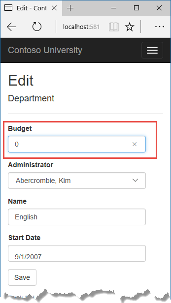

Before Jane clicks **Save**, John visits the same page and changes the Start Date field from 9/1/2007 to 9/1/2013.


Jane clicks **Save** first and sees her change when the browser displays the Index page.

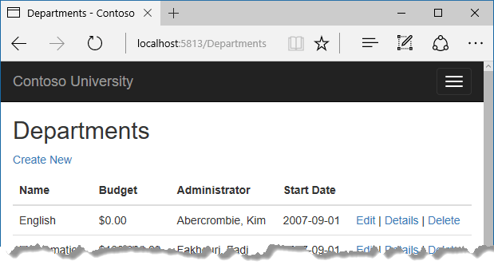

John clicks **Save** on an Edit page that still shows a budget of $350,000.00. What happens next is determined by how you handle concurrency conflicts.

Optimistic concurrency includes the following options:

* You can keep track of which property a user has modified and update only the corresponding columns in the DB.

  In the scenario, no data would be lost. Different properties were updated by the two users. The next time someone browses the English department, they will see both Jane's and John's changes. This method of updating can reduce the number of conflicts that could result in data loss. This approach:
 
  * Can't avoid data loss if competing changes are made to the same property.
  * Is generally not practical in a web app. It requires maintaining significant state in order to keep track of all fetched values and new values. Maintaining large amounts of state can affect app performance.
  * Can increase app complexity compared to concurrency detection on an entity.

* You can let John's change overwrite Jane's change.

  The next time someone browses the English department, they will see 9/1/2013 and the fetched $350,000.00 value. This approach is called a *Client Wins* or *Last in Wins* scenario. (All values from the client take precedence over what's in the data store.) If you don't do any coding for concurrency handling, Client Wins happens automatically.

* You can prevent John's change from being updated in the DB. Typically, the app would:

  * Display an error message.
  * Show the current state of the data.
  * Allow the user to reapply the changes.

  This is called a *Store Wins* scenario. (The data-store values take precedence over the values submitted by the client.) You implement the Store Wins scenario in this tutorial. This method ensures that no changes are overwritten without a user being alerted.

## Handling concurrency 

When a property is configured as a [concurrency token](/ef/core/modeling/concurrency):

* EF Core verifies that property has not been modified after it was fetched. The check occurs when [SaveChanges](/dotnet/api/microsoft.entityframeworkcore.dbcontext.savechanges#Microsoft_EntityFrameworkCore_DbContext_SaveChanges) or [SaveChangesAsync](/dotnet/api/microsoft.entityframeworkcore.dbcontext.savechangesasync#Microsoft_EntityFrameworkCore_DbContext_SaveChangesAsync_System_Threading_CancellationToken_) is called.
* If the property has been changed after it was fetched, a [DbUpdateConcurrencyException](/dotnet/api/microsoft.entityframeworkcore.dbupdateconcurrencyexception) is thrown. 

The DB and data model must be configured to support throwing `DbUpdateConcurrencyException`.

### Detecting concurrency conflicts on a property

Concurrency conflicts can be detected at the property level with the [ConcurrencyCheck](/dotnet/api/system.componentmodel.dataannotations.concurrencycheckattribute) attribute. The attribute can be applied to multiple properties on the model. For more information, see [Data Annotations-ConcurrencyCheck](/ef/core/modeling/concurrency#data-annotations).

The `[ConcurrencyCheck]` attribute isn't used in this tutorial.

### Detecting concurrency conflicts on a row

To detect concurrency conflicts, a [rowversion](/sql/t-sql/data-types/rowversion-transact-sql) tracking column is added to the model.  `rowversion` :

* Is SQL Server specific. Other databases may not provide a similar feature.
* Is used to determine that an entity has not been changed since it was fetched from the DB. 

The DB generates a sequential `rowversion` number that's incremented each time the row is updated. In an `Update` or `Delete` command, the `Where` clause includes the fetched value of `rowversion`. If the row being updated has changed:

* `rowversion` doesn't match the fetched value.
* The `Update` or `Delete` commands don't find a row because the `Where` clause includes the fetched `rowversion`.
* A `DbUpdateConcurrencyException` is thrown.

In EF Core, when no rows have been updated by an `Update` or `Delete` command, a concurrency exception is thrown.

### Add a tracking property to the Department entity

In *Models/Department.cs*, add a tracking property named RowVersion:

[!code-csharp[](intro/samples/cu/Models/Department.cs?name=snippet_Final&highlight=26,27)]

The [Timestamp](/dotnet/api/system.componentmodel.dataannotations.timestampattribute) attribute specifies that this column is included in the `Where` clause of `Update` and `Delete` commands. The attribute is called `Timestamp` because previous versions of SQL Server used a SQL `timestamp` data type before the SQL `rowversion` type replaced it.

The fluent API can also specify the tracking property:

```csharp
modelBuilder.Entity<Department>()
  .Property<byte[]>("RowVersion")
  .IsRowVersion();
```

The following code shows a portion of the T-SQL generated by EF Core when the Department name is updated:

[!code-sql[](intro/samples/cu21snapshots/sql.txt?highlight=2-3)]

The preceding highlighted code shows the `WHERE` clause containing `RowVersion`. If the DB `RowVersion` doesn't equal the `RowVersion` parameter (`@p2`), no rows are updated.

The following highlighted code shows the T-SQL that verifies exactly one row was updated:

[!code-sql[](intro/samples/cu21snapshots/sql.txt?highlight=4-6)]

[@@ROWCOUNT](/sql/t-sql/functions/rowcount-transact-sql) returns the number of rows affected by the last statement. In no rows are updated, EF Core throws a `DbUpdateConcurrencyException`.

You can see the T-SQL EF Core generates in the output window of Visual Studio.

### Update the DB

Adding the `RowVersion` property changes the DB model, which requires a migration.

Build the project. Enter the following in a command window:

```dotnetcli
dotnet ef migrations add RowVersion
dotnet ef database update
```

The preceding commands:

* Adds the *Migrations/{time stamp}_RowVersion.cs* migration file.
* Updates the *Migrations/SchoolContextModelSnapshot.cs* file. The update adds the following highlighted code to the `BuildModel` method:

  [!code-csharp[](intro/samples/cu/Migrations/SchoolContextModelSnapshot.cs?name=snippet_Department&highlight=14-16)]

* Runs migrations to update the DB.

<a name="scaffold"></a>

## Scaffold the Departments model

# [Visual Studio](#tab/visual-studio) 

Follow the instructions in [Scaffold the student model](xref:data/ef-rp/intro#scaffold-student-pages) and use `Department` for the model class.

# [Visual Studio Code](#tab/visual-studio-code)

 Run the following command:

  ```dotnetcli
  dotnet aspnet-codegenerator razorpage -m Department -dc SchoolContext -udl -outDir Pages\Departments --referenceScriptLibraries
  ```

---

The preceding command scaffolds the `Department` model. Open the project in Visual Studio.

Build the project.

### Update the Departments Index page

The scaffolding engine created a `RowVersion` column for the Index page, but that field shouldn't be displayed. In this tutorial, the last byte of the `RowVersion` is displayed to help understand concurrency. The last byte isn't guaranteed to be unique. A real app wouldn't display `RowVersion` or the last byte of `RowVersion`.

Update the Index page:

* Replace Index with Departments.
* Replace the markup containing `RowVersion` with the last byte of `RowVersion`.
* Replace FirstMidName with FullName.

The following markup shows the updated page:

[!code-cshtml[](intro/samples/cu/Pages/Departments/Index.cshtml?highlight=5,8,29,47,50)]

### Update the Edit page model

Update *Pages\Departments\Edit.cshtml.cs* with the following code:

[!code-csharp[](intro/samples/cu/Pages/Departments/Edit.cshtml.cs?name=snippet)]

To detect a concurrency issue, the [OriginalValue](/dotnet/api/microsoft.entityframeworkcore.changetracking.propertyentry.originalvalue#Microsoft_EntityFrameworkCore_ChangeTracking_PropertyEntry_OriginalValue) is updated with the `rowVersion` value from the entity it was fetched. EF Core generates a SQL UPDATE command with a WHERE clause containing the original `RowVersion` value. If no rows are affected by the UPDATE command (no rows have the original `RowVersion` value), a `DbUpdateConcurrencyException` exception is thrown.

[!code-csharp[](intro/samples/cu/Pages/Departments/Edit.cshtml.cs?name=snippet_rv&highlight=24-999)]

In the preceding code, `Department.RowVersion` is the value when the entity was fetched. `OriginalValue` is the value in the DB when `FirstOrDefaultAsync` was called in this method.

The following code gets the client values (the values posted to this method) and the DB values:

[!code-csharp[](intro/samples/cu/Pages/Departments/Edit.cshtml.cs?name=snippet_try&highlight=9,18)]

The following code adds a custom error message for each column that has DB values different from what was posted to `OnPostAsync`:

[!code-csharp[](intro/samples/cu/Pages/Departments/Edit.cshtml.cs?name=snippet_err)]

The following highlighted code sets the `RowVersion` value to the new value retrieved from the DB. The next time the user clicks **Save**, only concurrency errors that happen since the last display of the Edit page will be caught.

[!code-csharp[](intro/samples/cu/Pages/Departments/Edit.cshtml.cs?name=snippet_try&highlight=23)]

The `ModelState.Remove` statement is required because `ModelState` has the old `RowVersion` value. In the Razor Page, the `ModelState` value for a field takes precedence over the model property values when both are present.

## Update the Edit page

Update *Pages/Departments/Edit.cshtml* with the following markup:

[!code-cshtml[](intro/samples/cu/Pages/Departments/Edit.cshtml?highlight=1,14,16-17,37-39)]

The preceding markup:

* Updates the `page` directive from `@page` to `@page "{id:int}"`.
* Adds a hidden row version. `RowVersion` must be added so post back binds the value.
* Displays the last byte of `RowVersion` for debugging purposes.
* Replaces `ViewData` with the strongly-typed `InstructorNameSL`.

## Test concurrency conflicts with the Edit page

Open two browsers instances of Edit on the English department:

* Run the app and select Departments.
* Right-click the **Edit** hyperlink for the English department and select **Open in new tab**.
* In the first tab, click the **Edit** hyperlink for the English department.

The two browser tabs display the same information.

Change the name in the first browser tab and click **Save**.

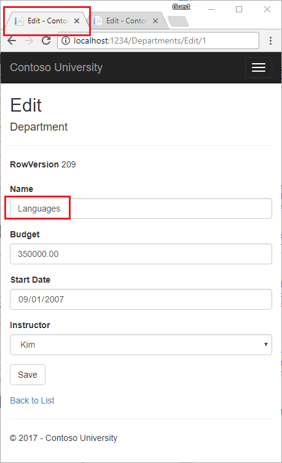

The browser shows the Index page with the changed value and updated rowVersion indicator. Note the updated rowVersion indicator, it's displayed on the second postback in the other tab.

Change a different field in the second browser tab.

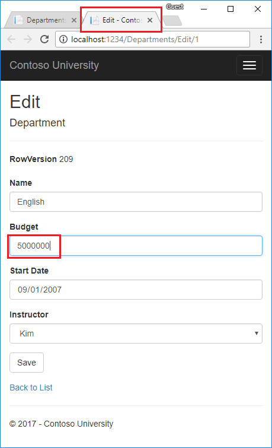

Click **Save**. You see error messages for all fields that don't match the DB values:

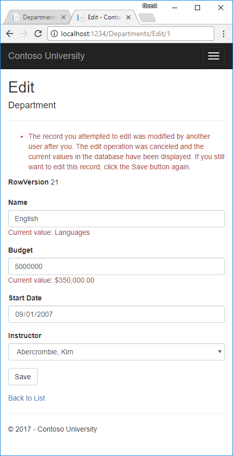

This browser window didn't intend to change the Name field. Copy and paste the current value (Languages) into the Name field. Tab out. Client-side validation removes the error message.

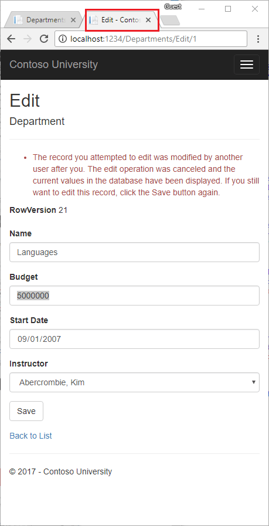

Click **Save** again. The value you entered in the second browser tab is saved. You see the saved values in the Index page.

## Update the Delete page

Update the Delete page model with the following code:

[!code-csharp[](intro/samples/cu/Pages/Departments/Delete.cshtml.cs)]

The Delete page detects concurrency conflicts when the entity has changed after it was fetched. `Department.RowVersion` is the row version when the entity was fetched. When EF Core creates the SQL DELETE command, it includes a WHERE clause with `RowVersion`. If the SQL DELETE command results in zero rows affected:

* The `RowVersion` in the SQL DELETE command doesn't match `RowVersion` in the DB.
* A DbUpdateConcurrencyException exception is thrown.
* `OnGetAsync` is called with the `concurrencyError`.

### Update the Delete page

Update *Pages/Departments/Delete.cshtml* with the following code:

[!code-cshtml[](intro/samples/cu/Pages/Departments/Delete.cshtml?highlight=1,10,39,51)]

The preceding code makes the following changes:

* Updates the `page` directive from `@page` to `@page "{id:int}"`.
* Adds an error message.
* Replaces FirstMidName with FullName in the **Administrator** field.
* Changes `RowVersion` to display the last byte.
* Adds a hidden row version. `RowVersion` must be added so post back binds the value.

### Test concurrency conflicts with the Delete page

Create a test department.

Open two browsers instances of Delete on the test department:

* Run the app and select Departments.
* Right-click the **Delete** hyperlink for the test department and select **Open in new tab**.
* Click the **Edit** hyperlink for the test department.

The two browser tabs display the same information.

Change the budget in the first browser tab and click **Save**.

The browser shows the Index page with the changed value and updated rowVersion indicator. Note the updated rowVersion indicator, it's displayed on the second postback in the other tab.

Delete the test department from the second tab. A concurrency error is display with the current values from the DB. Clicking **Delete** deletes the entity, unless `RowVersion` has been updated.

See [Inheritance](xref:data/ef-mvc/inheritance) on how to inherit a data model.

### Additional resources

* [Concurrency Tokens in EF Core](/ef/core/modeling/concurrency)
* [Handle concurrency in EF Core](/ef/core/saving/concurrency)
* [YouTube version of this tutorial(Handling Concurrency Conflicts)](https://youtu.be/EosxHTFgYps)
* [YouTube version of this tutorial(Part 2)](https://www.youtube.com/watch?v=kcxERLnaGO0)
* [YouTube version of this tutorial(Part 3)](https://www.youtube.com/watch?v=d4RbpfvELRs)

> [!div class="step-by-step"]
> [Previous](xref:data/ef-rp/update-related-data)

::: moniker-end

