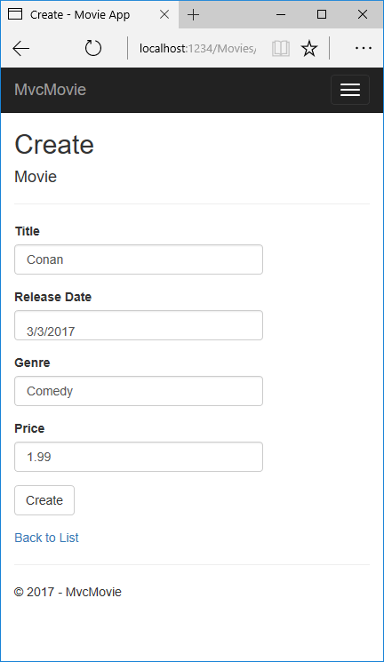
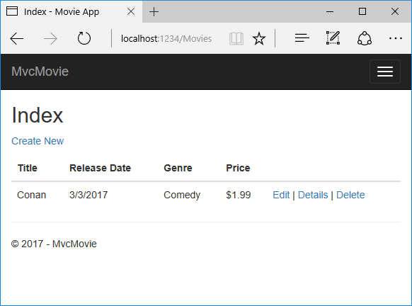

## Add initial migration and update the database

* Open a command prompt and navigate to the project directory. (The directory containing the *Startup.cs* file).

* Run the following commands in the command prompt:

  ```console
  dotnet restore
  dotnet ef migrations add Initial
  dotnet ef database update
  ```
  
## dotnet ef commands

* `dotnet` (.NET Core) is a cross-platform implementation of .NET. You can read about it [here](http://go.microsoft.com/fwlink/?LinkID=517853).
* `dotnet restore`: Downloads the NuGet packages specified in the *.csproj* file.
* `dotnet ef migrations add Initial` Runs the Entity Framework .NET Core CLI migrations command and creates the initial migration. The parameter "Initial" is arbitrary, but customary for the first (*initial*) database migration. This operation creates the *Data/Migrations/\<date-time>_Initial.cs* file containing the migration commands to add (or drop) the *Movie* table to the database
* `dotnet ef database update`  Updates the database with the migration we just created

## Test the app

* Run the app and tap the **Mvc Movie** link.
* Tap the **Create New** link and create a movie.

  

* You may not be able to enter decimal points or commas in the `Price` field. To support [jQuery validation](http://jqueryvalidation.org/) for non-English locales that use a comma (",") for a decimal point, and non US-English date formats, you must take steps to globalize your app. See [Additional resources](#additional-resources) for more information. For now, just enter whole numbers like 10.

<a name=displayformatdatelocal></a>

* In some locales you'll need to specify the date format. See the highlighted code below.

[!code-csharp[Main](../../tutorials/first-mvc-app/start-mvc/sample/MvcMovie/Models/MovieDateFormat.cs?name=snippet_1&highlight=2,10)]

We'll talk about `DataAnnotations` later in the tutorial.

Tapping **Create** causes the form to be posted to the server, where the movie information is saved in a database. You are then redirected to the */Movies* URL, where you can see the newly created movie in the listing.



Create a couple more movie entries. Try the **Edit**, **Details**, and **Delete** links, which are all functional.

## Dependency Injection

Open the *Startup.cs* file and examine `ConfigureServices`:

[!code-csharp[Main](../../tutorials/first-mvc-app/start-mvc/sample/MvcMovie/Startup.cs?name=snippet_cs&highlight=7-8)]

The highligted code above shows the movie database context being added to the [Dependency Injection](xref:fundamentals/dependency-injection) container.

Open the *Controllers/MoviesController.cs* file and examine the constructor:

<!-- l.. Make copy of Movies controller because we comment out the initial index method and update it later  -->

[!code-csharp[Main](../../tutorials/first-mvc-app/start-mvc/sample/MvcMovie/Controllers/MC1.cs?name=snippet_1)] 

The constructor uses [Dependency Injection](xref:fundamentals/dependency-injection) to inject the database context (`MvcMovieContext `) into the controller. The database context is used in each of the [CRUD](https://en.wikipedia.org/wiki/Create,_read,_update_and_delete) methods in the controller.

<a name=strongly-typed-models-keyword-label></a>

## Strongly typed models and the @model keyword

Earlier in this tutorial, you saw how a controller can pass data or objects to a view using the `ViewData` dictionary. The `ViewData` dictionary is a dynamic object that provides a convenient late-bound way to pass information to a view.

MVC also provides the ability to pass strongly typed model objects to a view. This strongly typed approach enables better compile-time checking of your code and richer [IntelliSense](https://msdn.microsoft.com/en-us/library/hcw1s69b.aspx). The scaffolding mechanism used this approach (that is, passing a strongly typed model) with the `MoviesController` class and views when it created the methods and views.

Examine the generated `Details` method in the *Controllers/MoviesController.cs* file:

[!code-csharp[Main](../../tutorials/first-mvc-app/start-mvc/sample/MvcMovie/Controllers/MoviesController.cs?name=snippet_details)]

The `id` parameter is generally passed as route data. For example `http://localhost:5000/movies/details/1` sets:

* The controller to the `movies` controller (the first URL segment).
* The action to `details` (the second URL segment).
* The id to 1 (the last URL segment).

You could also pass in the `id` with a query string as follows:

`http://localhost:1234/movies/details?id=1`

If a Movie is found, an instance of the `Movie` model is passed to the `Details` view:

```csharp
return View(movie);
   ```

Examine the contents of the *Views/Movies/Details.cshtml* file:

[!code-html[Main](../../tutorials/first-mvc-app/start-mvc/sample/MvcMovie/Views/Movies/DetailsOriginal.cshtml)]

By including a `@model` statement at the top of the view file, you can specify the type of object that the view expects. When you created the movie controller, Visual Studio automatically included the following `@model` statement at the top of the *Details.cshtml* file:

```HTML
@model MvcMovie.Models.Movie
   ```

This `@model` directive allows you to access the movie that the controller passed to the view by using a `Model` object that's strongly typed. For example, in the *Details.cshtml* view, the code passes each movie field to the `DisplayNameFor` and `DisplayFor` HTML Helpers with the strongly typed `Model` object. The `Create` and `Edit` methods and views also pass a `Movie` model object.

Examine the *Index.cshtml* view and the `Index` method in the Movies controller. Notice how the code creates a `List` object when it calls the `View` method. The code passes this `Movies` list from the `Index` action method to the view:

[!code-csharp[Main](../../tutorials/first-mvc-app/start-mvc/sample/MvcMovie/Controllers/MC1.cs?name=snippet_index)]

When you created the movies controller, scaffolding automatically included the following `@model` statement at the top of the *Index.cshtml* file:

<!-- Copy Index.cshtml to IndexOriginal.cshtml -->

[!code-html[Main](../../tutorials/first-mvc-app/start-mvc/sample/MvcMovie/Views/Movies/IndexOriginal.cshtml?range=1)]

The `@model` directive allows you to access the list of movies that the controller passed to the view by using a `Model` object that's strongly typed. For example, in the *Index.cshtml* view, the code loops through the movies with a `foreach` statement over the strongly typed `Model` object:

[!code-html[Main](../../tutorials/first-mvc-app/start-mvc/sample/MvcMovie/Views/Movies/IndexOriginal.cshtml?highlight=1,31,34,37,40,43,46-48)]

Because the `Model` object is strongly typed (as an `IEnumerable<Movie>` object), each item in the loop is typed as `Movie`. Among other benefits, this means that you get compile-time checking of the code and full [IntelliSense](https://msdn.microsoft.com/en-us/library/hcw1s69b.aspx) support in the code editor: