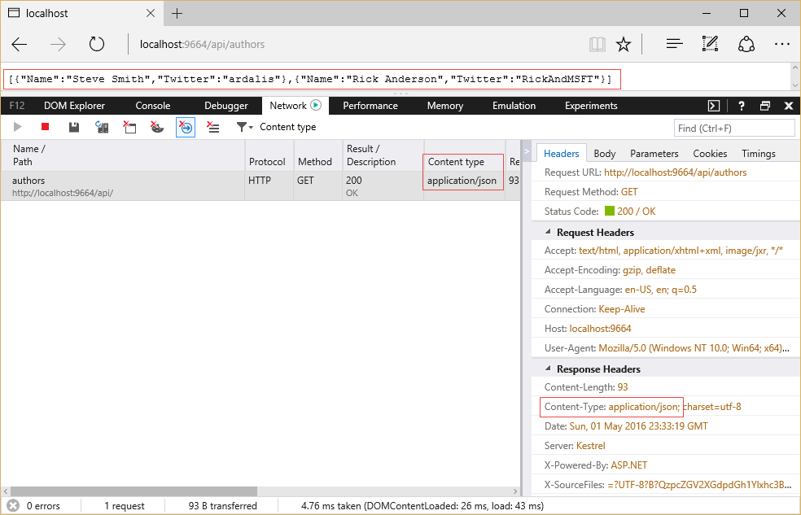
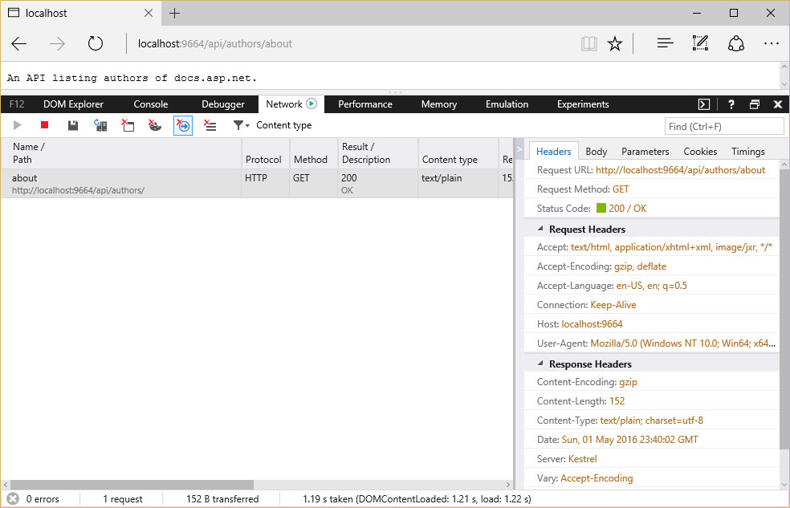
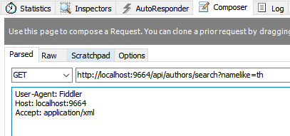
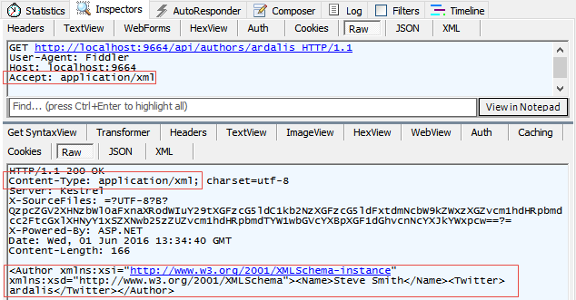
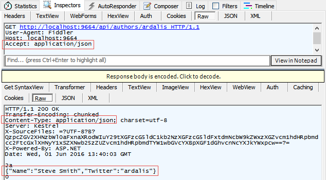

# Introduction to formatting response data in ASP.NET Core MVC

By [Steve Smith](http://ardalis.com)

ASP.NET Core MVC has built-in support for formatting response data, using fixed formats or in response to client specifications.

[View or download sample from GitHub](https://github.com/aspnet/Docs/tree/master/aspnetcore/mvc/models/formatting/sample).

## Format-Specific Action Results

Some action result types are specific to a particular format, such as `JsonResult` and `ContentResult`. Actions can return specific results that are always formatted in a particular manner. For example, returning a `JsonResult` will return JSON-formatted data, regardless of client preferences. Likewise, returning a `ContentResult` will return plain-text-formatted string data (as will simply returning a string).

> [!NOTE]
> An action isn't required to return any particular type; MVC supports any object return value. If an action returns an `IActionResult` implementation and the controller inherits from `Controller`, developers have many helper methods corresponding to many of the choices. Results from actions that return objects that are not `IActionResult` types will be serialized using the appropriate `IOutputFormatter` implementation.

To return data in a specific format from a controller that inherits from the `Controller` base class, use the built-in helper method `Json` to return JSON and `Content` for plain text. Your action method should return either the specific result type (for instance, `JsonResult`) or `IActionResult`.

Returning JSON-formatted data:

[!code-csharp[Main](./formatting/sample/src/ResponseFormattingSample/Controllers/Api/AuthorsController.cs?highlight=3,5&range=21-26)]

Sample response from this action:



Note that the content type of the response is `application/json`, shown both in the list of network requests and in the Response Headers section. Also note the list of options presented by the browser (in this case, Microsoft Edge) in the Accept header in the Request Headers section. The current technique is ignoring this header; obeying it is discussed below.

To return plain text formatted data, use `ContentResult` and the `Content` helper:

[!code-csharp[Main](./formatting/sample/src/ResponseFormattingSample/Controllers/Api/AuthorsController.cs?highlight=3,5&range=47-52)]

A response from this action:



Note in this case the `Content-Type` returned is `text/plain`. You can also achieve this same behavior using just a string response type:

[!code-csharp[Main](./formatting/sample/src/ResponseFormattingSample/Controllers/Api/AuthorsController.cs?highlight=3,5&range=54-59)]

>[!TIP]
> For non-trivial actions with multiple return types or options (for example, different HTTP status codes based on the result of operations performed), prefer `IActionResult` as the return type.

## Content Negotiation

Content negotiation (*conneg* for short) occurs when the client specifies an [Accept header](https://www.w3.org/Protocols/rfc2616/rfc2616-sec14.html). The default format used by ASP.NET Core MVC is JSON. Content negotiation is implemented by `ObjectResult`. It is also built into the status code specific action results returned from the helper methods (which are all based on `ObjectResult`). You can also return a model type (a class you've defined as your data transfer type) and the framework will automatically wrap it in an `ObjectResult` for you.

The following action method uses the `Ok` and `NotFound` helper methods:

[!code-csharp[Main](./formatting/sample/src/ResponseFormattingSample/Controllers/Api/AuthorsController.cs?highlight=8,10&range=28-38)]

A JSON-formatted response will be returned unless another format was requested and the server can return the requested format. You can use a tool like [Fiddler](http://www.telerik.com/fiddler) to create a request that includes an Accept header and specify another format. In that case, if the server has a *formatter* that can produce a response in the requested format, the result will be returned in the client-preferred format.



In the above screenshot, the Fiddler Composer has been used to generate a request, specifying `Accept: application/xml`. By default, ASP.NET Core MVC only supports JSON, so even when another format is specified, the result returned is still JSON-formatted. You'll see how to add additional formatters in the next section.

Controller actions can return POCOs (Plain Old CLR Objects), in which case ASP.NET MVC will automatically create an `ObjectResult` for you that wraps the object. The client will get the formatted serialized object (JSON format is the default; you can configure XML or other formats). If the object being returned is `null`, then the framework will return a `204 No Content` response.

Returning an object type:

[!code-csharp[Main](./formatting/sample/src/ResponseFormattingSample/Controllers/Api/AuthorsController.cs?highlight=3&range=40-45)]

In the sample, a request for a valid author alias will receive a 200 OK response with the author's data. A request for an invalid alias will receive a 204 No Content response. Screenshots showing the response in XML and JSON formats are shown below.

### Content Negotiation Process

Content *negotiation* only takes place if an `Accept` header appears in the request. When a request contains an accept header, the framework will enumerate the media types in the accept header in preference order and will try to find a formatter that can produce a response in one of the formats specified by the accept header. In case no formatter is found that can satisfy the client's request, the framework will try to find the first formatter that can produce a response (unless the developer has configured the option on `MvcOptions` to return 406 Not Acceptable instead). If the request specifies XML, but the XML formatter has not been configured, then the JSON formatter will be used. More generally, if no formatter is configured that can provide the requested format, then the first formatter than can format the object is used. If no header is given, the first formatter that can handle the object to be returned will be used to serialize the response. In this case, there isn't any
negotiation taking place - the server is determining what format it will use.

> [!NOTE]
> If the Accept header contains `*/*`, the Header will be ignored unless `RespectBrowserAcceptHeader` is set to true on `MvcOptions`.

### Browsers and Content Negotiation

Unlike typical API clients, web browsers tend to supply `Accept` headers that include a wide array of formats, including wildcards. By default, when the framework detects that the request is coming from a browser, it will ignore the `Accept` header and instead return the content in the application's configured default format (JSON unless otherwise configured). This provides a more consistent experience when using different browsers to consume APIs.

If you would prefer your application honor browser accept headers, you can configure this as part of MVC's configuration by setting `RespectBrowserAcceptHeader` to `true` in the `ConfigureServices` method in *Startup.cs*.

```csharp
services.AddMvc(options =>
{
  options.RespectBrowserAcceptHeader = true; // false by default
}
```

## Configuring Formatters

If your application needs to support additional formats beyond the default of JSON, you can add NuGet packages and configure MVC to support them. There are separate formatters for input and output. Input formatters are used by [Model Binding](model-binding.md); output formatters are used to format responses. You can also configure [🔧 Custom Formatters](../advanced/custom-formatters.md).

### Adding XML Format Support

To add support for XML formatting, install the `Microsoft.AspNetCore.Mvc.Formatters.Xml` NuGet package.

Add the XmlSerializerFormatters to MVC's configuration in *Startup.cs*:

[!code-csharp[Main](./formatting/sample/src/ResponseFormattingSample/Startup.cs?highlight=4&range=30-36)]

Alternately, you can add just the output formatter:

```csharp
services.AddMvc(options =>
{
  options.OutputFormatters.Add(new XmlSerializerOutputFormatter());
});
```

These two approaches will serialize results using `System.Xml.Serialization.XmlSerializer`. If you prefer, you can use the `System.Runtime.Serialization.DataContractSerializer` by adding its associated formatter:

```csharp
services.AddMvc(options =>
{
  options.OutputFormatters.Add(new XmlDataContractSerializerOutputFormatter());
});
```

Once you've added support for XML formatting, your controller methods should return the appropriate format based on the request's `Accept` header, as this Fiddler example demonstrates:



You can see in the Inspectors tab that the Raw GET request was made with an `Accept: application/xml` header set. The response pane shows the `Content-Type: application/xml` header, and the `Author` object has been serialized to XML.

Use the Composer tab to modify the request to specify `application/json` in the `Accept` header. Execute the request, and the response will be formatted as JSON:



In this screenshot, you can see the request sets a header of `Accept: application/json` and the response specifies the same as its `Content-Type`. The `Author` object is shown in the body of the response, in JSON format.

### Forcing a Particular Format

If you would like to restrict the response formats for a specific action you can, you can apply the `[Produces]` filter. The `[Produces]` filter specifies the response formats for a specific action (or controller). Like most [Filters](../controllers/filters.md), this can be applied at the action, controller, or global scope.

```csharp
[Produces("application/json")]
public class AuthorsController
```

The `[Produces]` filter will force all actions within the `AuthorsController` to return JSON-formatted responses, even if other formatters were configured for the application and the client provided an `Accept` header requesting a different, available format. See [Filters](../controllers/filters.md) to learn more, including how to apply filters globally.

### Special Case Formatters

Some special cases are implemented using built-in formatters. By default, `string` return types will be formatted as *text/plain* (*text/html* if requested via `Accept` header). This behavior can be removed by removing the `TextOutputFormatter`. You remove formatters in the `Configure` method in *Startup.cs* (shown below). Actions that have a model object return type will return a 204 No Content response when returning `null`. This behavior can be removed by removing the `HttpNoContentOutputFormatter`. The following code removes the `TextOutputFormatter` and `HttpNoContentOutputFormatter`.

```csharp
services.AddMvc(options =>
{
  options.OutputFormatters.RemoveType<TextOutputFormatter>();
  options.OutputFormatters.RemoveType<HttpNoContentOutputFormatter>();
});
```

Without the `TextOutputFormatter`, `string` return types return 406 Not Acceptable, for example. Note that if an XML formatter exists, it will format `string` return types if the `TextOutputFormatter` is removed.

Without the `HttpNoContentOutputFormatter`, null objects are formatted using the configured formatter. For example, the JSON formatter will simply return a response with a body of `null`, while the XML formatter will return an empty XML element with the attribute `xsi:nil="true"` set.

## Response Format URL Mappings

Clients can request a particular format as part of the URL, such as in the query string or part of the path, or by using a format-specific file extension such as .xml or .json. The mapping from request path should be specified in the route the API is using. For example:

```csharp
[FormatFilter]
public class ProductsController
{
  [Route("[controller]/[action]/{id}.{format?}")]
  public Product GetById(int id)
```

This route would allow the requested format to be specified as an optional file extension. The `[FormatFilter]` attribute checks for the existence of the format value in the `RouteData` and will map the response format to the appropriate formatter when the response is created.

|Route|Formatter|
|--- |--- |
|`/products/GetById/5`|The default output formatter|
|`/products/GetById/5.json`|The JSON formatter (if configured)|
|`/products/GetById/5.xml`|The XML formatter (if configured)|
