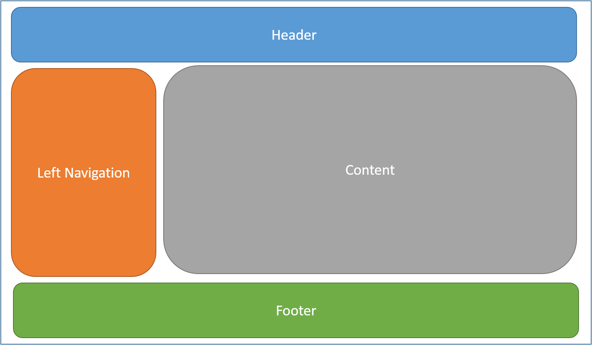

# Layout

By [Steve Smith](https://ardalis.com/)

Views frequently share visual and programmatic elements. In this article, you'll learn how to use common layouts, share directives, and run common code before rendering views in your ASP.NET app.

## What is a Layout

Most web apps have a common layout that provides the user with a consistent experience as they navigate from page to page. The layout typically includes common user interface elements such as the app header, navigation or menu elements, and footer.



Common HTML structures such as scripts and stylesheets are also frequently used by many pages within an app. All of these shared elements may be defined in a *layout* file, which can then be referenced by any view used within the app. Layouts reduce duplicate code in views, helping them follow the [Don't Repeat Yourself (DRY) principle](http://deviq.com/don-t-repeat-yourself/).

By convention, the default layout for an ASP.NET app is named `_Layout.cshtml`. The Visual Studio ASP.NET Core MVC project template includes this layout file in the `Views/Shared` folder:


This layout defines a top level template for views in the app. Apps do not require a layout, and apps can define more than one layout, with different views specifying different layouts.

An example `_Layout.cshtml`:

[!code-html[Main](../../common/samples/WebApplication1/Views/Shared/_Layout.cshtml?highlight=42,66)]

## Specifying a Layout

Razor views have a `Layout` property. Individual views specify a layout by setting this property:

[!code-html[Main](../../common/samples/WebApplication1/Views/_ViewStart.cshtml?highlight=2)]

The layout specified can use a full path (example: `/Views/Shared/_Layout.cshtml`) or a partial name (example: `_Layout`). When a partial name is provided, the Razor view engine will search for the layout file using its standard discovery process. The controller-associated folder is searched first, followed by the `Shared` folder. This discovery process is identical to the one used to discover [partial views](partial.md).

By default, every layout must call `RenderBody`. Wherever the call to `RenderBody` is placed, the contents of the view will be rendered.

<a name="layout-sections-label"></a>

### Sections

A layout can optionally reference one or more *sections*, by calling `RenderSection`. Sections provide a way to organize where certain page elements should be placed. Each call to `RenderSection` can specify whether that section is required or optional. If a required section is not found, an exception will be thrown. Individual views specify the content to be rendered within a section using the `@section` Razor syntax. If a view defines a section, it must be rendered (or an error will occur).

An example `@section` definition in a view:

```html
@section Scripts {
     <script type="text/javascript" src="/scripts/main.js"></script>
   }
   ```

In the code above, validation scripts are added to the `scripts` section on a view that includes a form. Other views in the same application might not require any additional scripts, and so wouldn't need to define a scripts section.

Sections defined in a view are available only in its immediate layout page. They cannot be referenced from partials, view components, or other parts of the view system.

### Ignoring sections

By default, the body and all sections in a content page must all be rendered by the layout page. The Razor view engine enforces this by tracking whether the body and each section have been rendered.

To instruct the view engine to ignore the body or sections, call the `IgnoreBody` and `IgnoreSection` methods.

The body and every section in a Razor page must be either rendered or ignored.

<a name="viewimports"></a>

## Importing Shared Directives

Views can use Razor directives to do many things, such as importing namespaces or performing [dependency injection](dependency-injection.md). Directives shared by many views may be specified in a common `_ViewImports.cshtml` file. The `_ViewImports` file supports the following directives:

* `@addTagHelper`

* `@removeTagHelper`

* `@tagHelperPrefix`

* `@using`

* `@model`

* `@inherits`

* `@inject`

The file does not support other Razor features, such as functions and section definitions.

A sample `_ViewImports.cshtml` file:

[!code-html[Main](../../common/samples/WebApplication1/Views/_ViewImports.cshtml)]

The `_ViewImports.cshtml` file for an ASP.NET Core MVC app is typically placed in the `Views` folder. A `_ViewImports.cshtml` file can be placed within any folder, in which case it will only be applied to views within that folder and its subfolders. `_ViewImports` files are processed starting at the root level, and then for each folder leading up to the location of the view itself, so settings specified at the root level may be overridden at the folder level.

For example, if a root level `_ViewImports.cshtml` file specifies `@model` and `@addTagHelper`, and another `_ViewImports.cshtml` file in the controller-associated folder of the view specifies a different `@model` and adds another `@addTagHelper`, the view will have access to both tag helpers and will use the latter `@model`.

If multiple `_ViewImports.cshtml` files are run for a view, combined behavior of the directives included in the `ViewImports.cshtml` files will be as follows:

* `@addTagHelper`, `@removeTagHelper`: all run, in order

* `@tagHelperPrefix`: the closest one to the view overrides any others

* `@model`: the closest one to the view overrides any others

* `@inherits`: the closest one to the view overrides any others

* `@using`: all are included; duplicates are ignored

* `@inject`: for each property, the closest one to the view overrides any others with the same property name

<a name="viewstart"></a>

## Running Code Before Each View

If you have code you need to run before every view, this should be placed in the `_ViewStart.cshtml` file. By convention, the `_ViewStart.cshtml` file is located in the `Views` folder. The statements listed in `_ViewStart.cshtml` are run before every full view (not layouts, and not partial views). Like [ViewImports.cshtml](xref:mvc/views/layout#viewimports), `_ViewStart.cshtml` is hierarchical. If a `_ViewStart.cshtml` file is defined in the controller-associated view folder, it will be run after the one defined in the root of the `Views` folder (if any).

A sample `_ViewStart.cshtml` file:

[!code-html[Main](../../common/samples/WebApplication1/Views/_ViewStart.cshtml)]

The file above specifies that all views will use the `_Layout.cshtml` layout.

> [!NOTE]
> Neither `_ViewStart.cshtml` nor `_ViewImports.cshtml` are typically placed in the `/Views/Shared` folder. The app-level versions of these files should be placed directly in the `/Views` folder.
