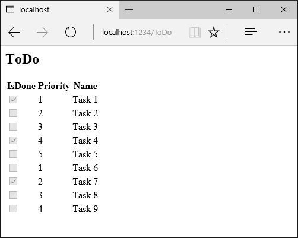
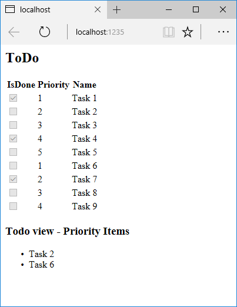
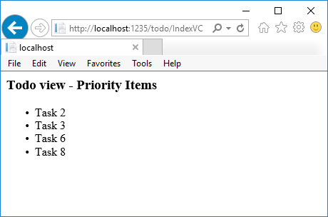
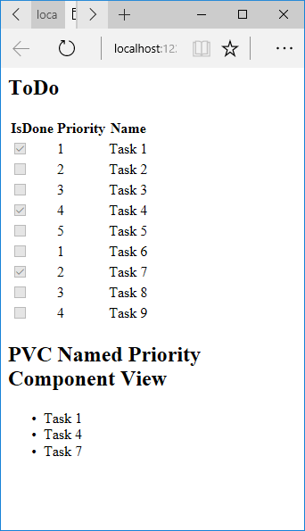
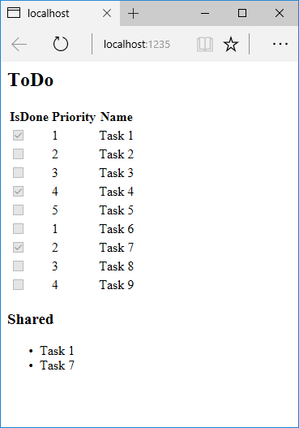

# View components

By [Rick Anderson](https://twitter.com/RickAndMSFT)

[View or download sample code](https://github.com/aspnet/Docs/tree/master/aspnetcore/mvc/views/view-components/sample)

## Introducing view components

New to ASP.NET Core MVC, view components are similar to partial views, but they are much more powerful. View components don’t use model binding, and only depend on the data you provide when calling into it. A view component:

* Renders a chunk rather than a whole response
* Includes the same separation-of-concerns and testability benefits found between a controller and view
* Can have parameters and business logic
* Is typically invoked from a layout page

View components are intended anywhere you have reusable rendering logic that is too complex for a partial view, such as:

* Dynamic navigation menus
* Tag cloud (where it queries the database)
* Login panel
* Shopping cart
* Recently published articles
* Sidebar content on a typical blog
* A login panel that would be rendered on every page and show either the links to log out or log in, depending on the log in state of the user

A view component consists of two parts: the class (typically derived from [ViewComponent](https://docs.microsoft.com/aspnet/core/api/microsoft.aspnetcore.mvc.viewcomponent)) and the result it returns (typically a view). Like controllers, a view component can be a POCO, but most developers will want to take advantage of the methods and properties available by deriving from `ViewComponent`.

## Creating a view component

This section contains the high-level requirements to create a view component. Later in the article, we'll examine each step in detail and create a view component.

### The view component class

A view component class can be created by any of the following:

* Deriving from *ViewComponent*
* Decorating a class with the `[ViewComponent]` attribute, or deriving from a class with the `[ViewComponent]` attribute
* Creating a class where the name ends with the suffix *ViewComponent*

Like controllers, view components must be public, non-nested, and non-abstract classes. The view component name is the class name with the "ViewComponent" suffix removed. It can also be explicitly specified using the `ViewComponentAttribute.Name` property.

A view component class:

* Fully supports constructor [dependency injection](../../fundamentals/dependency-injection.md)

* Does not take part in the controller lifecycle, which means you can't use [filters](../controllers/filters.md) in a view component

### View component methods

A view component defines its logic in an `InvokeAsync` method that returns an `IViewComponentResult`. Parameters come directly from invocation of the view component, not from model binding. A view component never directly handles a request. Typically, a view component initializes a model and passes it to a view by calling the `View` method. In summary, view component methods:

* Define an `InvokeAsync` method that returns an `IViewComponentResult`
* Typically initializes a model and passes it to a view by calling the `ViewComponent` `View` method
* Parameters come from the calling method, not HTTP, there is no model binding
* Are not reachable directly as an HTTP endpoint, they are invoked from your code (usually in a view). A view component never handles a request
* Are overloaded on the signature rather than any details from the current HTTP request

### View search path

The runtime searches for the view in the following paths:

   * Views/\<controller_name>/Components/\<view_component_name>/\<view_name>
   * Views/Shared/Components/\<view_component_name>/\<view_name>

The default view name for a view component is *Default*, which means your view file will typically be named *Default.cshtml*. You can specify a different view name when creating the view component result or when calling the `View` method.

We recommend you name the view file *Default.cshtml* and use the *Views/Shared/Components/\<view_component_name>/\<view_name>* path. The `PriorityList` view component used in this sample uses *Views/Shared/Components/PriorityList/Default.cshtml* for the view component view.

## Invoking a view component

To use the view component, call the following inside a view:

```html
@Component.InvokeAsync("Name of view component", <anonymous type containing parameters>)
```

The parameters will be passed to the `InvokeAsync` method. The `PriorityList` view component developed in the article is invoked from the *Views/Todo/Index.cshtml* view file. In the following, the `InvokeAsync` method is called with two parameters:

[!code-html[Main](view-components/sample/ViewCompFinal/Views/Todo/IndexFinal.cshtml?range=35)]

## Invoking a view component as a Tag Helper

For ASP.NET Core 1.1 and higher, you can invoke a view component as a [Tag Helper](xref:mvc/views/tag-helpers/intro):

[!code-html[Main](view-components/sample/ViewCompFinal/Views/Todo/IndexTagHelper.cshtml?range=37-38)]

Pascal-cased class and method parameters for Tag Helpers are translated into their [lower kebab case](https://stackoverflow.com/questions/11273282/whats-the-name-for-dash-separated-case/12273101). The Tag Helper to invoke a view component uses the `<vc></vc>` element. The view component is specified as follows:

```html
<vc:[view-component-name]
  parameter1="parameter1 value"
  parameter2="parameter2 value">
</vc:[view-component-name]>
```

Note: In order to use a View Component as a Tag Helper, you must register the assembly containing the View Component using the `@addTagHelper` directive. For example, if your View Component is in an assembly called "MyWebApp", add the following directive to the `_ViewImports.cshtml` file:

```csharp
@addTagHelper *, MyWebApp
```

You can register a View Component as a Tag Helper to any file that references the View Component. See [Managing Tag Helper Scope](xref:mvc/views/tag-helpers/intro#managing-tag-helper-scope) for more information on how to register Tag Helpers.

The `InvokeAsync` method used in this tutorial:

[!code-html[Main](view-components/sample/ViewCompFinal/Views/Todo/IndexFinal.cshtml?range=35)]

In Tag Helper markup:

[!code-html[Main](view-components/sample/ViewCompFinal/Views/Todo/IndexTagHelper.cshtml?range=37-38)]

In the sample above, the `PriorityList` view component becomes `priority-list`. The parameters to the view component are passed as attributes in lower kebab case.

### Invoking a view component directly from a controller

View components are typically invoked from a view, but you can invoke them directly from a controller method. While view components do not define endpoints like controllers, you can easily implement a controller action that returns the content of a `ViewComponentResult`.

In this example, the view component is called directly from the controller:

[!code-csharp[Main](view-components/sample/ViewCompFinal/Controllers/ToDoController.cs?name=snippet_IndexVC)]

## Walkthrough: Creating a simple view component

[Download](https://github.com/aspnet/Docs/tree/master/aspnetcore/mvc/views/view-components/sample), build and test the starter code. It's a simple project with a `Todo` controller that displays a list of *Todo* items.



### Add a ViewComponent class

Create a *ViewComponents* folder and add the following `PriorityListViewComponent` class:

[!code-csharp[Main](view-components/sample/ViewCompFinal/ViewComponents/PriorityListViewComponent1.cs?name=snippet1)]

Notes on the code:

* View component classes can be contained in **any** folder in the project.
* Because the class name PriorityList**ViewComponent** ends with the suffix **ViewComponent**, the runtime will use the string "PriorityList" when referencing the class component from a view. I'll explain that in more detail later.
* The `[ViewComponent]` attribute can change the name used to reference a view component. For example, we could have named the class `XYZ` and applied the `ViewComponent` attribute:

  ```csharp
  [ViewComponent(Name = "PriorityList")]
     public class XYZ : ViewComponent
     ```

* The `[ViewComponent]` attribute above tells the view component selector to use the name `PriorityList` when looking for the views associated with the component, and to use the string "PriorityList" when referencing the class component from a view. I'll explain that in more detail later.
* The component uses [dependency injection](../../fundamentals/dependency-injection.md) to make the data context available.
* `InvokeAsync` exposes a method which can be called from a view, and it can take an arbitrary number of arguments.
* The `InvokeAsync` method returns the set of `ToDo` items that satisfy the `isDone` and `maxPriority` parameters.

### Create the view component Razor view

* Create the *Views/Shared/Components* folder. This folder **must** be named *Components*.

* Create the *Views/Shared/Components/PriorityList* folder. This folder name must match the name of the view component class, or the name of the class minus the suffix (if we followed convention and used the *ViewComponent* suffix in the class name). If you used the `ViewComponent` attribute, the class name would need to match the attribute designation.

* Create a *Views/Shared/Components/PriorityList/Default.cshtml* Razor view:
  [!code-html[Main](view-components/sample/ViewCompFinal/Views/Shared/Components/PriorityList/Default1.cshtml)]
    
   The Razor view takes a list of `TodoItem` and displays them. If the view component `InvokeAsync` method doesn't pass the name of the view (as in our sample), *Default* is used for the view name by convention. Later in the tutorial, I'll show you how to pass the name of the view. To override the default styling for a specific controller, add a view to the controller-specific view folder (for example *Views/Todo/Components/PriorityList/Default.cshtml)*.
    
    If the view component is controller-specific, you can add it to the controller-specific folder (*Views/Todo/Components/PriorityList/Default.cshtml*).

* Add a `div` containing a call to the priority list component to the bottom of the *Views/Todo/index.cshtml* file:

    [!code-html[Main](view-components/sample/ViewCompFinal/Views/Todo/IndexFirst.cshtml?range=34-38)]

The markup `@await Component.InvokeAsync` shows the syntax for calling view components. The first argument is the name of the component we want to invoke or call. Subsequent parameters are passed to the component. `InvokeAsync` can take an arbitrary number of arguments.

Test the app. The following image shows the ToDo list and the priority items:



You can also call the view component directly from the controller:

[!code-csharp[Main](view-components/sample/ViewCompFinal/Controllers/ToDoController.cs?name=snippet_IndexVC)]



### Specifying a view name

A complex view component might need to specify a non-default view under some conditions. The following code shows how to specify the "PVC" view  from the `InvokeAsync` method. Update the `InvokeAsync` method in the `PriorityListViewComponent` class.

[!code-csharp[Main](../../mvc/views/view-components/sample/ViewCompFinal/ViewComponents/PriorityListViewComponentFinal.cs?highlight=4,5,6,7,8,9&range=28-39)]

Copy the *Views/Shared/Components/PriorityList/Default.cshtml* file to a view named *Views/Shared/Components/PriorityList/PVC.cshtml*. Add a heading to indicate the PVC view is being used.

[!code-html[Main](../../mvc/views/view-components/sample/ViewCompFinal/Views/Shared/Components/PriorityList/PVC.cshtml?highlight=3)]

Update *Views/TodoList/Index.cshtml*:

<!-- Views/TodoList/Index.cshtml is never imported, so change to test tutorial -->

[!code-html[Main](view-components/sample/ViewCompFinal/Views/Todo/IndexFinal.cshtml?range=35)]

Run the app and verify PVC view.



If the PVC view is not rendered, verify you are calling the view component with a priority of 4 or higher.

### Examine the view path

* Change the priority parameter to three or less so the priority view is not returned.
* Temporarily rename the *Views/Todo/Components/PriorityList/Default.cshtml* to *1Default.cshtml*.
* Test the app, you'll get the following error:

   ```
   An unhandled exception occurred while processing the request.
   InvalidOperationException: The view 'Components/PriorityList/Default' was not found. The following locations were searched:
   /Views/ToDo/Components/PriorityList/Default.cshtml
   /Views/Shared/Components/PriorityList/Default.cshtml
   EnsureSuccessful
   ```

* Copy *Views/Todo/Components/PriorityList/1Default.cshtml* to *Views/Shared/Components/PriorityList/Default.cshtml*.
* Add some markup to the *Shared* Todo view component view to indicate the view is from the *Shared* folder.
* Test the **Shared** component view.



### Avoiding magic strings

If you want compile time safety, you can replace the hard-coded view component name with the class name. Create the view component without the "ViewComponent" suffix:

[!code-csharp[Main](../../mvc/views/view-components/sample/ViewCompFinal/ViewComponents/PriorityList.cs?highlight=10&range=5-35)]

Add a `using` statement to your Razor view file, and use the `nameof` operator:

[!code-html[Main](view-components/sample/ViewCompFinal/Views/Todo/IndexNameof.cshtml?range=1-6,33-)]

## Additional Resources

* [Dependency injection into views](dependency-injection.md)
