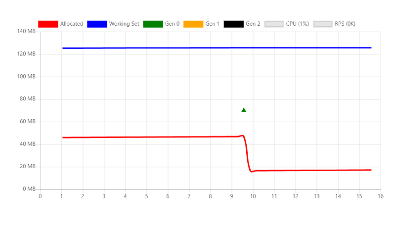
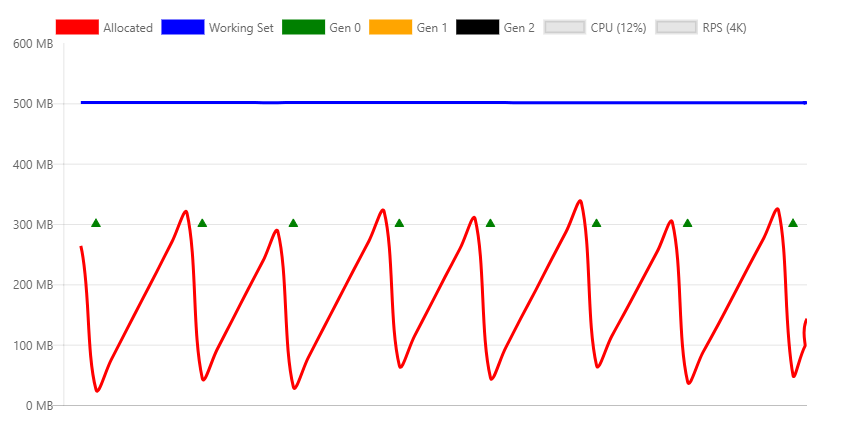
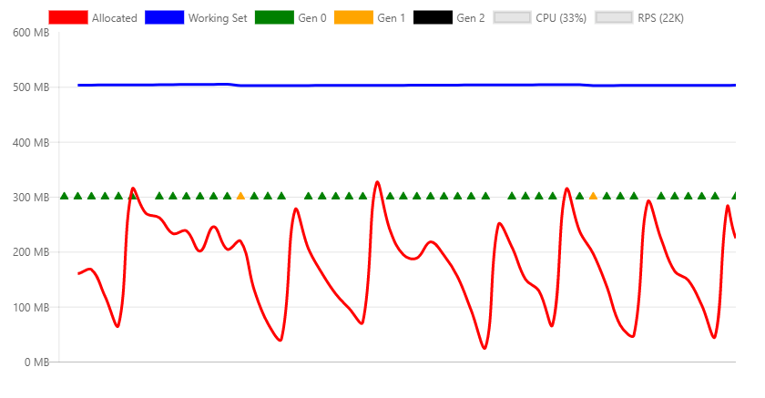
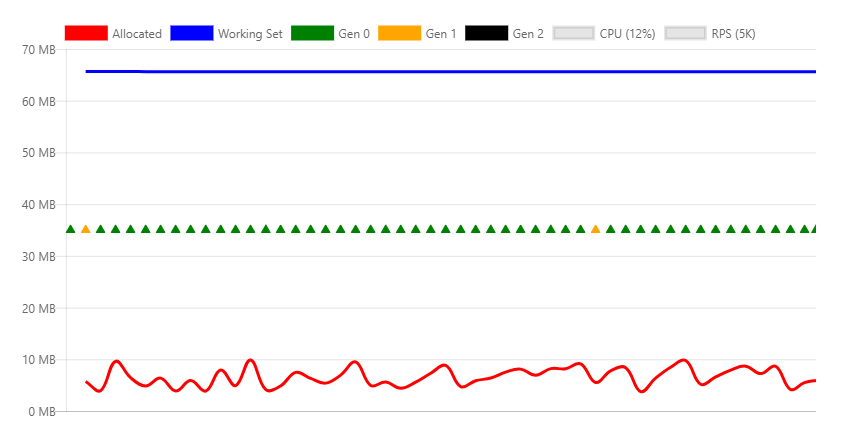
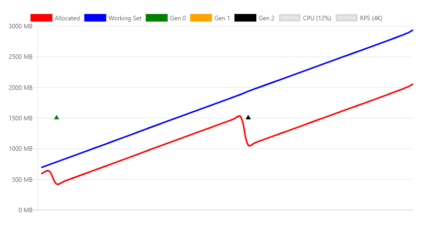
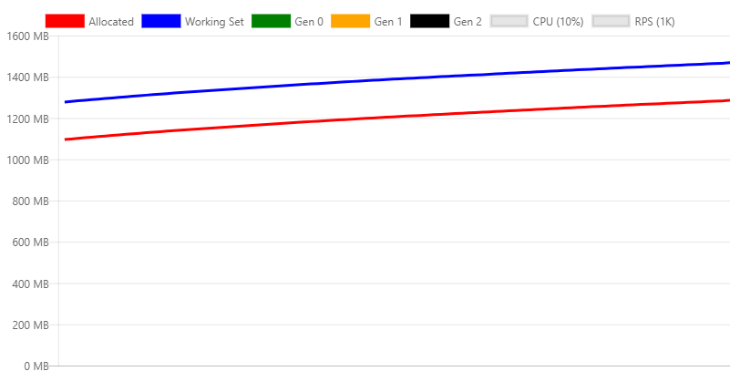
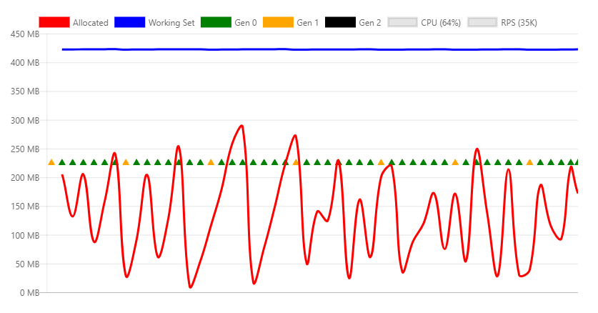
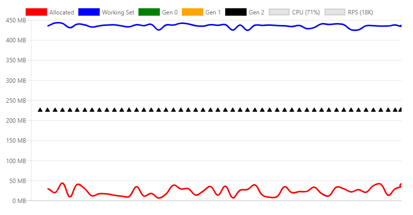
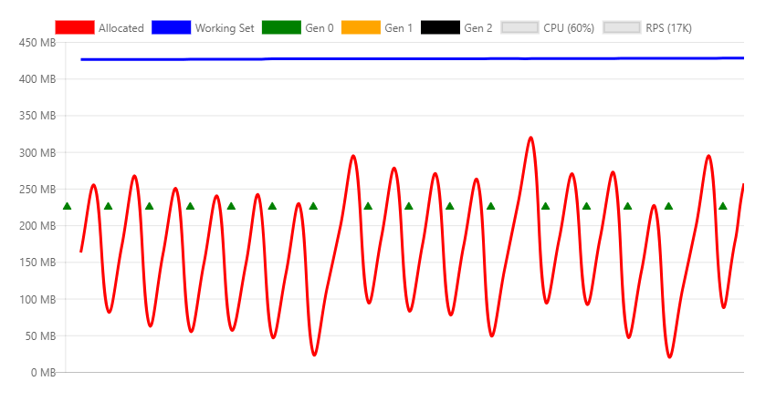
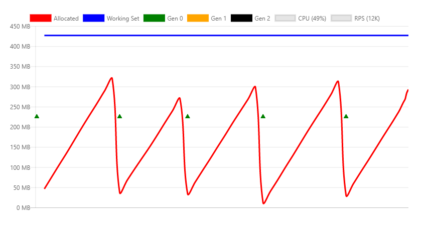

# Memory management and garbage collection (GC) in ASP.NET Core

By [Sébastien Ros](https://github.com/sebastienros) and [Rick Anderson](https://twitter.com/RickAndMSFT)

Memory management is complex, even in a managed framework like .NET. Analyzing and understanding memory issues can be challenging. This article:

* Was motivated by many *memory leak* and *GC not working* issues. Most of these issues were caused by not understanding how memory consumption works in .NET Core, or not understanding how it's measured.
* Demonstrates problematic memory use, and suggests alternative approaches.

## How garbage collection (GC) works in .NET Core

The GC allocates heap segments where each segment is a contiguous range of memory. Objects placed in the heap are categorized into one of 3 generations: 0, 1, or 2. The generation determines the frequency the GC attempts to release memory on managed objects that are no longer referenced by the app. Lower numbered generations are GC'd more frequently.

Objects are moved from one generation to another based on their lifetime. As objects live longer, they are moved into a higher generation. As mentioned previously, higher generations are GC'd less often. Short term lived objects always remain in generation 0. For example, objects that are referenced during the life of a web request are short lived. Application level [singletons](xref:fundamentals/dependency-injection#service-lifetimes) generally migrate to generation 2.

When an ASP.NET Core app starts, the GC:

* Reserves some memory for the initial heap segments.
* Commits a small portion of memory when the runtime is loaded.

The preceding memory allocations are done for performance reasons. The performance benefit comes from heap segments in contiguous memory.

### Call GC.Collect

Calling [GC.Collect](xref:System.GC.Collect*) explicitly:

* Should **not** be done by production ASP.NET Core apps.
* Is useful when investigating memory leaks.
* When investigating, verifies the GC has removed all dangling objects from memory so memory can be measured.

## Analyzing the memory usage of an app

Dedicated tools can help analyzing memory usage:

- Counting object references
- Measuring how much impact the GC has on CPU usage
- Measuring memory space used for each generation

Use the following tools to analyze memory usage:

* [dotnet-trace](/dotnet/core/diagnostics/dotnet-trace): Can be  used on production machines.
* [Analyze memory usage without the Visual Studio debugger](/visualstudio/profiling/memory-usage-without-debugging2)
* [Profile memory usage in Visual Studio](/visualstudio/profiling/memory-usage)

### Detecting memory issues

Task Manager can be used to get an idea of how much memory an ASP.NET app is using. The Task Manager memory value:

* Represents the amount of memory that is used by the ASP.NET process.
* Includes the app's living objects and other memory consumers such as native memory usage.

If the Task Manager memory value increases indefinitely and never flattens out, the app has a memory leak. The following sections demonstrate and explain several memory usage patterns.

## Sample display memory usage app

The [MemoryLeak sample app](https://github.com/sebastienros/memoryleak) is available on GitHub. The MemoryLeak app:

* Includes a diagnostic controller that gathers real-tine memory and GC data for the app.
* Has an Index page that displays the memory and GC data. The Index page is refreshed every second.
* Contains an API controller that provides various memory load patterns.
* Is not a supported tool, however, it can be used to display memory usage patterns of ASP.NET Core apps.

Run MemoryLeak. Allocated memory slowly increases until a GC occurs. Memory increases because the tool allocates custom object to capture data. The following image shows the MemoryLeak Index page when a Gen 0 GC occurs. The chart shows 0 RPS (Requests per second) because no API endpoints from the API controller have been called.



The chart displays two values for the memory usage:

- Allocated: the amount of memory occupied by managed objects
- Working set: the total physical memory (RAM) used by the process. The working set shown is the same value Task Manager can display.

### Transient objects

The following API creates a 10-KB String instance and returns it to the client. On each request, a new object is allocated in memory and written to the response. Strings are stored as UTF-16 characters in .NET so each character takes 2 bytes in memory.

```csharp
[HttpGet("bigstring")]
public ActionResult<string> GetBigString()
{
    return new String('x', 10 * 1024);
}
```

The following graph is generated with a relatively small load in to show how memory allocations are impacted by the GC.



The preceding chart shows:

* 4K RPS (Requests per second).
* Generation 0 GC collections occur about every two seconds.
* The working set is constant at approximately 500 MB.
* CPU is 12%.
* The memory consumption and release (through GC) is stable.

The following chart is taken at the max throughput that can be handled by the machine.



The preceding chart shows:

* 22 RPS
* Generation 0 GC collections occur several times per second.
* Generation 1 collections are triggered because the app allocated significantly more memory per second.
* The working set is constant at approximately 500 MB.
* CPU is 33%.
* The memory consumption and release (through GC) is stable.
* The CPU (33%) is not over-utilized, therefore the garbage collection can keep up with a high number of allocations.

### Workstation GC vs. Server GC

The .NET Garbage Collector has two different modes:

* **Workstation GC**: Optimized for the desktop.
* **Server GC**. The default GC for ASP.NET Core apps. Optimized for the server.

The GC mode can be set explicitly in the project file or in the *runtimeconfig.json* file of the published app. The following markup shows setting `ServerGarbageCollection` in the project file:

```xml
<PropertyGroup>
  <ServerGarbageCollection>true</ServerGarbageCollection>
</PropertyGroup>
```

Changing `ServerGarbageCollection` in the project file requires the app to be rebuilt.

**Note:** Server garbage collection is **not** available on machines with a single core. For more information, see <xref:System.Runtime.GCSettings.IsServerGC>.

The following image shows the memory profile under a 5K RPS using the Workstation GC.



The differences between this chart and the server version are significant:

- The working set drops from 500 MB to 70 MB.
- The GC does generation 0 collections multiple times per second instead of every two seconds.
- GC drops from 300 MB to 10 MB.

On a typical web server environment, CPU usage is more important than memory, therefore the Server GC is better. If memory utilization is high and CPU usage is relatively low, the Workstation GC might be more performant. For example, high density hosting several web apps where memory is scarce.

### Persistent object references

The GC cannot free objects that are referenced. Objects that are referenced but no longer needed result in a memory leak. If the app frequently allocates objects and fails to free them after they are no longer needed, memory usage will increase over time.

The following API creates a 10-KB String instance and returns it to the client. The difference with the previous example is that this instance is referenced by a static member, which means it's never available for collection.

```csharp
private static ConcurrentBag<string> _staticStrings = new ConcurrentBag<string>();

[HttpGet("staticstring")]
public ActionResult<string> GetStaticString()
{
    var bigString = new String('x', 10 * 1024);
    _staticStrings.Add(bigString);
    return bigString;
}
```

The preceding code:

* Is an example of a typical memory leak.
* With frequent calls, causes app memory to increases until the process crashes with an `OutOfMemory` exception.



In the preceding image:

* Load testing the `/api/staticstring` endpoint causes a linear increase in memory.
* The GC tries to free memory as the memory pressure grows, by calling a generation 2 collection.
* The GC cannot free the leaked memory. Allocated and working set increase with time.

Some scenarios, such as caching, require object references to be held until memory pressure forces them to be released. The <xref:System.WeakReference> class can be used for this type of caching code. A `WeakReference` object is collected under memory pressures. The default implementation of <xref:Microsoft.Extensions.Caching.Memory.IMemoryCache> uses `WeakReference`.

### Native memory

Some .NET Core objects rely on native memory. Native memory can **not** be collected by the GC. The .NET object using native memory must free it using native code.

.NET provides the <xref:System.IDisposable> interface to let developers release native memory. Even if <xref:System.IDisposable.Dispose*> is not called, correctly implemented classes call `Dispose` when the [finalizer](/dotnet/csharp/programming-guide/classes-and-structs/destructors) runs.

Consider the following code:

```csharp
[HttpGet("fileprovider")]
public void GetFileProvider()
{
    var fp = new PhysicalFileProvider(TempPath);
    fp.Watch("*.*");
}
```

[PhysicaFileProvider](/dotnet/api/microsoft.extensions.fileproviders.physicalfileprovider?view=dotnet-plat-ext-3.0) is a managed class, so any instance will be collected at the end of the request.

The following image shows the memory profile while invoking the `fileprovider` API continuously.



The preceding chart shows an obvious issue with the implementation of this class, as it keeps increasing memory usage. This is a known problem that is being tracked in [this issue](https://github.com/aspnet/Home/issues/3110).

The same leak could be happen in user code, by one of the following:

* Not releasing the class correctly.
* Forgetting to invoke the `Dispose`method of the dependent objects that should be disposed.

### Large objects heap

Frequent memory allocation/free cycles can fragment memory, especially when allocating large chunks of memory. Objects are allocated in contiguous blocks of memory. To mitigate fragmentation, when the GC frees memory, it trys to defragment it. This process is called **compaction**. Compaction involves moving objects. Moving large objects imposes a performance penalty. For this reason the GC creates a special memory zone for _large_ objects, called the [large object heap](/dotnet/standard/garbage-collection/large-object-heap) (LOH). Objects that are greater than 85,000 bytes (approximately 83 KB) are:

* Placed on the LOH.
* Not compacted.
* Collected during generation 2 GCs.

When the LOH is full, the GC will trigger a generation 2 collection. Generation 2 collections:

* Are inherently slow.
* Additionally incur the cost of triggering a collection on all other generations.

The following code compacts the LOH immediately:

```csharp
GCSettings.LargeObjectHeapCompactionMode = GCLargeObjectHeapCompactionMode.CompactOnce;
GC.Collect();
```

See <xref:System.Runtime.GCSettings.LargeObjectHeapCompactionMode> for information on compacting the LOH.

In containers using .NET Core 3.0 and later, the LOH is automatically compacted.

The following API that illustrates this behavior:

```csharp
[HttpGet("loh/{size=85000}")]
public int GetLOH1(int size)
{
   return new byte[size].Length;
}
```

The following chart shows the memory profile of calling the `/api/loh/84975` endpoint, under maximum load:



The following chart shows the memory profile of calling the `/api/loh/84976` endpoint, allocating *just one more byte*:



Note: The `byte[]` structure has overhead bytes. That's why 84,976 bytes triggers the 85,000 limit.

Comparing the two preceding charts:

* The working set is similar for both scenarios, about 450 MB.
* The under LOH requests (84,975 bytes) shows mostly generation 0 collections.
* The over LOH requests generate constant generation 2 collections. Generation 2 collections are expensive. More CPU is required and throughput drops almost 50%.

Temporary large objects are particularly problematic because they cause gen2 GCs.

For maximum performance, large object use should be minimized. If possible, split up large objects. For example, [Response Caching](xref:performance/caching/response) middleware in ASP.NET Core split the cache entries into blocks less than 85,000 bytes.

The following links show the ASP.NET Core approach to keeping objects under the LOH limit:
- [ResponseCaching/Streams/StreamUtilities.cs](https://github.com/aspnet/AspNetCore/blob/v3.0.0/src/Middleware/ResponseCaching/src/Streams/StreamUtilities.cs#L16)
- [ResponseCaching/MemoryResponseCache.cs](https://github.com/aspnet/ResponseCaching/blob/c1cb7576a0b86e32aec990c22df29c780af29ca5/src/Microsoft.AspNetCore.ResponseCaching/Internal/MemoryResponseCache.cs#L55)

For more information, see:

* [Large Object Heap Uncovered](https://devblogs.microsoft.com/dotnet/large-object-heap-uncovered-from-an-old-msdn-article/)
* [Large object heap](/dotnet/standard/garbage-collection/large-object-heap)

### HttpClient

Incorrectly using <xref:System.Net.Http.HttpClient> can result in a resource leak. System resources, such as database connections, sockets, file handles, etc.:

* Are more scarce than memory.
* Are more problematic when leaked than memory.

Experienced .NET developers know to call <xref:System.IDisposable.Dispose*> on objects that implement <xref:System.IDisposable>. Not disposing objects that implement `IDisposable` typically results in leaked memory or leaked system resources.

`HttpClient` implements `IDisposable`, but should **not** be disposed on every invocation. Rather, `HttpClient` should be reused.

The following endpoint creates and disposes a new  `HttpClient` instance on every request:

```csharp
[HttpGet("httpclient1")]
public async Task<int> GetHttpClient1(string url)
{
    using (var httpClient = new HttpClient())
    {
        var result = await httpClient.GetAsync(url);
        return (int)result.StatusCode;
    }
}
```

Under load, the following error messages are logged:

```
fail: Microsoft.AspNetCore.Server.Kestrel[13]
      Connection id "0HLG70PBE1CR1", Request id "0HLG70PBE1CR1:00000031":
      An unhandled exception was thrown by the application.
System.Net.Http.HttpRequestException: Only one usage of each socket address
    (protocol/network address/port) is normally permitted --->
    System.Net.Sockets.SocketException: Only one usage of each socket address
    (protocol/network address/port) is normally permitted
   at System.Net.Http.ConnectHelper.ConnectAsync(String host, Int32 port,
    CancellationToken cancellationToken)
```

Even though the `HttpClient` instances are disposed, the actual network connection takes some time to be released by the operating system. By continuously creating new connections, _ports exhaustion_ occurs. Each client connection requires its own client port.

One way to prevent port exhaustion is to reuse the same `HttpClient` instance:

```csharp
private static readonly HttpClient _httpClient = new HttpClient();

[HttpGet("httpclient2")]
public async Task<int> GetHttpClient2(string url)
{
    var result = await _httpClient.GetAsync(url);
    return (int)result.StatusCode;
}
```

The `HttpClient` instance is released when the app stops. This example shows that not every disposable resource should be disposed after each use.

See the following for a better way to handle the lifetime of an `HttpClient` instance:

* [HttpClient and lifetime management](/aspnet/core/fundamentals/http-requests#httpclient-and-lifetime-management)
* [HTTPClient factory blog](https://devblogs.microsoft.com/aspnet/asp-net-core-2-1-preview1-introducing-httpclient-factory/)
 
### Object pooling

The previous example showed how the `HttpClient` instance can be made static and reused by all requests. Reuse prevents running out of resources.

Object pooling:

* Uses the reuse pattern.
* Is designed for objects that are expensive to create.

A pool is a collection of pre-initialized objects that can be reserved and released across threads. Pools can define allocation rules such as limits, predefined sizes, or growth rate.

The NuGet package [Microsoft.Extensions.ObjectPool](https://www.nuget.org/packages/Microsoft.Extensions.ObjectPool/) contains classes that help to manage such pools.

The following API endpoint instantiates a `byte` buffer that is filled with random numbers on each request:

```csharp
        [HttpGet("array/{size}")]
        public byte[] GetArray(int size)
        {
            var random = new Random();
            var array = new byte[size];
            random.NextBytes(array);

            return array;
        }
```

The following chart display calling the preceding API with moderate load:



In the preceding chart, generation 0 collections happen approximately once per second.

The preceding code can be optimized by pooling the `byte` buffer by using [`ArrayPool<T>`](xref:System.Buffers.ArrayPool`1). A static instance is reused across requests.

What's different with this approach is that a pooled object is returned from the API. That means:

* The object is out of your control as soon as you return from the method.
* You can't release the object.

To set up disposal of the object:

* Encapsulate the pooled array in a disposable object.
* Register the pooled object with [HttpContext.Response.RegisterForDispose](xref:Microsoft.AspNetCore.Http.HttpResponse.RegisterForDispose*).

`RegisterForDispose` will take care of calling `Dispose`on the target object so that it's only released when the HTTP request is complete.

```csharp
private static ArrayPool<byte> _arrayPool = ArrayPool<byte>.Create();

private class PooledArray : IDisposable
{
    public byte[] Array { get; private set; }

    public PooledArray(int size)
    {
        Array = _arrayPool.Rent(size);
    }

    public void Dispose()
    {
        _arrayPool.Return(Array);
    }
}

[HttpGet("pooledarray/{size}")]
public byte[] GetPooledArray(int size)
{
    var pooledArray = new PooledArray(size);

    var random = new Random();
    random.NextBytes(pooledArray.Array);

    HttpContext.Response.RegisterForDispose(pooledArray);

    return pooledArray.Array;
}
```

Applying the same load as the non-pooled version results in the following chart:



The main difference is allocated bytes, and as a consequence much fewer generation 0 collections.

## Additional resources

* [Garbage Collection](/dotnet/standard/garbage-collection/)
* [Understanding different GC modes with Concurrency Visualizer](https://blogs.msdn.microsoft.com/seteplia/2017/01/05/understanding-different-gc-modes-with-concurrency-visualizer/)
* [Large Object Heap Uncovered](https://devblogs.microsoft.com/dotnet/large-object-heap-uncovered-from-an-old-msdn-article/)
* [Large object heap](/dotnet/standard/garbage-collection/large-object-heap)
