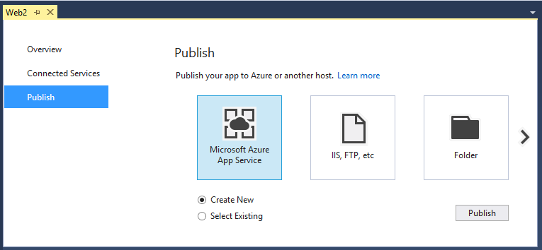
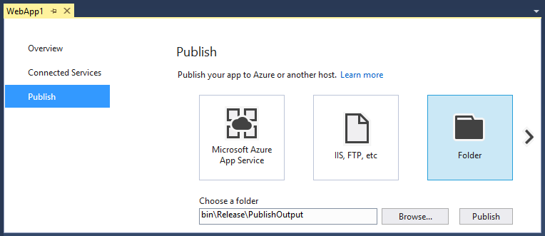
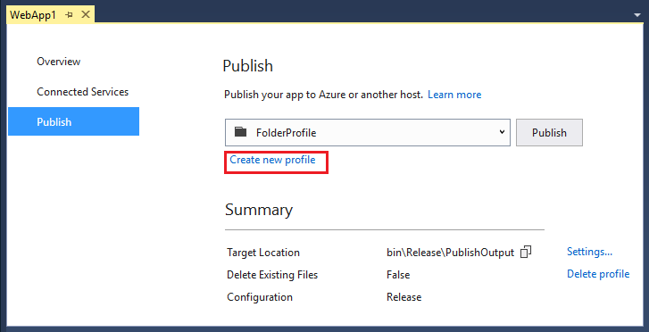

# Create publish profiles for Visual Studio and MSBuild, to deploy ASP.NET Core apps

By [Sayed Ibrahim Hashimi](https://github.com/sayedihashimi) and [Rick Anderson](https://twitter.com/RickAndMSFT)

This article focuses on using Visual Studio 2017 to create publish profiles. The publish profiles created with Visual Studio can be run from MSBuild and Visual Studio 2017. The article provides details of the publishing process. See [Publish an ASP.NET Core web app to Azure App Service using Visual Studio](xref:tutorials/publish-to-azure-webapp-using-vs) for instructions on publishing to Azure.

The following *.csproj* file was created with the command `dotnet new mvc`:

# [ASP.NET Core 2.x](#tab/aspnetcore2x)

```xml
<Project Sdk="Microsoft.NET.Sdk.Web">

  <PropertyGroup>
    <TargetFramework>netcoreapp2.0</TargetFramework>
  </PropertyGroup>

  <ItemGroup>
    <PackageReference Include="Microsoft.AspNetCore.All" Version="2.0.0" />
  </ItemGroup>

  <ItemGroup>
    <DotNetCliToolReference Include="Microsoft.VisualStudio.Web.CodeGeneration.Tools" Version="2.0.0" />
  </ItemGroup>

</Project>
```

# [ASP.NET Core 1.x](#tab/aspnetcore1x)

```xml
<Project Sdk="Microsoft.NET.Sdk.Web">

  <PropertyGroup>
    <TargetFramework>netcoreapp1.1</TargetFramework>
  </PropertyGroup>

  <ItemGroup>
    <PackageReference Include="Microsoft.AspNetCore" Version="1.1.1" />
    <PackageReference Include="Microsoft.AspNetCore.Mvc" Version="1.1.2" />
    <PackageReference Include="Microsoft.AspNetCore.StaticFiles" Version="1.1.1" />
  </ItemGroup>

</Project>
```

---

The `Sdk` attribute in the `<Project>` element (in the first line) of the markup above does the following:

* Imports the `props` file from *$(MSBuildSDKsPath)\Microsoft.NET.Sdk.Web\Sdk\Sdk.Props* at the beginning.
* Imports the targets file from *$(MSBuildSDKsPath)\Microsoft.NET.Sdk.Web\Sdk\Sdk.targets* at the end.

The default location for `MSBuildSDKsPath` (with Visual Studio 2017 Enterprise) is the *%programfiles(x86)%\Microsoft Visual Studio\2017\Enterprise\MSBuild\Sdks* folder.

`Microsoft.NET.Sdk.Web` depends on:

* *Microsoft.NET.Sdk.Web.ProjectSystem*
* *Microsoft.NET.Sdk.Publish*

Which causes the following `props` and `targets` to be imported:

* $(MSBuildSDKsPath)\Microsoft.NET.Sdk.Web.ProjectSystem\Sdk\Sdk.Props
* $(MSBuildSDKsPath)\Microsoft.NET.Sdk.Web.ProjectSystem\Sdk\Sdk.targets
* $(MSBuildSDKsPath)\Microsoft.NET.Sdk.Publish\Sdk\Sdk.Props
* $(MSBuildSDKsPath)\Microsoft.NET.Sdk.Publish\Sdk\Sdk.targets

Publish targets will again import the right set of targets based on the publish method used.

When MSBuild or Visual Studio loads a project, the following high level actions are performed:

* Build project
* Compute files to publish
* Publish files to destination

### Compute project items

When the project is loaded, the project items (files) are computed. The `item type` attribute determines how the file is processed. By default, *.cs* files are included in the `Compile` item list. Files in the `Compile` item list are compiled.

The `Content` item list contains files that will be published in addition to the build outputs. By default, files matching the pattern wwwroot/** will be included in the `Content` item. [wwwroot/** is a globbing pattern](https://gruntjs.com/configuring-tasks#globbing-patterns) that specifies all files in the *wwwroot* folder **and** subfolders. To explicitly add a file to the publish list, add the file directly in the *.csproj* file as shown in [Including Files](#including-files).

When you select the **Publish** button in Visual Studio or when you publish from command line:

- The properties/items are computed (the files that are needed to build).
- Visual Studio only: NuGet packages are restored.  (Restore needs to be explicit by the user on the CLI.)
- The project builds.
- The publish items are computed (the files that are needed to publish).
- The project is published. (The computed files are copied to the publish destination.)

## Basic command line publishing

This section works on all .NET Core supported platforms and doesn't require Visual Studio. In the samples below, the `dotnet publish` command is run from the project directory (which contains the *.csproj* file). If you're not in the project folder, you can explicitly pass in the project file path. For example:

```console
dotnet publish  c:/webs/web1
```

Run the following commands to create and publish a web app:

# [ASP.NET Core 2.x](#tab/aspnetcore2x)

```console
dotnet new mvc
dotnet publish
```

# [ASP.NET Core 1.x](#tab/aspnetcore1x)

```console
dotnet new mvc
dotnet restore
dotnet publish
```

--------------

The `dotnet publish` produces output similar to the following:

```console
C:\Webs\Web1>dotnet publish
Microsoft (R) Build Engine version 15.3.409.57025 for .NET Core
Copyright (C) Microsoft Corporation. All rights reserved.

  Web1 -> C:\Webs\Web1\bin\Debug\netcoreapp2.0\Web1.dll
  Web1 -> C:\Webs\Web1\bin\Debug\netcoreapp2.0\publish\
```

The default publish folder is `bin\$(Configuration)\netcoreapp<version>\publish`. The default for `$(Configuration)` is Debug. In the sample above, the `<TargetFramework>` is `netcoreapp2.0`.

`dotnet publish -h` displays help information for publish.

The following command specifies a `Release` build and the publishing directory:

```console
dotnet publish -c Release -o C:/MyWebs/test
```

The `dotnet publish` command calls `MSBuild` which invokes the `Publish` target. Any parameters passed to `dotnet publish` are passed to `MSBuild`. The `-c` parameter maps to the `Configuration` MSBuild property. The `-o` parameter maps to `OutputPath`.

You can pass MSBuild properties using either of the following formats:

- ` p:<NAME>=<VALUE>`
- `/p:<NAME>=<VALUE>`

The following command publishes a `Release` build to a network share:

`dotnet publish -c Release /p:PublishDir=//r8/release/AdminWeb`

The network share is specified with forward slashes (*//r8/*) and works on all .NET Core supported platforms.

Confirm that the published app for deployment isn't running. Files in the *publish* folder are locked when the app is running. Deployment can't occur because locked files can't be copied.

## Publish profiles

This section uses Visual Studio 2017 and higher to create publishing profiles. Once created, you can publish from Visual Studio or the command line.

Publish profiles can simplify the publishing process. You can have multiple publish profiles. To create a publish profile in Visual Studio, right click on the project in Solution Explore and select **Publish**. Alternatively, you can select **Publish     \<project name>** from the build menu. The **Publish** tab of the application capacities page is displayed. If the project doesn't contain a publish profile, the following page is displayed:



When **Folder** is selected, the **Publish** button creates a folder publish profile and publishes.



Once a publish profile is created, the **Publish** tab changes, and you select **Create new profile** to create a new profile.



The Publish wizard supports the following publish targets:

- Microsoft Azure App Service
- IIS, FTP, etc (for any web server)
- Folder
- Import profile (allows you to import a profile).
- Microsoft Azure Virtual Machines

See [What publishing options are right for me?](https://docs.microsoft.com/visualstudio/ide/not-in-toc/web-publish-options) for more information.

When you create a publish profile with Visual Studio, a *Properties/PublishProfiles/\<publish name>.pubxml* MSBuild file is created. This *.pubxml* file is a MSBuild file and contains publish configuration settings. You can change this file to customize the build and publish process. This file is read by the publishing process. `<LastUsedBuildConfiguration>` is special because it’s a global property and shouldn’t be in any file that’s imported in the build. See [MSBuild: how to set the configuration property](http://sedodream.com/2012/10/27/MSBuildHowToSetTheConfigurationProperty.aspx) for more info.
The *.pubxml* file should not be checked into source control because it depends on the *.user* file. The *.user* file should never be checked into source control because it can contain sensitive information and it's only valid for one user and machine.

Sensitive information (like the publish password) is encrypted on a per user/machine level and stored in the *Properties/PublishProfiles/\<publish name>.pubxml.user* file. Because this file can contain sensitive information, it should **not** be checked into source control.

For an overview of how to publish a web app on ASP.NET Core see [Publishing and Deployment](index.md). [Publishing and Deployment](index.md) is an open source project at https://github.com/aspnet/websdk.

Currently `dotnet publish` doesn’t have the ability to use publish profiles. To use publish profiles, use `dotnet build`. `dotnet build` invokes MSBuild on the project. Alternatively, call `msbuild` directly.

Set the following MSBuild properties when using a publish profile:

- `DeployOnBuild=true`
- `PublishProfile=<Publish profile name>`

For example, when publishing with a profile named *FolderProfile* you can execute either of the commands below.

- `dotnet build /p:DeployOnBuild=true /p:PublishProfile=FolderProfile`
- `msbuild      /p:DeployOnBuild=true /p:PublishProfile=FolderProfile`

When you invoke `dotnet build` it will call `msbuild` to run the build and publish process. Calling `dotnet build` or `msbuild` is essentially equivalent when you pass in a folder profile. When calling MSBuild directly on Windows you get the .NET Framework version of MSBuild.  MSDeploy is currently limited to Windows machines for publishing. Calling `dotnet build` on a non-folder profile invokes MSBuild, and MSBuild uses MSDeploy on non-folder profiles. Calling `dotnet build` on a non-folder profile invokes MSBuild (using MSDeploy) and results in a failure (even when running on a Windows platform). To publish with a non-folder profile, call MSBuild directly.

The following folder publish profile was created with Visual Studio and publishes to a network share:

[!code-xml[Main](web-publishing-vs/sample/FolderProfile.pubxml?highlight=5,9,11,18)]

Note `<LastUsedBuildConfiguration>` is set to `Release`.  When publishing from Visual Studio, the `<LastUsedBuildConfiguration>` configuration property value is set using the value when the publish process is started. The `<LastUsedBuildConfiguration>` configuration property is special and shouldn’t be overridden in an imported MSBuild file. You can override this property from the command line. For example:

`dotnet build -c Release /p:DeployOnBuild=true /p:PublishProfile=FolderProfile`

Using MSBuild:

`msbuild /p:Configuration=Release /p:DeployOnBuild=true /p:PublishProfile=FolderProfile`

## Publish to an MSDeploy endpoint from the command line

As previously mentioned, you can publish using `dotnet publish` or the `msbuild` command. `dotnet publish` runs in the context of .NET Core. `msbuild` requires .NET framework, and is therefore limited to Windows environments.

The easiest way to publish with MSDeploy is to first create a publish profile in Visual Studio 2017 and use the profile from the command line.

In the following sample, an ASP.NET Core web app is created ( using `dotnet new mvc`) and an Azure publish profile is added with Visual Studio.

You run `msbuild` from a **Developer Command Prompt for VS 2017**. The Developer Command Prompt will have the correct *msbuild.exe* in its path and set some MSBuild variables.

MSBuild uses the following syntax:

`msbuild <path-to-project-file> /p:DeployOnBuild=true /p:PublishProfile=<Publish Profile>  /p:Username=<USERNAME> /p:Password=<PASSWORD>`

You can get the `Password` from the *\<Publish name>.PublishSettings* file. You can download the *.PublishSettings* file from:

- Solution Explorer: Right click on the Web App and select **Download Publish Profile**.
- The Azure Management Portal: Select **Get publish profile** from the  Web App blade.

`Username` can be found in the publish profile.

The following sample uses the "Web11112 - Web Deploy" publish profile:

```console
msbuild "C:\Webs\Web1\Web1.csproj" /p:DeployOnBuild=true
 /p:PublishProfile="Web11112 - Web Deploy"  /p:Username="$Web11112"
 /p:Password="<password removed>"
```

## Excluding files

When publishing ASP.NET Core web apps, the build artifacts and contents of the *wwwroot* folder are included. `msbuild` supports [globbing patterns](https://gruntjs.com/configuring-tasks#globbing-patterns). For example, the following `<Content>` element markup will exclude all text (*.txt*) files from the *wwwroot/content* folder and all its subfolders.

```xml
<ItemGroup>
  <Content Update="wwwroot/content/**/*.txt" CopyToPublishDirectory="Never" />
</ItemGroup>
```

The markup above can be added to a publish profile or the *.csproj* file. When added to the *.csproj* file, the rule is added to all publish profiles in the project.

The following `<MsDeploySkipRules>` element markup exludes all files from the *wwwroot/content* folder:

```xml
<ItemGroup>
  <MsDeploySkipRules Include="CustomSkipFolder">
    <ObjectName>dirPath</ObjectName>
    <AbsolutePath>wwwroot\content</AbsolutePath>
  </MsDeploySkipRules>
</ItemGroup>
```

`<MsDeploySkipRules>`  will not delete the *skip* targets from the deployment site. `<Content>` targeted files and folders will be deleted from the deployment site. For example, suppose you had deployed a web app with the following files:

- *Views/Home/About1.cshtml*
- *Views/Home/About2.cshtml*
- *Views/Home/About3.cshtml*

If you added the following `<MsDeploySkipRules>` markup, those files would not be deleted on the deployment site.

``` xml
<ItemGroup>
  <MsDeploySkipRules Include="CustomSkipFile">
    <ObjectName>filePath</ObjectName>
    <AbsolutePath>Views\\Home\\About1.cshtml</AbsolutePath>
  </MsDeploySkipRules>

  <MsDeploySkipRules Include="CustomSkipFile">
    <ObjectName>filePath</ObjectName>
    <AbsolutePath>Views\\Home\\About2.cshtml</AbsolutePath>
  </MsDeploySkipRules>

  <MsDeploySkipRules Include="CustomSkipFile">
    <ObjectName>filePath</ObjectName>
    <AbsolutePath>Views\\Home\\About3.cshtml</AbsolutePath>
  </MsDeploySkipRules>
</ItemGroup>
```

The `<MsDeploySkipRules>` markup shown above prevents the *skipped* files from being depoyed, but will not delete those files once they are deployed.

The following `<Content>` markup would delete the targeted files at the deployment site:

``` xml
<ItemGroup>
  <Content Update="Views/Home/About?.cshtml" CopyToPublishDirectory="Never" />
</ItemGroup>
```

Using command line deployment with the `<Content>` markup above would result in output similar to the following:

``` console
MSDeployPublish:
  Starting Web deployment task from source: manifest(C:\Webs\Web1\obj\Release\netcoreapp1.1\PubTmp\Web1.SourceManifest.
  xml) to Destination: auto().
  Deleting file (Web11112\Views\Home\About1.cshtml).
  Deleting file (Web11112\Views\Home\About2.cshtml).
  Deleting file (Web11112\Views\Home\About3.cshtml).
  Updating file (Web11112\web.config).
  Updating file (Web11112\Web1.deps.json).
  Updating file (Web11112\Web1.dll).
  Updating file (Web11112\Web1.pdb).
  Updating file (Web11112\Web1.runtimeconfig.json).
  Successfully executed Web deployment task.
  Publish Succeeded.
Done Building Project "C:\Webs\Web1\Web1.csproj" (default targets).
```

## Including files

The following markup can be used to include an *images* folder outside the project directory to the *wwwroot/images* folder of the publish site.

``` xml
<ItemGroup>
  <_CustomFiles Include="$(MSBuildProjectDirectory)/../images/**/*" />
  <DotnetPublishFiles Include="@(_CustomFiles)">
    <DestinationRelativePath>wwwroot/images/%(RecursiveDir)%(Filename)%(Extension)</DestinationRelativePath>
  </DotnetPublishFiles>
</ItemGroup>
```

The markup can be added to the *.csproj* file or the publish profile. If it's added to the *.csproj* file, it will be included in each publish profile in the project.

The following highlighted markup shows how to:

* Copy a file from outside the project into the *wwwroot* folder.
* Exclude the *wwwroot\Content* folder.
* Exclude *Views\Home\About2.cshtml*.

[!code-xml[Main](web-publishing-vs/sample/FolderProfile2.pubxml?highlight=21-29)]

See the [WebSDK Readme](https://github.com/aspnet/websdk) for more deployment samples.

### Run a target before or after publishing

The builtin `BeforePublish` and `AfterPublish` targets can be used to execute a target before or after the publish target. The following markup can be added to the publish profile to log messages to the console output before and after publishing:

``` xml
<Target Name="CustomActionsBeforePublish" BeforeTargets="BeforePublish">
    <Message Text="Inside BeforePublish" Importance="high" />
  </Target>
  <Target Name="CustomActionsAfterPublish" AfterTargets="AfterPublish">
    <Message Text="Inside AfterPublish" Importance="high" />
</Target>
```

## The Kudu service

To view the files on your Azure Web App, use the [kudu service](https://github.com/projectkudu/kudu/wiki/Accessing-the-kudu-service). Append the `scm` token to the name or your Web App. For example:

| URL               | Result|
| ----------------- | ------------ |
| `http://mysite.azurewebsites.net/` | Web App |
| `http://mysite.scm.azurewebsites.net/` | Kudu sevice |

Select the [Debug Console](https://github.com/projectkudu/kudu/wiki/Kudu-console) menu item to view/edit/delete/add files.

## Additional resources

- [Web Deploy](https://www.iis.net/downloads/microsoft/web-deploy)  (msdeploy) simplifies deployment of Web applications and Web sites to IIS servers.

- [https://github.com/aspnet/websdk](https://github.com/aspnet/websdk/issues): File issues and request features for deployment.
