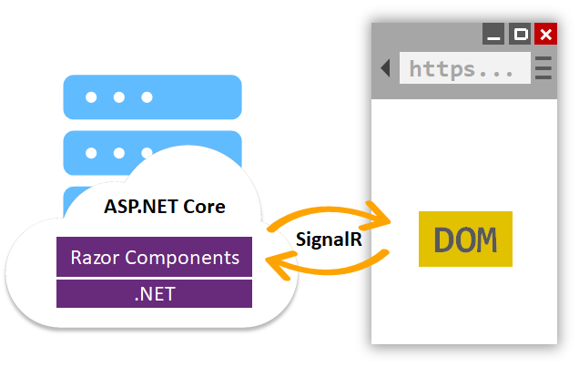
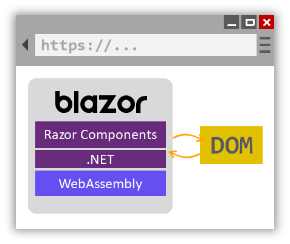

# Introduction to Razor Components

By [Steve Sanderson](http://blog.stevensanderson.com), [Daniel Roth](https://github.com/danroth27), and [Luke Latham](https://github.com/guardrex)

[!INCLUDE[](~/includes/razor-components-preview-notice.md)]

*ASP.NET Core Razor Components* executes server-side in ASP.NET Core, while *Blazor* (Razor Components executed client-side) is an experimental .NET web framework using C#/Razor and HTML that runs in the browser with WebAssembly. Blazor provides all of the benefits of a client-side web UI framework using .NET on the client.

Web development has improved in many ways over the years, but building modern web apps still poses challenges. Using .NET in the browser offers many advantages that can help make web development easier and more productive:

* **Stability and consistency**: .NET provides standardized programming frameworks across platforms that are stable, feature-rich, and easy to use.
* **Modern innovative languages**: .NET languages are constantly improving with innovative new language features.
* **Industry-leading tools**: The Visual Studio product family provides a fantastic .NET development experience across platforms on Windows, Linux, and macOS.
* **Speed and scalability**: .NET has a strong history of performance, reliability, and security for app development. Using .NET as a full-stack solution makes it easier to build fast, reliable, and secure apps.
* **Full-stack development that leverages existing skills**: C#/Razor developers use their existing C#/Razor skills to write client-side code and share server and client-side logic among apps.
* **Wide browser support**: Razor Components render the UI as ordinary markup and JavaScript. Blazor runs on .NET in the browser using open web standards with no plugins and no code transpilation. Blazor works in all modern web browsers, including mobile browsers.

## Hosting models

### Server-side hosting model

Because Razor Components decouple a component's rendering logic from how the UI updates are applied, there is flexibility in how Razor Components can be hosted. ASP.NET Core Razor Components in .NET Core 3.0 adds support for hosting Razor Components on the server in an ASP.NET Core app where all UI updates are handled over a SignalR connection. The runtime handles sending UI events from the browser to the server and then applies UI updates sent by the server back to the browser after running the components. The same connection is also used to handle JavaScript interop calls.



For more information, see <xref:razor-components/hosting-models#server-side-hosting-model>.

### Client-side hosting model

Running .NET code inside web browsers is made possible by a relatively new technology, [WebAssembly](http://webassembly.org) (abbreviated *wasm*). WebAssembly is an open web standard and is supported in web browsers without plugins. WebAssembly is a compact bytecode format optimized for fast download and maximum execution speed.

WebAssembly code can access the full functionality of the browser via JavaScript interop. At the same time, WebAssembly code runs in the same trusted sandbox as JavaScript to prevent malicious actions on the client machine.



When a Blazor app is built and run in a browser:

1. C# code files and Razor files are compiled into .NET assemblies.
1. The assemblies and the .NET runtime are downloaded to the browser.
1. Blazor uses JavaScript to bootstrap the .NET runtime and configures the runtime to load required assembly references. Document object model (DOM) manipulation and browser API calls are handled by the Blazor runtime via JavaScript interoperability.

To support older browsers that don't support WebAssembly, you can use the ASP.NET Core Razor Components [server-side hosting model](#server-side-hosting-model).

For more information, see <xref:razor-components/hosting-models#client-side-hosting-model>.

## Components

Apps are built with *components*. A component is a piece of UI, such as a page, dialog, or data entry form. Components can be nested, reused, and shared between projects.

A *component* is a .NET class. The class can either be written directly, as a C# class (*\*.cs*), or more commonly in the form of a Razor markup page (*\*.cshtml*).

[Razor](/aspnet/core/mvc/views/razor) is a syntax for combining HTML markup with C# code. Razor is designed for developer productivity, allowing the developer to switch between markup and C# in the same file with [IntelliSense](/visualstudio/ide/using-intellisense) support. The following markup is an example of a basic custom dialog component in a Razor file (*DialogComponent.cshtml*):

```cshtml
<div>
    <h2>@Title</h2>
    @BodyContent
    <button onclick=@OnOK>OK</button>
</div>

@functions {
    public string Title { get; set; }
    public RenderFragment BodyContent { get; set; }
    public Action OnOK { get; set; }
}
```

When this component is used elsewhere in the app, IntelliSense speeds development with syntax and parameter completion.

Components can be:

* Nested.
* Created with Razor (*\*.cshtml*) or C# (*\*.cs*) code.
* Shared via class libraries.
* Unit tested without requiring a browser DOM.

## Infrastructure

Razor Components offers the core facilities that most apps require, including:

* Layouts
* Routing
* Dependency injection

All of these features are optional. When one of these features isn't used in an app, the implementation is stripped out of the app when published by the [Intermediate Language (IL) Linker](xref:host-and-deploy/razor-components/configure-linker).

## Code sharing and .NET Standard

Apps can reference and use existing [.NET Standard](/dotnet/standard/net-standard) libraries. .NET Standard is a formal specification of .NET APIs that are common across .NET implementations. .NET Standard 2.0 or higher is supported. APIs that aren't applicable inside a web browser (for example, accessing the file system, opening a socket, threading, and other features) throw [PlatformNotSupportedException](/dotnet/api/system.platformnotsupportedexception). .NET Standard class libraries can be shared across server code and in browser-based apps.

## JavaScript interop

For apps that require third-party JavaScript libraries and browser APIs, WebAssembly is designed to interoperate with JavaScript. Razor Components are capable of using any library or API that JavaScript is able to use. C# code can call into JavaScript code, and JavaScript code can call into C# code. For more information, see [JavaScript interop](xref:razor-components/javascript-interop).

## Optimization

For client-side apps, payload size is critical. Blazor optimizes payload size to reduce download times. For example, unused parts of .NET assemblies are removed during the build process, HTTP responses are compressed, and the .NET runtime and assemblies are cached in the browser.

Razor Components provides an even smaller payload size than Blazor by maintaining .NET assemblies, the app's assembly, and the runtime server-side. Razor Components apps only serve markup, script, and stylesheets to clients.

## Deployment

Use Blazor to build a pure standalone client-side app or a full-stack ASP.NET Core app that contains both server and client apps:

* In a **standalone client-side app**, the Blazor app is compiled into a *dist* folder that only contains static files. The files can be hosted on Azure App Service, GitHub Pages, IIS (configured as a static file server), Node.js servers, and many other servers and services. .NET isn't required on the server in production.
* In a **full-stack ASP.NET Core app**, code can be shared between server and client apps. The resulting ASP.NET Core Razor Components app, which serves the client-side UI and other server-side API endpoints, can be built and deployed to any cloud or on-premise host supported by ASP.NET Core.

## Suggest a feature or file a bug report

To make suggestions and file bug reports, please [open an issue](https://github.com/aspnet/AspNetCore/issues/new). For general help and to get answers from the community, join the conversation on [Gitter](https://gitter.im/aspnet/Blazor).

## Additional resources

* [WebAssembly](http://webassembly.org/)
* [C# Guide](/dotnet/csharp/)
* [Razor](/aspnet/core/mvc/views/razor)
* [HTML](https://www.w3.org/html/)
