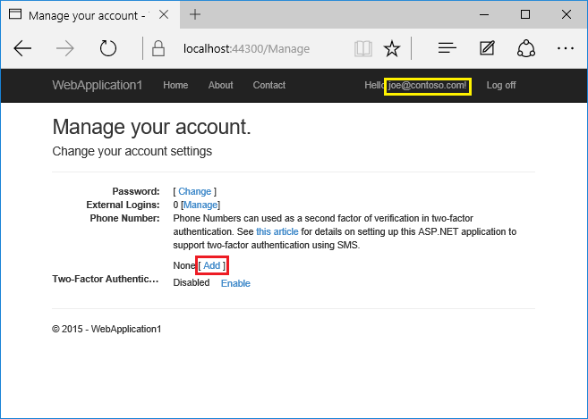
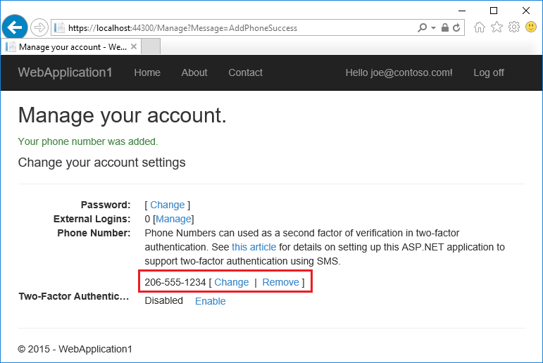

# Two-factor authentication with SMS

By [Rick Anderson](https://twitter.com/RickAndMSFT) and [Swiss-Devs](https://github.com/Swiss-Devs)

This tutorial applies to ASP.NET Core 1.x only. See [Enabling QR Code generation for authenticator apps in ASP.NET Core](xref:security/authentication/identity-enable-qrcodes) for ASP.NET Core 2.0 and later.

This tutorial shows how to set up two-factor authentication (2FA) using SMS. Instructions are given for [twilio](https://www.twilio.com/) and [ASPSMS](https://www.aspsms.com/asp.net/identity/core/testcredits/), but you can use any other SMS provider. We recommend you complete [Account Confirmation and Password Recovery](accconfirm.md) before starting this tutorial.

View the [completed sample](https://github.com/aspnet/Docs/tree/master/aspnetcore/security/authentication/2fa/sample/Web2FA). [How to download](xref:tutorials/index#how-to-download-a-sample).

## Create a new ASP.NET Core project

Create a new ASP.NET Core web app named `Web2FA` with individual user accounts. Follow the instructions in [Enforcing SSL in an ASP.NET Core app](xref:security/enforcing-ssl) to set up and require SSL.

### Create an SMS account

Create an SMS account, for example, from [twilio](https://www.twilio.com/) or [ASPSMS](https://www.aspsms.com/asp.net/identity/core/testcredits/). Record the authentication credentials (for twilio: accountSid and authToken, for ASPSMS: Userkey and Password).

#### Figuring out SMS Provider credentials

**Twilio:**  
From the Dashboard tab of your Twilio account, copy the **Account SID** and **Auth token**.

**ASPSMS:**  
From your account settings, navigate to **Userkey** and copy it together with your **Password**.

We will later store these values in with the secret-manager tool within the keys `SMSAccountIdentification` and `SMSAccountPassword`.

#### Specifying SenderID / Originator

**Twilio:**  
From the Numbers tab, copy your Twilio **phone number**. 

**ASPSMS:**  
Within the Unlock Originators Menu, unlock one or more Originators or choose an alphanumeric Originator (Not supported by all networks). 

We will later store this value with the secret-manager tool within the key `SMSAccountFrom`.


### Provide credentials for the SMS service

We'll use the [Options pattern](xref:fundamentals/configuration#options-config-objects) to access the user account and key settings. 

   * Create a class to fetch the secure SMS key. For this sample, the `SMSoptions` class is created in the *Services/SMSoptions.cs* file.

[!code-csharp[Main](2fa/sample/Web2FA/Services/SMSoptions.cs)]

Set the `SMSAccountIdentification`, `SMSAccountPassword` and `SMSAccountFrom` with the [secret-manager tool](xref:security/app-secrets). For example:

```none
C:/Web2FA/src/WebApp1>dotnet user-secrets set SMSAccountIdentification 12345
info: Successfully saved SMSAccountIdentification = 12345 to the secret store.
```
* Add the NuGet package for the SMS provider. From the Package Manager Console (PMC) run:

**Twilio:**  
`Install-Package Twilio`

**ASPSMS:**  
`Install-Package ASPSMS`


* Add code in the *Services/MessageServices.cs* file to enable SMS. Use either the Twilio or the ASPSMS section:


**Twilio:**  
[!code-csharp[Main](2fa/sample/Web2FA/Services/MessageServices_twilio.cs)]

**ASPSMS:**  
[!code-csharp[Main](2fa/sample/Web2FA/Services/MessageServices_ASPSMS.cs)]

### Configure startup to use `SMSoptions`

Add `SMSoptions` to the service container in the `ConfigureServices` method in the *Startup.cs*:

[!code-csharp[Main](2fa/sample/Web2FA/Startup.cs?name=snippet1&highlight=4)]

### Enable two-factor authentication

Open the *Views/Manage/Index.cshtml* Razor view file and remove the comment characters (so no markup is commnted out).

## Log in with two-factor authentication

* Run the app and register a new user


* Tap on your user name, which activates the `Index` action method in Manage controller. Then tap the phone number **Add** link.



* Add a phone number that will receive the verification code, and tap **Send verification code**.


* You will get a text message with the verification code. Enter it and tap **Submit**


If you don't get a text message, see twilio log page.

* The Manage view shows your phone number was added successfully.



* Tap **Enable** to enable two-factor authentication.


### Test two-factor authentication

* Log off.

* Log in.

* The user account has enabled two-factor authentication, so you have to provide the second factor of authentication . In this tutorial you have enabled phone verification. The built in templates also allow you to set up email as the second factor. You can set up additional second factors for authentication such as QR codes. Tap **Submit**.


* Enter the code you get in the SMS message.

* Clicking on the **Remember this browser** check box will exempt you from needing to use 2FA to log on when using the same device and browser. Enabling 2FA and clicking on **Remember this browser** will provide you with strong 2FA protection from malicious users trying to access your account, as long as they don't have access to your device. You can do this on any private device you regularly use. By setting  **Remember this browser**, you get the added security of 2FA from devices you don't regularly use, and you get the convenience on not having to go through 2FA on your own devices.


## Account lockout for protecting against brute force attacks

We recommend you use account lockout with 2FA. Once a user logs in (through a local account or social account), each failed attempt at 2FA is stored, and if the maximum attempts (default is 5) is reached, the user is locked out for five minutes (you can set the lock out time with `DefaultAccountLockoutTimeSpan`). The following configures Account to be locked out for 10 minutes after 10 failed attempts.

[!code-csharp[Main](2fa/sample/Web2FA/Startup.cs?name=snippet2&highlight=13-17)] 
