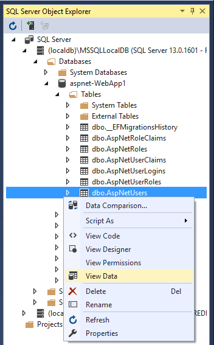
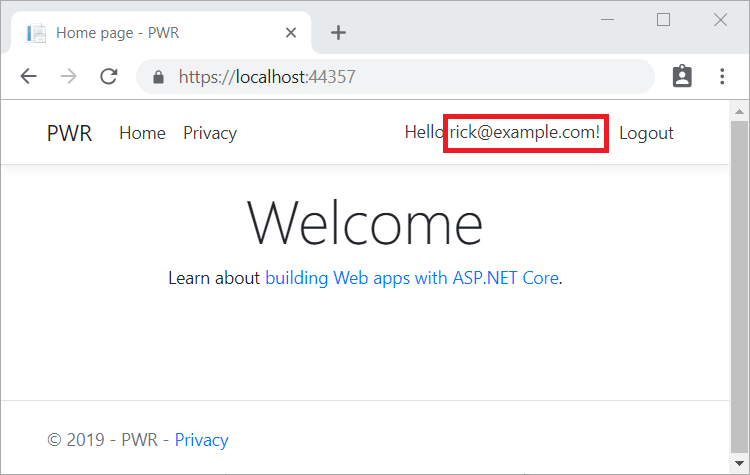

# Account confirmation and password recovery in ASP.NET Core

By [Rick Anderson](https://twitter.com/RickAndMSFT) and [Joe Audette](https://twitter.com/joeaudette)

This tutorial shows you how to build an ASP.NET Core app with email confirmation and password reset. This tutorial is **not** a beginning topic. You should be familiar with:

* [ASP.NET Core](xref:tutorials/first-mvc-app/start-mvc)
* [Authentication](xref:security/authentication/index)
* [Account Confirmation and Password Recovery](xref:security/authentication/accconfirm)
* [Entity Framework Core](xref:data/ef-mvc/intro)

See [this PDF file](https://github.com/aspnet/Docs/tree/master/aspnetcore/security/authorization/secure-data/asp.net_repo_pdf_1-16-18.pdf) for the ASP.NET Core MVC 1.1 and 2.x versions.

## Prerequisites

[!INCLUDE[](~/includes/net-core-prereqs.md)]

## Create a new ASP.NET Core project with the .NET Core CLI

# [ASP.NET Core 2.x](#tab/aspnetcore2x)

```console
dotnet new razor --auth Individual -o WebPWrecover
cd WebPWrecover
```

* `--auth Individual` specifies the Individual User Accounts project template.
* On Windows, add the `-uld` option. It specifies LocalDB should be used instead of SQLite.
* Run `new mvc --help` to get help on this command.

# [ASP.NET Core 1.x](#tab/aspnetcore1x)

If you're using the CLI or SQLite, run the following in a command window:

```console
dotnet new mvc --auth Individual
```

* `--auth Individual` specifies the Individual User Accounts project template.
* On Windows, add the `-uld` option. It specifies LocalDB should be used instead of SQLite.
* Run `new mvc --help` to get help on this command.

---

Alternatively, you can create a new ASP.NET Core project with Visual Studio:

* In Visual Studio, create a new **Web Application** project.
* Select **ASP.NET Core 2.0**. **.NET Core** is selected in the following image, but you can select **.NET Framework**.
* Select **Change Authentication** and set to **Individual User Accounts**.
* Keep the default **Store user accounts in-app**.


## Test new user registration

Run the app, select the **Register** link, and register a user. Follow the instructions to run Entity Framework Core migrations. At this point, the only validation on the email is with the [[EmailAddress]](/dotnet/api/system.componentmodel.dataannotations.emailaddressattribute) attribute. After submitting the registration, you are logged into the app. Later in the tutorial, the code is updated so new users can't log in until their email has been validated.

## View the Identity database

See [Work with SQLite in an ASP.NET Core MVC project](xref:tutorials/first-mvc-app-xplat/working-with-sql) for instructions on how to view the SQLite database.

For Visual Studio:

* From the **View** menu, select **SQL Server Object Explorer** (SSOX).
* Navigate to **(localdb)MSSQLLocalDB(SQL Server 13)**. Right-click on **dbo.AspNetUsers** > **View Data**:



Note the table's `EmailConfirmed` field is `False`.

You might want to use this email again in the next step when the app sends a confirmation email. Right-click on the row and select **Delete**. Deleting the email alias makes it easier in the following steps.

---

## Require HTTPS

See [Require HTTPS](xref:security/enforcing-ssl).

<a name="prevent-login-at-registration"></a>
## Require email confirmation

It's a best practice to confirm the email of a new user registration. Email confirmation helps to verify they're not impersonating someone else (that is, they haven't registered with someone else's email). Suppose you had a discussion forum, and you wanted to prevent "yli@example.com" from registering as "nolivetto@contoso.com." Without email confirmation, "nolivetto@contoso.com" could receive unwanted email from your app. Suppose the user accidentally registered as "ylo@example.com" and hadn't noticed the misspelling of "yli". They wouldn't be able to use password recovery because the app doesn't have their correct email. Email confirmation provides only limited protection from bots. Email confirmation doesn't provide protection from malicious users with many email accounts.

You generally want to prevent new users from posting any data to your web site before they have a confirmed email.

Update `ConfigureServices` to require a confirmed email:

[!code-csharp[](accconfirm/sample/WebPWrecover/Startup.cs?name=snippet1&highlight=12-17)]

`config.SignIn.RequireConfirmedEmail = true;` prevents registered users from logging in until their email is confirmed.

### Configure email provider

In this tutorial, SendGrid is used to send email. You need a SendGrid account and key to send email. You can use other email providers. ASP.NET Core 2.x includes `System.Net.Mail`, which allows you to send email from your app. We recommend you use SendGrid or another email service to send email. SMTP is difficult to secure and set up correctly.

The [Options pattern](xref:fundamentals/configuration/options) is used to access the user account and key settings. For more information, see [configuration](xref:fundamentals/configuration/index).

Create a class to fetch the secure email key. For this sample, the `AuthMessageSenderOptions` class is created in the *Services/AuthMessageSenderOptions.cs* file:

[!code-csharp[](accconfirm/sample/WebPWrecover/Services/AuthMessageSenderOptions.cs?name=snippet1)]

Set the `SendGridUser` and `SendGridKey` with the [secret-manager tool](xref:security/app-secrets). For example:

```console
C:\WebAppl\src\WebApp1>dotnet user-secrets set SendGridUser RickAndMSFT
info: Successfully saved SendGridUser = RickAndMSFT to the secret store.
```

On Windows, Secret Manager stores keys/value pairs in a *secrets.json* file in the `%APPDATA%/Microsoft/UserSecrets/<WebAppName-userSecretsId>` directory.

The contents of the *secrets.json* file aren't encrypted. The *secrets.json* file is shown below (the `SendGridKey` value has been removed.)

 ```json
  {
    "SendGridUser": "RickAndMSFT",
    "SendGridKey": "<key removed>"
  }
  ```

### Configure startup to use AuthMessageSenderOptions

Add `AuthMessageSenderOptions` to the service container at the end of the `ConfigureServices` method in the *Startup.cs* file:

# [ASP.NET Core 2.x](#tab/aspnetcore2x)

[!code-csharp[](accconfirm/sample/WebPWrecover/Startup.cs?name=snippet2&highlight=28)]

# [ASP.NET Core 1.x](#tab/aspnetcore1x)

[!code-csharp[](accconfirm/sample/WebApp1/Startup.cs?name=snippet1&highlight=26)]

---

### Configure the AuthMessageSender class

This tutorial shows how to add email notifications through [SendGrid](https://sendgrid.com/), but you can send email using SMTP and other mechanisms.

Install the `SendGrid` NuGet package:

* From the command line:

    `dotnet add package SendGrid`

* From the Package Manager Console, enter the following command:

 `Install-Package SendGrid`

See [Get Started with SendGrid for Free](https://sendgrid.com/free/) to register for a free SendGrid account.

#### Configure SendGrid

# [ASP.NET Core 2.x](#tab/aspnetcore2x)

To configure SendGrid, add code similar to the following in *Services/EmailSender.cs*:

[!code-csharp[](accconfirm/sample/WebPWrecover/Services/EmailSender.cs)]

# [ASP.NET Core 1.x](#tab/aspnetcore1x)
* Add code in *Services/MessageServices.cs* similar to the following to configure SendGrid:

[!code-csharp[](accconfirm/sample/WebApp1/Services/MessageServices.cs)]

---

## Enable account confirmation and password recovery

The template has the code for account confirmation and password recovery. Find the `OnPostAsync` method in *Pages/Account/Register.cshtml.cs*.

# [ASP.NET Core 2.x](#tab/aspnetcore2x)

Prevent newly registered users from being automatically logged on by commenting out the following line:

```csharp
await _signInManager.SignInAsync(user, isPersistent: false);
```

The complete method is shown with the changed line highlighted:

[!code-csharp[](accconfirm/sample/WebPWrecover/Pages/Account/Register.cshtml.cs?highlight=16&name=snippet_Register)]

# [ASP.NET Core 1.x](#tab/aspnetcore1x)

To enable account confirmation, uncomment the following code:

[!code-csharp[](accconfirm/sample/WebApp1/Controllers/AccountController.cs?highlight=16-25&name=snippet_Register)]

**Note:** The code is preventing a newly registered user from being automatically logged on by commenting out the following line:

```csharp
//await _signInManager.SignInAsync(user, isPersistent: false);
```

Enable password recovery by uncommenting the code in the `ForgotPassword` action of *Controllers/AccountController.cs*:

[!code-csharp[](accconfirm/sample/WebApp1/Controllers/AccountController.cs?highlight=17-23&name=snippet_ForgotPassword)]

Uncomment the form element in *Views/Account/ForgotPassword.cshtml*. You might want to remove the `<p> For more information on how to enable reset password ... </p>` element, which contains a link to this article.

[!code-cshtml[](accconfirm/sample/WebApp1/Views/Account/ForgotPassword.cshtml?highlight=7-10,12,28)]

---

## Register, confirm email, and reset password

Run the web app, and test the account confirmation and password recovery flow.

* Run the app and register a new user

 

* Check your email for the account confirmation link. See [Debug email](#debug) if you don't get the email.
* Click the link to confirm your email.
* Log in with your email and password.
* Log off.

### View the manage page

Select your user name in the browser:


You might need to expand the navbar to see user name.


# [ASP.NET Core 2.x](#tab/aspnetcore2x)

The manage page is displayed with the **Profile** tab selected. The **Email** shows a check box indicating the email has been confirmed.


# [ASP.NET Core 1.x](#tab/aspnetcore1x)

This is mentioned later in the tutorial.


---

### Test password reset

* If you're logged in, select **Logout**.
* Select the **Log in** link and select the **Forgot your password?** link.
* Enter the email you used to register the account.
* An email with a link to reset your password is sent. Check your email and click the link to reset your password. After your password has been successfully reset, you can log in with your email and new password.

<a name="debug"></a>

### Debug email

If you can't get email working:

* Create a [console app to send email](https://sendgrid.com/docs/Integrate/Code_Examples/v2_Mail/csharp.html).
* Review the [Email Activity](https://sendgrid.com/docs/User_Guide/email_activity.html) page.
* Check your spam folder.
* Try another email alias on a different email provider (Microsoft, Yahoo, Gmail, etc.)
* Try sending to different email accounts.

**A security best practice** is to **not** use production secrets in test and development. If you publish the app to Azure, you can set the SendGrid secrets as application settings in the Azure Web App portal. The configuration system is set up to read keys from environment variables.

## Combine social and local login accounts

To complete this section, you must first enable an external authentication provider. See [Facebook, Google, and external provider authentication](xref:security/authentication/social/index).

You can combine local and social accounts by clicking on your email link. In the following sequence, "RickAndMSFT@gmail.com" is first created as a local login; however, you can create the account as a social login first, then add a local login.


Click on the **Manage** link. Note the 0 external (social logins) associated with this account.


Click the link to another login service and accept the app requests. In the following image, Facebook is the external authentication provider:


The two accounts have been combined. You are able to log on with either account. You might want your users to add local accounts in case their social login authentication service is down, or more likely they've lost access to their social account.

## Enable account confirmation after a site has users

Enabling account confirmation on a site with users locks out all the existing users. Existing users are locked out because their accounts aren't confirmed. To work around exiting user lockout, use one of the following approaches:

* Update the database to mark all existing users as being confirmed
* Confirm exiting users. For example, batch-send emails with confirmation links.
