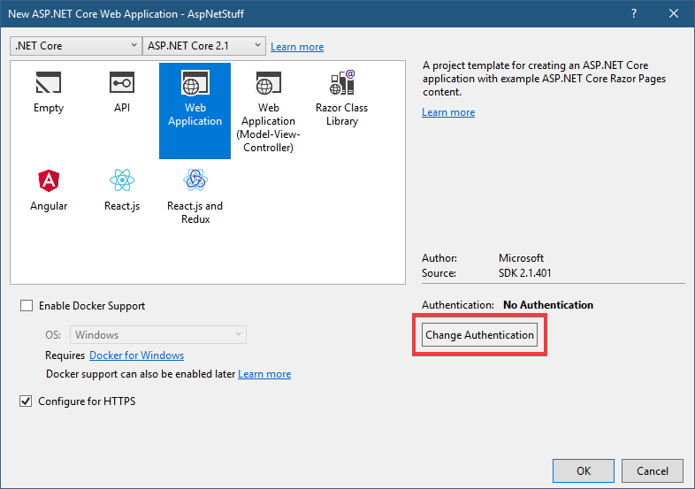
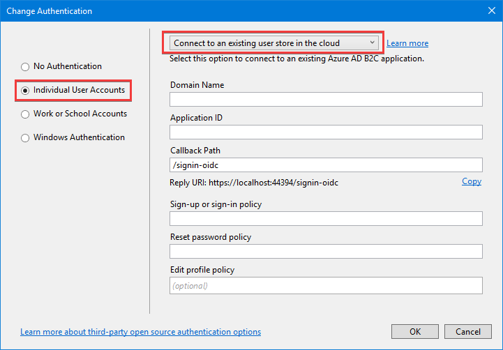
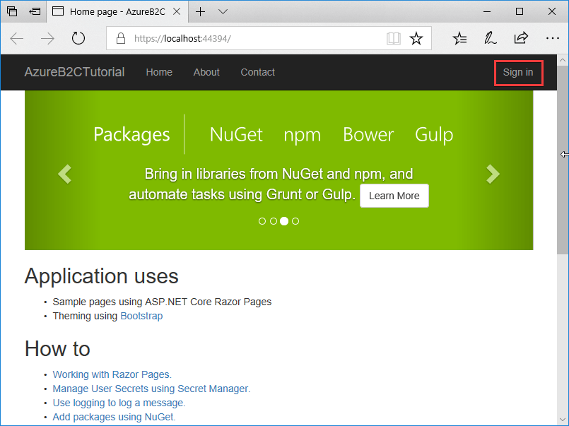
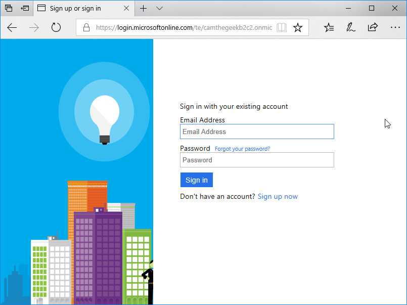
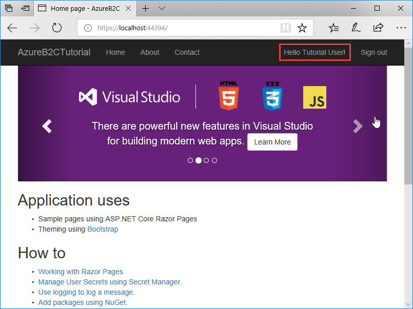

# Cloud authentication with Azure Active Directory B2C in ASP.NET Core

By [Cam Soper](https://twitter.com/camsoper)

[Azure Active Directory B2C](/azure/active-directory-b2c/active-directory-b2c-overview) (Azure AD B2C) is a cloud identity management solution for web and mobile apps. The service provides authentication for apps hosted in the cloud and on-premises. Authentication types include individual accounts, social network accounts, and federated enterprise accounts. Additionally, Azure AD B2C can provide multi-factor authentication with minimal configuration.

> [!TIP]
> Azure Active Directory (Azure AD) and Azure AD B2C are separate product offerings. An Azure AD tenant represents an organization, while an Azure AD B2C tenant represents a collection of identities to be used with relying party applications. To learn more, see [Azure AD B2C: Frequently asked questions (FAQ)](/azure/active-directory-b2c/active-directory-b2c-faqs).

In this tutorial, learn how to:

> [!div class="checklist"]
> * Create an Azure Active Directory B2C tenant
> * Register an app in Azure AD B2C
> * Use Visual Studio to create an ASP.NET Core web app configured to use the Azure AD B2C tenant for authentication
> * Configure policies controlling the behavior of the Azure AD B2C tenant

## Prerequisites

The following are required for this walkthrough:

* [Microsoft Azure subscription](https://azure.microsoft.com/free/dotnet/?ref=microsoft.com&utm_source=microsoft.com&utm_medium=docs&utm_campaign=visualstudio)
* [Visual Studio 2019](https://visualstudio.microsoft.com/downloads/?utm_medium=microsoft&utm_source=docs.microsoft.com&utm_campaign=inline+link&utm_content=download+vs2019)

## Create the Azure Active Directory B2C tenant

Create an Azure Active Directory B2C tenant [as described in the documentation](/azure/active-directory-b2c/active-directory-b2c-get-started). When prompted, associating the tenant with an Azure subscription is optional for this tutorial.

## Register the app in Azure AD B2C

In the newly created Azure AD B2C tenant, register your app using [the steps in the documentation](/azure/active-directory-b2c/tutorial-register-applications#register-a-web-application) under the **Register a web app** section. Stop at the **Create a web app client secret** section. A client secret isn't required for this tutorial. 

Use the following values:

| Setting                       | Value                     | Notes                                                                                                                                                                                              |
|-------------------------------|---------------------------|----------------------------------------------------------------------------------------------------------------------------------------------------------------------------------------------------|
| **Name**                      | *&lt;app name&gt;*        | Enter a **Name** for the app that describes your app to consumers.                                                                                                                                 |
| **Include web app / web API** | Yes                       |                                                                                                                                                                                                    |
| **Allow implicit flow**       | Yes                       |                                                                                                                                                                                                    |
| **Reply URL**                 | `https://localhost:44300/signin-oidc` | Reply URLs are endpoints where Azure AD B2C returns any tokens that your app requests. Visual Studio provides the Reply URL to use. For now, enter `https://localhost:44300/signin-oidc` to complete the form. |
| **App ID URI**                | Leave blank               | Not required for this tutorial.                                                                                                                                                                    |
| **Include native client**     | No                        |                                                                                                                                                                                                    |

> [!WARNING]
> If setting up a non-localhost Reply URL, be aware of the [constraints on what is allowed in the Reply URL list](/azure/active-directory-b2c/tutorial-register-applications#register-a-web-application). 

After the app is registered, the list of apps in the tenant is displayed. Select the app that was just registered. Select the **Copy** icon to the right of the **Application ID** field to copy it to the clipboard.

Nothing more can be configured in the Azure AD B2C tenant at this time, but leave the browser window open. There is more configuration after the ASP.NET Core app is created.

## Create an ASP.NET Core app in Visual Studio

The Visual Studio Web Application template can be configured to use the Azure AD B2C tenant for authentication.

In Visual Studio:

1. Create a new ASP.NET Core Web Application. 
2. Select **Web Application** from the list of templates.
3. Select the **Change Authentication** button.
    
    

4. In the **Change Authentication** dialog, select **Individual User Accounts**, and then select **Connect to an existing user store in the cloud** in the dropdown. 
    
    

5. Complete the form with the following values:
    
    | Setting                       | Value                                                 |
    |-------------------------------|-------------------------------------------------------|
    | **Domain Name**               | *&lt;the domain name of your B2C tenant&gt;*          |
    | **Application ID**            | *&lt;paste the Application ID from the clipboard&gt;* |
    | **Callback Path**             | *&lt;use the default value&gt;*                       |
    | **Sign-up or sign-in policy** | `B2C_1_SiUpIn`                                        |
    | **Reset password policy**     | `B2C_1_SSPR`                                          |
    | **Edit profile policy**       | *&lt;leave blank&gt;*                                 |
    
    Select the **Copy** link next to **Reply URI** to copy the Reply URI to the clipboard. Select **OK** to close the **Change Authentication** dialog. Select **OK** to create the web app.

## Finish the B2C app registration

Return to the browser window with the B2C app properties still open. Change the temporary **Reply URL** specified earlier to the value copied from Visual Studio. Select **Save** at the top of the window.

> [!TIP]
> If you didn't copy the Reply URL, use the HTTPS address from the Debug tab in the web project properties, and append the **CallbackPath** value from *appsettings.json*.

## Configure policies

Use the steps in the Azure AD B2C documentation to [create a sign-up or sign-in policy](/azure/active-directory-b2c/active-directory-b2c-reference-policies#user-flow-versions), and then [create a password reset policy](/azure/active-directory-b2c/active-directory-b2c-reference-policies#user-flow-versions). Use the example values provided in the documentation for **Identity providers**, **Sign-up attributes**, and **Application claims**. Using the **Run now** button to test the policies as described in the documentation is optional.

> [!WARNING]
> Ensure the policy names are exactly as described in the documentation, as those policies were used in the **Change Authentication** dialog in Visual Studio. The policy names can be verified in *appsettings.json*.

## Configure the underlying OpenIdConnectOptions/JwtBearer/Cookie options

To configure the underlying options directly, use the appropriate scheme constant in `Startup.ConfigureServices`:

```csharp
services.Configure<OpenIdConnectOptions>(
    AzureAD[B2C]Defaults.OpenIdScheme, options => 
    {
        // Omitted for brevity
    });

services.Configure<CookieAuthenticationOptions>(
    AzureAD[B2C]Defaults.CookieScheme, options => 
    {
        // Omitted for brevity
    });

services.Configure<JwtBearerOptions>(
    AzureAD[B2C]Defaults.JwtBearerAuthenticationScheme, options => 
    {
        // Omitted for brevity
    });
```

## Run the app

In Visual Studio, press **F5** to build and run the app. After the web app launches, select **Accept** to accept the use of cookies (if prompted), and then select **Sign in**.



The browser redirects to the Azure AD B2C tenant. Sign in with an existing account (if one was created testing the policies) or select **Sign up now** to create a new account. The **Forgot your password?** link is used to reset a forgotten password.



After successfully signing in, the browser redirects to the web app.



## Next steps

In this tutorial, you learned how to:

> [!div class="checklist"]
> * Create an Azure Active Directory B2C tenant
> * Register an app in Azure AD B2C
> * Use Visual Studio to create an ASP.NET Core Web Application configured to use the Azure AD B2C tenant for authentication
> * Configure policies controlling the behavior of the Azure AD B2C tenant

Now that the ASP.NET Core app is configured to use Azure AD B2C for authentication, the [Authorize attribute](xref:security/authorization/simple) can be used to secure your app. Continue developing your app by learning to:

* [Customize the Azure AD B2C user interface](/azure/active-directory-b2c/active-directory-b2c-reference-ui-customization).
* [Configure password complexity requirements](/azure/active-directory-b2c/active-directory-b2c-reference-password-complexity).
* [Enable multi-factor authentication](/azure/active-directory-b2c/active-directory-b2c-reference-mfa).
* Configure additional identity providers, such as [Microsoft](/azure/active-directory-b2c/active-directory-b2c-setup-msa-app), [Facebook](/azure/active-directory-b2c/active-directory-b2c-setup-fb-app), [Google](/azure/active-directory-b2c/active-directory-b2c-setup-goog-app), [Amazon](/azure/active-directory-b2c/active-directory-b2c-setup-amzn-app), [Twitter](/azure/active-directory-b2c/active-directory-b2c-setup-twitter-app), and others.
* [Use the Azure AD Graph API](/azure/active-directory-b2c/active-directory-b2c-devquickstarts-graph-dotnet) to retrieve additional user information, such as group membership, from the Azure AD B2C tenant.
* [Secure an ASP.NET Core web API using Azure AD B2C](https://azure.microsoft.com/resources/samples/active-directory-b2c-dotnetcore-webapi/).
* [Tutorial: Grant access to an ASP.NET web API using Azure Active Directory B2C](/azure/active-directory-b2c/tutorial-web-api-dotnet).
