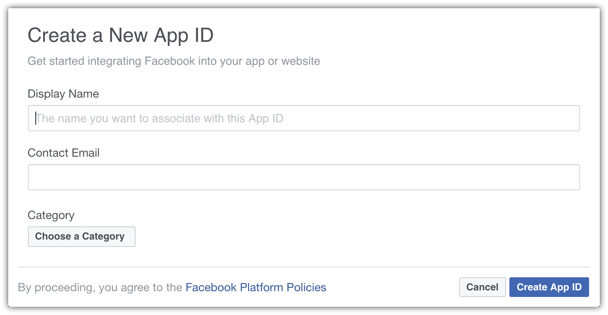
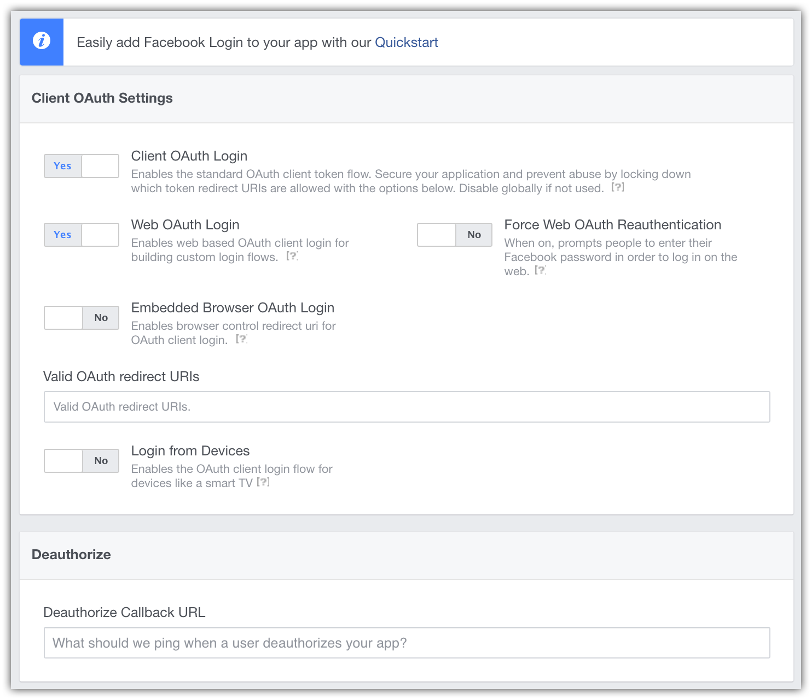
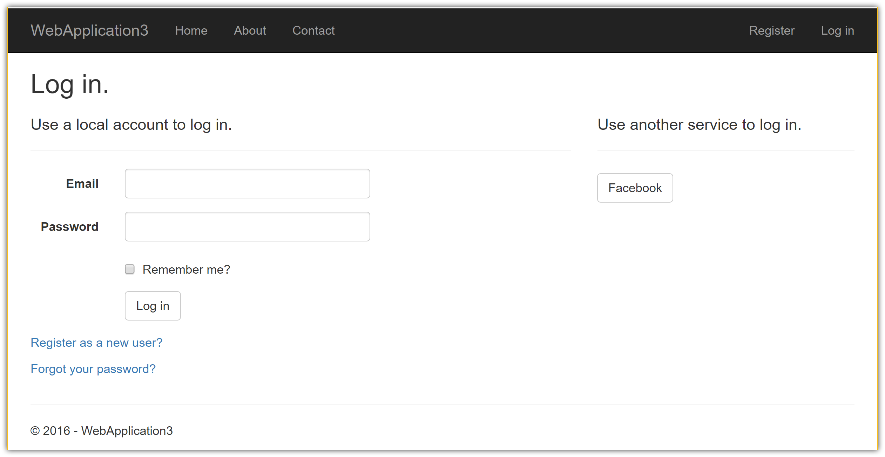

# Configuring Facebook authentication

<a name=security-authentication-facebook-logins></a>

By [Rick Anderson](https://twitter.com/RickAndMSFT), [Pranav Rastogi](https://github.com/rustd) and [Valeriy Novytskyy](https://github.com/01binary)

This tutorial shows you how to enable your users to sign in with their Facebook account using a sample ASP.NET Core project created on the [previous page](sociallogins.md). We start by creating a Facebook AppId by following the [official steps](https://developers.facebook.com/docs/apps/register).

## Creating the app in Facebook

*  Navigate to [https://developers.facebook.com/apps](https://developers.facebook.com/apps) and sign in. If you don't already have a Facebook account, use the **sign up** link on the login page to create one.

* Tap **My Apps** in the upper right corner:


* Tap **+ Add a New App** and fill out the form to create a new app ID:



* The **Product Setup** page is displayed, letting you select the features for your new app. Tap **Get Started** on **Facebook Login**:


* You are presented with the **Client OAuth Settings** page, with some defaults already set:



* Enter your base URI with *signin-facebook* appended into the **Valid OAuth Redirect URIs** field. For example, `https://localhost:44320/signin-facebook`.

  When deploying the site you'll need to register a new public url.

> [!NOTE]
> You don't need to configure **signin-facebook** as a route in your app. The Facebook middleware will automatically intercept requests at this route and handle them to implement the OAuth flow.

* Make a note of your `App ID` and your `App Secret` before dismissing this page so that you can add both into your ASP.NET Core app later in this tutorial.

* Tap **Save Changes** to complete the new application configuration.

## Storing Facebook AppId and AppSecret

Link sensitive settings like Facebook `App ID` and `App Secret` to your application configuration by using the [Secret Manager tool](../app-secrets.md) instead of storing them in your configuration file directly, as described in the [social login overview page](sociallogins.md). Execute the following commands in your project working directory:

* Set the Facebook AppId

  <!-- literal_block {"ids": [], "xml:space": "preserve"} -->

  ````
  dotnet user-secrets set Authentication:Facebook:AppId <app-Id>
     ````

* Set the Facebook AppSecret

  <!-- literal_block {"ids": [], "xml:space": "preserve"} -->

  ````
  dotnet user-secrets set Authentication:Facebook:AppSecret <app-secret>
     ````

The following code reads the configuration values stored by the [Secret Manager](../app-secrets.md#security-app-secrets):

[!code-csharp[Main](../../common/samples/WebApplication1/Startup.cs?highlight=11&range=20-36)]

## Enable Facebook middleware

> [!NOTE]
> You will need to use NuGet to install the [Microsoft.AspNetCore.Authentication.Facebook](https://www.nuget.org/packages/Microsoft.AspNetCore.Authentication.Facebook) package if it hasn't already been installed. Alternatively, execute the following commands in your project directory:
>
> `dotnet install Microsoft.AspNetCore.Authentication.Facebook`

Add the Facebook middleware in the `Configure` method in `Startup.cs`:

````csharp
app.UseFacebookAuthentication(new FacebookOptions()
{
    AppId = Configuration["Authentication:Facebook:AppId"],
    AppSecret = Configuration["Authentication:Facebook:AppSecret"]
});
````

## Sign in with Facebook

Run your application and click **Log in**. You will see an option to sign in with Facebook.



When you click on Facebook, you will be redirected to Facebook for authentication.


Once you enter your Facebook credentials, then you will be redirected back to the web site where you can set your email.

You are now logged in using your Facebook credentials:


## Next steps

* This article showed how you can authenticate with Facebook. You can follow a similar approach to authenticate with other providers listed on the [previous page](sociallogins.md).

* Once you publish your web site to Azure web app, you should reset the `AppSecret` in the Facebook developer portal.

* Set the `Authentication:Facebook:AppId` and `Authentication:Facebook:AppSecret` as application settings in the Azure portal. The configuration system is setup to read keys from environment variables.