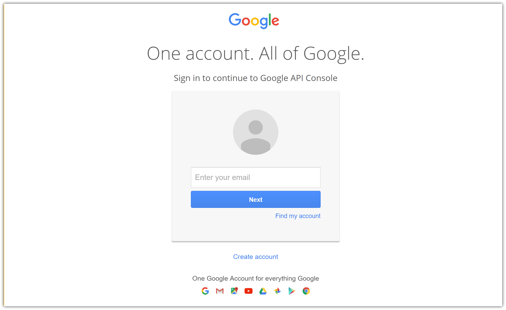
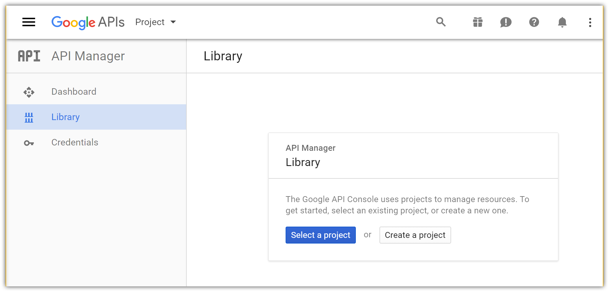
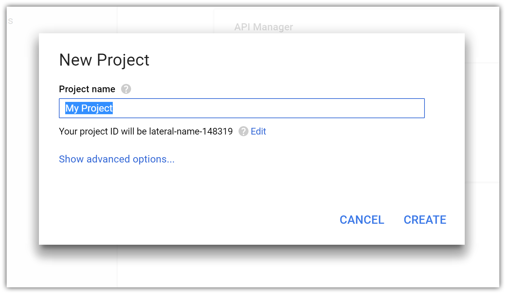
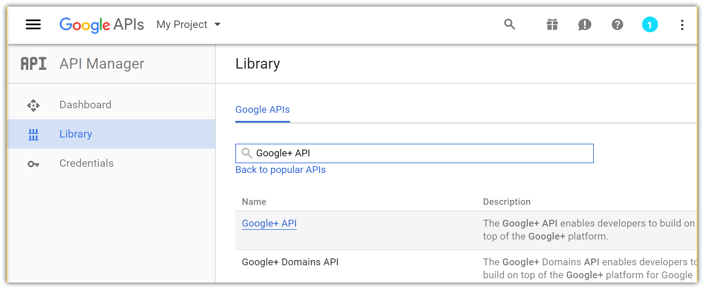
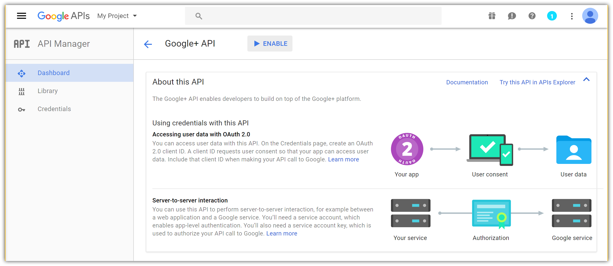
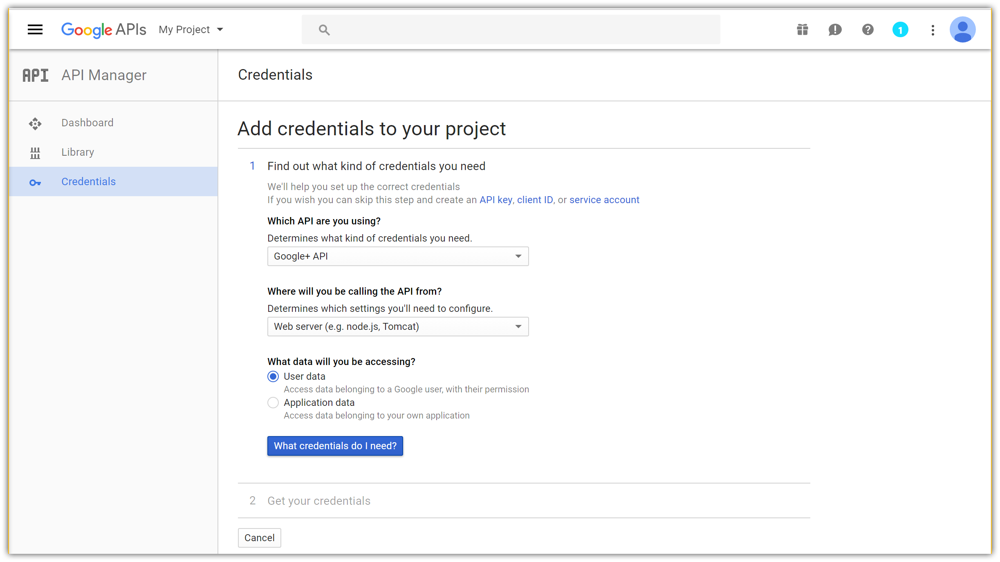
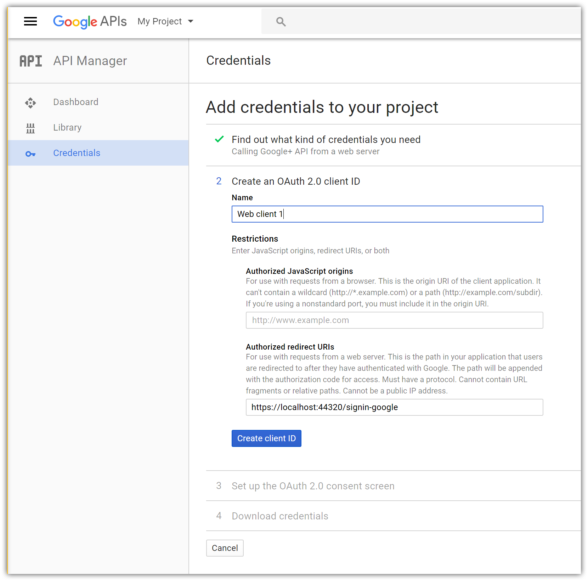
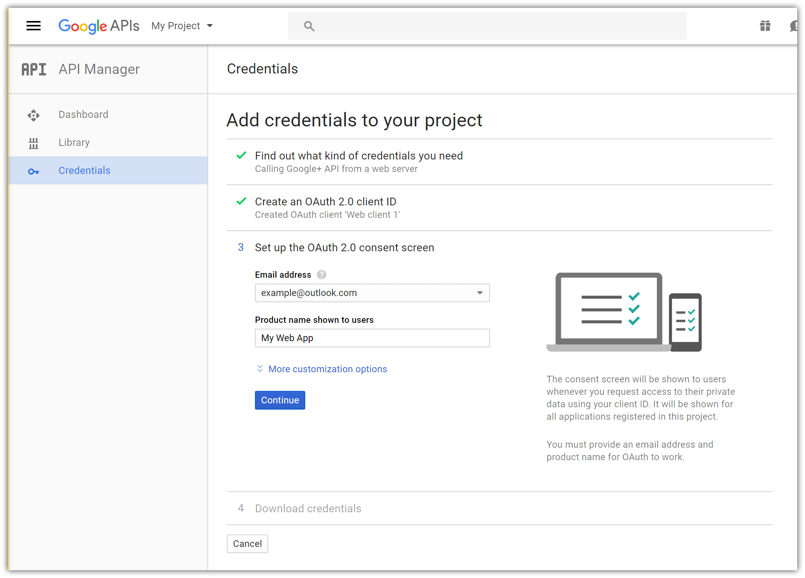
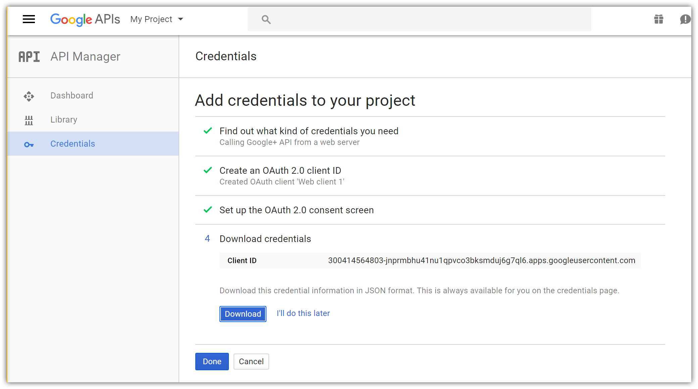

# Configuring Google authentication

<a name=security-authentication-google-logins></a>

This tutorial shows you how to enable your users to sign in with their Google+ account using a sample ASP.NET Core project created in the [previous section](sociallogins.md). We start by following the [official steps](https://developers.google.com/identity/sign-in/web/devconsole-project) to create a new app in Google API Console.

## Creating the app in Google API Console

* Navigate to [https://console.developers.google.com/projectselector/apis/library](https://console.developers.google.com/projectselector/apis/library) and sign in. If you don't already have a Google account, use the **[Create account](https://accounts.google.com/SignUpWithoutGmail?service=cloudconsole&continue=https%3A%2F%2Fconsole.developers.google.com%2Fprojectselector%2Fapis%2Flibrary&ltmpl=api)** link to create one:



* You are redirected to API Manager Library page:



* Tap **Create a project** and enter your application name:



* After accepting the dialog, you are redirected back to the Library page allowing you to choose features for your new app. <a name="enable-googleplus">Find **Google+ API** in the list</a> and click on its link to add the API feature:



* The page for the newly added API is displayed. Tap **Enable** to add Google+ sign in feature to your app:



* After enabling the API, tap **Go to Credentials** to configure the secrets:


* Choose:
   * **Google+ API**
   * **Web server (e.g. node.js, Tomcat)**, and
   * **User data**:



* Tap **What credentials do I need?** which takes you to the second step of app configuration:



* Because we are creating a Google+ project with just one feature (sign in), we can enter the same **Name** for the OAuth 2.0 client ID as the one we used for the project.

* Enter your current site URL with *signin-google* appended into the **Authorized redirect URIs** field. For example, `https://localhost:44320/signin-google`.

  When deploying the site you'll need to register a new public url.

> [!NOTE]
> You don't need to configure **signin-google** as a route in your app. The Google middleware automatically intercepts requests at this route and handles them to implement the OAuth flow.

* Tap **Create client ID**, which takes you to the third step:



* Enter your public facing **Email address** and the **Product name** shown for your app when Google+ prompts the user to sign in.

* Tap **Continue** to proceed to the last step:



* Tap **Download** to save a JSON file with application secrets, and **Done** to complete creation of the new app.

## Storing Google ClientID and ClientSecret

Link sensitive settings like Google `ClientID` and `ClientSecret` to your application configuration by using the [Secret Manager tool](../app-secrets.md) instead of storing them in your configuration file directly, as described in the [social login overview page](sociallogins.md).

* Open the JSON file downloaded in the last step. Note the `client_id` and `client_secret` values present in the JSON structure.

* Execute the following commands in your project working directory to store the Google secrets:

  <!-- literal_block {"ids": [], "xml:space": "preserve"} -->

  ````
  dotnet user-secrets set Authentication:Google:ClientID <client_id>
  dotnet user-secrets set Authentication:Google:ClientSecret <client-secret>
     ````

The following code reads the configuration values stored by the [Secret Manager](../app-secrets.md#security-app-secrets):

[!code-csharp[Main](../../common/samples/WebApplication1/Startup.cs?highlight=11&range=20-36)]

## Enable Google middleware

> [!NOTE]
> Use NuGet to install the [Microsoft.AspNetCore.Authentication.Google](https://www.nuget.org/packages/Microsoft.AspNetCore.Authentication.Google) package if it hasn't already been installed. Alternatively, execute the following commands in your project directory:
>
> `dotnet install Microsoft.AspNetCore.Authentication.Google`

Add the Google middleware in the `Configure` method in `Startup.cs`:

````csharp
app.UseGoogleAuthentication(new GoogleOptions()
{
    ClientId = Configuration["Authentication:Google:ClientId"],
    ClientSecret = Configuration["Authentication:Google:ClientSecret"]
});
````

## Login with Google

Run your application and click **Log in**. An option to sign in with Google appears:


When you click on Google, you are redirected to Google for authentication:


After entering your Google credentials, then you are redirected back to the Web site where you can set your email.

You are now logged in using your Google credentials:


> [!NOTE]
> If instead you receive a `403 (Forbidden)` error page from your own app when running in development mode (or break into the debugger with the same error), ensure that **Google+ API** has been enabled in the **API Manager Library** by following the steps listed [earlier in this section](#enable-googleplus). If the sign in doesn't work and you aren't getting any errors, switch to development mode to make the issue easier to debug.

## Next steps

* This article showed how you can authenticate with Google. You can follow a similar approach to authenticate with other providers listed in the [previous section](sociallogins.md).

* Once you publish your Web site to Azure Web App, you should reset the `ClientSecret` in the Google API Console.

* Set the `Authentication:Google:ClientId` and `Authentication:Google:ClientSecret` as application setting in the Azure Web App portal. The configuration system is setup to read keys from environment variables.