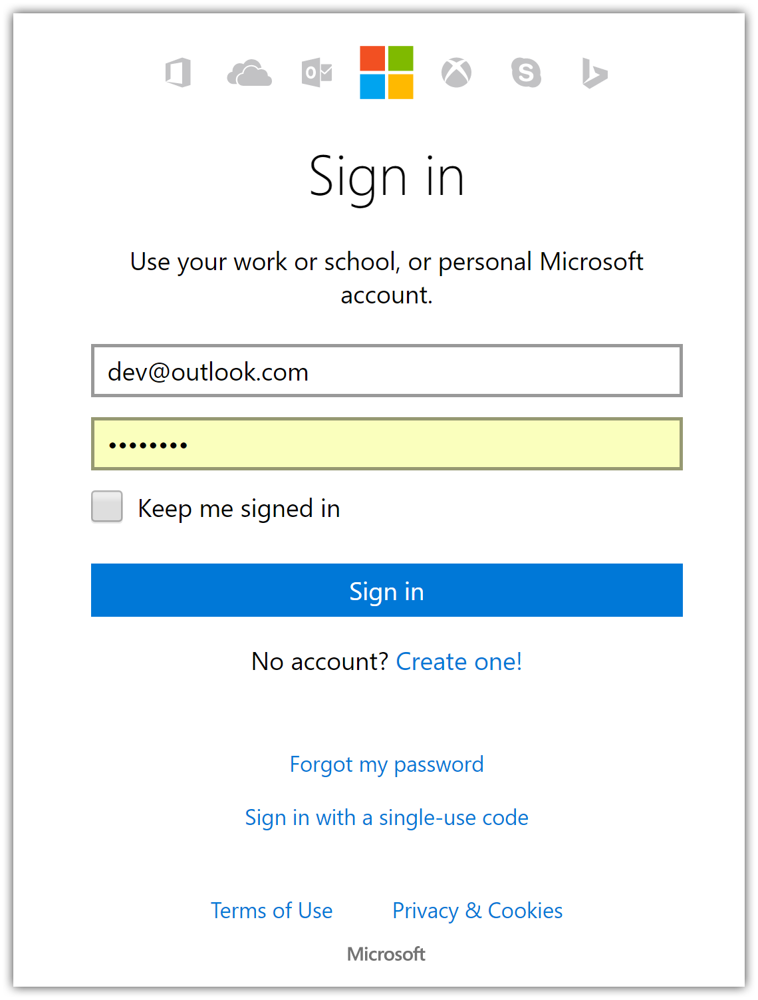
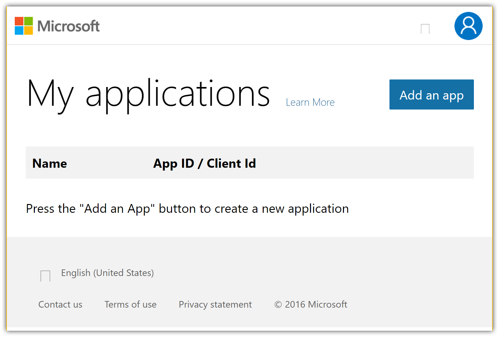
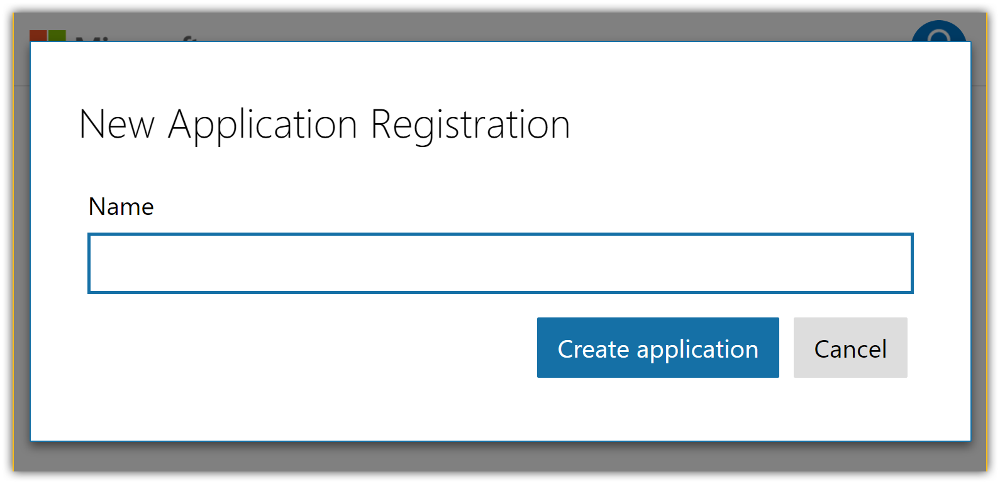
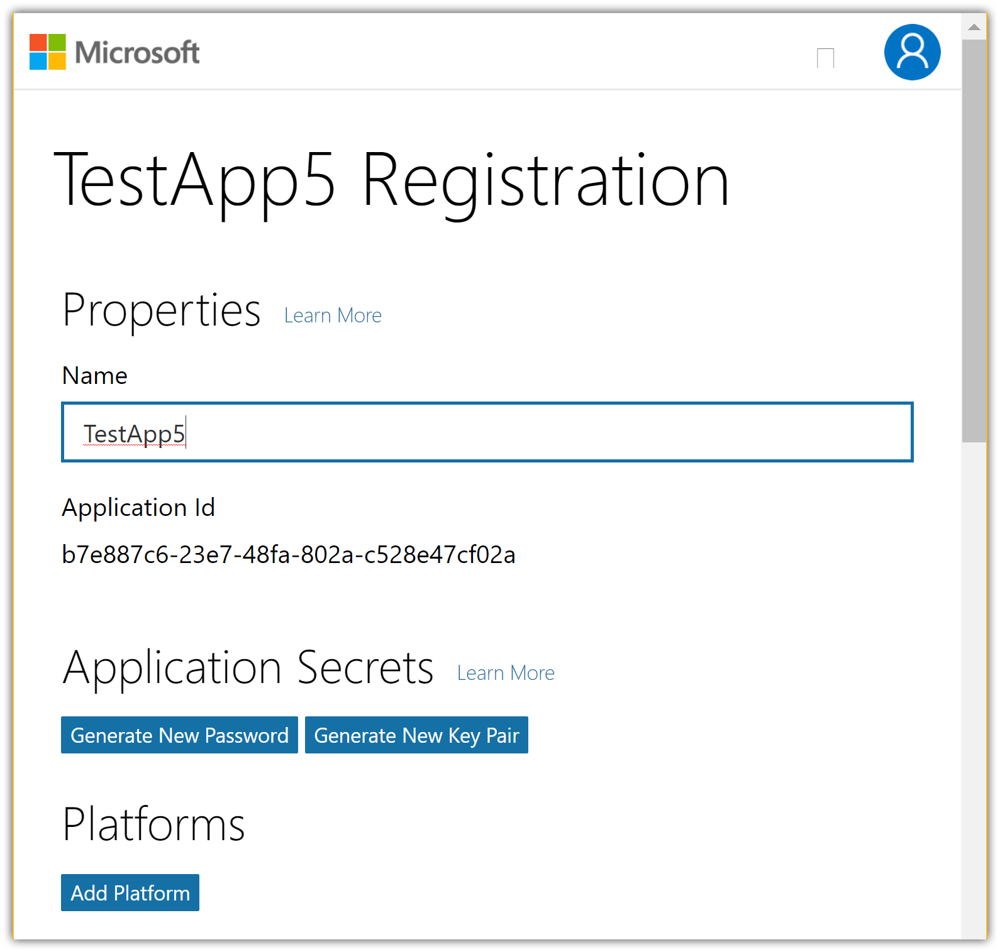
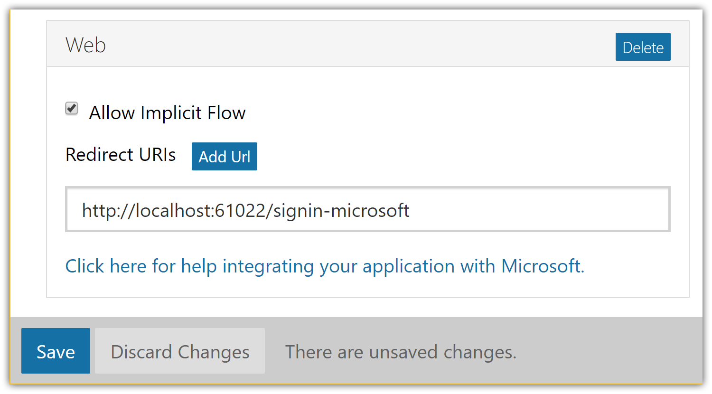
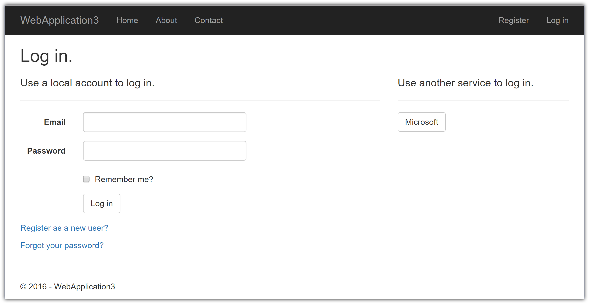
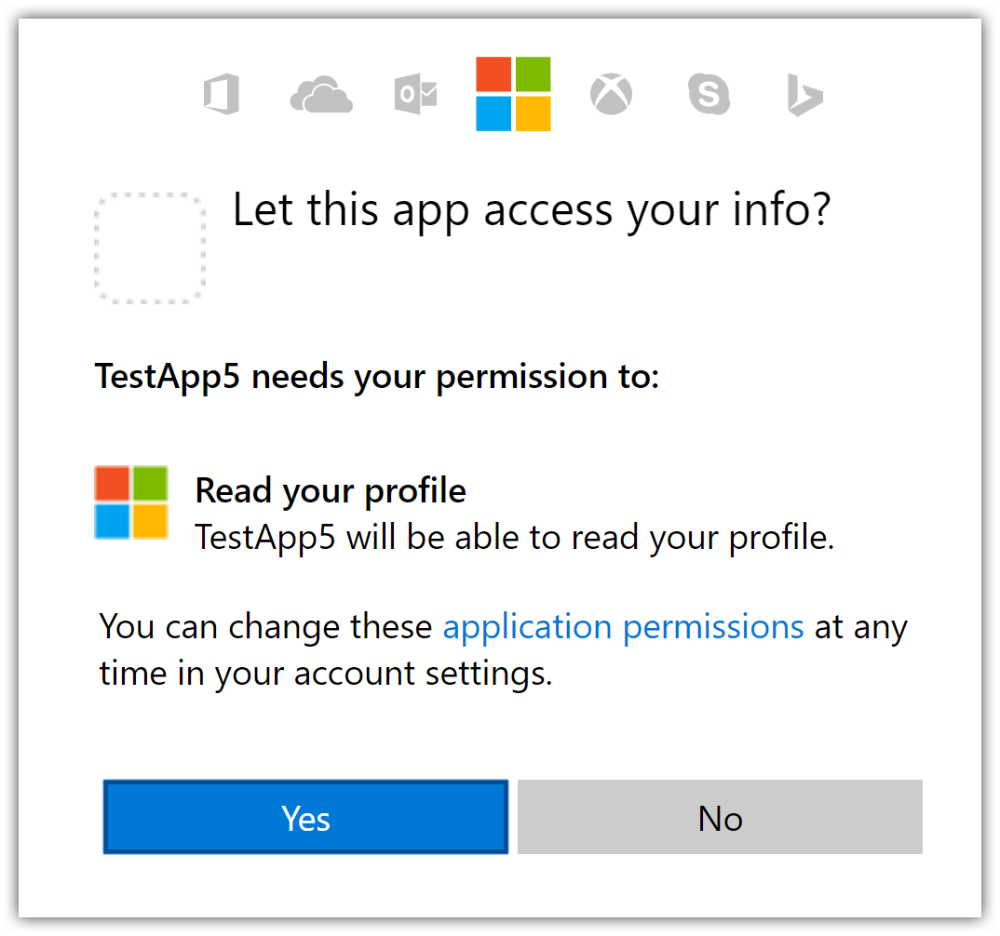
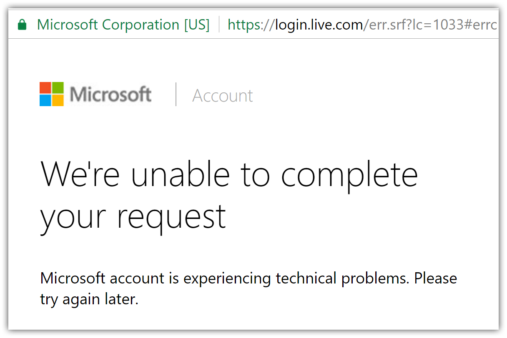

# Configuring Microsoft Account authentication

<a name=security-authentication-microsoft-logins></a>

By [Rick Anderson](https://twitter.com/RickAndMSFT), [Pranav Rastogi](https://github.com/rustd), and [Valeriy Novytskyy](https://github.com/01binary)

This tutorial shows you how to enable your users to sign in with their Microsoft account using a sample ASP.NET Core project created on the [previous page](sociallogins.md).

## Creating the app in Microsoft Developer Portal

* Navigate to [https://apps.dev.microsoft.com](https://apps.dev.microsoft.com):


* Tap **sign in**:



If you don't already have a Microsoft account, tap **[Create one!](https://signup.live.com/signup?wa=wsignin1.0&rpsnv=13&ct=1478151035&rver=6.7.6643.0&wp=SAPI_LONG&wreply=https%3a%2f%2fapps.dev.microsoft.com%2fLoginPostBack&id=293053&aadredir=1&contextid=D70D4F21246BAB50&bk=1478151036&uiflavor=web&uaid=f0c3de863a914c358b8dc01b1ff49e85&mkt=EN-US&lc=1033&lic=1)**. After signing in you are redirected to **My applications** page:



* Tap **Add an app** in the upper right corner and enter your **application name**:



* The **Registration** page is displayed:



* Tap **Add Platform** in the **Platforms** section and select the **Web** platform:


* In the new **Web** platform section, enter your current site URL with *signin-microsoft* appended into the **Redirect URIs** field. For example, `https://localhost:44320/signin-microsoft`:


  
  > [!NOTE]
  > When deploying the site you'll need to register a new public url.

  > [!NOTE]
  > You don't need to configure **signin-microsoft** as a route in your app. The Microsoft Account middleware automatically intercepts requests at this route and handles them to implement the OAuth flow.

* Don't forget to tap **Add Url** to ensure the Url was added.

* Tap **Save** to save changes.

## Storing Microsoft ApplicationId and Secret

Link sensitive settings like Microsoft `ApplicationId` and `Secret` to your application configuration by using the [Secret Manager tool](../app-secrets.md) instead of storing them in your configuration file directly, as described in the [social login overview page](sociallogins.md).

* Note the `Application Id` displayed on the **Registration** page.

* Tap **Generate New Password** in the **Application Secrets** section. This displays a box where you can copy the application secret:


* Execute the following commands in your project working directory to store the Microsoft secrets:

  <!-- literal_block {"ids": [], "xml:space": "preserve"} -->

  ```
  dotnet user-secrets set Authentication:Microsoft:ClientId <client-id>
  dotnet user-secrets set Authentication:Microsoft:ClientSecret <client-secret>
     ```

The following code reads the configuration values stored by the [Secret Manager](../app-secrets.md#security-app-secrets):

[!code-csharp[Main](../../common/samples/WebApplication1/Startup.cs?highlight=11&range=20-36)]

## Enable Microsoft Account middleware

> [!NOTE]
> Use NuGet to install the [Microsoft.AspNetCore.Authentication.Microsoft](https://www.nuget.org/packages/Microsoft.AspNetCore.Authentication.MicrosoftAccount) package if it hasn't already been installed. Alternatively, execute the following commands in your project directory:
>
> `dotnet install Microsoft.AspNetCore.Authentication.Microsoft`

Add the Microsoft Account middleware in the `Configure` method in `Startup.cs`:

```csharp
app.UseMicrosoftAccountAuthentication(new MicrosoftAccountOptions()
{
    ClientId = Configuration["Authentication:Microsoft:ClientId"],
    ClientSecret = Configuration["Authentication:Microsoft:ClientSecret"]
});
```

## Sign in with Microsoft Account

Run your application and click **Log in**. An option to sign in with Microsoft appears:



When you click on Microsoft, you are redirected to Microsoft for authentication:



After entering your Microsoft Account credentials, you are redirected back to the web site where you can set your email.

You are now logged in using your Microsoft credentials:


> [!NOTE]
> If the Microsoft Account provider redirects you to a sign in error page, note the error title and description directly following the `#` (hashtag) in the Uri. The most common cause is your application Uri not matching any of the **Redirect URIs** specified for the **Web** platform. In this case, ensure protocol, host, and port are all correct. Your application should be using `https` protocol and the redirect uri should end with **signin-microsoft** as that's the route Microsoft Account middleware requests the login provider to redirect to.



## Next steps

* This article showed how you can authenticate with Microsoft. You can follow a similar approach to authenticate with other providers listed on the [previous page](sociallogins.md).

* Once you publish your web site to Azure web app, you should reset the `Secret` in the Microsoft developer portal.

* Set the `Authentication:Microsoft:ClientId` and `Authentication:Microsoft:ClientSecret` as application settings in the Azure portal. The configuration system is set up to read keys from environment variables.
