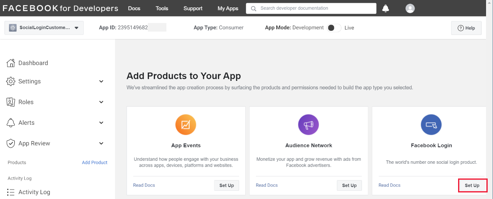
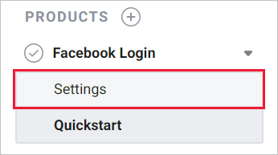
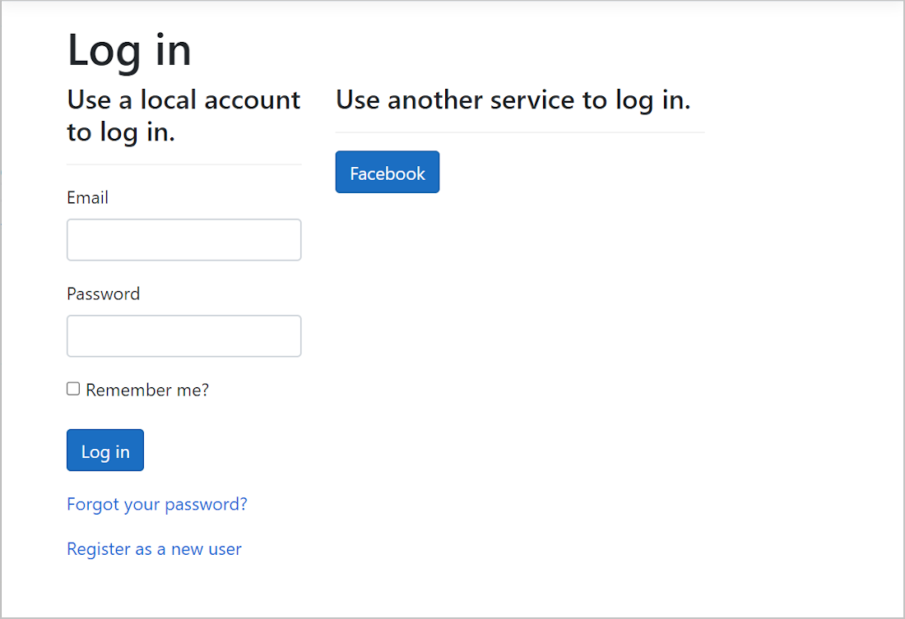
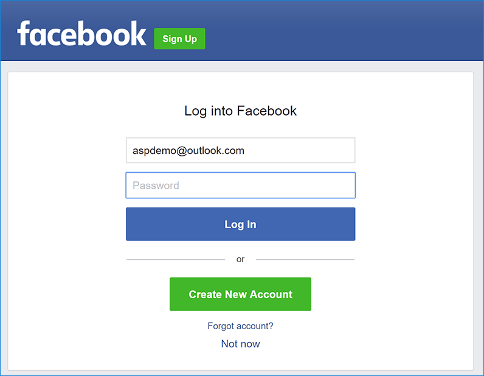
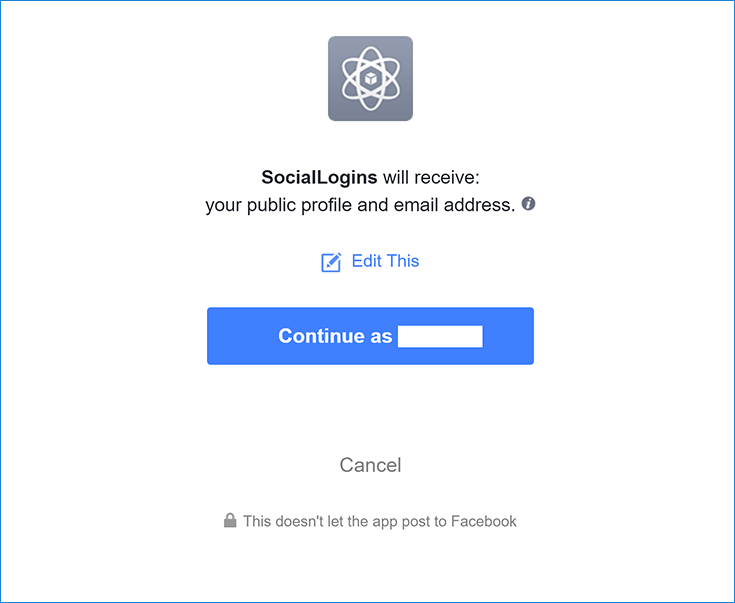

# Configuring Facebook authentication

By [Valeriy Novytskyy](https://github.com/01binary) and [Rick Anderson](https://twitter.com/RickAndMSFT)

This tutorial shows you how to enable your users to sign in with their Facebook account using a sample ASP.NET Core 2.0 project created on the [previous page](index.md). We start by creating a Facebook App ID by following the [official steps](https://developers.facebook.com).

## Create the app in Facebook

*  Navigate to the [Facebook for Developers](https://developers.facebook.com) page and sign in. If you don't already have a Facebook account, use the **Sign up for Facebook** link on the login page to create one.

* Tap the **Create App** button in the upper right corner to create a new App ID.

   

* Fill out the form and tap the **Create App ID** button.

   

* When presented with **Select a product** prompt, Click **Set Up** on the **Facebook Login** card.

   

* The **Quickstart** wizard will launch with **Choose a Platform** as the first page. Bypass the wizard for now by clicking the **Settings** link in the menu on the left:

   

* You are presented with the **Client OAuth Settings** page:


* Enter your development URI with */signin-facebook* appended into the **Valid OAuth Redirect URIs** field (for example: `https://localhost:44320/signin-facebook`). The Facebook authentication configured later in this tutorial will automatically handle requests at */signin-facebook* route to implement the OAuth flow.

* Click **Save Changes**.

* Click the **Dashboard** link in the left navigation. 

    On this page, make a note of your `App ID` and your `App Secret`. You will add both into your ASP.NET Core application in the next section:

   

* When deploying the site you need to revisit the **Facebook Login** setup page and register a new public URI.

## Store Facebook App ID and App Secret

Link sensitive settings like Facebook `App ID` and `App Secret` to your application configuration using the [Secret Manager](xref:security/app-secrets). For the purposes of this tutorial, name the tokens `Authentication:Facebook:AppId` and `Authentication:Facebook:AppSecret`.

Execute the following commands to securely store `App ID` and `App Secret` using Secret Manager:

```console
dotnet user-secrets set Authentication:Facebook:AppId <app-id>
dotnet user-secrets set Authentication:Facebook:AppSecret <app-secret>
```

## Configure Facebook Authentication

The project template used in this tutorial ensures that [Microsoft.AspNetCore.Authentication.Facebook](https://www.nuget.org/packages/Microsoft.AspNetCore.Authentication.Facebook) package is already installed.

* To install this package with Visual Studio 2017, right-click on the project and select **Manage NuGet Packages**.
* To install with .NET Core CLI, execute the following in your project directory:

   `dotnet add package Microsoft.AspNetCore.Authentication.Facebook`

# [ASP.NET Core 2.x](#tab/aspnetcore2x)

Add the Facebook service in the `ConfigureServices` method in the *Startup.cs* file:

```csharp
services.AddIdentity<ApplicationUser, IdentityRole>()
        .AddEntityFrameworkStores<ApplicationDbContext>()
        .AddDefaultTokenProviders();

services.AddAuthentication().AddFacebook(facebookOptions =>
{
    facebookOptions.AppId = Configuration["Authentication:Facebook:AppId"];
    facebookOptions.AppSecret = Configuration["Authentication:Facebook:AppSecret"];
});
```

[!INCLUDE[default settings configuration](includes/default-settings.md)]

# [ASP.NET Core 1.x](#tab/aspnetcore1x)

Add the Facebook middleware in the `Configure` method in *Startup.cs* file:

```csharp
app.UseFacebookAuthentication(new FacebookOptions()
{
    AppId = Configuration["Authentication:Facebook:AppId"],
    AppSecret = Configuration["Authentication:Facebook:AppSecret"]
});
```

---

See the [FacebookOptions](https://docs.microsoft.com/aspnet/core/api/microsoft.aspnetcore.builder.facebookoptions) API reference for more information on configuration options supported by Facebook authentication. Configuration options can be used to:

* Request different information about the user.
* Add query string arguments to customize the login experience.

## Sign in with Facebook

Run your application and click **Log in**. You see an option to sign in with Facebook.



When you click on **Facebook**, you are redirected to Facebook for authentication:



Facebook authentication requests public profile and email address by default:



Once you enter your Facebook credentials you are redirected back to your site where you can set your email.

You are now logged in using your Facebook credentials:


## Troubleshooting

* **ASP.NET Core 2.x only:** If Identity is not configured by calling `services.AddIdentity` in `ConfigureServices`, attempting to authenticate will result in *ArgumentException: The 'SignInScheme' option must be provided*. The project template used in this tutorial ensures that this is done.
* If the site database has not been created by applying the initial migration, you get *A database operation failed while processing the request* error. Tap **Apply Migrations** to create the database and refresh to continue past the error.

## Next steps

* This article showed how you can authenticate with Facebook. You can follow a similar approach to authenticate with other providers listed on the [previous page](index.md).

* Once you publish your web site to Azure web app, you should reset the `AppSecret` in the Facebook developer portal.

* Set the `Authentication:Facebook:AppId` and `Authentication:Facebook:AppSecret` as application settings in the Azure portal. The configuration system is set up to read keys from environment variables.
