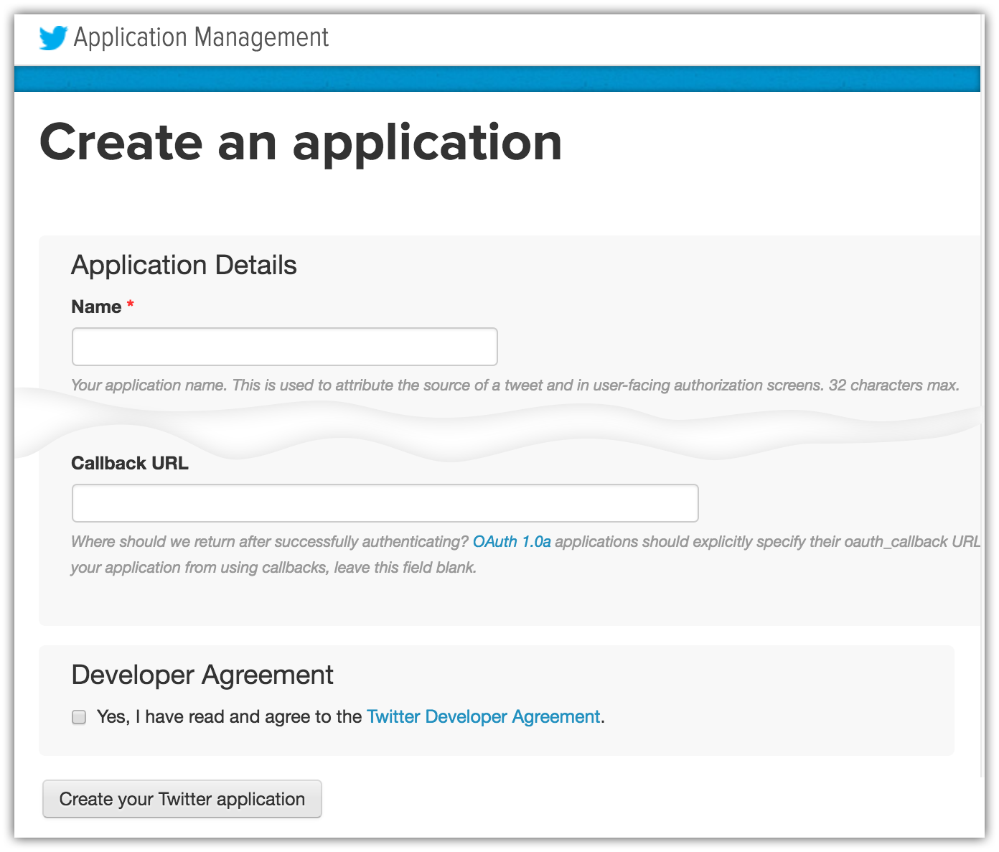
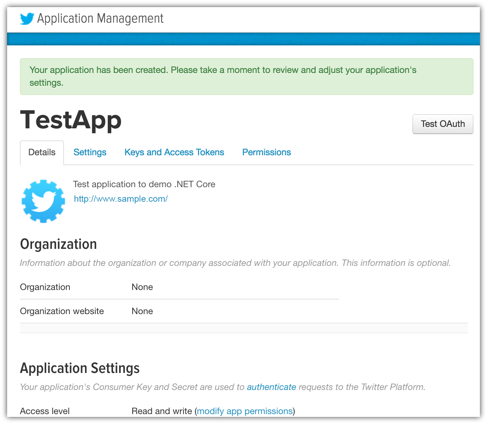
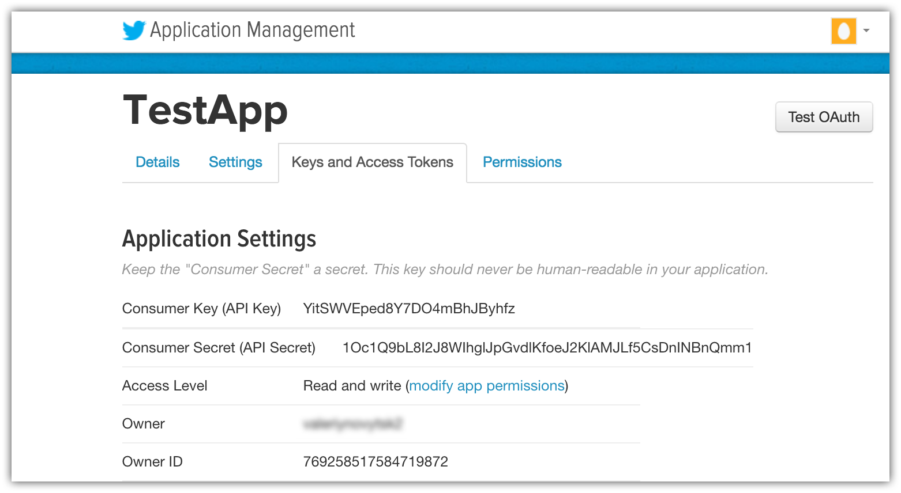

# Configuring Twitter authentication

<a name=security-authentication-twitter-logins></a>

This tutorial shows you how to enable your users to [log in with their Twitter account](https://dev.twitter.com/web/sign-in/desktop-browser) using a sample ASP.NET Core project created in the [previous section](sociallogins.md).

## Creating the app in Twitter

* Navigate to [https://apps.twitter.com/](https://apps.twitter.com/) and sign in. If you don't already have a Twitter account, use the *[Sign up now](https://twitter.com/signup)* link to create one. After signing in you will be redirected to the *Application Management* page:


* Tap **Create New App** in the upper right corner and fill out the *application name*, *description*, and the expected *website* address after deployment:



* Enter your current site URL with *signin-twitter* appended into the **Callback URL** field. For example, https://localhost:44320/**signin-twitter**.

> [!NOTE]
> You don't need to configure **signin-twitter** as a route in your app. The ASP.NET Core team's implementation of the OAuth flow will create a temporary socket (called a *backchannel*) that listens at this route just for the duration of the OAuth flow.

* Tap **Create your Twitter application**. New application details will be displayed:



## Storing Twitter ConsumerKey and ConsumerSecret

Link sensitive settings like Twitter *ConsumerKey* and *ConsumerSecret* to your application configuration by using the [Secret Manager tool](../app-secrets.md) instead of storing them in your configuration file directly, as described in the [previous section](sociallogins.md).

* Switch to the **Keys and Access Tokens** tab. Note the *Consumer Key* and *Consumer Secret*:



* Execute the following in your project working directory to store the Twitter secrets:

  <!-- literal_block {"ids": [], "xml:space": "preserve"} -->

  ````
  dotnet user-secrets set Authentication:Twitter:ConsumerKey <consumer-key>
  dotnet user-secrets set Authentication:Twitter:ConsumerSecret <consumer-secret>
     ````

The following code reads the configuration values stored by the [Secret Manager](../app-secrets.md#security-app-secrets):

[!code-csharp[Main](../../common/samples/WebApplication1/src/WebApplication1/Startup.cs?highlight=11&range=20-36)]

## Enable Twitter middleware

> [!NOTE]
> You will need to use NuGet to install the [Microsoft.AspNetCore.Authentication.Twitter](https://www.nuget.org/packages/Microsoft.AspNetCore.Authentication.Twitter/1.1.0-preview1-final) package if it hasn't already been installed. Alternatively, execute the following in your project directory:
>
> `dotnet install Microsoft.AspNetCore.Authentication.Twitter`

Add the Twitter middleware in the `Configure` method in `Startup`:

[!code-csharp[Main](./sociallogins/sample/Startup.cs?highlight=90,91,92,93,94&range=64-114)]

## Login with Twitter

Run your application and click Login. You will see an option for Twitter:


When you click on Twitter, you will be redirected to Twitter for authentication:


Once you enter your Twitter credentials, then you will be redirected back to the Web site where you can set your email.

You are now logged in using your Twitter credentials:


## Optionally set password

When you register with an external login provider, you do not have a password registered with the app. This alleviates you from creating and remembering a password for the site, but it also makes you dependent on the external login provider. If the external login provider is unavailable, you won't be able to log in to the web site.

To create a password and login using your email that you set during the login process with external providers:

* Tap the **Hello <email alias>** link at the top right corner to navigate to the **Manage** view.


* Tap **Create**


* Set a valid password and you can use this to login with your email

## Next steps

* This article showed how you can authenticate with Twitter. You can follow a similar approach to authenticate with [Facebook](facebook-logins.md), [Microsoft Account](microsoft-logins.md), [Google](google-logins.md) and other providers.

* Once you publish your Web site to Azure Web App, you should reset the *ConsumerSecret* in the Twitter developer portal.

* Set the *Authentication:Twitter:ConsumerKey* and Authentication:Twitter:ConsumerSecret as application setting in the Azure Web App portal. The configuration system is setup to read keys from environment variables.