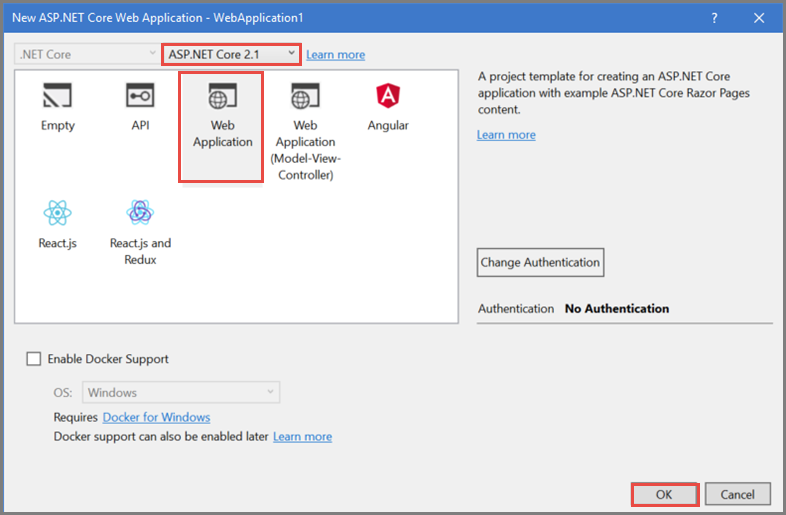

# Get started with SignalR on ASP.NET Core

By [Rachel Appel](https://twitter.com/rachelappel)

This tutorial teaches the basics of building a real-time app using SignalR for ASP.NET Core.

   

This tutorial demonstrates the following SignalR development tasks:

> [!div class="checklist"]
> * Create a SignalR on ASP.NET Core web app.
> * Create a SignalR hub to push content to clients.
> * Modify the `Startup` class and configure the app.

[View or download sample code](https://github.com/aspnet/Docs/tree/master/aspnetcore/signalr/get-started/sample/) ([how to download](xref:tutorials/index#how-to-download-a-sample))

# Prerequisites

Install the following software:

# [Visual Studio](#tab/visual-studio)

* [.NET Core SDK 2.1 or later](https://www.microsoft.com/net/download/all)
* [Visual Studio 2017](https://www.visualstudio.com/downloads/) version 15.7 or later with the **ASP.NET and web development** workload
* [npm](https://www.npmjs.com/get-npm)

# [Visual Studio Code](#tab/visual-studio-code)

* [.NET Core SDK 2.1 or later](https://www.microsoft.com/net/download/all)
* [Visual Studio Code](https://code.visualstudio.com/download)
* [C# for Visual Studio Code](https://marketplace.visualstudio.com/items?itemName=ms-vscode.csharp)
* [npm](https://www.npmjs.com/get-npm)

-----

## Create an ASP.NET Core project that hosts SignalR client and server

# [Visual Studio](#tab/visual-studio/)

1. Use the **File** > **New Project** menu option and choose **ASP.NET Core Web Application**. Name the project *SignalRChat*.

   

2. Select **Web Application** to create a project using Razor Pages. Then select **OK**. Be sure that **ASP.NET Core 2.1** is selected from the framework selector, though SignalR runs on older versions of .NET.

   

Visual Studio includes the `Microsoft.AspNetCore.SignalR` package containing its server libraries as part of its **ASP.NET Core Web Application** template. However, the JavaScript client library for SignalR must be installed using *npm*.

3. Run the following commands in the **Package Manager Console** window, from the project root:

    ```console
    npm init -y
    npm install @aspnet/signalr
    ```     

4. Copy the *signalr.js* file from *node_modules\\@aspnet\signalr\dist\browser* to the *lib* folder in your project.

# [Visual Studio Code](#tab/visual-studio-code/)

1. From the **Integrated Terminal**, run the following command:

    ```console
    dotnet new webapp -o SignalRChat
    ```

2. Install the JavaScript client library using *npm*.

    ```console
    npm init -y
    npm install @aspnet/signalr
    ```

3. Copy the *signalr.js* file from *node_modules\\@aspnet\signalr\dist\browser* to the *lib* folder in your project.

-----

## Create the SignalR Hub

A hub is a class that serves as a high-level pipeline that allows the client and server to call methods on each other.

# [Visual Studio](#tab/visual-studio/)

1. Add a class to the project by choosing **File** > **New** > **File** and selecting **Visual C# Class**. Name the file *ChatHub*. 

2. Inherit from `Microsoft.AspNetCore.SignalR.Hub`. The `Hub` class contains properties and events for managing connections and groups, as well as sending and receiving data.

3. Create the `SendMessage` method that sends a message to all connected chat clients. Notice it returns a [Task](https://msdn.microsoft.com/library/system.threading.tasks.task(v=vs.110).aspx), because SignalR is asynchronous. Asynchronous code scales better.

   [!code-csharp[Startup](get-started/sample/Hubs/ChatHub.cs)]

# [Visual Studio Code](#tab/visual-studio-code/)

1. Open the *SignalRChat* folder in Visual Studio Code.

2. Add a class to the project by selecting **File** > **New File** from the menu.

3. Inherit from `Microsoft.AspNetCore.SignalR.Hub`. The `Hub` class contains properties and events for managing connections and groups, as well as sending and receiving data to clients.

4. Add a `SendMessage` method to the class. The `SendMessage` method sends a message to all connected chat clients. Notice it returns a [Task](/dotnet/api/system.threading.tasks.task), because SignalR is asynchronous. Asynchronous code scales better.

   [!code-csharp[Startup](get-started/sample/Hubs/ChatHub.cs?range=6-12)]

-----

## Configure the project to use SignalR

The SignalR server must be configured so that it knows to pass requests to SignalR.

1. To configure a SignalR project, modify the project's `Startup.ConfigureServices` method.

   `services.AddSignalR` adds SignalR as part of the [middleware](xref:fundamentals/middleware/index) pipeline.

2. Configure routes to your hubs using `UseSignalR`.


   [!code-csharp[Startup](get-started/sample/Startup.cs?highlight=37,57-60)]


## Create the SignalR client code

1. Replace the content in *Pages\Index.cshtml* with the following code:

   [!code-cshtml[Index](get-started/sample/Pages/Index.cshtml)]

   The preceding HTML displays name and message fields, and a submit button. Notice the script references at the bottom: a reference to SignalR and *chat.js*.

2. Add a JavaScript file, named *chat.js*, to the *wwwroot\js* folder. Add the following code to it:

   [!code-javascript[Index](get-started/sample/wwwroot/js/chat.js)]

## Run the app

# [Visual Studio](#tab/visual-studio)

1. Select **Debug** > **Start without debugging** to launch a browser and load the website locally. Copy the URL from the address bar.

1. Open another browser instance (any browser) and paste the URL in the address bar.

1. Choose either browser, enter a name and message, and click the **Send** button. The name and message are displayed on both pages instantly.

# [Visual Studio Code](#tab/visual-studio-code)

1. Press **Debug** (F5) to build and run the program. Running the program opens a browser window.

1. Open another browser window and load the website locally in it.

1. Choose either browser, enter a name and message, and click the **Send** button. The name and message are displayed on both pages instantly.

---

  

## Related resources

[Introduction to ASP.NET Core SignalR](introduction.md)
