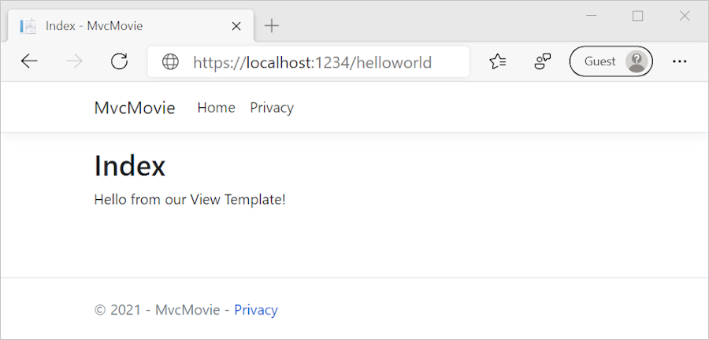
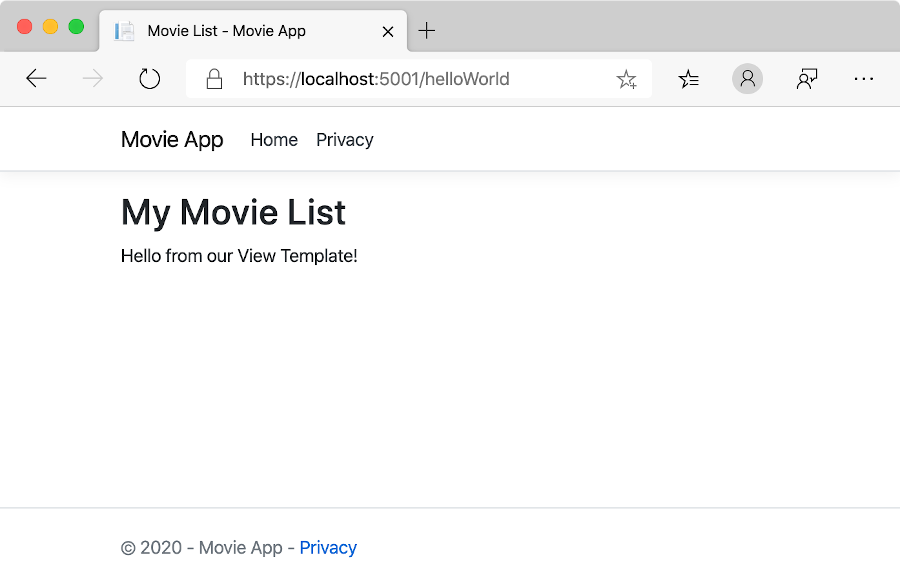

# Adding a view

By [Rick Anderson](https://twitter.com/RickAndMSFT)

In this section you're going to modify the `HelloWorldController` class to use Razor view template files to cleanly encapsulate the process of generating HTML responses to a client.

You'll create a view template file using Razor. Razor-based view templates have a *.cshtml* file extension. They provide an elegant way to create HTML output using C#.

Currently the `Index` method returns a string with a message that is hard-coded in the controller class. In the `HelloWorldController` class, replace the `Index` method with the following code:

[!code-csharp[Main](start-mvc/sample/MvcMovie/Controllers/HelloWorldController.cs?name=snippet_4)]

The `Index` method above returns a View object. It uses a view template to generate an HTML response to the browser. Controller methods (also known as action methods) such as the `Index` method above, generally return an `IActionResult` (or a class derived from `ActionResult`), not primitive types like string.

* Right click on the *Views* folder, and then **Add > New Folder** and name the folder *HelloWorld*.

* Right click on the *Views/HelloWorld* folder, and then **Add > New Item**.

* In the **Add New Item - MvcMovie** dialog

  * In the search box in the upper-right, enter *view*

  * Tap **MVC View Page**

  * In the **Name** box, change the name if necessary to *Index.cshtml*.

  * Tap **Add**


Replace the contents of the *Views/HelloWorld/Index.cshtml* Razor view file with the following:

[!code-HTML[Main](start-mvc/sample/MvcMovie/Views/HelloWorld/Index.cshtml)]

Navigate to `http://localhost:xxxx/HelloWorld`. The `Index` method in the `HelloWorldController` didn't do much work; it simply ran the statement `return View();`, which specified that the method should use a view template file to render a response to the browser. Because you didn't explicitly specify the name of the view template file to use, MVC defaulted to using the *Index.cshtml* view file in the */Views/HelloWorld* folder. The image below shows the string "Hello from our View Template!" hard-coded in the view.



If your browser window is small (for example on a mobile device), you might need to toggle (tap) the [Bootstrap navigation button](http://getbootstrap.com/components/#navbar) in the upper right to see the to the **Home**, **About**, and **Contact** links.


## Changing views and layout pages

Tap on the menu links (**MvcMovie**, **Home**, **About**). Each page shows the same menu layout. The menu layout is implemented in the *Views/Shared/_Layout.cshtml* file. Open the *Views/Shared/_Layout.cshtml* file.

[Layout](xref:mvc/views/layout) templates allow you to specify the HTML container layout of your site in one place and then apply it across multiple pages in your site. Find the `@RenderBody()` line. `RenderBody` is a placeholder where all the view-specific pages you create show up, *wrapped* in the layout page. For example, if you select the **About** link, the **Views/Home/About.cshtml** view is rendered inside the `RenderBody` method.

## Change the title and menu link in the layout file

Change the contents of the title element. Change the anchor text in the layout template to "Movie App" and the controller from `Home` to `Movies` as highlighted below:

[!code-html[Main](start-mvc/sample/MvcMovie/Views/Shared/_Layout.cshtml?highlight=7,31)]

>[!WARNING]
> We haven't implemented the `Movies` controller yet, so if you click on that link, you'll get a 404 (Not found) error.

Save your changes and tap the **About** link. Notice how the title on the browser tab now displays **About - Movie App** instead of **About - Mvc Movie**. Tap the **Contact** link and notice that it also displays **Movie App**. We were able to make the change once in the layout template and have all pages on the site reflect the new link text and new title.

Examine the *Views/_ViewStart.cshtml* file:


```HTML
@{
    Layout = "_Layout";
}
```

The *Views/_ViewStart.cshtml* file brings in the *Views/Shared/_Layout.cshtml* file to each view. You can use the `Layout` property to set a different layout view, or set it to `null` so no layout file will be used.

Change the title of the `Index` view.

Open *Views/HelloWorld/Index.cshtml*. There are two places to make a change:

   * The text that appears in the title of the browser.
   * The secondary header (`<h2>` element).

You'll make them slightly different so you can see which bit of code changes which part of the app.


```HTML
@{
    ViewData["Title"] = "Movie List";
}

<h2>My Movie List</h2>

<p>Hello from our View Template!</p>
```

`ViewData["Title"] = "Movie List";` in the code above sets the `Title` property of the `ViewData` dictionary to "Movie List". The `Title` property is used in the `<title>` HTML element in the layout page:


```HTML
<title>@ViewData["Title"] - Movie App</title>
   ```

Save your change and navigate to `http://localhost:xxxx/HelloWorld`. Notice that the browser title, the primary heading, and the secondary headings have changed. (If you don't see changes in the browser, you might be viewing cached content. Press Ctrl+F5 in your browser to force the response from the server to be loaded.) The browser title is created with `ViewData["Title"]` we set in the *Index.cshtml* view template and the additional "- Movie App" added in the layout file.

Also notice how the content in the *Index.cshtml* view template was merged with the *Views/Shared/_Layout.cshtml* view template and a single HTML response was sent to the browser. Layout templates make it really easy to make changes that apply across all of the pages in your application. To learn more see [Layout](../../mvc/views/layout.md).



Our little bit of "data" (in this case the "Hello from our View Template!" message) is hard-coded, though. The MVC application has a "V" (view) and you've got a "C" (controller), but no "M" (model) yet.

## Passing Data from the Controller to the View

Controller actions are invoked in response to an incoming URL request. A controller class is where you write the code that handles the incoming browser requests. The controller retrieves data from a data source and decides what type of response to send back to the browser. View templates can be used from a controller to generate and format an HTML response to the browser.

Controllers are responsible for providing the data required in order for a view template to render a response. A best practice: View templates should **not** perform business logic or interact with a database directly. Rather, a view template should work only with the data that's provided to it by the controller. Maintaining this "separation of concerns" helps keep your code clean, testable, and maintainable.

Currently, the `Welcome` method in the `HelloWorldController` class takes a `name` and a `ID` parameter and then outputs the values directly to the browser. Rather than have the controller render this response as a string, let’s change the controller to use a view template instead. The view template will generate a dynamic response, which means that you need to pass appropriate bits of data from the controller to the view in order to generate the response. You can do this by having the controller put the dynamic data (parameters) that the view template needs in a `ViewData` dictionary that the view template can then access.

Return to the *HelloWorldController.cs* file and change the `Welcome` method to add a `Message` and `NumTimes` value to the `ViewData` dictionary. The `ViewData` dictionary is a dynamic object, which means you can put whatever you want in to it; the `ViewData` object has no defined properties until you put something inside it. The [MVC model binding system](xref:mvc/models/model-binding) automatically maps the named parameters (`name` and `numTimes`) from the query string in the address bar to parameters in your method. The complete *HelloWorldController.cs* file looks like this:

[!code-csharp[Main](start-mvc/sample/MvcMovie/Controllers/HelloWorldController.cs?name=snippet_5)]

The `ViewData` dictionary object contains data that will be passed to the view. Next, you need a Welcome view template.

* Right click on the *Views/HelloWorld* folder, and then **Add > New Item**.
* In the **Add New Item - MvcMovie** dialog:

  * In the search box in the upper-right, enter *view*.
  * Tap **MVC View Page**.
  * In the **Name** box, enter *Welcome.cshtml*
  * Tap **Add**.

You'll create a loop in the *Welcome.cshtml* view template that displays "Hello" `NumTimes`. Replace the contents of *Views/HelloWorld/Welcome.cshtml* with the following:

[!code-html[Main](start-mvc/sample/MvcMovie/Views/HelloWorld/Welcome.cshtml)]

Save your changes and browse to the following URL:

`http://localhost:xxxx/HelloWorld/Welcome?name=Rick&numtimes=4`

Data is taken from the URL and passed to the controller using the [MVC model binder](xref:mvc/models/model-binding) . The controller packages the data into a `ViewData` dictionary and passes that object to the view. The view then renders the data as HTML to the browser.


In the sample above, we used the `ViewData` dictionary to pass data from the controller to a view. Later in the tutorial, we will use a view model to pass data from a controller to a view. The view model approach to passing data is generally much preferred over the `ViewData` dictionary approach. See [ViewModel vs ViewData vs ViewBag vs TempData vs Session in MVC](http://www.mytecbits.com/microsoft/dot-net/viewmodel-viewdata-viewbag-tempdata-mvc) for more information.

Well, that was a kind of an "M" for model, but not the database kind. Let's take what we've learned and create a database of movies.

>[!div class="step-by-step"]
[Previous](adding-controller.md)
[Next](adding-model.md)
