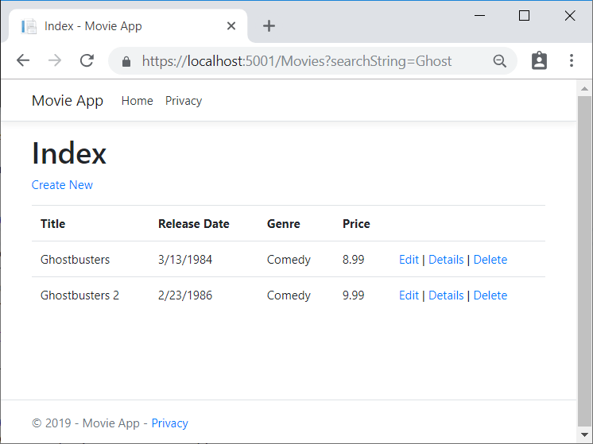
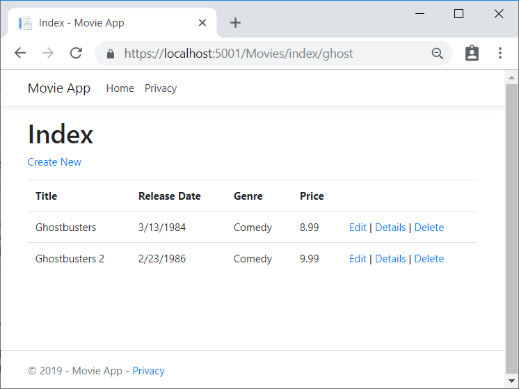
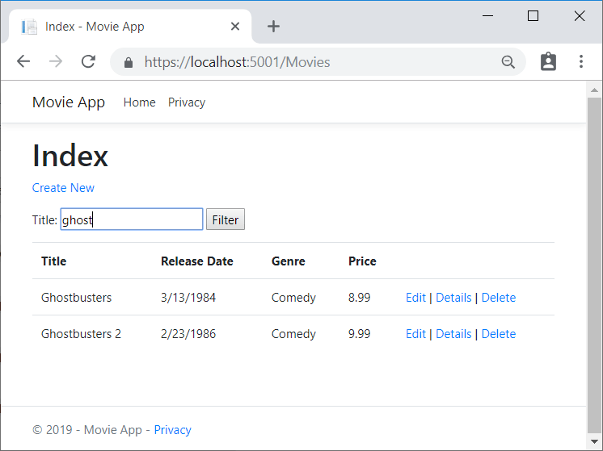
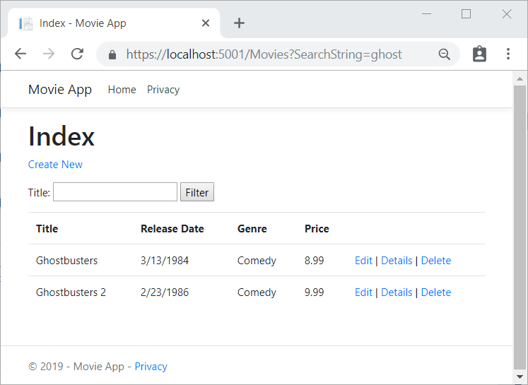

# Adding Search

In this section you'll add search capability to the `Index` action method that lets you search movies by *genre* or *name*.

Update the `Index` action method to enable search:

[!code-csharp[Main](start-mvc/sample2/src/MvcMovie/Controllers/MoviesController.cs?range=256-267)]

The first line of the `Index` action method creates a [LINQ](http://msdn.microsoft.com/en-us/library/bb397926.aspx) query to select the movies:

```csharp
var movies = from m in _context.Movie
             select m;
```

The query is *only* defined at this point, it **has not** been run against the database.

If the `searchString` parameter contains a string, the movies query is modified to filter on the value of the search string, using the following code:

<!-- literal_block {"ids": [], "linenos": false, "xml:space": "preserve", "language": "csharp", "highlight_args": {"hl_lines": [3]}} -->

```csharp
if (!String.IsNullOrEmpty(searchString))
   {
       movies = movies.Where(s => s.Title.Contains(searchString));
   }
```

The `s => s.Title.Contains()` code above is a [Lambda Expression](http://msdn.microsoft.com/en-us/library/bb397687.aspx). Lambdas are used in method-based [LINQ](http://msdn.microsoft.com/en-us/library/bb397926.aspx) queries as arguments to standard query operator methods such as the [Where](http://msdn.microsoft.com/en-us/library/system.linq.enumerable.where.aspx) method or `Contains` used in the code above. LINQ queries are not executed when they are defined or when they are modified by calling a method such as `Where`, `Contains`  or `OrderBy`. Instead, query execution is deferred, which means that the evaluation of an expression is delayed until its realized value is actually iterated over or the `ToListAsync` method is called. For more information about deferred query execution, see [Query Execution](http://msdn.microsoft.com/en-us/library/bb738633.aspx).

> [!NOTE]
> The [Contains](http://msdn.microsoft.com/en-us/library/bb155125.aspx) method is run on the database, not the c# code above. On the database, [Contains](http://msdn.microsoft.com/en-us/library/bb155125.aspx) maps to [SQL LIKE](http://msdn.microsoft.com/en-us/library/ms179859.aspx), which is case insensitive.

Navigate to `/Movies/Index`. Append a query string such as `?searchString=ghost` to the URL. The filtered movies are displayed.



If you change the signature of the `Index` method to have a parameter named `id`, the `id` parameter will match the optional `{id}` placeholder for the default routes set in *Startup.cs*.

[!code-csharp[Main](./start-mvc/sample2/src/MvcMovie/Startup.cs?highlight=5&name=snippet_1)]

You can quickly rename the `searchString` parameter to `id` with the **rename** command. Right click on `searchString` **> Rename**.


The rename targets are highlighted.


Change the parameter to `id` and all occurrences of `searchString` change to `id`.


The previous `Index` method:

[!code-csharp[Main](./start-mvc/sample2/src/MvcMovie/Controllers/MoviesController.cs?highlight=1,8&range=256-267)]

The updated `Index` method:

[!code-csharp[Main](./start-mvc/sample2/src/MvcMovie/Controllers/MoviesController.cs?highlight=1,8&range=275-286)]

You can now pass the search title as route data (a URL segment) instead of as a query string value.



However, you can't expect users to modify the URL every time they want to search for a movie. So now you'll add UI to help them filter movies. If you changed the signature of the `Index` method to test how to pass the route-bound `ID` parameter, change it back so that it takes a parameter named `searchString`:

[!code-csharp[Main](./start-mvc/sample2/src/MvcMovie/Controllers/MoviesController.cs?highlight=1&range=256-267)]

Open the *Views/Movies/Index.cshtml* file, and add the `<form>` markup highlighted below:

[!code-HTML[Main](../../tutorials/first-mvc-app/start-mvc/sample2/src/MvcMovie/Views/Movies/IndexForm1.cshtml?highlight=11,12,13,14,15,16&range=4-21)]

The HTML `<form>` tag uses the [Form Tag Helper](../../mvc/views/working-with-forms.md), so when you submit the form, the filter string is posted to the `Index` action of the movies controller. Save your changes and then test the filter.



There's no `[HttpPost]` overload of the `Index` method as you might expect. You don't need it, because the method isn't changing the state of the app, just filtering data.

You could add the following `[HttpPost] Index` method.

[!code-csharp[Main](./start-mvc/sample2/src/MvcMovie/Controllers/MoviesController.cs?highlight=1&range=294-299)]

The `notUsed` parameter is used to create an overload for the `Index` method. We'll talk about that later in the tutorial.

If you add this method, the action invoker would match the `[HttpPost] Index` method, and the `[HttpPost] Index` method would run as shown in the image below.


However, even if you add this `[HttpPost]` version of the `Index` method, there's a limitation in how this has all been implemented. Imagine that you want to bookmark a particular search or you want to send a link to friends that they can click in order to see the same filtered list of movies. Notice that the URL for the HTTP POST request is the same as the URL for the GET request (localhost:xxxxx/Movies/Index) -- there's no search information in the URL. The search string information is sent to the server as a [form field value](https://developer.mozilla.org/en-US/docs/Web/Guide/HTML/Forms/Sending_and_retrieving_form_data). You can verify that with the [F12 Developer tools](https://dev.windows.com/en-us/microsoft-edge/platform/documentation/f12-devtools-guide/) or the excellent [Fiddler tool](http://www.telerik.com/fiddler). Start the [F12 tool](https://dev.windows.com/en-us/microsoft-edge/platform/documentation/f12-devtools-guide/):

Tap the **http://localhost:xxx/Movies  HTTP POST 200** line and then tap **Body  > Request Body**.


You can see the search parameter and [XSRF](../../security/anti-request-forgery.md) token in the request body. Note, as mentioned in the previous tutorial, the [Form Tag Helper](../../mvc/views/working-with-forms.md) generates an [XSRF](../../security/anti-request-forgery.md) anti-forgery token. We're not modifying data, so we don't need to validate the token in the controller method.

Because the search parameter is in the request body and not the URL, you can't capture that search information to bookmark or share with others. We'll fix this by specifying the request should be `HTTP GET`. Notice how intelliSense helps us update the markup.


Notice the distinctive font in the `<form>` tag. That distinctive font indicates the tag is supported by [Tag Helpers](../../mvc/views/tag-helpers/intro.md).


Now when you submit a search, the URL contains the search query string. Searching will also go to the `HttpGet Index` action method, even if you have a `HttpPost Index` method.



The following markup shows the change to the `form` tag:

```html
<form asp-controller="Movies" asp-action="Index" method="get">
   ```

## Adding Search by Genre

Add the following `MovieGenreViewModel` class to the *Models* folder:

[!code-csharp[Main](start-mvc/sample2/src/MvcMovie/Models/MovieGenreViewModel.cs)]

The movie-genre view model will contain:

   * a list of movies

   * a `SelectList` containing the list of genres. This will allow the user to select a genre from the list.

   * `movieGenre`, which contains the selected genre

Replace the `Index` method with the following code:

[!code-csharp[Main](start-mvc/sample2/src/MvcMovie/Controllers/MoviesController.cs?range=306-331)]

The following code is a `LINQ` query that retrieves all the genres from the database.

```csharp
IQueryable<string> genreQuery = from m in _context.Movie
                                   orderby m.Genre
                                   select m.Genre;
   ```

The `SelectList` of genres is created by projecting the distinct genres (we don't want our select list to have duplicate genres).

```csharp
movieGenreVM.genres = new SelectList(await genreQuery.Distinct().ToListAsync())
   ```

## Adding search by genre to the Index view

[!code-HTML[Main](../../tutorials/first-mvc-app/start-mvc/sample2/src/MvcMovie/Views/Movies/IndexFormGenre.cshtml?highlight=1,15,16,17,27,41)]

Test the app by searching by genre, by movie title, and by both.

>[!div class="step-by-step"]
[Previous](controller-methods-views.md)
[Next](new-field.md)  
