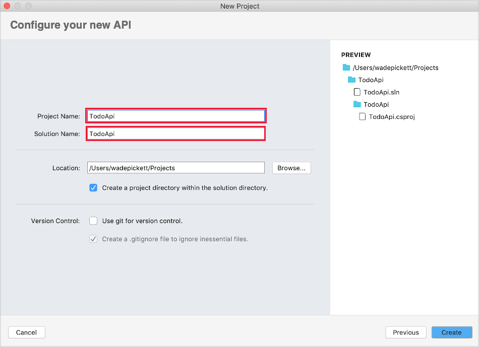

# Create a Web API with ASP.NET Core and Visual Studio for Mac

By [Rick Anderson](https://twitter.com/RickAndMSFT) and [Mike Wasson](https://github.com/mikewasson)

In this tutorial, build a web API for managing a list of "to-do" items. The UI isn't constructed.

There are 3 versions of this tutorial:

* macOS: Web API with Visual Studio for Mac (This tutorial)
* Windows: [Web API with Visual Studio for Windows](xref:tutorials/first-web-api)
* macOS, Linux, Windows: [Web API with Visual Studio Code](xref:tutorials/web-api-vsc)

<!-- WARNING: The code AND images in this doc are used by uid: tutorials/web-api-vsc, tutorials/first-web-api-mac and tutorials/first-web-api. If you change any code/images in this tutorial, update uid: tutorials/web-api-vsc -->

[!INCLUDE[template files](../includes/webApi/intro.md)]

See [Introduction to ASP.NET Core MVC on macOS or Linux](xref:tutorials/first-mvc-app-xplat/index) for an example that uses a persistent database.

## Prerequisites

[!INCLUDE[](~/includes/net-core-prereqs-macos.md)]

## Create the project

From Visual Studio, select **File > New Solution**.


Select **.NET Core App >  ASP.NET Core Web API > Next**.


Enter **TodoApi** for the **Project Name**, and then select Create.



### Launch the app

In Visual Studio, select **Run > Start With Debugging** to launch the app. Visual Studio launches a browser and navigates to `http://localhost:5000`. You get an HTTP 404 (Not Found) error.  Change the URL to `http://localhost:port/api/values`. The `ValuesController` data will be displayed:

```
["value1","value2"]
```

### Add support for Entity Framework Core

Install the [Entity Framework Core InMemory](https://docs.microsoft.com/ef/core/providers/in-memory/) database provider. This database provider allows Entity Framework Core to be used with an in-memory database.

* From the **Project** menu, select **Add NuGet Packages**. 

  *  Alternately, you can right-click **Dependencies**, and then select **Add Packages**.

* Enter `EntityFrameworkCore.InMemory` in the search box.
* Select `Microsoft.EntityFrameworkCore.InMemory`, and then select **Add Package**.

### Add a model class

A model is an object that represents the data in your application. In this case, the only model is a to-do item.

Add a folder named *Models*. In Solution Explorer, right-click the project. Select **Add** > **New Folder**. Name the folder *Models*.


Note: You can put model classes anywhere in your project, but the *Models* folder is used by convention.

Add a `TodoItem` class. Right-click the *Models* folder and select **Add > New File > General > Empty Class**. Name the class `TodoItem`, and then select **New**.

Replace the generated code with:

[!code-csharp[](first-web-api/sample/TodoApi/Models/TodoItem.cs)]

The database generates the `Id` when a `TodoItem` is created.

### Create the database context

The *database context* is the main class that coordinates Entity Framework functionality for a given data model. You create this class by deriving from the `Microsoft.EntityFrameworkCore.DbContext` class.

Add a `TodoContext` class to the *Models* folder.

[!code-csharp[](first-web-api/sample/TodoApi/Models/TodoContext.cs)]

[!INCLUDE[Register the database context](../includes/webApi/register_dbContext.md)]

## Add a controller

In Solution Explorer, in the *Controllers* folder, add the class `TodoController`.

Replace the generated code with the following (and add closing braces):

[!INCLUDE[code and get todo items](../includes/webApi/getTodoItems.md)]

### Launch the app

In Visual Studio, select **Run > Start With Debugging** to launch the app. Visual Studio launches a browser and navigates to `http://localhost:port`, where *port* is a randomly chosen port number. You get an HTTP 404 (Not Found) error.  Change the URL to `http://localhost:port/api/values`. The `ValuesController` data will be displayed:

```
["value1","value2"]
```

Navigate to the `Todo` controller at`http://localhost:port/api/todo`:

```
[{"key":1,"name":"Item1","isComplete":false}]
```

## Implement the other CRUD operations

We'll add `Create`, `Update`, and `Delete` methods to the controller. These are variations on a theme, so I'll just show the code and highlight the main differences. Build the project after adding or changing code.

### Create

[!code-csharp[](first-web-api/sample/TodoApi/Controllers/TodoController.cs?name=snippet_Create)]

This is an HTTP POST method, indicated by the [`[HttpPost]`](/aspnet/core/api/microsoft.aspnetcore.mvc.httppostattribute) attribute. The [`[FromBody]`](/aspnet/core/api/microsoft.aspnetcore.mvc.frombodyattribute) attribute tells MVC to get the value of the to-do item from the body of the HTTP request.

The `CreatedAtRoute` method returns a 201 response, which is the standard response for an HTTP POST method that creates a new resource on the server. `CreatedAtRoute` also adds a Location header to the response. The Location header specifies the URI of the newly created to-do item. See [10.2.2 201 Created](http://www.w3.org/Protocols/rfc2616/rfc2616-sec10.html).

### Use Postman to send a Create request

* Start the app (**Run > Start With Debugging**).
* Start Postman.


* Set the HTTP method to `POST`
* Select the **Body** radio button
* Select the **raw** radio button
* Set the type to JSON
* In the key-value editor, enter a Todo item such as

```json
{
	"name":"walk dog",
	"isComplete":true
}
```

* Select **Send**

* Select the Headers tab in the lower pane and copy the **Location** header:


You can use the Location header URI to access the resource you just created. Recall the `GetById` method created the `"GetTodo"` named route:

```csharp
[HttpGet("{id}", Name = "GetTodo")]
public IActionResult GetById(string id)
```

### Update

[!code-csharp[](first-web-api/sample/TodoApi/Controllers/TodoController.cs?name=snippet_Update)]

`Update` is similar to `Create`, but uses HTTP PUT. The response is [204 (No Content)](http://www.w3.org/Protocols/rfc2616/rfc2616-sec9.html). According to the HTTP spec, a PUT request requires the client to send the entire updated entity, not just the deltas. To support partial updates, use HTTP PATCH.

```json
{
  "key": 1,
  "name": "walk dog",
  "isComplete": true
}
```


### Delete

[!code-csharp[](first-web-api/sample/TodoApi/Controllers/TodoController.cs?name=snippet_Delete)]

The response is [204 (No Content)](http://www.w3.org/Protocols/rfc2616/rfc2616-sec9.html).


## Next steps

* [Route to controller actions](xref:mvc/controllers/routing)
* For information about deploying your API, see [Host and deploy](xref:host-and-deploy/index).
* [View or download sample code](https://github.com/aspnet/Docs/tree/master/aspnetcore/tutorials/first-web-api/sample) ([how to download](xref:tutorials/index#how-to-download-a-sample))
* [Postman](https://www.getpostman.com/)
* [Fiddler](https://www.telerik.com/download/fiddler)
