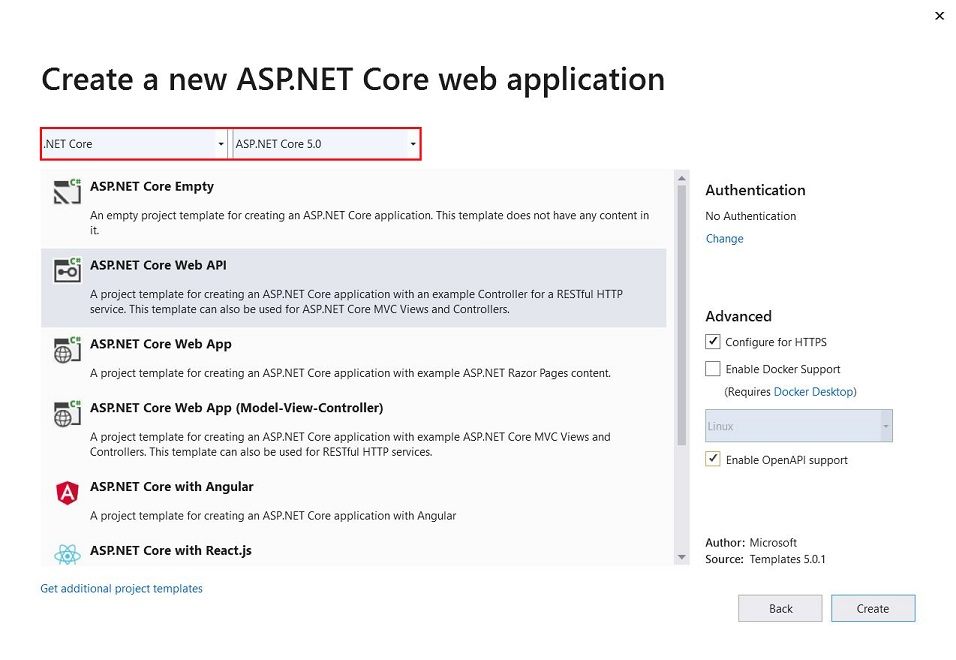
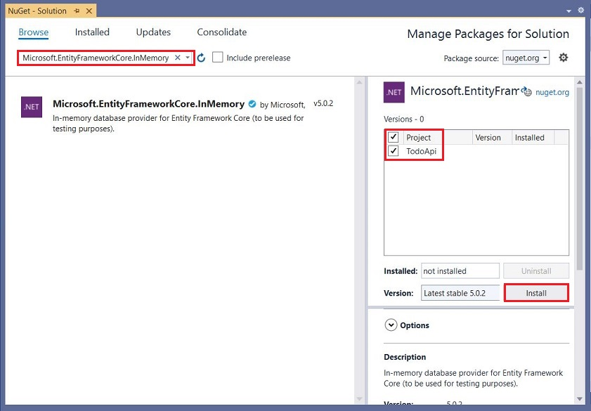
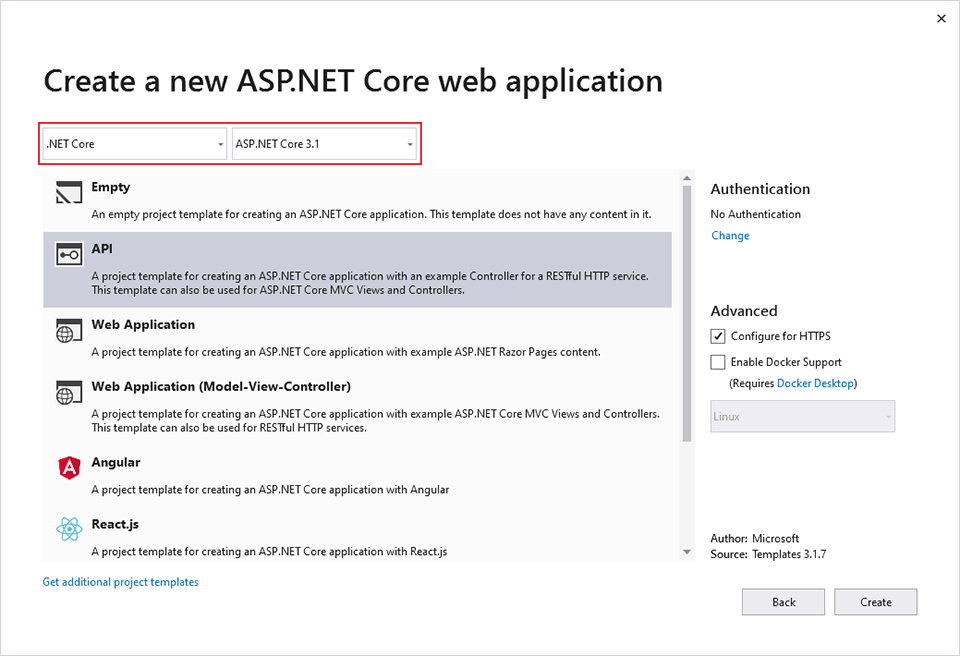
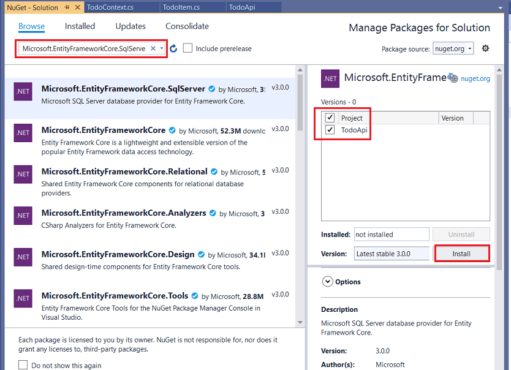
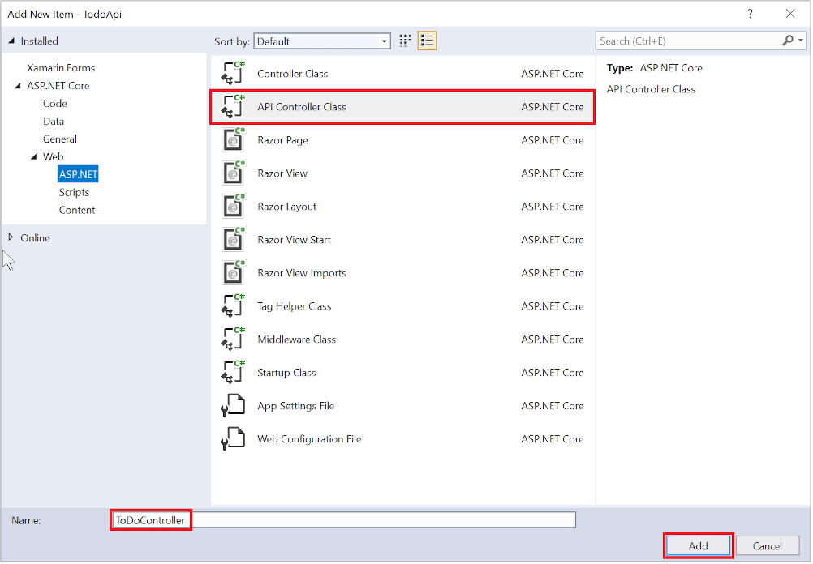
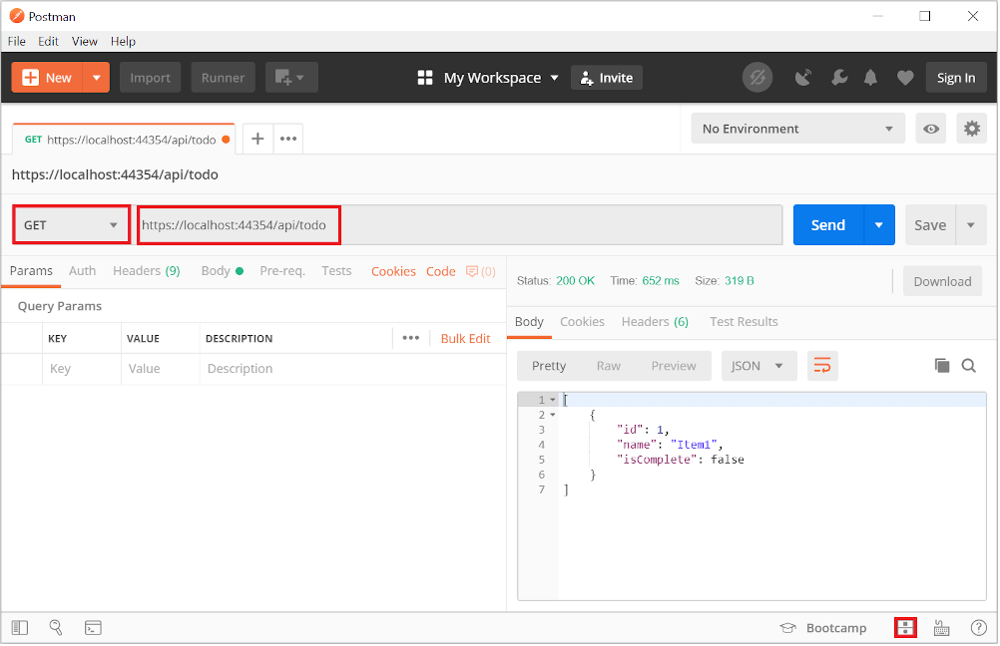
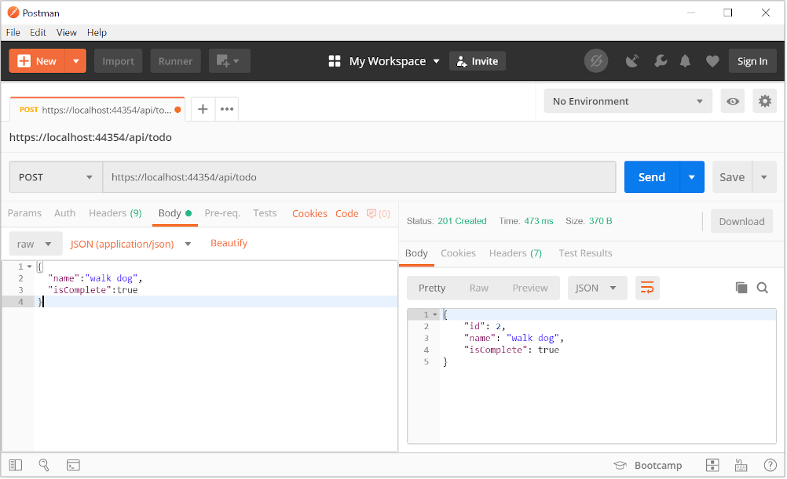
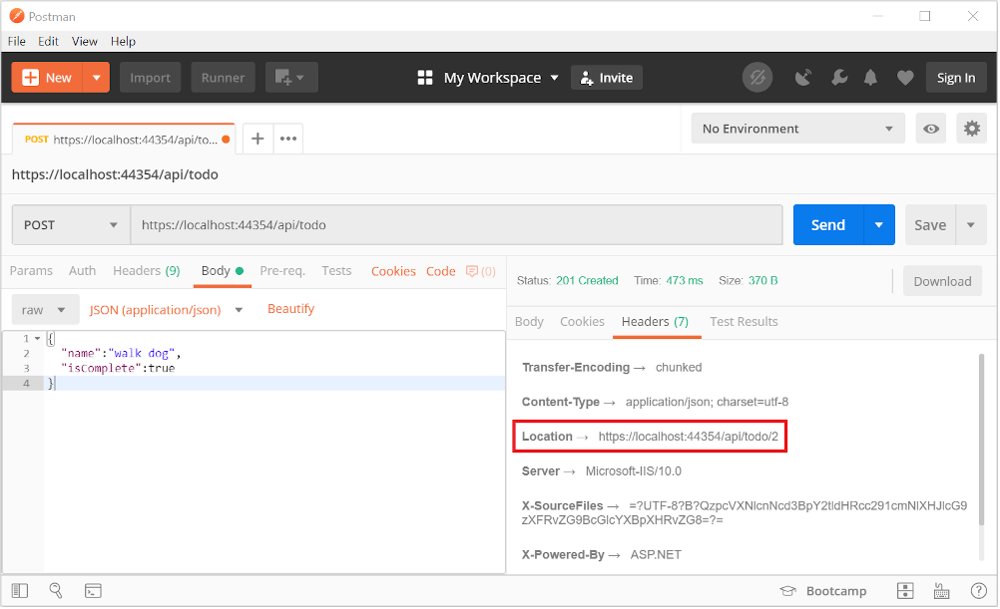

# Tutorial: Create a web API with ASP.NET Core

By [Rick Anderson](https://twitter.com/RickAndMSFT), [Kirk Larkin](https://twitter.com/serpent5), and [Mike Wasson](https://github.com/mikewasson)

This tutorial teaches the basics of building a web API with ASP.NET Core.

::: moniker range=">= aspnetcore-5.0"

In this tutorial, you learn how to:

> [!div class="checklist"]
> * Create a web API project.
> * Add a model class and a database context.
> * Scaffold a controller with CRUD methods.
> * Configure routing, URL paths, and return values.
> * Call the web API with Postman.

At the end, you have a web API that can manage "to-do" items stored in a database.

## Overview

This tutorial creates the following API:

|API | Description | Request body | Response body |
|--- | ---- | ---- | ---- |
|`GET /api/TodoItems` | Get all to-do items | None | Array of to-do items|
|`GET /api/TodoItems/{id}` | Get an item by ID | None | To-do item|
|`POST /api/TodoItems` | Add a new item | To-do item | To-do item |
|`PUT /api/TodoItems/{id}` | Update an existing item &nbsp; | To-do item | None |
|`DELETE /api/TodoItems/{id}` &nbsp; &nbsp; | Delete an item &nbsp; &nbsp; | None | None|

The following diagram shows the design of the app.


## Prerequisites

# [Visual Studio](#tab/visual-studio)

[!INCLUDE[](~/includes/net-core-prereqs-vs-5.0.md)]

# [Visual Studio Code](#tab/visual-studio-code)

[!INCLUDE[](~/includes/net-core-prereqs-vsc-5.0.md)]

# [Visual Studio for Mac](#tab/visual-studio-mac)

[!INCLUDE[](~/includes/net-core-prereqs-mac-5.0.md)]

---

## Create a web project

# [Visual Studio](#tab/visual-studio)

* From the **File** menu, select **New** > **Project**.
* Select the **ASP.NET Core Web Application** template and click **Next**.
* Name the project *TodoApi* and click **Create**.
* In the **Create a new ASP.NET Core Web Application** dialog, confirm that **.NET Core** and **ASP.NET Core 5.0** are selected. Select the **API** template and click **Create**.



# [Visual Studio Code](#tab/visual-studio-code)

* Open the [integrated terminal](https://code.visualstudio.com/docs/editor/integrated-terminal).
* Change directories (`cd`) to the folder that will contain the project folder.
* Run the following commands:

   ```dotnetcli
   dotnet new webapi -o TodoApi
   cd TodoApi
   dotnet add package Microsoft.EntityFrameworkCore.InMemory
   code -r ../TodoApi
   ```

* When a dialog box asks if you want to add required assets to the project, select **Yes**.

  The preceding commands:

  * Creates a new web API project and opens it in Visual Studio Code.
  * Adds the NuGet packages which are required in the next section.

# [Visual Studio for Mac](#tab/visual-studio-mac)

* Select **File** > **New Solution**.

  

* In Visual Studio for Mac earlier than version 8.6, select **.NET Core** > **App** > **API** > **Next**. In version 8.6 or later, select **Web and Console** > **App** > **API** > **Next**.

  

* In the **Configure the new ASP.NET Core Web API** dialog, select the latest .NET Core 5.x **Target Framework**. Select **Next**.

* Enter *TodoApi* for the **Project Name** and then select **Create**.

  

[!INCLUDE[](~/includes/mac-terminal-access.md)]

Open a command terminal in the project folder and run the following command:

   ```dotnetcli
   dotnet add package Microsoft.EntityFrameworkCore.InMemory
   ```

---

### Test the project

The project template creates a `WeatherForecast` API with support for [Swagger](xref:tutorials/web-api-help-pages-using-swagger).

# [Visual Studio](#tab/visual-studio)

Press Ctrl+F5 to run without the debugger.

[!INCLUDE[](~/includes/trustCertVS.md)]

  Visual Studio launches:

* The IIS Express web server.
* The default browser and navigates to `https://localhost:<port>/swagger/index.html`, where `<port>` is a randomly chosen port number.

# [Visual Studio Code](#tab/visual-studio-code)

[!INCLUDE[](~/includes/trustCertVSC.md)]

Press Ctrl+F5 to run the app. In a browser, go to following URL: [https://localhost:5001/swagger](https://localhost:5001/swagger)

# [Visual Studio for Mac](#tab/visual-studio-mac)

Select **Run** > **Start Debugging** to launch the app. Visual Studio for Mac launches a browser and navigates to `https://localhost:<port>`, where `<port>` is a randomly chosen port number. An HTTP 404 (Not Found) error is returned. Append `/swagger` to the URL (change the URL to `https://localhost:<port>/swagger`).

---

The Swagger page `/swagger/index.html` is displayed. Select **GET** > **Try it out** > **Execute**. The page displays:

* The [Curl](https://curl.haxx.se/) command to test the WeatherForecast API.
* The URL to test the WeatherForecast API.
* The response code, body, and headers.
* A drop down list box with media types and the example value and schema.

<!-- Review: Do we care the IE generates several errors. It shows the data, but with  Unrecognized response type; displaying content as text.
-->
Swagger is used to generate useful documentation and help pages for web APIs. This tutorial focuses on creating a web API. For more information on Swagger, see <xref:tutorials/web-api-help-pages-using-swagger>.

Copy and paste the **Request URL** in the browser:  `https://localhost:<port>/WeatherForecast`

JSON similar to the following is returned:

```json
[
    {
        "date": "2019-07-16T19:04:05.7257911-06:00",
        "temperatureC": 52,
        "temperatureF": 125,
        "summary": "Mild"
    },
    {
        "date": "2019-07-17T19:04:05.7258461-06:00",
        "temperatureC": 36,
        "temperatureF": 96,
        "summary": "Warm"
    },
    {
        "date": "2019-07-18T19:04:05.7258467-06:00",
        "temperatureC": 39,
        "temperatureF": 102,
        "summary": "Cool"
    },
    {
        "date": "2019-07-19T19:04:05.7258471-06:00",
        "temperatureC": 10,
        "temperatureF": 49,
        "summary": "Bracing"
    },
    {
        "date": "2019-07-20T19:04:05.7258474-06:00",
        "temperatureC": -1,
        "temperatureF": 31,
        "summary": "Chilly"
    }
]
```

### Update the launchUrl

In *Properties\launchSettings.json*, update `launchUrl` from `"swagger"` to `"api/TodoItems"`:

```json
"launchUrl": "api/TodoItems",
```

Because Swagger has been removed, the preceding markup changes the URL that is launched to the GET method of the controller added in the following sections.

## Add a model class

A *model* is a set of classes that represent the data that the app manages. The model for this app is a single `TodoItem` class.

# [Visual Studio](#tab/visual-studio)

* In **Solution Explorer**, right-click the project. Select **Add** > **New Folder**. Name the folder *Models*.

* Right-click the *Models* folder and select **Add** > **Class**. Name the class *TodoItem* and select **Add**.

* Replace the template code with the following:

# [Visual Studio Code](#tab/visual-studio-code)

* Add a folder named *Models*.

* Add a `TodoItem` class to the *Models* folder with the following code:

# [Visual Studio for Mac](#tab/visual-studio-mac)

* Right-click the project. Select **Add** > **New Folder**. Name the folder *Models*.

  

* Right-click the *Models* folder, and select **Add** > **New File** > **General** > **Empty Class**.

* Name the class *TodoItem*, and then click **New**.

* Replace the template code with the following:

---

  [!code-csharp[](first-web-api/samples/5.x/TodoApi/Models/TodoItem.cs?name=snippet)]

The `Id` property functions as the unique key in a relational database.

Model classes can go anywhere in the project, but the *Models* folder is used by convention.

## Add a database context

The *database context* is the main class that coordinates Entity Framework functionality for a data model. This class is created by deriving from the <xref:Microsoft.EntityFrameworkCore.DbContext?displayProperty=fullName> class.

# [Visual Studio](#tab/visual-studio)

### Add NuGet packages

* From the **Tools** menu, select **NuGet Package Manager > Manage NuGet Packages for Solution**.
* Select the **Browse** tab, and then enter **Microsoft.EntityFrameworkCore.InMemory** in the search box.
* Select **Microsoft.EntityFrameworkCore.InMemory** in the left pane.
* Select the **Project** check box in the right pane and then select **Install**.



## Add the TodoContext database context

* Right-click the *Models* folder and select **Add** > **Class**. Name the class *TodoContext* and click **Add**.

# [Visual Studio Code / Visual Studio for Mac](#tab/visual-studio-code+visual-studio-mac)

* Add a `TodoContext` class to the *Models* folder.

---

* Enter the following code:

  [!code-csharp[](first-web-api/samples/5.x/TodoApi/Models/TodoContext.cs)]

## Register the database context

In ASP.NET Core, services such as the DB context must be registered with the [dependency injection (DI)](xref:fundamentals/dependency-injection) container. The container provides the service to controllers.

Update *Startup.cs* with the following code:

[!code-csharp[](first-web-api/samples/5.x/TodoApi/Startup.cs?highlight=7-8,23-24&name=snippet_all)]

The preceding code:

* Removes the Swagger calls.
* Removes unused `using` declarations.
* Adds the database context to the DI container.
* Specifies that the database context will use an in-memory database.

## Scaffold a controller

# [Visual Studio](#tab/visual-studio)

* Right-click the *Controllers* folder.
* Select **Add** > **New Scaffolded Item**.
* Select **API Controller with actions, using Entity Framework**, and then select **Add**.
* In the **Add API Controller with actions, using Entity Framework** dialog:

  * Select **TodoItem (TodoApi.Models)** in the **Model class**.
  * Select **TodoContext (TodoApi.Models)** in the **Data context class**.
  * Select **Add**.

# [Visual Studio Code / Visual Studio for Mac](#tab/visual-studio-code+visual-studio-mac)

Run the following commands:

```dotnetcli
dotnet add package Microsoft.VisualStudio.Web.CodeGeneration.Design
dotnet add package Microsoft.EntityFrameworkCore.Design
dotnet tool install -g dotnet-aspnet-codegenerator
dotnet tool update -g dotnet-aspnet-codegenerator
dotnet aspnet-codegenerator controller -name TodoItemsController -async -api -m TodoItem -dc TodoContext -outDir Controllers
```

The preceding commands:

* Add NuGet packages required for scaffolding.
* Installs the scaffolding engine (`dotnet-aspnet-codegenerator`).
* Scaffolds the `TodoItemsController`.

---

The generated code:

* Marks the class with the [`[ApiController]`](xref:Microsoft.AspNetCore.Mvc.ApiControllerAttribute) attribute. This attribute indicates that the controller responds to web API requests. For information about specific behaviors that the attribute enables, see <xref:web-api/index>.
* Uses DI to inject the database context (`TodoContext`) into the controller. The database context is used in each of the [CRUD](https://wikipedia.org/wiki/Create,_read,_update_and_delete) methods in the controller.

The ASP.NET Core templates for:

* Controllers with views include `[action]` in the route template.
* API controllers don't include `[action]` in the route template.

When the `[action]` token isn't in the route template, the [action](xref:mvc/controllers/routing#action) name is excluded from the route. That is, the action's associated method name isn't used in the matching route.

## Update the PostTodoItem create method

Update the return statement in the `PostTodoItem` to use the [nameof](/dotnet/csharp/language-reference/operators/nameof) operator:

[!code-csharp[](first-web-api/samples/5.x/TodoApi/Controllers/TodoItemsController.cs?name=snippet_Create)]

The preceding code is an HTTP POST method, as indicated by the [`[HttpPost]`](xref:Microsoft.AspNetCore.Mvc.HttpPostAttribute) attribute. The method gets the value of the to-do item from the body of the HTTP request.

For more information, see [Attribute routing with Http[Verb] attributes](xref:mvc/controllers/routing#attribute-routing-with-httpverb-attributes).

The <xref:Microsoft.AspNetCore.Mvc.ControllerBase.CreatedAtAction*> method:

* Returns an [HTTP 201 status code](https://developer.mozilla.org/docs/Web/HTTP/Status/201) if successful. HTTP 201 is the standard response for an HTTP POST method that creates a new resource on the server.
* Adds a [Location](https://developer.mozilla.org/docs/Web/HTTP/Headers/Location) header to the response. The `Location` header specifies the [URI](https://developer.mozilla.org/docs/Glossary/URI) of the newly created to-do item. For more information, see [10.2.2 201 Created](https://www.w3.org/Protocols/rfc2616/rfc2616-sec10.html).
* References the `GetTodoItem` action to create the `Location` header's URI. The C# `nameof` keyword is used to avoid hard-coding the action name in the `CreatedAtAction` call.

### Install Postman

This tutorial uses Postman to test the web API.

* Install [Postman](https://www.getpostman.com/downloads/)
* Start the web app.
* Start Postman.
* Disable **SSL certificate verification**
  * From **File** > **Settings** (**General** tab), disable **SSL certificate verification**.
    > [!WARNING]
    > Re-enable SSL certificate verification after testing the controller.

<a name="post"></a>

### Test PostTodoItem with Postman

* Create a new request.
* Set the HTTP method to `POST`.
* Set the URI to `https://localhost:<port>/api/TodoItems`. For example, `https://localhost:5001/api/TodoItems`.
* Select the **Body** tab.
* Select the **raw** radio button.
* Set the type to **JSON (application/json)**.
* In the request body enter JSON for a to-do item:

    ```json
    {
      "name":"walk dog",
      "isComplete":true
    }
    ```

* Select **Send**.

  

### Test the location header URI

The location header URI can be tested in the browser. Copy and paste the location header URI into the browser.

To test in Postman:

* Select the **Headers** tab in the **Response** pane.
* Copy the **Location** header value:

  

* Set the HTTP method to `GET`.
* Set the URI to `https://localhost:<port>/api/TodoItems/1`. For example, `https://localhost:5001/api/TodoItems/1`.
* Select **Send**.

## Examine the GET methods

Two GET endpoints are implemented:

* `GET /api/TodoItems`
* `GET /api/TodoItems/{id}`

Test the app by calling the two endpoints from a browser or Postman. For example:

* `https://localhost:5001/api/TodoItems`
* `https://localhost:5001/api/TodoItems/1`

A response similar to the following is produced by the call to `GetTodoItems`:

```json
[
  {
    "id": 1,
    "name": "Item1",
    "isComplete": false
  }
]
```

### Test Get with Postman

* Create a new request.
* Set the HTTP method to **GET**.
* Set the request URI to `https://localhost:<port>/api/TodoItems`. For example, `https://localhost:5001/api/TodoItems`.
* Set **Two pane view** in Postman.
* Select **Send**.

This app uses an in-memory database. If the app is stopped and started, the preceding GET request will not return any data. If no data is returned, [POST](#post) data to the app.

## Routing and URL paths

The [`[HttpGet]`](xref:Microsoft.AspNetCore.Mvc.HttpGetAttribute) attribute denotes a method that responds to an HTTP GET request. The URL path for each method is constructed as follows:

* Start with the template string in the controller's `Route` attribute:

  [!code-csharp[](first-web-api/samples/5.x/TodoApi/Controllers/TodoItemsController.cs?name=TodoController&highlight=1)]

* Replace `[controller]` with the name of the controller, which by convention is the controller class name minus the "Controller" suffix. For this sample, the controller class name is **TodoItems**Controller, so the controller name is "TodoItems". ASP.NET Core [routing](xref:mvc/controllers/routing) is case insensitive.
* If the `[HttpGet]` attribute has a route template (for example, `[HttpGet("products")]`), append that to the path. This sample doesn't use a template. For more information, see [Attribute routing with Http[Verb] attributes](xref:mvc/controllers/routing#attribute-routing-with-httpverb-attributes).

In the following `GetTodoItem` method, `"{id}"` is a placeholder variable for the unique identifier of the to-do item. When `GetTodoItem` is invoked, the value of `"{id}"` in the URL is provided to the method in its `id` parameter.

[!code-csharp[](first-web-api/samples/3.0/TodoApi/Controllers/TodoItemsController.cs?name=snippet_GetByID&highlight=1-2)]

## Return values

The return type of the `GetTodoItems` and `GetTodoItem` methods is [ActionResult\<T> type](xref:web-api/action-return-types#actionresultt-type). ASP.NET Core automatically serializes the object to [JSON](https://www.json.org/) and writes the JSON into the body of the response message. The response code for this return type is [200 OK](https://developer.mozilla.org/docs/Web/HTTP/Status/200), assuming there are no unhandled exceptions. Unhandled exceptions are translated into 5xx errors.

`ActionResult` return types can represent a wide range of HTTP status codes. For example, `GetTodoItem` can return two different status values:

* If no item matches the requested ID, the method returns a [404 status](https://developer.mozilla.org/docs/Web/HTTP/Status/404) <xref:Microsoft.AspNetCore.Mvc.ControllerBase.NotFound%2A> error code.
* Otherwise, the method returns 200 with a JSON response body. Returning `item` results in an HTTP 200 response.

## The PutTodoItem method

Examine the `PutTodoItem` method:

[!code-csharp[](first-web-api/samples/5.x/TodoApi/Controllers/TodoItemsController.cs?name=snippet_Update)]

`PutTodoItem` is similar to `PostTodoItem`, except it uses HTTP PUT. The response is [204 (No Content)](https://www.w3.org/Protocols/rfc2616/rfc2616-sec9.html). According to the HTTP specification, a PUT request requires the client to send the entire updated entity, not just the changes. To support partial updates, use [HTTP PATCH](xref:Microsoft.AspNetCore.Mvc.HttpPatchAttribute).

If you get an error calling `PutTodoItem`, call `GET` to ensure there's an item in the database.

### Test the PutTodoItem method

This sample uses an in-memory database that must be initialized each time the app is started. There must be an item in the database before you make a PUT call. Call GET to ensure there's an item in the database before making a PUT call.

Update the to-do item that has Id = 1 and set its name to `"feed fish"`:

```json
  {
    "Id":1,
    "name":"feed fish",
    "isComplete":true
  }
```

The following image shows the Postman update:


## The DeleteTodoItem method

Examine the `DeleteTodoItem` method:

[!code-csharp[](first-web-api/samples/5.x/TodoApi/Controllers/TodoItemsController.cs?name=snippet_Delete)]

### Test the DeleteTodoItem method

Use Postman to delete a to-do item:

* Set the method to `DELETE`.
* Set the URI of the object to delete (for example `https://localhost:5001/api/TodoItems/1`).
* Select **Send**.

<a name="over-post-v5"></a>

## Prevent over-posting

Currently the sample app exposes the entire `TodoItem` object. Production apps typically limit the data that's input and returned using a subset of the model. There are multiple reasons behind this and security is a major one. The subset of a model is usually referred to as a Data Transfer Object (DTO), input model, or view model. **DTO** is used in this article.

A DTO may be used to:

* Prevent over-posting.
* Hide properties that clients are not supposed to view.
* Omit some properties in order to reduce payload size.
* Flatten object graphs that contain nested objects. Flattened object graphs can be more convenient for clients.

To demonstrate the DTO approach, update the `TodoItem` class to include a secret field:

[!code-csharp[](first-web-api/samples/5.x/TodoApiDTO/Models/TodoItem.cs?name=snippet&highlight=8)]

The secret field needs to be hidden from this app, but an administrative app could choose to expose it.

Verify you can post and get the secret field.

Create a DTO model:

[!code-csharp[](first-web-api/samples/5.x/TodoApiDTO/Models/TodoItemDTO.cs?name=snippet)]

Update the `TodoItemsController` to use `TodoItemDTO`:

[!code-csharp[](first-web-api/samples/5.x/TodoApiDTO/Controllers/TodoItemsController.cs?name=snippet)]

Verify you can't post or get the secret field.

## Call the web API with JavaScript

See [Tutorial: Call an ASP.NET Core web API with JavaScript](xref:tutorials/web-api-javascript).

::: moniker-end

::: moniker range=">= aspnetcore-3.0 < aspnetcore-5.0"

In this tutorial, you learn how to:

> [!div class="checklist"]
> * Create a web API project.
> * Add a model class and a database context.
> * Scaffold a controller with CRUD methods.
> * Configure routing, URL paths, and return values.
> * Call the web API with Postman.

At the end, you have a web API that can manage "to-do" items stored in a database.

## Overview

This tutorial creates the following API:

|API | Description | Request body | Response body |
|--- | ---- | ---- | ---- |
|`GET /api/TodoItems` | Get all to-do items | None | Array of to-do items|
|`GET /api/TodoItems/{id}` | Get an item by ID | None | To-do item|
|`POST /api/TodoItems` | Add a new item | To-do item | To-do item |
|`PUT /api/TodoItems/{id}` | Update an existing item &nbsp; | To-do item | None |
|`DELETE /api/TodoItems/{id}` &nbsp; &nbsp; | Delete an item &nbsp; &nbsp; | None | None|

The following diagram shows the design of the app.


## Prerequisites

# [Visual Studio](#tab/visual-studio)

[!INCLUDE[](~/includes/net-core-prereqs-vs-3.1.md)]

# [Visual Studio Code](#tab/visual-studio-code)

[!INCLUDE[](~/includes/net-core-prereqs-vsc-3.1.md)]

# [Visual Studio for Mac](#tab/visual-studio-mac)

[!INCLUDE[](~/includes/net-core-prereqs-mac-3.1.md)]

---

## Create a web project

# [Visual Studio](#tab/visual-studio)

* From the **File** menu, select **New** > **Project**.
* Select the **ASP.NET Core Web Application** template and click **Next**.
* Name the project *TodoApi* and click **Create**.
* In the **Create a new ASP.NET Core Web Application** dialog, confirm that **.NET Core** and **ASP.NET Core 3.1** are selected. Select the **API** template and click **Create**.



# [Visual Studio Code](#tab/visual-studio-code)

* Open the [integrated terminal](https://code.visualstudio.com/docs/editor/integrated-terminal).
* Change directories (`cd`) to the folder that will contain the project folder.
* Run the following commands:

   ```dotnetcli
   dotnet new webapi -o TodoApi
   cd TodoApi
   dotnet add package Microsoft.EntityFrameworkCore.InMemory
   code -r ../TodoApi
   ```

* When a dialog box asks if you want to add required assets to the project, select **Yes**.

  The preceding commands:

  * Creates a new web API project and opens it in Visual Studio Code.
  * Adds the NuGet packages which are required in the next section.

# [Visual Studio for Mac](#tab/visual-studio-mac)

* Select **File** > **New Solution**.

  

* In Visual Studio for Mac earlier than version 8.6, select **.NET Core** > **App** > **API** > **Next**. In version 8.6 or later, select **Web and Console** > **App** > **API** > **Next**.

  

* In the **Configure the new ASP.NET Core Web API** dialog, select the latest .NET Core 3.x **Target Framework**. Select **Next**.

* Enter *TodoApi* for the **Project Name** and then select **Create**.

  

[!INCLUDE[](~/includes/mac-terminal-access.md)]

Open a command terminal in the project folder and run the following command:

   ```dotnetcli
   dotnet add package Microsoft.EntityFrameworkCore.InMemory
   ```

---

### Test the API

The project template creates a `WeatherForecast` API. Call the `Get` method from a browser to test the app.

# [Visual Studio](#tab/visual-studio)

Press Ctrl+F5 to run the app. Visual Studio launches a browser and navigates to `https://localhost:<port>/WeatherForecast`, where `<port>` is a randomly chosen port number.

If you get a dialog box that asks if you should trust the IIS Express certificate, select **Yes**. In the **Security Warning** dialog that appears next, select **Yes**.

# [Visual Studio Code](#tab/visual-studio-code)

Press Ctrl+F5 to run the app. In a browser, go to following URL: `https://localhost:5001/WeatherForecast`.

# [Visual Studio for Mac](#tab/visual-studio-mac)

Select **Run** > **Start Debugging** to launch the app. Visual Studio for Mac launches a browser and navigates to `https://localhost:<port>`, where `<port>` is a randomly chosen port number. An HTTP 404 (Not Found) error is returned. Append `/WeatherForecast` to the URL (change the URL to `https://localhost:<port>/WeatherForecast`).

---

JSON similar to the following is returned:

```json
[
    {
        "date": "2019-07-16T19:04:05.7257911-06:00",
        "temperatureC": 52,
        "temperatureF": 125,
        "summary": "Mild"
    },
    {
        "date": "2019-07-17T19:04:05.7258461-06:00",
        "temperatureC": 36,
        "temperatureF": 96,
        "summary": "Warm"
    },
    {
        "date": "2019-07-18T19:04:05.7258467-06:00",
        "temperatureC": 39,
        "temperatureF": 102,
        "summary": "Cool"
    },
    {
        "date": "2019-07-19T19:04:05.7258471-06:00",
        "temperatureC": 10,
        "temperatureF": 49,
        "summary": "Bracing"
    },
    {
        "date": "2019-07-20T19:04:05.7258474-06:00",
        "temperatureC": -1,
        "temperatureF": 31,
        "summary": "Chilly"
    }
]
```

## Add a model class

A *model* is a set of classes that represent the data that the app manages. The model for this app is a single `TodoItem` class.

# [Visual Studio](#tab/visual-studio)

* In **Solution Explorer**, right-click the project. Select **Add** > **New Folder**. Name the folder *Models*.

* Right-click the *Models* folder and select **Add** > **Class**. Name the class *TodoItem* and select **Add**.

* Replace the template code with the following code:

# [Visual Studio Code](#tab/visual-studio-code)

* Add a folder named *Models*.

* Add a `TodoItem` class to the *Models* folder with the following code:

# [Visual Studio for Mac](#tab/visual-studio-mac)

* Right-click the project. Select **Add** > **New Folder**. Name the folder *Models*.

  

* Right-click the *Models* folder, and select **Add** > **New File** > **General** > **Empty Class**.

* Name the class *TodoItem*, and then click **New**.

* Replace the template code with the following code:

---

  [!code-csharp[](first-web-api/samples/3.0/TodoApi/Models/TodoItem.cs?name=snippet)]

The `Id` property functions as the unique key in a relational database.

Model classes can go anywhere in the project, but the *Models* folder is used by convention.

## Add a database context

The *database context* is the main class that coordinates Entity Framework functionality for a data model. This class is created by deriving from the `Microsoft.EntityFrameworkCore.DbContext` class.

# [Visual Studio](#tab/visual-studio)

### Add NuGet packages

* From the **Tools** menu, select **NuGet Package Manager > Manage NuGet Packages for Solution**.
* Select the **Browse** tab, and then enter **Microsoft.EntityFrameworkCore.InMemory** in the search box.
* Select **Microsoft.EntityFrameworkCore.InMemory** in the left pane.
* Select the **Project** check box in the right pane and then select **Install**.



## Add the TodoContext database context

* Right-click the *Models* folder and select **Add** > **Class**. Name the class *TodoContext* and click **Add**.

# [Visual Studio Code / Visual Studio for Mac](#tab/visual-studio-code+visual-studio-mac)

* Add a `TodoContext` class to the *Models* folder.

---

* Enter the following code:

  [!code-csharp[](first-web-api/samples/3.0/TodoApi/Models/TodoContext.cs)]

## Register the database context

In ASP.NET Core, services such as the DB context must be registered with the [dependency injection (DI)](xref:fundamentals/dependency-injection) container. The container provides the service to controllers.

Update *Startup.cs* with the following highlighted code:

[!code-csharp[](first-web-api/samples/3.0/TodoApi/Startup.cs?highlight=7-8,23-24&name=snippet_all)]

The preceding code:

* Removes unused `using` declarations.
* Adds the database context to the DI container.
* Specifies that the database context will use an in-memory database.

## Scaffold a controller

# [Visual Studio](#tab/visual-studio)

* Right-click the *Controllers* folder.
* Select **Add** > **New Scaffolded Item**.
* Select **API Controller with actions, using Entity Framework**, and then select **Add**.
* In the **Add API Controller with actions, using Entity Framework** dialog:

  * Select **TodoItem (TodoApi.Models)** in the **Model class**.
  * Select **TodoContext (TodoApi.Models)** in the **Data context class**.
  * Select **Add**.

# [Visual Studio Code / Visual Studio for Mac](#tab/visual-studio-code+visual-studio-mac)

Run the following commands:

```dotnetcli
dotnet add package Microsoft.VisualStudio.Web.CodeGeneration.Design
dotnet add package Microsoft.EntityFrameworkCore.Design
dotnet tool install --global dotnet-aspnet-codegenerator
dotnet tool update -g Dotnet-aspnet-codegenerator
dotnet aspnet-codegenerator controller -name TodoItemsController -async -api -m TodoItem -dc TodoContext -outDir Controllers
```

The preceding commands:

* Add NuGet packages required for scaffolding.
* Installs the scaffolding engine (`dotnet-aspnet-codegenerator`).
* Scaffolds the `TodoItemsController`.

---

The generated code:

* Marks the class with the [`[ApiController]`](xref:Microsoft.AspNetCore.Mvc.ApiControllerAttribute) attribute. This attribute indicates that the controller responds to web API requests. For information about specific behaviors that the attribute enables, see <xref:web-api/index>.
* Uses DI to inject the database context (`TodoContext`) into the controller. The database context is used in each of the [CRUD](https://wikipedia.org/wiki/Create,_read,_update_and_delete) methods in the controller.

The ASP.NET Core templates for:

* Controllers with views include `[action]` in the route template.
* API controllers don't include `[action]` in the route template.

When the `[action]` token isn't in the route template, the [action](xref:mvc/controllers/routing#action) name is excluded from the route. That is, the action's associated method name isn't used in the matching route.

## Examine the PostTodoItem create method

Replace the return statement in the `PostTodoItem` to use the [nameof](/dotnet/csharp/language-reference/operators/nameof) operator:

[!code-csharp[](first-web-api/samples/3.0/TodoApi/Controllers/TodoItemsController.cs?name=snippet_Create)]

The preceding code is an HTTP POST method, as indicated by the [`[HttpPost]`](xref:Microsoft.AspNetCore.Mvc.HttpPostAttribute) attribute. The method gets the value of the to-do item from the body of the HTTP request.

For more information, see [Attribute routing with Http[Verb] attributes](xref:mvc/controllers/routing#attribute-routing-with-httpverb-attributes).

The <xref:Microsoft.AspNetCore.Mvc.ControllerBase.CreatedAtAction*> method:

* Returns an HTTP 201 status code if successful. HTTP 201 is the standard response for an HTTP POST method that creates a new resource on the server.
* Adds a [Location](https://developer.mozilla.org/docs/Web/HTTP/Headers/Location) header to the response. The `Location` header specifies the [URI](https://developer.mozilla.org/docs/Glossary/URI) of the newly created to-do item. For more information, see [10.2.2 201 Created](https://www.w3.org/Protocols/rfc2616/rfc2616-sec10.html).
* References the `GetTodoItem` action to create the `Location` header's URI. The C# `nameof` keyword is used to avoid hard-coding the action name in the `CreatedAtAction` call.

### Install Postman

This tutorial uses Postman to test the web API.

* Install [Postman](https://www.getpostman.com/downloads/)
* Start the web app.
* Start Postman.
* Disable **SSL certificate verification**
  * From **File** > **Settings** (**General** tab), disable **SSL certificate verification**.
    > [!WARNING]
    > Re-enable SSL certificate verification after testing the controller.

<a name="post"></a>

### Test PostTodoItem with Postman

* Create a new request.
* Set the HTTP method to `POST`.
* Set the URI to `https://localhost:<port>/api/TodoItems`. For example, `https://localhost:5001/api/TodoItems`.
* Select the **Body** tab.
* Select the **raw** radio button.
* Set the type to **JSON (application/json)**.
* In the request body enter JSON for a to-do item:

    ```json
    {
      "name":"walk dog",
      "isComplete":true
    }
    ```

* Select **Send**.

  

### Test the location header URI with Postman

* Select the **Headers** tab in the **Response** pane.
* Copy the **Location** header value:

  

* Set the HTTP method to `GET`.
* Set the URI to `https://localhost:<port>/api/TodoItems/1`. For example, `https://localhost:5001/api/TodoItems/1`.
* Select **Send**.

## Examine the GET methods

These methods implement two GET endpoints:

* `GET /api/TodoItems`
* `GET /api/TodoItems/{id}`

Test the app by calling the two endpoints from a browser or Postman. For example:

* `https://localhost:5001/api/TodoItems`
* `https://localhost:5001/api/TodoItems/1`

A response similar to the following is produced by the call to `GetTodoItems`:

```json
[
  {
    "id": 1,
    "name": "Item1",
    "isComplete": false
  }
]
```

### Test Get with Postman

* Create a new request.
* Set the HTTP method to **GET**.
* Set the request URI to `https://localhost:<port>/api/TodoItems`. For example, `https://localhost:5001/api/TodoItems`.
* Set **Two pane view** in Postman.
* Select **Send**.

This app uses an in-memory database. If the app is stopped and started, the preceding GET request will not return any data. If no data is returned, [POST](#post) data to the app.

## Routing and URL paths

The [`[HttpGet]`](xref:Microsoft.AspNetCore.Mvc.HttpGetAttribute) attribute denotes a method that responds to an HTTP GET request. The URL path for each method is constructed as follows:

* Start with the template string in the controller's `Route` attribute:

  [!code-csharp[](first-web-api/samples/3.0/TodoApi/Controllers/TodoItemsController.cs?name=TodoController&highlight=1)]

* Replace `[controller]` with the name of the controller, which by convention is the controller class name minus the "Controller" suffix. For this sample, the controller class name is **TodoItems**Controller, so the controller name is "TodoItems". ASP.NET Core [routing](xref:mvc/controllers/routing) is case insensitive.
* If the `[HttpGet]` attribute has a route template (for example, `[HttpGet("products")]`), append that to the path. This sample doesn't use a template. For more information, see [Attribute routing with Http[Verb] attributes](xref:mvc/controllers/routing#attribute-routing-with-httpverb-attributes).

In the following `GetTodoItem` method, `"{id}"` is a placeholder variable for the unique identifier of the to-do item. When `GetTodoItem` is invoked, the value of `"{id}"` in the URL is provided to the method in its `id` parameter.

[!code-csharp[](first-web-api/samples/3.0/TodoApi/Controllers/TodoItemsController.cs?name=snippet_GetByID&highlight=1-2)]

## Return values 

The return type of the `GetTodoItems` and `GetTodoItem` methods is [ActionResult\<T> type](xref:web-api/action-return-types#actionresultt-type). ASP.NET Core automatically serializes the object to [JSON](https://www.json.org/) and writes the JSON into the body of the response message. The response code for this return type is 200, assuming there are no unhandled exceptions. Unhandled exceptions are translated into 5xx errors.

`ActionResult` return types can represent a wide range of HTTP status codes. For example, `GetTodoItem` can return two different status values:

* If no item matches the requested ID, the method returns a 404 <xref:Microsoft.AspNetCore.Mvc.ControllerBase.NotFound%2A> error code.
* Otherwise, the method returns 200 with a JSON response body. Returning `item` results in an HTTP 200 response.

## The PutTodoItem method

Examine the `PutTodoItem` method:

[!code-csharp[](first-web-api/samples/3.0/TodoApi/Controllers/TodoItemsController.cs?name=snippet_Update)]

`PutTodoItem` is similar to `PostTodoItem`, except it uses HTTP PUT. The response is [204 (No Content)](https://www.w3.org/Protocols/rfc2616/rfc2616-sec9.html). According to the HTTP specification, a PUT request requires the client to send the entire updated entity, not just the changes. To support partial updates, use [HTTP PATCH](xref:Microsoft.AspNetCore.Mvc.HttpPatchAttribute).

If you get an error calling `PutTodoItem`, call `GET` to ensure there's an item in the database.

### Test the PutTodoItem method

This sample uses an in-memory database that must be initialized each time the app is started. There must be an item in the database before you make a PUT call. Call GET to ensure there's an item in the database before making a PUT call.

Update the to-do item that has Id = 1 and set its name to "feed fish":

```json
  {
    "id":1,
    "name":"feed fish",
    "isComplete":true
  }
```

The following image shows the Postman update:


## The DeleteTodoItem method

Examine the `DeleteTodoItem` method:

[!code-csharp[](first-web-api/samples/3.0/TodoApi/Controllers/TodoItemsController.cs?name=snippet_Delete)]

### Test the DeleteTodoItem method

Use Postman to delete a to-do item:

* Set the method to `DELETE`.
* Set the URI of the object to delete (for example `https://localhost:5001/api/TodoItems/1`).
* Select **Send**.

<a name="over-post"></a>
<a name="over-post-v3"></a>

## Prevent over-posting

Currently the sample app exposes the entire `TodoItem` object. Production apps typically limit the data that's input and returned using a subset of the model. There are multiple reasons behind this and security is a major one. The subset of a model is usually referred to as a Data Transfer Object (DTO), input model, or view model. **DTO** is used in this article.

A DTO may be used to:

* Prevent over-posting.
* Hide properties that clients are not supposed to view.
* Omit some properties in order to reduce payload size.
* Flatten object graphs that contain nested objects. Flattened object graphs can be more convenient for clients.

To demonstrate the DTO approach, update the `TodoItem` class to include a secret field:

[!code-csharp[](first-web-api/samples/3.0/TodoApiDTO/Models/TodoItem.cs?name=snippet&highlight=6)]

The secret field needs to be hidden from this app, but an administrative app could choose to expose it.

Verify you can post and get the secret field.

Create a DTO model:

[!code-csharp[](first-web-api/samples/3.0/TodoApiDTO/Models/TodoItemDTO.cs?name=snippet)]

Update the `TodoItemsController` to use `TodoItemDTO`:

[!code-csharp[](first-web-api/samples/3.0/TodoApiDTO/Controllers/TodoItemsController.cs?name=snippet)]

Verify you can't post or get the secret field.

## Call the web API with JavaScript

See [Tutorial: Call an ASP.NET Core web API with JavaScript](xref:tutorials/web-api-javascript).

::: moniker-end

::: moniker range="< aspnetcore-3.0"

In this tutorial, you learn how to:

> [!div class="checklist"]
> * Create a web API project.
> * Add a model class and a database context.
> * Add a controller.
> * Add CRUD methods.
> * Configure routing and URL paths.
> * Specify return values.
> * Call the web API with Postman.
> * Call the web API with JavaScript.

At the end, you have a web API that can manage "to-do" items stored in a relational database.

## Overview 2.1

This tutorial creates the following API:

|API | Description | Request body | Response body |
|--- | ---- | ---- | ---- |
|GET /api/TodoItems | Get all to-do items | None | Array of to-do items|
|GET /api/TodoItems/{id} | Get an item by ID | None | To-do item|
|POST /api/TodoItems | Add a new item | To-do item | To-do item |
|PUT /api/TodoItems/{id} | Update an existing item &nbsp; | To-do item | None |
|DELETE /api/TodoItems/{id} &nbsp; &nbsp; | Delete an item &nbsp; &nbsp; | None | None|

The following diagram shows the design of the app.


## Prerequisites 2.1

# [Visual Studio](#tab/visual-studio)

[!INCLUDE[](~/includes/net-core-prereqs-vs2019-2.2.md)]

# [Visual Studio Code](#tab/visual-studio-code)

[!INCLUDE[](~/includes/net-core-prereqs-vsc-2.2.md)]

# [Visual Studio for Mac](#tab/visual-studio-mac)

[!INCLUDE[](~/includes/net-core-prereqs-mac-2.2.md)]

---

## Create a web project 2.1

# [Visual Studio](#tab/visual-studio)

* From the **File** menu, select **New** > **Project**.
* Select the **ASP.NET Core Web Application** template and click **Next**.
* Name the project *TodoApi* and click **Create**.
* In the **Create a new ASP.NET Core Web Application** dialog, confirm that **.NET Core** and **ASP.NET Core 2.2** are selected. Select the **API** template and click **Create**. **Don't** select **Enable Docker Support**.


# [Visual Studio Code](#tab/visual-studio-code)

* Open the [integrated terminal](https://code.visualstudio.com/docs/editor/integrated-terminal).
* Change directories (`cd`) to the folder that will contain the project folder.
* Run the following commands:

   ```dotnetcli
   dotnet new webapi -o TodoApi
   code -r TodoApi
   ```

  These commands create a new web API project and open a new instance of Visual Studio Code in the new project folder.

* When a dialog box asks if you want to add required assets to the project, select **Yes**.

# [Visual Studio for Mac](#tab/visual-studio-mac)

* Select **File** > **New Solution**.

  

* In Visual Studio for Mac earlier than version 8.6, select **.NET Core** > **App** > **API** > **Next**. In version 8.6 or later, select **Web and Console** > **App** > **API** > **Next**.
  
* In the **Configure the new ASP.NET Core Web API** dialog, select the latest .NET Core 2.x **Target Framework**. Select **Next**.

* Enter *TodoApi* for the **Project Name** and then select **Create**.

  

---

### Test the API 2.1

The project template creates a `values` API. Call the `Get` method from a browser to test the app.

# [Visual Studio](#tab/visual-studio)

Press Ctrl+F5 to run the app. Visual Studio launches a browser and navigates to `https://localhost:<port>/api/values`, where `<port>` is a randomly chosen port number.

If you get a dialog box that asks if you should trust the IIS Express certificate, select **Yes**. In the **Security Warning** dialog that appears next, select **Yes**.

# [Visual Studio Code](#tab/visual-studio-code)

Press Ctrl+F5 to run the app. In a browser, go to following URL: `https://localhost:5001/api/values`.

# [Visual Studio for Mac](#tab/visual-studio-mac)

Select **Run** > **Start Debugging** to launch the app. Visual Studio for Mac launches a browser and navigates to `https://localhost:<port>`, where `<port>` is a randomly chosen port number. An HTTP 404 (Not Found) error is returned. Append `/api/values` to the URL (change the URL to `https://localhost:<port>/api/values`).

---

The following JSON is returned:

```json
["value1","value2"]
```

## Add a model class 2.1

A *model* is a set of classes that represent the data that the app manages. The model for this app is a single `TodoItem` class.

# [Visual Studio](#tab/visual-studio)

* In **Solution Explorer**, right-click the project. Select **Add** > **New Folder**. Name the folder *Models*.

* Right-click the *Models* folder and select **Add** > **Class**. Name the class *TodoItem* and select **Add**.

* Replace the template code with the following code:

# [Visual Studio Code](#tab/visual-studio-code)

* Add a folder named *Models*.

* Add a `TodoItem` class to the *Models* folder with the following code:

# [Visual Studio for Mac](#tab/visual-studio-mac)

* Right-click the project. Select **Add** > **New Folder**. Name the folder *Models*.

  

* Right-click the *Models* folder, and select **Add** > **New File** > **General** > **Empty Class**.

* Name the class *TodoItem*, and then click **New**.

* Replace the template code with the following code:

---

  [!code-csharp[](first-web-api/samples/2.2/TodoApi/Models/TodoItem.cs)]

The `Id` property functions as the unique key in a relational database.

Model classes can go anywhere in the project, but the *Models* folder is used by convention.

## Add a database context 2.1

The *database context* is the main class that coordinates Entity Framework functionality for a data model. This class is created by deriving from the `Microsoft.EntityFrameworkCore.DbContext` class.

# [Visual Studio](#tab/visual-studio)

* Right-click the *Models* folder and select **Add** > **Class**. Name the class *TodoContext* and click **Add**.

# [Visual Studio Code / Visual Studio for Mac](#tab/visual-studio-code+visual-studio-mac)

* Add a `TodoContext` class to the *Models* folder.

---

* Replace the template code with the following code:

  [!code-csharp[](first-web-api/samples/2.2/TodoApi/Models/TodoContext.cs)]

## Register the database context 2.1

In ASP.NET Core, services such as the DB context must be registered with the [dependency injection (DI)](xref:fundamentals/dependency-injection) container. The container provides the service to controllers.

Update *Startup.cs* with the following highlighted code:

[!code-csharp[](first-web-api/samples/2.2/TodoApi/Startup1.cs?highlight=5,8,25-26&name=snippet_all)]

The preceding code:

* Removes unused `using` declarations.
* Adds the database context to the DI container.
* Specifies that the database context will use an in-memory database.

## Add a controller 2.1

# [Visual Studio](#tab/visual-studio)

* Right-click the *Controllers* folder.
* Select **Add** > **New Item**.
* In the **Add New Item** dialog, select the **API Controller Class** template.
* Name the class *TodoController*, and select **Add**.

  

# [Visual Studio Code / Visual Studio for Mac](#tab/visual-studio-code+visual-studio-mac)

* In the *Controllers* folder, create a class named `TodoController`.

---

* Replace the template code with the following code:

  [!code-csharp[](first-web-api/samples/2.2/TodoApi/Controllers/TodoController2.cs?name=snippet_todo1)]

The preceding code:

* Defines an API controller class without methods.
* Marks the class with the [`[ApiController]`](xref:Microsoft.AspNetCore.Mvc.ApiControllerAttribute) attribute. This attribute indicates that the controller responds to web API requests. For information about specific behaviors that the attribute enables, see <xref:web-api/index>.
* Uses DI to inject the database context (`TodoContext`) into the controller. The database context is used in each of the [CRUD](https://wikipedia.org/wiki/Create,_read,_update_and_delete) methods in the controller.
* Adds an item named `Item1` to the database if the database is empty. This code is in the constructor, so it runs every time there's a new HTTP request. If you delete all items, the constructor creates `Item1` again the next time an API method is called. So it may look like the deletion didn't work when it actually did work.

## Add Get methods 2.1

To provide an API that retrieves to-do items, add the following methods to the `TodoController` class:

[!code-csharp[](first-web-api/samples/2.2/TodoApi/Controllers/TodoController.cs?name=snippet_GetAll)]

These methods implement two GET endpoints:

* `GET /api/todo`
* `GET /api/todo/{id}`

Stop the app if it's still running. Then run it again to include the latest changes.

Test the app by calling the two endpoints from a browser. For example:

* `https://localhost:<port>/api/todo`
* `https://localhost:<port>/api/todo/1`

The following HTTP response is produced by the call to `GetTodoItems`:

```json
[
  {
    "id": 1,
    "name": "Item1",
    "isComplete": false
  }
]
```

## Routing and URL paths 2.1

The [`[HttpGet]`](xref:Microsoft.AspNetCore.Mvc.HttpGetAttribute) attribute denotes a method that responds to an HTTP GET request. The URL path for each method is constructed as follows:

* Start with the template string in the controller's `Route` attribute:

  [!code-csharp[](first-web-api/samples/2.2/TodoApi/Controllers/TodoController.cs?name=TodoController&highlight=3)]

* Replace `[controller]` with the name of the controller, which by convention is the controller class name minus the "Controller" suffix. For this sample, the controller class name is **Todo**Controller, so the controller name is "todo". ASP.NET Core [routing](xref:mvc/controllers/routing) is case insensitive.
* If the `[HttpGet]` attribute has a route template (for example, `[HttpGet("products")]`), append that to the path. This sample doesn't use a template. For more information, see [Attribute routing with Http[Verb] attributes](xref:mvc/controllers/routing#attribute-routing-with-httpverb-attributes).

In the following `GetTodoItem` method, `"{id}"` is a placeholder variable for the unique identifier of the to-do item. When `GetTodoItem` is invoked, the value of `"{id}"` in the URL is provided to the method in its`id` parameter.

[!code-csharp[](first-web-api/samples/2.2/TodoApi/Controllers/TodoController.cs?name=snippet_GetByID&highlight=1-2)]

## Return values 2.1

The return type of the `GetTodoItems` and `GetTodoItem` methods is [ActionResult\<T> type](xref:web-api/action-return-types#actionresultt-type). ASP.NET Core automatically serializes the object to [JSON](https://www.json.org/) and writes the JSON into the body of the response message. The response code for this return type is 200, assuming there are no unhandled exceptions. Unhandled exceptions are translated into 5xx errors.

`ActionResult` return types can represent a wide range of HTTP status codes. For example, `GetTodoItem` can return two different status values:

* If no item matches the requested ID, the method returns a 404 <xref:Microsoft.AspNetCore.Mvc.ControllerBase.NotFound%2A> error code.
* Otherwise, the method returns 200 with a JSON response body. Returning `item` results in an HTTP 200 response.

## Test the GetTodoItems method 2.1

This tutorial uses Postman to test the web API.

* Install [Postman](https://www.getpostman.com/downloads/).
* Start the web app.
* Start Postman.
* Disable **SSL certificate verification**.

# [Visual Studio](#tab/visual-studio)

* From **File** > **Settings** (**General** tab), disable **SSL certificate verification**.

# [Visual Studio Code / Visual Studio for Mac](#tab/visual-studio-code+visual-studio-mac)

* From **Postman** > **Preferences** (**General** tab), disable **SSL certificate verification**. Alternatively, select the wrench and select **Settings**, then disable the SSL certificate verification.

---
  
> [!WARNING]
> Re-enable SSL certificate verification after testing the controller.

* Create a new request.
  * Set the HTTP method to **GET**.
  * Set the request URI to `https://localhost:<port>/api/todo`. For example, `https://localhost:5001/api/todo`.
* Set **Two pane view** in Postman.
* Select **Send**.



## Add a Create method 2.1

Add the following `PostTodoItem` method inside of *Controllers/TodoController.cs*: 

[!code-csharp[](first-web-api/samples/2.2/TodoApi/Controllers/TodoController.cs?name=snippet_Create)]

The preceding code is an HTTP POST method, as indicated by the [`[HttpPost]`](xref:Microsoft.AspNetCore.Mvc.HttpPostAttribute) attribute. The method gets the value of the to-do item from the body of the HTTP request.

The `CreatedAtAction` method:

* Returns an HTTP 201 status code, if successful. HTTP 201 is the standard response for an HTTP POST method that creates a new resource on the server.
* Adds a `Location` header to the response. The `Location` header specifies the URI of the newly created to-do item. For more information, see [10.2.2 201 Created](https://www.w3.org/Protocols/rfc2616/rfc2616-sec10.html).
* References the `GetTodoItem` action to create the `Location` header's URI. The C# `nameof` keyword is used to avoid hard-coding the action name in the `CreatedAtAction` call.

  [!code-csharp[](first-web-api/samples/2.2/TodoApi/Controllers/TodoController.cs?name=snippet_GetByID&highlight=1-2)]

### Test the PostTodoItem method 2.1

* Build the project.
* In Postman, set the HTTP method to `POST`.
* Set the URI to `https://localhost:<port>/api/Todo`. For example, `https://localhost:5001/api/Todo`.
* Select the **Body** tab.
* Select the **raw** radio button.
* Set the type to **JSON (application/json)**.
* In the request body enter JSON for a to-do item:

    ```json
    {
      "name":"walk dog",
      "isComplete":true
    }
    ```

* Select **Send**.

  

  If you get a 405 Method Not Allowed error, it's probably the result of not compiling the project after adding the `PostTodoItem` method.

### Test the location header URI 2.1

* Select the **Headers** tab in the **Response** pane.
* Copy the **Location** header value:

  

* Set the method to GET.
* Set the URI to `https://localhost:<port>/api/TodoItems/2`. For example, `https://localhost:5001/api/TodoItems/2`.
* Select **Send**.

## Add a PutTodoItem method 2.1

Add the following `PutTodoItem` method:

[!code-csharp[](first-web-api/samples/2.2/TodoApi/Controllers/TodoController.cs?name=snippet_Update)]

`PutTodoItem` is similar to `PostTodoItem`, except it uses HTTP PUT. The response is [204 (No Content)](https://www.w3.org/Protocols/rfc2616/rfc2616-sec9.html). According to the HTTP specification, a PUT request requires the client to send the entire updated entity, not just the changes. To support partial updates, use [HTTP PATCH](xref:Microsoft.AspNetCore.Mvc.HttpPatchAttribute).

If you get an error calling `PutTodoItem`, call `GET` to ensure there's an item in the database.

### Test the PutTodoItem method 2.1

This sample uses an in-memory database that must be initialized each time the app is started. There must be an item in the database before you make a PUT call. Call GET to ensure there's an item in the database before making a PUT call.

Update the to-do item that has Id = 1 and set its name to "feed fish":

```json
  {
    "id":1,
    "name":"feed fish",
    "isComplete":true
  }
```

The following image shows the Postman update:


## Add a DeleteTodoItem method 2.1

Add the following `DeleteTodoItem` method:

[!code-csharp[](first-web-api/samples/2.2/TodoApi/Controllers/TodoController.cs?name=snippet_Delete)]

The `DeleteTodoItem` response is [204 (No Content)](https://www.w3.org/Protocols/rfc2616/rfc2616-sec9.html).

### Test the DeleteTodoItem method 2.1

Use Postman to delete a to-do item:

* Set the method to `DELETE`.
* Set the URI of the object to delete (for example, `https://localhost:5001/api/todo/1`).
* Select **Send**.

The sample app allows you to delete all the items. However, when the last item is deleted, a new one is created by the model class constructor the next time the API is called.

## Call the web API with JavaScript 2.1

In this section, an HTML page is added that uses JavaScript to call the web API. jQuery initiates the request. JavaScript updates the page with the details from the web API's response.

Configure the app to [serve static files](xref:Microsoft.AspNetCore.Builder.StaticFileExtensions.UseStaticFiles%2A) and [enable default file mapping](xref:Microsoft.AspNetCore.Builder.DefaultFilesExtensions.UseDefaultFiles%2A) by updating *Startup.cs* with the following highlighted code:

[!code-csharp[](first-web-api/samples/2.2/TodoApi/Startup.cs?highlight=14-15&name=snippet_configure)]

Create a *wwwroot* folder in the project directory.

Add an HTML file named *index.html* to the *wwwroot* directory. Replace its contents with the following markup:

[!code-html[](first-web-api/samples/2.2/TodoApi/wwwroot/index.html)]

Add a JavaScript file named *site.js* to the *wwwroot* directory. Replace its contents with the following code:

[!code-javascript[](first-web-api/samples/2.2/TodoApi/wwwroot/site.js?name=snippet_SiteJs)]

A change to the ASP.NET Core project's launch settings may be required to test the HTML page locally:

* Open *Properties\launchSettings.json*.
* Remove the `launchUrl` property to force the app to open at *index.html*&mdash;the project's default file.

This sample calls all of the CRUD methods of the web API. Following are explanations of the calls to the API.

### Get a list of to-do items 2.1

jQuery sends an HTTP GET request to the web API, which returns JSON representing an array of to-do items. The `success` callback function is invoked if the request succeeds. In the callback, the DOM is updated with the to-do information.

[!code-javascript[](first-web-api/samples/2.2/TodoApi/wwwroot/site.js?name=snippet_GetData)]

### Add a to-do item 2.1

jQuery sends an HTTP POST request with the to-do item in the request body. The `accepts` and `contentType` options are set to `application/json` to specify the media type being received and sent. The to-do item is converted to JSON by using [JSON.stringify](https://developer.mozilla.org/docs/Web/JavaScript/Reference/Global_Objects/JSON/stringify). When the API returns a successful status code, the `getData` function is invoked to update the HTML table.

[!code-javascript[](first-web-api/samples/2.2/TodoApi/wwwroot/site.js?name=snippet_AddItem)]

### Update a to-do item 2.1

Updating a to-do item is similar to adding one. The `url` changes to add the unique identifier of the item, and the `type` is `PUT`.

[!code-javascript[](first-web-api/samples/2.2/TodoApi/wwwroot/site.js?name=snippet_AjaxPut)]

### Delete a to-do item 2.1

Deleting a to-do item is accomplished by setting the `type` on the AJAX call to `DELETE` and specifying the item's unique identifier in the URL.

[!code-javascript[](first-web-api/samples/2.2/TodoApi/wwwroot/site.js?name=snippet_AjaxDelete)]

::: moniker-end

<a name="auth"></a>

## Add authentication support to a web API 2.1

[!INCLUDE[](~/includes/IdentityServer4.md)]

## Additional resources 2.1

[View or download sample code for this tutorial](https://github.com/dotnet/AspNetCore.Docs/tree/master/aspnetcore/tutorials/first-web-api/samples). See [how to download](xref:index#how-to-download-a-sample).

For more information, see the following resources:

* <xref:web-api/index>
* <xref:tutorials/web-api-help-pages-using-swagger>
* <xref:data/ef-rp/intro>
* <xref:mvc/controllers/routing>
* <xref:web-api/action-return-types>
* <xref:host-and-deploy/azure-apps/index>
* <xref:host-and-deploy/index>
* [YouTube version of this tutorial](https://www.youtube.com/watch?v=TTkhEyGBfAk)
* [Microsoft Learn: Create a web API with ASP.NET Core](/learn/modules/build-web-api-aspnet-core/)
