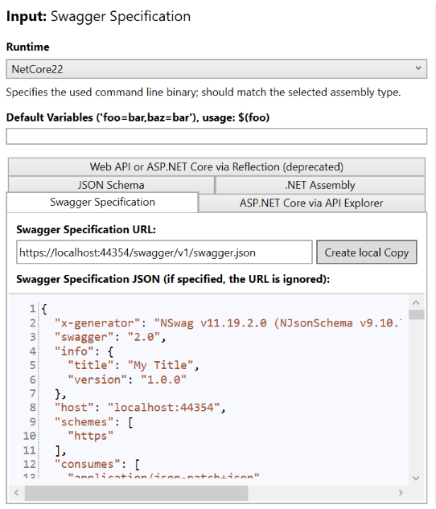
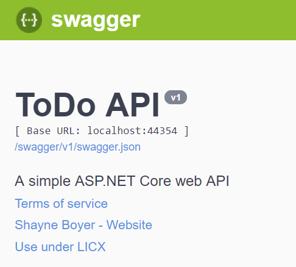

# Get started with NSwag and ASP.NET Core

By [Christoph Nienaber](https://twitter.com/zuckerthoben), [Rico Suter](https://rsuter.com), and [Dave Brock](https://twitter.com/daveabrock)

::: moniker range=">= aspnetcore-2.1"

[View or download sample code](https://github.com/aspnet/AspNetCore.Docs/tree/master/aspnetcore/tutorials/web-api-help-pages-using-swagger/samples/2.1/TodoApi.NSwag) ([how to download](xref:index#how-to-download-a-sample))

::: moniker-end

::: moniker range="<= aspnetcore-2.0"

[View or download sample code](https://github.com/aspnet/AspNetCore.Docs/tree/master/aspnetcore/tutorials/web-api-help-pages-using-swagger/samples/2.0/TodoApi.NSwag) ([how to download](xref:index#how-to-download-a-sample))

::: moniker-end

NSwag offers the following capabilities:

* The ability to utilize the Swagger UI and Swagger generator.
* Flexible code generation capabilities.

With NSwag, you don't need an existing API&mdash;you can use third-party APIs that incorporate Swagger and generate a client implementation. NSwag allows you to expedite the development cycle and easily adapt to API changes.

## Register the NSwag middleware

Register the NSwag middleware to:

* Generate the Swagger specification for the implemented web API.
* Serve the Swagger UI to browse and test the web API.

To use the [NSwag](https://github.com/RicoSuter/NSwag) ASP.NET Core middleware, install the [NSwag.AspNetCore](https://www.nuget.org/packages/NSwag.AspNetCore/) NuGet package. This package contains the middleware to generate and serve the Swagger specification, Swagger UI (v2 and v3), and [ReDoc UI](https://github.com/Rebilly/ReDoc).

Use one of the following approaches to install the NSwag NuGet package:

# [Visual Studio](#tab/visual-studio)

* From the **Package Manager Console** window:
  * Go to **View** > **Other Windows** > **Package Manager Console**
  * Navigate to the directory in which the *TodoApi.csproj* file exists
  * Execute the following command:

    ```powershell
    Install-Package NSwag.AspNetCore
    ```

* From the **Manage NuGet Packages** dialog:
  * Right-click the project in **Solution Explorer** > **Manage NuGet Packages**
  * Set the **Package source** to "nuget.org"
  * Enter "NSwag.AspNetCore" in the search box
  * Select the "NSwag.AspNetCore" package from the **Browse** tab and click **Install**

# [Visual Studio for Mac](#tab/visual-studio-mac)

* Right-click the *Packages* folder in **Solution Pad** > **Add Packages...**
* Set the **Add Packages** window's **Source** drop-down to "nuget.org"
* Enter "NSwag.AspNetCore" in the search box
* Select the "NSwag.AspNetCore" package from the results pane and click **Add Package**

# [.NET Core CLI](#tab/netcore-cli)

Run the following command:

```dotnetcli
dotnet add TodoApi.csproj package NSwag.AspNetCore
```

---

## Add and configure Swagger middleware

Add and configure Swagger in your ASP.NET Core app by performing the following steps:

* In the `Startup.ConfigureServices` method, register the required Swagger services:

[!code-csharp[](../tutorials/web-api-help-pages-using-swagger/samples/2.0/TodoApi.NSwag/Startup.cs?name=snippet_ConfigureServices&highlight=8)]

* In the `Startup.Configure` method, enable the middleware for serving the generated Swagger specification and the Swagger UI:

[!code-csharp[](../tutorials/web-api-help-pages-using-swagger/samples/2.0/TodoApi.NSwag/Startup.cs?name=snippet_Configure&highlight=6-7)]

* Launch the app. Navigate to:
  * `http://localhost:<port>/swagger` to view the Swagger UI.
  * `http://localhost:<port>/swagger/v1/swagger.json` to view the Swagger specification.

## Code generation

You can take advantage of NSwag's code generation capabilities by choosing one of the following options:

* [NSwagStudio](https://github.com/RicoSuter/NSwag/wiki/NSwagStudio) &ndash; a Windows desktop app for generating API client code in C# or TypeScript.
* The [NSwag.CodeGeneration.CSharp](https://www.nuget.org/packages/NSwag.CodeGeneration.CSharp/) or [NSwag.CodeGeneration.TypeScript](https://www.nuget.org/packages/NSwag.CodeGeneration.TypeScript/) NuGet packages for code generation inside your project.
* NSwag from the [command line](https://github.com/RicoSuter/NSwag/wiki/CommandLine).
* The [NSwag.MSBuild](https://github.com/RicoSuter/NSwag/wiki/NSwag.MSBuild) NuGet package.
* The [Unchase OpenAPI (Swagger) Connected Service](https://marketplace.visualstudio.com/items?itemName=Unchase.unchaseopenapiconnectedservice) &ndash; a Visual Studio Connected Service for generating API client code in C# or TypeScript. Also generates C# controllers for OpenAPI services with NSwag.

### Generate code with NSwagStudio

* Install NSwagStudio by following the instructions at the [NSwagStudio GitHub repository](https://github.com/RicoSuter/NSwag/wiki/NSwagStudio). On the NSwag release page you can download an xcopy version which can be started without installation and admin privileges.
* Launch NSwagStudio and enter the *swagger.json* file URL in the **Swagger Specification URL** text box. For example, *http://localhost:44354/swagger/v1/swagger.json*.
* Click the **Create local Copy** button to generate a JSON representation of your Swagger specification.

  

* In the **Outputs** area, click the **CSharp Client** check box. Depending on your project, you can also choose **TypeScript Client** or **CSharp Web API Controller**. If you select **CSharp Web API Controller**, a service specification rebuilds the service, serving as a reverse generation.
* Click **Generate Outputs** to produce a complete C# client implementation of the *TodoApi.NSwag* project. To see the generated client code, click the **CSharp Client** tab:

```csharp
//----------------------
// <auto-generated>
//     Generated using the NSwag toolchain v12.0.9.0 (NJsonSchema v9.13.10.0 (Newtonsoft.Json v11.0.0.0)) (http://NSwag.org)
// </auto-generated>
//----------------------

namespace MyNamespace
{
    #pragma warning disable

    [System.CodeDom.Compiler.GeneratedCode("NSwag", "12.0.9.0 (NJsonSchema v9.13.10.0 (Newtonsoft.Json v11.0.0.0))")]
    public partial class TodoClient
    {
        private string _baseUrl = "https://localhost:44354";
        private System.Net.Http.HttpClient _httpClient;
        private System.Lazy<Newtonsoft.Json.JsonSerializerSettings> _settings;

        public TodoClient(System.Net.Http.HttpClient httpClient)
        {
            _httpClient = httpClient;
            _settings = new System.Lazy<Newtonsoft.Json.JsonSerializerSettings>(() =>
            {
                var settings = new Newtonsoft.Json.JsonSerializerSettings();
                UpdateJsonSerializerSettings(settings);
                return settings;
            });
        }

        public string BaseUrl
        {
            get { return _baseUrl; }
            set { _baseUrl = value; }
        }

        // code omitted for brevity
```

> [!TIP]
> The C# client code is generated based on selections in the **Settings** tab. Modify the settings to perform tasks such as default namespace renaming and synchronous method generation.

* Copy the generated C# code into a file in the client project that will consume the API.
* Start consuming the web API:

```csharp
 var todoClient = new TodoClient();

// Gets all to-dos from the API
 var allTodos = await todoClient.GetAllAsync();

 // Create a new TodoItem, and save it via the API.
var createdTodo = await todoClient.CreateAsync(new TodoItem());

// Get a single to-do by ID
var foundTodo = await todoClient.GetByIdAsync(1);
```

## Customize API documentation

Swagger provides options for documenting the object model to ease consumption of the web API.

### API info and description

In the `Startup.ConfigureServices` method, a configuration action passed to the `AddSwaggerDocument` method adds information such as the author, license, and description:

[!code-csharp[](../tutorials/web-api-help-pages-using-swagger/samples/2.0/TodoApi.NSwag/Startup2.cs?name=snippet_AddSwaggerDocument)]

The Swagger UI displays the version's information:



### XML comments

To enable XML comments, perform the following steps:

# [Visual Studio](#tab/visual-studio)

::: moniker range=">= aspnetcore-2.0"

* Right-click the project in **Solution Explorer** and select **Edit <project_name>.csproj**.
* Manually add the highlighted lines to the *.csproj* file:

[!code-xml[](../tutorials/web-api-help-pages-using-swagger/samples/2.1/TodoApi.NSwag/TodoApi.csproj?name=snippet_DocumentationFileElement&highlight=1-2,4)]

::: moniker-end

::: moniker range="<= aspnetcore-1.1"

* Right-click the project in **Solution Explorer** and select **Properties**
* Check the **XML documentation file** box under the **Output** section of the **Build** tab

::: moniker-end

# [Visual Studio for Mac](#tab/visual-studio-mac)

::: moniker range=">= aspnetcore-2.0"

* From the *Solution Pad*, press **control** and click the project name. Navigate to **Tools** > **Edit File**.
* Manually add the highlighted lines to the *.csproj* file:

[!code-xml[](../tutorials/web-api-help-pages-using-swagger/samples/2.1/TodoApi.NSwag/TodoApi.csproj?name=snippet_DocumentationFileElement&highlight=1-2,4)]

::: moniker-end

::: moniker range="<= aspnetcore-1.1"

* Open the **Project Options** dialog > **Build** > **Compiler**
* Check the **Generate xml documentation** box under the **General Options** section

::: moniker-end

# [.NET Core CLI](#tab/netcore-cli)

Manually add the highlighted lines to the *.csproj* file:

::: moniker range=">= aspnetcore-2.0"

[!code-xml[](../tutorials/web-api-help-pages-using-swagger/samples/2.1/TodoApi.NSwag/TodoApi.csproj?name=snippet_DocumentationFileElement&highlight=1-2,4)]

::: moniker-end

::: moniker range="<= aspnetcore-1.1"

[!code-xml[](../tutorials/web-api-help-pages-using-swagger/samples/2.0/TodoApi.NSwag/TodoApi.csproj?name=snippet_DocumentationFileElement&highlight=1-2,4)]

::: moniker-end

---

### Data annotations

::: moniker range="<= aspnetcore-2.0"

Because NSwag uses [Reflection](/dotnet/csharp/programming-guide/concepts/reflection), and the recommended return type for web API actions is [IActionResult](xref:Microsoft.AspNetCore.Mvc.IActionResult), it can't infer what your action is doing and what it returns.

Consider the following example:

[!code-csharp[](../tutorials/web-api-help-pages-using-swagger/samples/2.0/TodoApi.NSwag/Controllers/TodoController.cs?name=snippet_CreateAction)]

The preceding action returns `IActionResult`, but inside the action it's returning either [CreatedAtRoute](xref:System.Web.Http.ApiController.CreatedAtRoute*) or [BadRequest](xref:System.Web.Http.ApiController.BadRequest*). Use data annotations to tell clients which HTTP status codes this action is known to return. Mark the action with the following attributes:

[!code-csharp[](../tutorials/web-api-help-pages-using-swagger/samples/2.0/TodoApi.NSwag/Controllers/TodoController.cs?name=snippet_CreateActionAttributes)]

::: moniker-end

::: moniker range=">= aspnetcore-2.1"

Because NSwag uses [Reflection](/dotnet/csharp/programming-guide/concepts/reflection), and the recommended return type for web API actions is [ActionResult\<T>](xref:Microsoft.AspNetCore.Mvc.ActionResult%601), it can only infer the return type defined by `T`. You can't automatically infer other possible return types.

Consider the following example:

[!code-csharp[](../tutorials/web-api-help-pages-using-swagger/samples/2.1/TodoApi.NSwag/Controllers/TodoController.cs?name=snippet_CreateAction)]

The preceding action returns `ActionResult<T>`. Inside the action, it's returning [CreatedAtRoute](xref:System.Web.Http.ApiController.CreatedAtRoute*). Since the controller has the [`[ApiController]`](xref:Microsoft.AspNetCore.Mvc.ApiControllerAttribute) attribute, a [BadRequest](xref:System.Web.Http.ApiController.BadRequest*) response is possible, too. For more information, see [Automatic HTTP 400 responses](xref:web-api/index#automatic-http-400-responses). Use data annotations to tell clients which HTTP status codes this action is known to return. Mark the action with the following attributes:

[!code-csharp[](../tutorials/web-api-help-pages-using-swagger/samples/2.1/TodoApi.NSwag/Controllers/TodoController.cs?name=snippet_CreateActionAttributes)]

In ASP.NET Core 2.2 or later, you can use conventions instead of explicitly decorating individual actions with `[ProducesResponseType]`. For more information, see <xref:web-api/advanced/conventions>.

::: moniker-end

The Swagger generator can now accurately describe this action, and generated clients know what they receive when calling the endpoint. As a recommendation, mark all actions with these attributes.

For guidelines on what HTTP responses your API actions should return, see the [RFC 7231 specification](https://tools.ietf.org/html/rfc7231#section-4.3).
