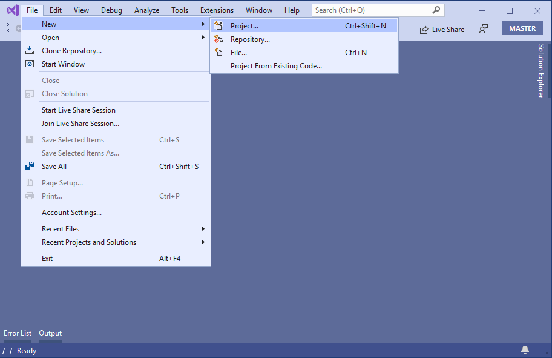
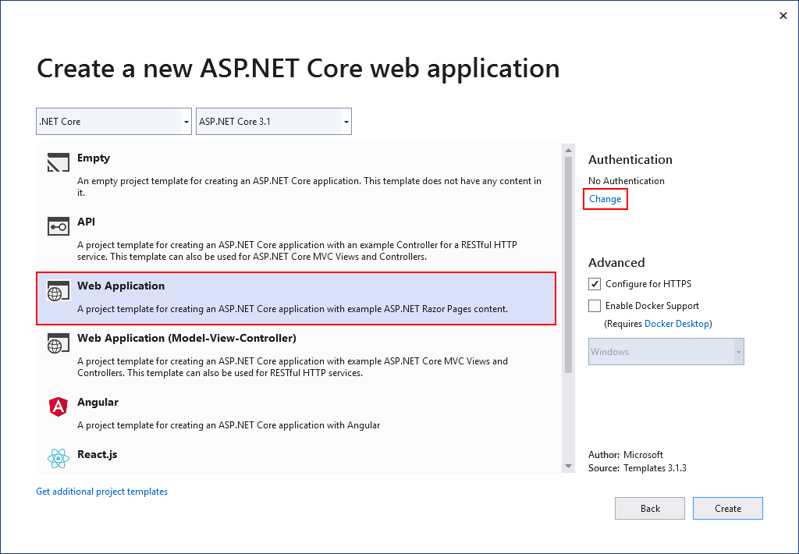
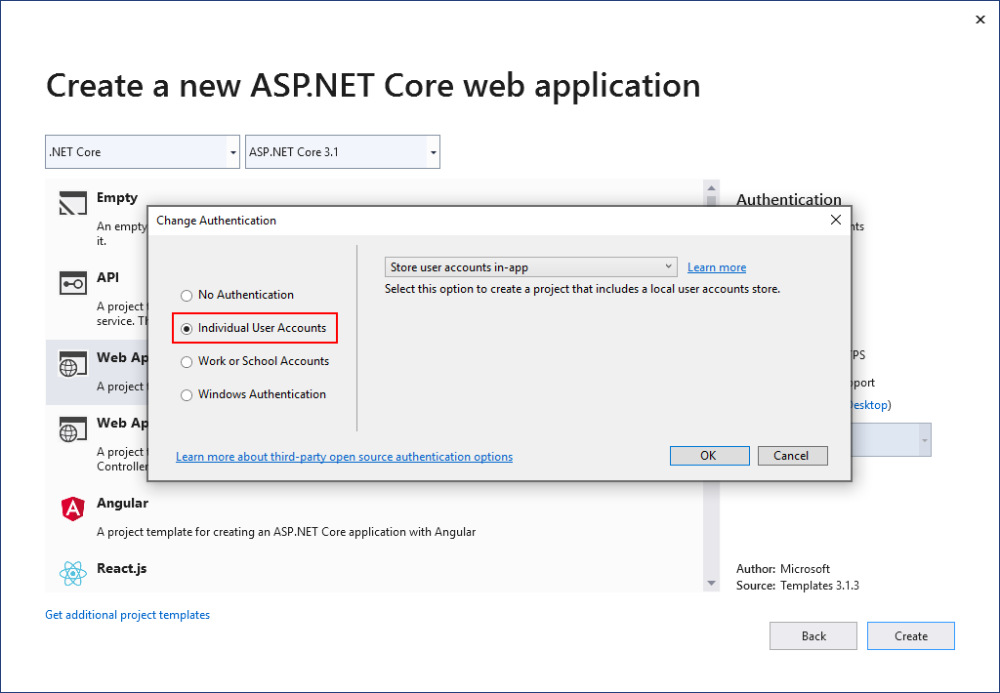
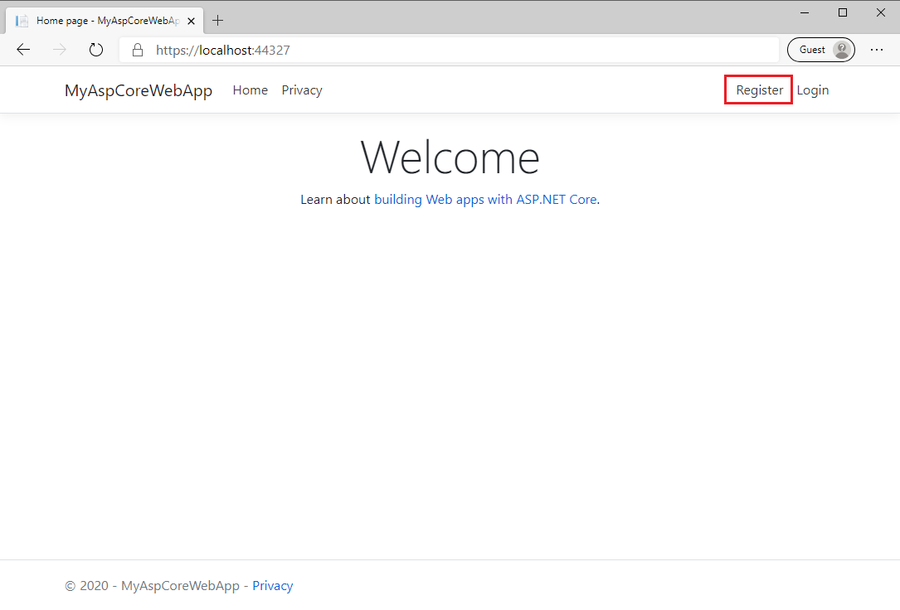
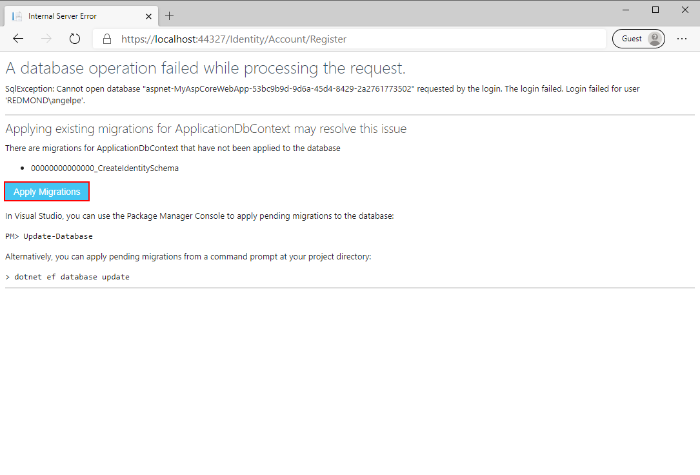
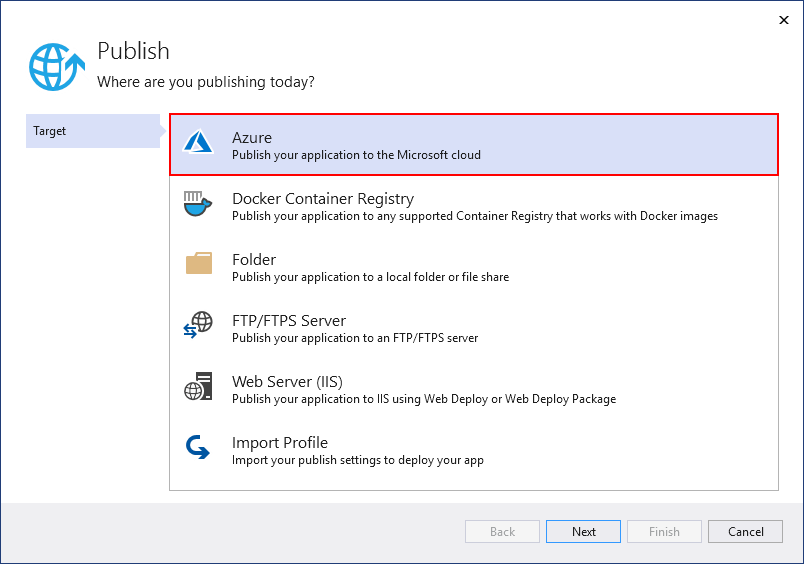
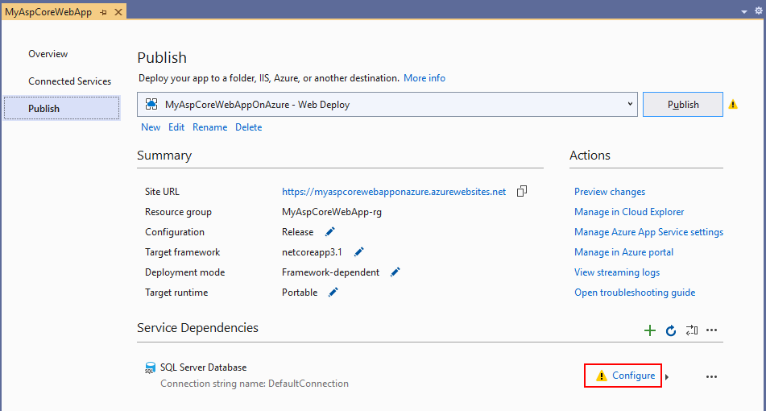
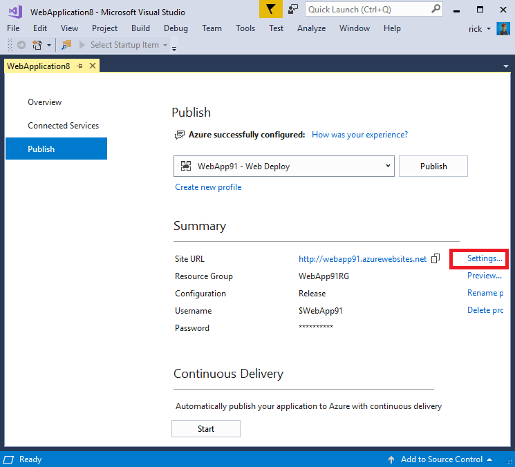
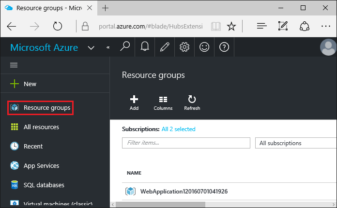

/en-us

# Publish an ASP.NET Core web app to Azure App Service using Visual Studio

By [Rick Anderson](https://twitter.com/RickAndMSFT), [Cesar Blum Silveira](https://github.com/cesarbs), and [Rachel Appel](https://twitter.com/rachelappel)

See [Publish to Azure from Visual Studio for Mac](https://blog.xamarin.com/publish-azure-visual-studio-mac/) if you are working on a Mac.

## Set up

* Open a [free Azure account](https://aka.ms/K5y5yh) if you do not have one. 

## Create a web app

In the Visual Studio Start Page, select **File > New > Project...**

Complete the **New Project** dialog:

* In the left pane, select **.NET Core**.
* In the center pane, select **ASP.NET Core Web Application**.
* Select **OK**.

In the **New ASP.NET Core Web Application** dialog:

* Select **Web Application**.
* Select **Change Authentication**.

The **Change Authentication** dialog appears. 

* Select **Individual User Accounts**.
* Select **OK** to return to the **New ASP.NET Core Web Application**, then select **OK** again.

 

Visual Studio creates the solution.

## Run the app

* Press CTRL+F5 to run the project.
* Test the **About** and **Contact** links.

### Register a user

* Select **Register** and register a new user. You can use a fictitious email address. When you submit, the page displays the following error:

    *"Internal Server Error: A database operation failed while processing the request. SQL exception: Cannot open the database. Applying existing migrations for Application DB context may resolve this issue."*
* Select **Apply Migrations** and, once the page updates, refresh the page.

The app displays the email used to register the new user and a **Log out** link.

## Deploy the app to Azure

Right-click on the project in Solution Explorer and select **Publish...**.

In the **Publish** dialog:

* Select **Microsoft Azure App Service**.
* Select the gear icon and then select **Create Profile**.
* Select **Create Profile**.

### Create Azure resources

The **Create App Service** dialog appears:

* Enter your subscription.
* The **App Name**, **Resource Group**, and **App Service Plan** entry fields are populated. You can keep these names or change them.

* Select the **Services** tab to create a new database.

* Select the green **+** icon to create a new SQL Database

* Select **New...** on the **Configure SQL Database** dialog to create a new database.

The **Configure SQL Server** dialog appears.

* Enter an administrator user name and password, and then select **OK**. You can keep the default **Server Name**. 

> [!NOTE]
> "admin" is not allowed as the administrator user name.

* Select **OK**.

Visual Studio returns to the **Create App Service** dialog.

* Select **Create** on the **Create App Service** dialog.

Visual Studio creates the Web app and SQL Server on Azure. This step can take a few minutes. For information on the resources created, see [Additonal resources](#additonal-resources).

When deployment completes, select **Settings**:

On the **Settings** page of the **Publish** dialog:

  * Expand **Databases** and check **Use this connection string at runtime**.
  * Expand **Entity Framework Migrations** and check **Apply this migration on publish**.

* Select **Save**. Visual Studio returns to the **Publish** dialog. 

Click **Publish**. Visual Studio publishs your app to Azure. When the depoyment completes, the app is opened in a browser.

### Test your app in Azure

* Test the **About** and **Contact** links

* Register a new user

### Update the app

* Edit the *Pages/About.cshtml* Razor page and change its contents. For example, you can modify the paragraph to say "Hello ASP.NET Core!":
    [!code-html[About](publish-to-azure-webapp-using-vs/sample/about.cshtml?highlight=9&range=1-9)]

* Right-click on the project and select **Publish...** again.

* After the app is published, verify the changes you made are available on Azure.

### Clean up

When you have finished testing the app, go to the [Azure portal](https://portal.azure.com/) and delete the app.

* Select **Resource groups**, then select the resource group you created.

* In the **Resource groups** page, select **Delete**.

* Enter the name of the resource group and select **Delete**. Your app and all other resources created in this tutorial are now deleted from Azure.

### Next steps

* [Continuous Deployment to Azure with Visual Studio and Git](xref:host-and-deploy/azure-apps/azure-continuous-deployment)

## Additonal resources

* [Azure App Service](https://docs.microsoft.com/en-us/azure/app-service/app-service-web-overview)
* [Azure resource groups](https://docs.microsoft.com/en-us/azure/azure-resource-manager/resource-group-overview#resource-groups)
* [Azure SQL Database](https://docs.microsoft.com/en-us/azure/sql-database/)
