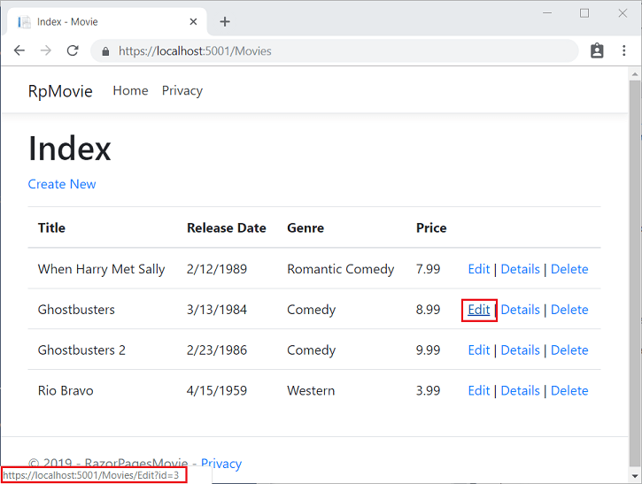

# Updating the generated pages

By [Rick Anderson](https://twitter.com/RickAndMSFT)

We have a good start to the movie app, but the presentation is not ideal. We don't want to see the time (12:00:00 AM in the image below) and **ReleaseDate** should be **Release Date** (two words).


## Update the generated code

Open the *Models/Movie.cs* file and add the highlighted lines shown in the following code:

[!code-csharp[Main](razor-pages-start/sample/RazorPagesMovie/Models/MovieDate.cs?name=snippet_1&highlight=10-11)]

Right click on a red squiggly line > ** Quick Actions and Refactorings**.

  

Select `using System.ComponentModel.DataAnnotations;`

  

  Visual studio adds `using System.ComponentModel.DataAnnotations;`.

We'll cover [DataAnnotations](https://docs.microsoft.com/aspnet/mvc/overview/older-versions/mvc-music-store/mvc-music-store-part-6) in the next tutorial. The [Display](https://docs.microsoft.com//aspnet/core/api/microsoft.aspnetcore.mvc.modelbinding.metadata.displaymetadata) attribute specifies what to display for the name of a field (in this case "Release Date" instead of "ReleaseDate"). The [DataType](https://docs.microsoft.com/aspnet/core/api/microsoft.aspnetcore.mvc.dataannotations.internal.datatypeattributeadapter) attribute specifies the type of the data (Date), so the time information stored in the field is not displayed.

Browse to Pages/Movies and  hover over an **Edit** link to see the target URL.



The **Edit**, **Details**, and **Delete** links are generated by the [Anchor Tag Helper](xref:mvc/views/tag-helpers/builtin-th/anchor-tag-helper) 
in the *Pages/Movies/Index.cshtml* file.

[!code-cshtml[Main](razor-pages-start/snapshot_sample/RazorPagesMovie/Pages/Movies/Index.cshtml?highlight=16-18&range=32-)]

[Tag Helpers](xref:mvc/views/tag-helpers/intro) enable server-side code to participate in creating and rendering HTML elements in Razor files. In the preceding code, the `AnchorTagHelper` dynamically generates the HTML `href` attribute value from the Razor Page (the route is relative), the `asp-page`,  and the route id (`asp-route-id`). See [URL generation for Pages](xref:mvc/razor-pages/index#url-generation-for-pages) for more information.

Use **View Source** from your favorite browser to examine the generated markup. A portion of the generated HTML is shown below:

```html
<td>
  <a href="/Movies/Edit?id=1">Edit</a> |
  <a href="/Movies/Details?id=1">Details</a> |
  <a href="/Movies/Delete?id=1">Delete</a>
</td>
```

The dynamically-generated links pass the movie ID with a query string (for example, `http://localhost:5000/Movies/Details?id=2` ). 

Update the Edit, Details, and Delete Razor Pages to use the "{id:int}" route template. Change the page directive for each of these pages from `@page` to `@page "{id:int}"`. Run the app and then view source. The generated HTML adds the ID to the path portion of the URL:

```html
<td>
  <a href="/Movies/Edit/1">Edit</a> |
  <a href="/Movies/Details/1">Details</a> |
  <a href="/Movies/Delete/1">Delete</a>
</td>
```

A request to the page with the "{id:int}" route template that does **not** include the integer will return an HTTP 404 (not found) error. For example, `http://localhost:5000/Movies/Details` will return a 404 error. To make the ID optional, append `?` to the route constraint:

 ```cshtml
@page "{id:int?}"
```

### Update concurrency exception handling

Update the `OnPostAsync` method in the *Pages/Movies/Edit.cshtml.cs* file. The following highlighted code shows the changes:

[!code-csharp[Main](razor-pages-start/snapshot_sample/RazorPagesMovie/Pages/Movies/Edit.cshtml.cs?name=snippet1&highlight=16-23)]

The previous code only detects concurrency exceptions when the first concurrent client deletes the movie, and the second concurrent client posts changes to the movie.

To test the `catch` block:

* Set a breakpoint on `catch (DbUpdateConcurrencyException)`
* Edit a movie.
* In another browser window, select the **Delete** link for the same movie, and then delete the movie.
* In the previous browser window, post changes to the movie.

Production code would generally detect concurrency conflicts when two or more clients concurrently updated a record. See [Handling concurrency conflicts](xref:data/ef-mvc/concurrency) for more information.

### Posting and binding review

Examine the *Pages/Movies/Edit.cshtml.cs* file:
[!code-csharp[Main](razor-pages-start/snapshot_sample/RazorPagesMovie/Pages/Movies/Edit.cshtml.cs?name=snippet2)]

When an HTTP GET request is made to the Movies/Edit page (for example, `http://localhost:5000/Movies/Edit/2`):

* The `OnGetAsync` method fetches the movie from the database and returns the `Page` method. 
* The `Page` method renders the *Pages/Movies/Edit.cshtml* Razor Page. The *Pages/Movies/Edit.cshtml* file contains the model directive (`@model RazorPagesMovie.Pages.Movies.EditModel`), which makes the the movie model available on the page.
* The Edit form is displayed with the values from the movie.

When the Movies/Edit page is posted:

* The form values on the page are bound to the `Movie` property. The `[BindProperty]` attribute enables [Model binding](xref:mvc/models/model-binding).

  ```csharp
  [BindProperty]
  public Movie Movie { get; set; }
  ```

* If there are errors in the model state (for example, `ReleaseDate` cannot be converted to a date), the form is posted again with the submitted values.
* If there are no model errors, the movie is saved.

The HTTP GET methods in the Index, Create, and Delete Razor pages follow a similar pattern. The HTTP POST `OnPostAsync` method in the Create Razor Page follows a similar pattern to the `OnPostAsync` method in the Edit Razor Page.

Search is added in the next tutorial.

>[!div class="step-by-step"]
[Previous: Working with SQL Server LocalDB](xref:tutorials/razor-pages/sql)
[Adding Search](xref:tutorials/razor-pages/search)
