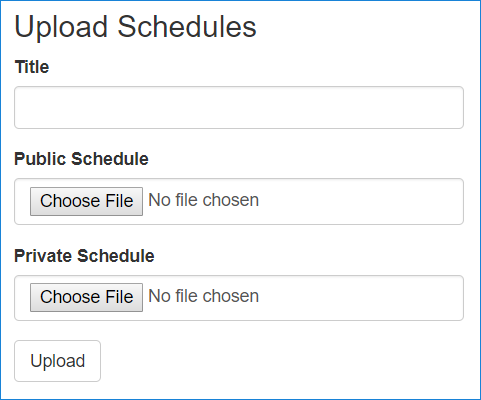
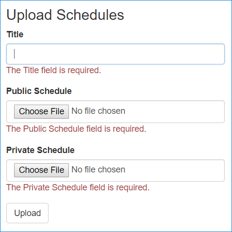

# Uploading files to a Razor Page in ASP.NET Core

By [Luke Latham](https://github.com/guardrex)

In this section, uploading files with a Razor Page is demonstrated.

The [Razor Pages Movie sample app](https://github.com/aspnet/Docs/tree/master/aspnetcore/tutorials/razor-pages/razor-pages-start/sample/RazorPagesMovie) in this tutorial uses simple model binding to upload files, which works well for uploading small files. For information on streaming large files, see [Uploading large files with streaming](xref:mvc/models/file-uploads#uploading-large-files-with-streaming).

In the following steps, a movie schedule file upload feature is added to the sample app. A movie schedule is represented by a `Schedule` class. The class includes two versions of the schedule. One version is provided to customers, `PublicSchedule`. The other version is used for company employees, `PrivateSchedule`. Each version is uploaded as a separate file. The tutorial demonstrates how to perform two file uploads from a page with a single POST to the server.

## Security considerations

Caution must be taken when providing users with the ability to upload files to a server. Attackers may execute [denial of service](/windows-hardware/drivers/ifs/denial-of-service) and other attacks on a system. Some security steps that reduce the likelihood of a successful attack are:

* Upload files to a dedicated file upload area on the system, which makes it easier to impose security measures on uploaded content. When permitting file uploads, make sure that execute permissions are disabled on the upload location.
* Use a safe file name determined by the app, not from user input or the file name of the uploaded file.
* Only allow a specific set of approved file extensions.
* Verify client-side checks are performed on the server. Client-side checks are easy to circumvent.
* Check the size of the upload and prevent larger uploads than expected.
* Run a virus/malware scanner on uploaded content.

> [!WARNING]
> Uploading malicious code to a system is frequently the first step to executing code that can:
> * Completely takeover a system.
> * Overload a system with the result that the system completely fails.
> * Compromise user or system data.
> * Apply graffiti to a public interface.

## Add a FileUpload class

Create a Razor Page to handle a pair of file uploads. Add a `FileUpload` class, which is bound to the page to obtain the schedule data. Right click the *Models* folder. Select **Add** > **Class**. Name the class **FileUpload** and add the following properties:

[!code-csharp[](razor-pages-start/sample/RazorPagesMovie/Models/FileUpload.cs)]

The class has a property for the schedule's title and a property for each of the two versions of the schedule. All three properties are required, and the title must be 3-60 characters long.

## Add a helper method to upload files

To avoid code duplication for processing uploaded schedule files, add a static helper method first. Create a *Utilities* folder in the app and add a *FileHelpers.cs* file with the following content. The helper method, `ProcessFormFile`, takes an [IFormFile](/dotnet/api/microsoft.aspnetcore.http.iformfile) and [ModelStateDictionary](/api/microsoft.aspnetcore.mvc.modelbinding.modelstatedictionary) and returns a string containing the file's size and content. The content type and length are checked. If the file doesn't pass a validation check, an error is added to the `ModelState`.

[!code-csharp[](razor-pages-start/sample/RazorPagesMovie/Utilities/FileHelpers.cs)]

### Save the file to disk

The sample app saves the file's content into a database field. To save the file's content to disk, use a [FileStream](/dotnet/api/system.io.filestream):

```csharp
using (var fileStream = new FileStream(filePath, FileMode.Create))
{
    await formFile.CopyToAsync(fileStream);
}
```

The worker process must have write permissions to the location specified by `filePath`.

### Save the file to Azure Blob Storage

To upload file content to Azure Blob Storage, see [Get started with Azure Blob Storage using .NET](/azure/storage/blobs/storage-dotnet-how-to-use-blobs). The topic demonstrates how to use [UploadFromStream](/dotnet/api/microsoft.windowsazure.storage.file.cloudfile.uploadfromstreamasync) to save a [FileStream](/dotnet/api/system.io.filestream) to blob storage.

## Add the Schedule class

Right click the *Models* folder. Select **Add** > **Class**. Name the class **Schedule** and add the following properties:

[!code-csharp[](razor-pages-start/sample/RazorPagesMovie/Models/Schedule.cs)]

The class uses `Display` and `DisplayFormat` attributes, which produce friendly titles and formatting when the schedule data is rendered.

## Update the MovieContext

Specify a `DbSet` in the `MovieContext` (*Models/MovieContext.cs*) for the schedules:

[!code-csharp[](razor-pages-start/sample/RazorPagesMovie/Models/MovieContext.cs?highlight=13)]

## Add the Schedule table to the database

Open the Package Manger Console (PMC): **Tools** > **NuGet Package Manager** > **Package Manager Console**.


In the PMC, execute the following commands. These commands add a `Schedule` table to the database:

```powershell
Add-Migration AddScheduleTable
Update-Database
```

## Add a file upload Razor Page

In the *Pages* folder, create a *Schedules* folder. In the *Schedules* folder, create a page named *Index.cshtml* for uploading a schedule with the following content:

[!code-cshtml[](razor-pages-start/sample/RazorPagesMovie/Pages/Schedules/Index.cshtml)]

Each form group includes a **\<label>** that displays the name of each class property. The `Display` attributes in the `FileUpload` model provide the display values for the labels. For example, the `UploadPublicSchedule` property's display name is set with `[Display(Name="Public Schedule")]` and thus displays "Public Schedule" in the label when the form renders.

Each form group includes a validation **\<span>**. If the user's input fails to meet the property attributes set in the `FileUpload` class or if any of the `ProcessFormFile` method file validation checks fail, the model fails to validate. When model validation fails, a helpful validation message is rendered to the user. For example, the `Title` property is annotated with `[Required]` and `[StringLength(60, MinimumLength = 3)]`. If the user fails to supply a title, they receive a message indicating that a value is required. If the user enters a value less than three characters or more than sixty characters, they receive a message indicating that the value has an incorrect length. If a file is provided that has no content, a message appears indicating that the file is empty.

## Add the page model

Add the page model (*Index.cshtml.cs*) to the *Schedules* folder:

[!code-csharp[](razor-pages-start/sample/RazorPagesMovie/Pages/Schedules/Index.cshtml.cs)]

The page model (`IndexModel` in *Index.cshtml.cs*) binds the `FileUpload` class:

[!code-csharp[](razor-pages-start/snapshot_sample/RazorPagesMovie/Pages/Schedules/Index.cshtml.cs?name=snippet1)]

The model also uses a list of the schedules (`IList<Schedule>`) to display the schedules stored in the database on the page:

[!code-csharp[](razor-pages-start/snapshot_sample/RazorPagesMovie/Pages/Schedules/Index.cshtml.cs?name=snippet2)]

When the page loads with `OnGetAsync`, `Schedules` is populated from the database and used to generate an HTML table of loaded schedules:

[!code-csharp[](razor-pages-start/snapshot_sample/RazorPagesMovie/Pages/Schedules/Index.cshtml.cs?name=snippet3)]

When the form is posted to the server, the `ModelState` is checked. If invalid, `Schedule` is rebuilt, and the page renders with one or more validation messages stating why page validation failed. If valid, the `FileUpload` properties are used in *OnPostAsync* to complete the file upload for the two versions of the schedule and to create a new `Schedule` object to store the data. The schedule is then saved to the database:

[!code-csharp[](razor-pages-start/snapshot_sample/RazorPagesMovie/Pages/Schedules/Index.cshtml.cs?name=snippet4)]

## Link the file upload Razor Page

Open *_Layout.cshtml* and add a link to the navigation bar to reach the file upload page:

[!code-cshtml[](razor-pages-start/sample/RazorPagesMovie/Pages/_Layout.cshtml?range=31-38&highlight=4)]

## Add a page to confirm schedule deletion

When the user clicks to delete a schedule, a chance to cancel the operation is provided. Add a delete confirmation page (*Delete.cshtml*) to the *Schedules* folder:

[!code-cshtml[](razor-pages-start/sample/RazorPagesMovie/Pages/Schedules/Delete.cshtml)]

The page model (*Delete.cshtml.cs*) loads a single schedule identified by `id` in the request's route data. Add the *Delete.cshtml.cs* file to the *Schedules* folder:

[!code-csharp[](razor-pages-start/sample/RazorPagesMovie/Pages/Schedules/Delete.cshtml.cs)]

The `OnPostAsync` method handles deleting the schedule by its `id`:

[!code-csharp[](razor-pages-start/snapshot_sample/RazorPagesMovie/Pages/Schedules/Delete.cshtml.cs?name=snippet1&highlight=8,12-13)]

After successfully deleting the schedule, the `RedirectToPage` sends the user back to the schedules *Index.cshtml* page.

## The working Schedules Razor Page

When the page loads, labels and inputs for schedule title, public schedule, and private schedule are rendered with a submit button:



Selecting the **Upload** button without populating any of the fields violates the `[Required]` attributes on the model. The `ModelState` is invalid. The validation error messages are displayed to the user:



Type two letters into the **Title** field. The validation message changes to indicate that the title must be between 3-60 characters:


When one or more schedules are uploaded, the **Loaded Schedules** section renders the loaded schedules:


The user can click the **Delete** link from there to reach the delete confirmation view, where they have an opportunity to confirm or cancel the delete operation.

## Troubleshooting

For troubleshooting information with `IFormFile` uploading, see the [File uploads in ASP.NET Core: Troubleshooting](xref:mvc/models/file-uploads#troubleshooting).

Thanks for completing this introduction to Razor Pages. We appreciate feedback. [Get started with MVC and EF Core](xref:data/ef-mvc/intro) is an excellent follow up to this tutorial.

## Additional resources

* [File uploads in ASP.NET Core](xref:mvc/models/file-uploads)
* [IFormFile](/dotnet/api/microsoft.aspnetcore.http.iformfile)

>[!div class="step-by-step"]
[Previous: Validation](xref:tutorials/razor-pages/validation)
