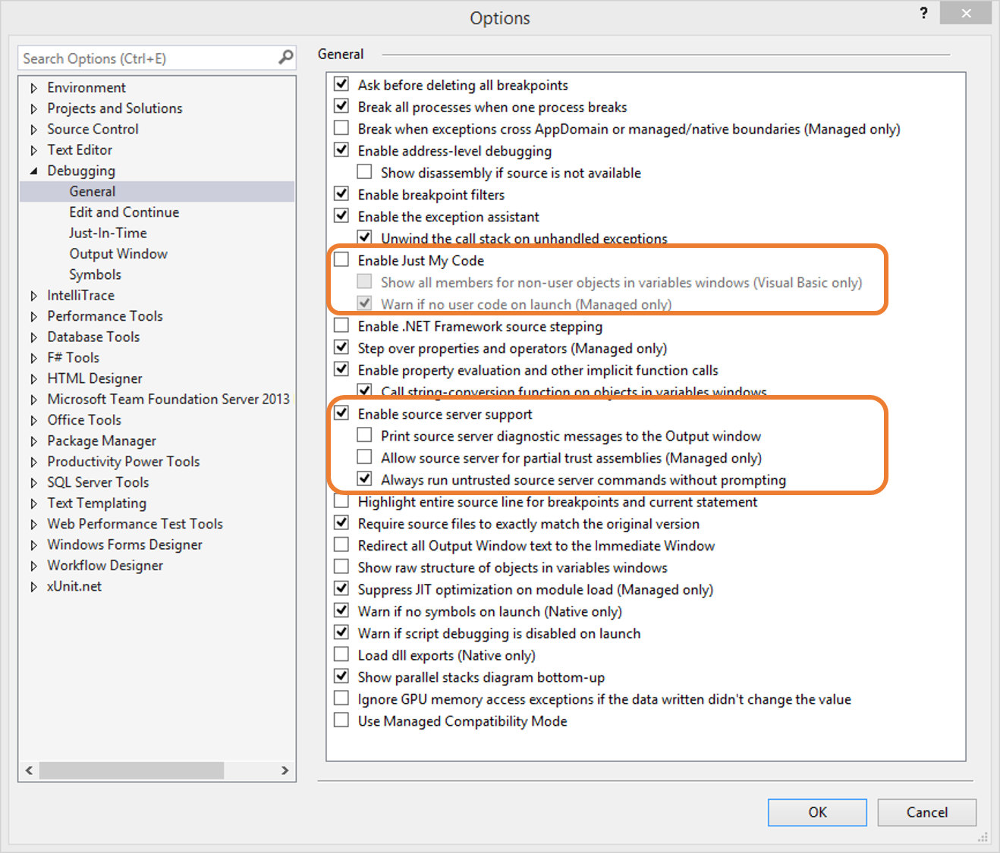
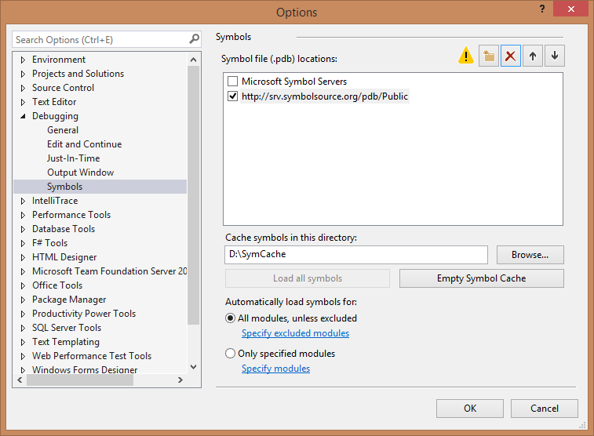

  # Debugging  ## Debugging in Azure

To debug your Web Application while running in Azure, please see the tutorial [Troubleshoot a web app in Azure App Service using Visual Studio](https://azure.microsoft.com/en-us/documentation/articles/web-sites-dotnet-troubleshoot-visual-studio/#webserverlogs).

  ## Debugging with Source and Symbols

In addition to debugging your own code, it is possible to debug directly into Microsoft ASP.NET WebHooks, and in fact all of .NET. This works regardless of whether you debug locally or remotely. First, configure Visual Studio to find the source and symbols by going to **Debug** and then **Options and Settings**. Set the options like this:



Then add a link to [symbolsource.org](http://symbolsource.org) for downloading the source and symbols. Go to the **Symbols** tab of the menu above and add the following as a symbol location:

<!-- literal_block {"names": [], "classes": [], "dupnames": [], "xml:space": "preserve", "backrefs": [], "ids": []} -->

````

   http://srv.symbolsource.org/pdb/Public
   ````

In addition, make sure that the cache directory has a short name; otherwise the file names can get too long which will cause the symbols to not load. A sample path is:

<!-- literal_block {"names": [], "classes": [], "dupnames": [], "xml:space": "preserve", "backrefs": [], "ids": []} -->

````

   C:\SymCache
   ````

The settings should look similar to this:


